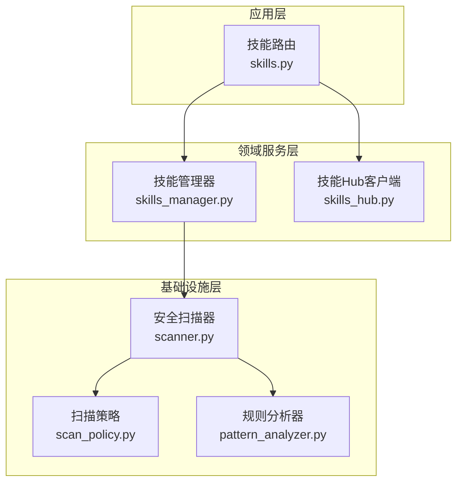
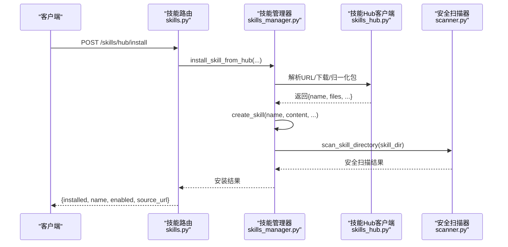
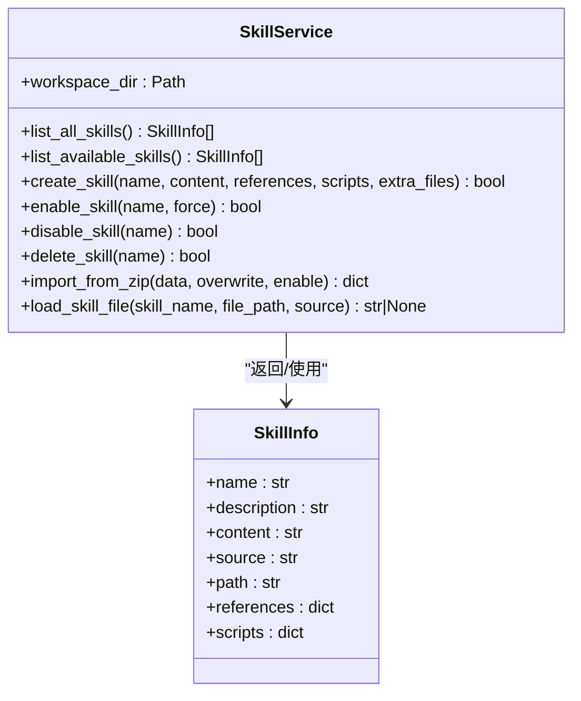
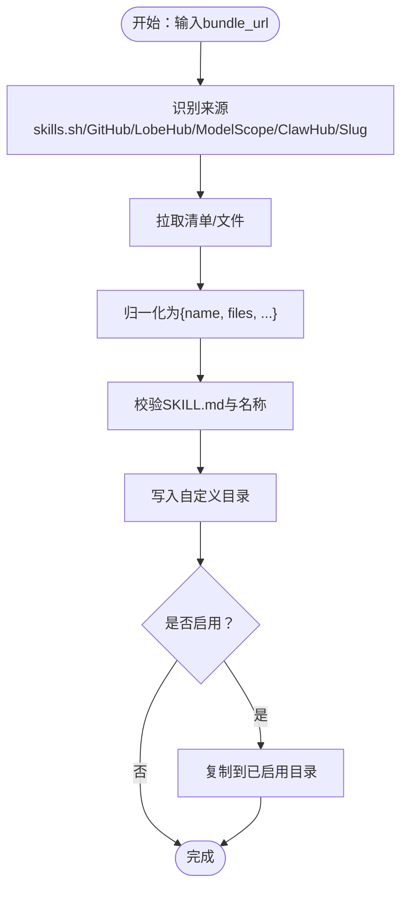
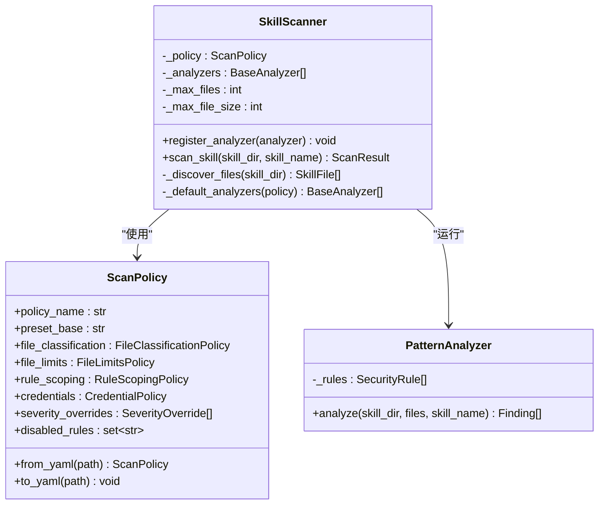
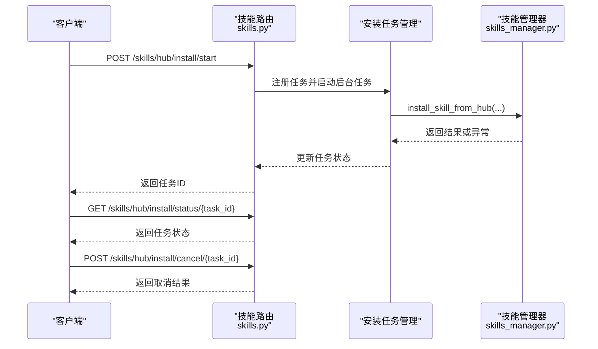
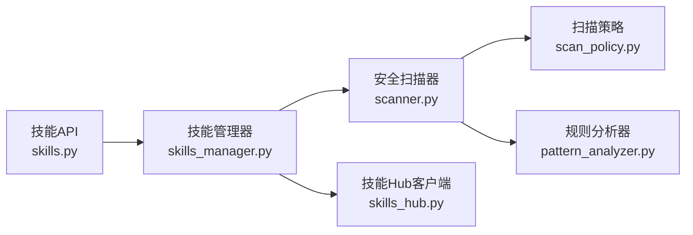

# 技能中心系统

<cite>
**本文档引用的文件**
- [skills_hub.py](file://src/copaw/agents/skills_hub.py)
- [skills_manager.py](file://src/copaw/agents/skills_manager.py)
- [skills.py](file://src/copaw/app/routers/skills.py)
- [scanner.py](file://src/copaw/security/skill_scanner/scanner.py)
- [models.py](file://src/copaw/security/skill_scanner/models.py)
- [scan_policy.py](file://src/copaw/security/skill_scanner/scan_policy.py)
- [default_policy.yaml](file://src/copaw/security/skill_scanner/data/default_policy.yaml)
- [pattern_analyzer.py](file://src/copaw/security/skill_scanner/analyzers/pattern_analyzer.py)
- [skills_cmd.py](file://src/copaw/cli/skills_cmd.py)
</cite>

## 目录
1. [简介](#简介)
2. [项目结构](#项目结构)
3. [核心组件](#核心组件)
4. [架构总览](#架构总览)
5. [详细组件分析](#详细组件分析)
6. [依赖关系分析](#依赖关系分析)
7. [性能考虑](#性能考虑)
8. [故障排查指南](#故障排查指南)
9. [结论](#结论)
10. [附录](#附录)

## 简介
本文件为 CoPaw 技能中心系统（SkillsHub）的全面技术文档，覆盖以下主题：
- 架构设计：技能发现、注册、安装与卸载的完整流程
- 搜索与动态加载机制：支持多来源技能包解析与导入
- 元数据管理、依赖解析与版本控制
- 与外部技能库（ClawHub、skills.sh、GitHub、LobeHub、ModelScope、SkillsMP）的集成
- 安全扫描与验证机制
- 数据模型、API 接口与配置格式
- 开发规范、插件接口与扩展点
- 缓存策略、性能优化与故障恢复

## 项目结构
技能中心系统由三层组成：
- 应用层（API 路由）：提供技能查询、启用/禁用、上传、从 Hub 安装等接口
- 领域服务层（技能管理器）：负责技能目录同步、启用/禁用、创建、删除、文件读取与 ZIP 导入
- 基础设施层（技能 Hub 与安全扫描）：负责从外部源解析技能包、下载与解包、安全扫描与策略执行

**图表来源**
- [skills.py:1-753](file://src/copaw/app/routers/skills.py#L1-L753)
- [skills_manager.py:1-1233](file://src/copaw/agents/skills_manager.py#L1-L1233)
- [skills_hub.py:1-1619](file://src/copaw/agents/skills_hub.py#L1-L1619)
- [scanner.py:1-319](file://src/copaw/security/skill_scanner/scanner.py#L1-L319)
- [scan_policy.py:1-476](file://src/copaw/security/skill_scanner/scan_policy.py#L1-L476)
- [pattern_analyzer.py:1-393](file://src/copaw/security/skill_scanner/analyzers/pattern_analyzer.py#L1-L393)

**章节来源**
- [skills.py:1-753](file://src/copaw/app/routers/skills.py#L1-L753)
- [skills_manager.py:1-1233](file://src/copaw/agents/skills_manager.py#L1-L1233)
- [skills_hub.py:1-1619](file://src/copaw/agents/skills_hub.py#L1-L1619)
- [scanner.py:1-319](file://src/copaw/security/skill_scanner/scanner.py#L1-L319)
- [scan_policy.py:1-476](file://src/copaw/security/skill_scanner/scan_policy.py#L1-L476)
- [pattern_analyzer.py:1-393](file://src/copaw/security/skill_scanner/analyzers/pattern_analyzer.py#L1-L393)

## 核心组件
- 技能管理器（SkillService）
  - 负责技能目录结构管理、启用/禁用、创建、删除、ZIP 导入、文件读取
  - 提供与工作区目录的同步能力（内置/自定义/已启用）
- 技能 Hub 客户端（SkillsHub）
  - 支持多种外部源：ClawHub、skills.sh、GitHub、LobeHub、ModelScope、SkillsMP
  - 解析 URL、拉取清单、下载文件、归一化为内部包结构
- 安全扫描器（SkillScanner）
  - 扫描策略（ScanPolicy）、规则签名（PatternAnalyzer）、结果模型（Finding/ScanResult）

**章节来源**
- [skills_manager.py:654-1233](file://src/copaw/agents/skills_manager.py#L654-L1233)
- [skills_hub.py:1513-1619](file://src/copaw/agents/skills_hub.py#L1513-L1619)
- [scanner.py:76-319](file://src/copaw/security/skill_scanner/scanner.py#L76-L319)
- [models.py:18-235](file://src/copaw/security/skill_scanner/models.py#L18-L235)
- [scan_policy.py:156-476](file://src/copaw/security/skill_scanner/scan_policy.py#L156-L476)

## 架构总览
技能中心系统采用分层架构，API 层通过 FastAPI 路由调用技能管理器；技能管理器在需要时调用技能 Hub 客户端进行外部源解析与下载，并在关键路径（创建/启用前）执行安全扫描。

**图表来源**
- [skills.py:344-388](file://src/copaw/app/routers/skills.py#L344-L388)
- [skills_manager.py:804-887](file://src/copaw/agents/skills_manager.py#L804-L887)
- [skills_hub.py:1567-1619](file://src/copaw/agents/skills_hub.py#L1567-L1619)
- [scanner.py:148-242](file://src/copaw/security/skill_scanner/scanner.py#L148-L242)

## 详细组件分析

### 组件A：技能管理器（SkillService）
职责与流程：
- 列出所有技能（内置/自定义），并去重
- 启用/禁用技能：将技能从自定义或内置复制到已启用目录，并触发热重载
- 创建技能：写入 SKILL.md 与 references/scripts 子树，执行安全扫描
- 删除技能：仅删除自定义目录中的技能
- ZIP 导入：校验 ZIP 结构与大小，提取技能目录，扫描后可选择启用
- 文件读取：安全地读取 references/scripts 下的文件，防止路径穿越

**图表来源**
- [skills_manager.py:654-1233](file://src/copaw/agents/skills_manager.py#L654-L1233)
- [skills_manager.py:28-61](file://src/copaw/agents/skills_manager.py#L28-L61)

**章节来源**
- [skills_manager.py:654-1233](file://src/copaw/agents/skills_manager.py#L654-L1233)

### 组件B：技能Hub客户端（SkillsHub）
功能与流程：
- 多源解析：支持 ClawHub、skills.sh、GitHub、LobeHub、ModelScope、SkillsMP
- URL 解析与规范化：从 URL 中提取 owner/repo/slug/version 等信息
- 包归一化：统一为 {name, files, references, scripts, extra_files}
- 搜索：提供 Hub 搜索接口
- 安装：将归一化包写入自定义目录，必要时启用

**图表来源**
- [skills_hub.py:1513-1619](file://src/copaw/agents/skills_hub.py#L1513-L1619)
- [skills_hub.py:1539-1564](file://src/copaw/agents/skills_hub.py#L1539-L1564)

**章节来源**
- [skills_hub.py:1513-1619](file://src/copaw/agents/skills_hub.py#L1513-L1619)

### 组件C：安全扫描器（SkillScanner）
职责与流程：
- 发现文件：遍历技能目录，按策略跳过/限制文件类型与数量
- 分析器：默认使用 PatternAnalyzer，基于 YAML 规则进行正则匹配
- 策略：ScanPolicy 控制规则范围、阈值、文件分类、严重性覆盖与禁用规则
- 结果：聚合 Finding，生成 ScanResult，提供最大严重级别判断

**图表来源**
- [scanner.py:76-319](file://src/copaw/security/skill_scanner/scanner.py#L76-L319)
- [scan_policy.py:156-476](file://src/copaw/security/skill_scanner/scan_policy.py#L156-L476)
- [pattern_analyzer.py:236-393](file://src/copaw/security/skill_scanner/analyzers/pattern_analyzer.py#L236-L393)

**章节来源**
- [scanner.py:76-319](file://src/copaw/security/skill_scanner/scanner.py#L76-L319)
- [models.py:18-235](file://src/copaw/security/skill_scanner/models.py#L18-L235)
- [scan_policy.py:1-476](file://src/copaw/security/skill_scanner/scan_policy.py#L1-L476)
- [pattern_analyzer.py:1-393](file://src/copaw/security/skill_scanner/analyzers/pattern_analyzer.py#L1-L393)

### 组件D：API 接口与任务流
- 列表与可用技能：返回内置/自定义/已启用状态
- Hub 搜索与安装：支持同步与异步安装任务，带取消与错误处理
- 批量启用/禁用：批量操作并返回阻断的技能
- ZIP 上传：校验类型与大小，导入后可选择启用
- 文件读取：安全读取 references/scripts 下的文件

**图表来源**
- [skills.py:391-453](file://src/copaw/app/routers/skills.py#L391-L453)
- [skills.py:264-342](file://src/copaw/app/routers/skills.py#L264-L342)

**章节来源**
- [skills.py:122-753](file://src/copaw/app/routers/skills.py#L122-L753)

## 依赖关系分析
- 技能管理器依赖安全扫描器进行创建/启用前后的扫描
- 技能 Hub 客户端依赖 HTTP 工具与外部 API（GitHub、ClawHub、LobeHub、ModelScope、SkillsMP）
- 安全扫描器依赖扫描策略与规则签名

**图表来源**
- [skills.py:1-753](file://src/copaw/app/routers/skills.py#L1-L753)
- [skills_manager.py:1-1233](file://src/copaw/agents/skills_manager.py#L1-L1233)
- [skills_hub.py:1-1619](file://src/copaw/agents/skills_hub.py#L1-L1619)
- [scanner.py:1-319](file://src/copaw/security/skill_scanner/scanner.py#L1-L319)
- [scan_policy.py:1-476](file://src/copaw/security/skill_scanner/scan_policy.py#L1-L476)
- [pattern_analyzer.py:1-393](file://src/copaw/security/skill_scanner/analyzers/pattern_analyzer.py#L1-L393)

**章节来源**
- [skills.py:1-753](file://src/copaw/app/routers/skills.py#L1-L753)
- [skills_manager.py:1-1233](file://src/copaw/agents/skills_manager.py#L1-L1233)
- [skills_hub.py:1-1619](file://src/copaw/agents/skills_hub.py#L1-L1619)
- [scanner.py:1-319](file://src/copaw/security/skill_scanner/scanner.py#L1-L319)
- [scan_policy.py:1-476](file://src/copaw/security/skill_scanner/scan_policy.py#L1-L476)
- [pattern_analyzer.py:1-393](file://src/copaw/security/skill_scanner/analyzers/pattern_analyzer.py#L1-L393)

## 性能考虑
- 文件发现与扫描
  - 使用文件类型映射与策略过滤减少扫描范围
  - 限制最大文件数与单文件大小，避免内存压力
- ZIP 安全与大小限制
  - 对 ZIP 进行完整性与路径合法性校验，限制未压缩总大小与条目数
- HTTP 请求退避与超时
  - 可配置重试次数、回退时间、超时，提升网络不稳定场景下的成功率
- 目录同步
  - 自定义覆盖内置，增量同步，避免重复拷贝

**章节来源**
- [scanner.py:116-134](file://src/copaw/security/skill_scanner/scanner.py#L116-L134)
- [skills_manager.py:548-577](file://src/copaw/agents/skills_manager.py#L548-L577)
- [skills_hub.py:70-106](file://src/copaw/agents/skills_hub.py#L70-L106)

## 故障排查指南
- 安全扫描失败
  - API 将返回 422 并携带具体发现列表；根据严重级别与规则 ID 定位问题
- Hub 安装失败
  - 400：URL 格式或内容不合法；429/5xx：上游限流或服务器错误；取消：任务被取消
- ZIP 导入失败
  - 非法 ZIP、未找到有效技能、扫描异常
- CLI 技能配置
  - 交互式选择技能启用/禁用，支持预览变更与确认保存

**章节来源**
- [skills.py:28-51](file://src/copaw/app/routers/skills.py#L28-L51)
- [skills.py:362-382](file://src/copaw/app/routers/skills.py#L362-L382)
- [skills.py:406-453](file://src/copaw/app/routers/skills.py#L406-L453)
- [skills_cmd.py:29-125](file://src/copaw/cli/skills_cmd.py#L29-L125)

## 结论
技能中心系统通过清晰的分层设计实现了技能的全生命周期管理：从发现、注册、安装到启用/禁用与删除；通过可配置的安全扫描策略与规则签名保障了技能包的安全性；通过多源 Hub 集成与异步任务流提升了用户体验与可靠性。建议在生产环境中结合组织策略文件与严格的扫描阈值，确保技能生态的安全与稳定。

## 附录

### 数据模型与配置
- 扫描结果模型
  - ScanResult：包含技能名、路径、发现列表、扫描耗时、最高严重级别等
  - Finding：包含规则ID、类别、严重级别、标题、描述、文件路径、行号、片段、修复建议等
- 扫描策略
  - ScanPolicy：隐藏文件、规则范围、凭证白名单、文件分类、文件限制、分析阈值、严重性覆盖、禁用规则等
  - 默认策略文件位于 data/default_policy.yaml

**章节来源**
- [models.py:18-235](file://src/copaw/security/skill_scanner/models.py#L18-L235)
- [scan_policy.py:156-476](file://src/copaw/security/skill_scanner/scan_policy.py#L156-L476)
- [default_policy.yaml:1-245](file://src/copaw/security/skill_scanner/data/default_policy.yaml#L1-L245)

### API 接口概览
- GET /skills：列出所有技能（含启用状态）
- GET /skills/available：列出已启用技能
- GET /skills/hub/search：Hub 搜索
- POST /skills/hub/install：同步安装
- POST /skills/hub/install/start：异步安装任务
- GET /skills/hub/install/status/{task_id}：查询任务状态
- POST /skills/hub/install/cancel/{task_id}：取消任务
- POST /skills/upload：上传 ZIP 并导入
- POST /skills/batch-enable：批量启用
- POST /skills/batch-disable：批量禁用
- POST /skills：创建技能
- POST /skills/{skill_name}/enable：启用技能
- POST /skills/{skill_name}/disable：禁用技能
- DELETE /skills/{skill_name}：删除技能
- GET /skills/{skill_name}/files/{source}/{file_path}：读取技能文件

**章节来源**
- [skills.py:122-753](file://src/copaw/app/routers/skills.py#L122-L753)

### 开发规范与扩展点
- 插件接口
  - BaseAnalyzer：可扩展新的分析器（如 LLM 分析器）
  - ScanPolicy：可通过 YAML 自定义策略，覆盖严重性、禁用规则、文件分类等
- 扩展点
  - 规则签名：在 rules/signatures/ 下新增 YAML 规则
  - Hub 源：在 _resolve_bundle_from_url 中添加新源解析逻辑
  - CLI：在 skills_cmd.py 中扩展命令与交互流程

**章节来源**
- [pattern_analyzer.py:236-393](file://src/copaw/security/skill_scanner/analyzers/pattern_analyzer.py#L236-L393)
- [scan_policy.py:261-304](file://src/copaw/security/skill_scanner/scan_policy.py#L261-L304)
- [skills_hub.py:1539-1564](file://src/copaw/agents/skills_hub.py#L1539-L1564)
- [skills_cmd.py:127-182](file://src/copaw/cli/skills_cmd.py#L127-L182)