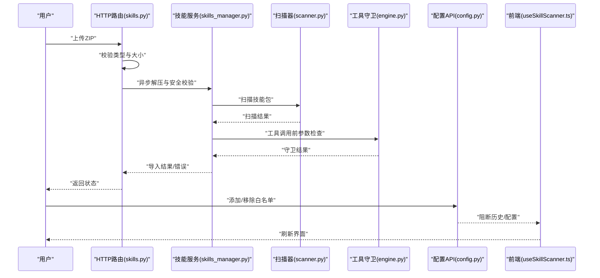
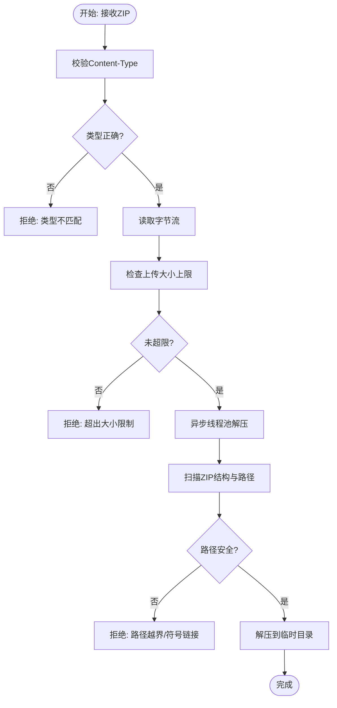
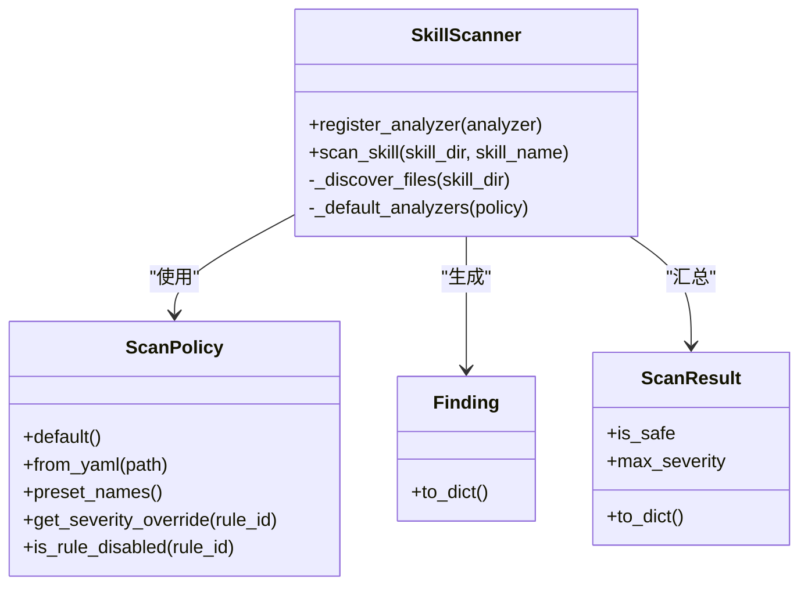
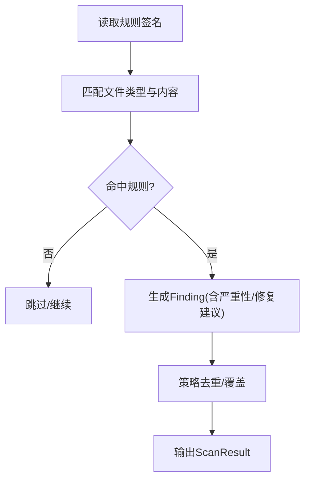
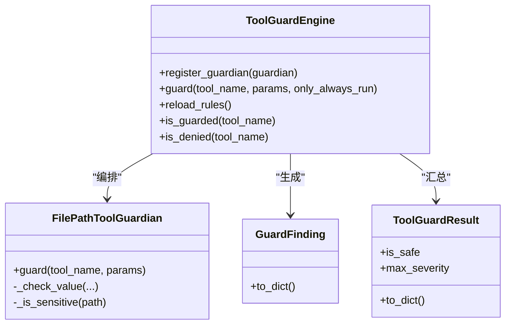
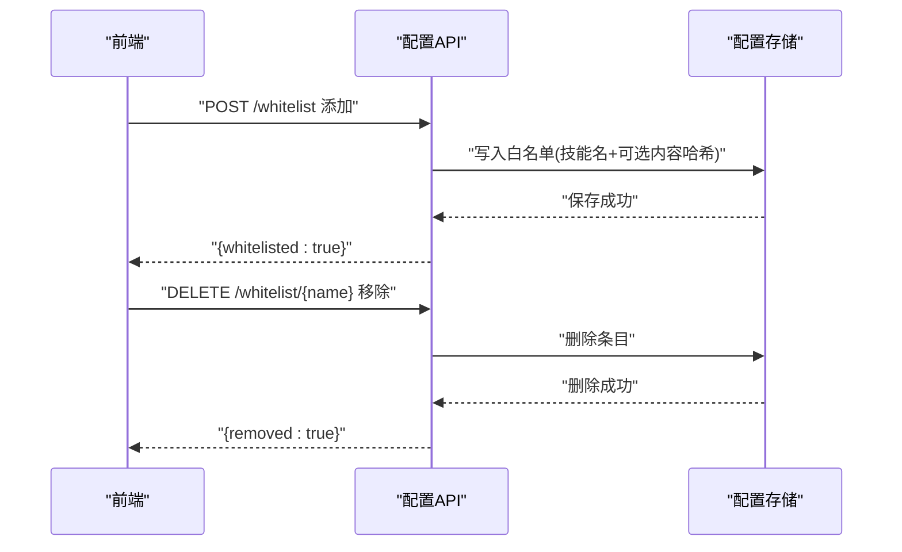
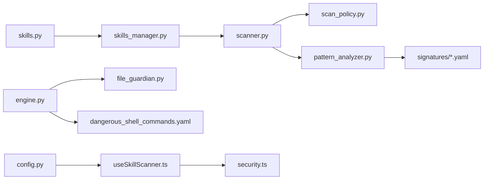

# 技能安全验证

<cite>
**本文引用的文件**
- [src/copaw/security/skill_scanner/scanner.py](file://src/copaw/security/skill_scanner/scanner.py)
- [src/copaw/security/skill_scanner/models.py](file://src/copaw/security/skill_scanner/models.py)
- [src/copaw/security/skill_scanner/scan_policy.py](file://src/copaw/security/skill_scanner/scan_policy.py)
- [src/copaw/security/skill_scanner/data/default_policy.yaml](file://src/copaw/security/skill_scanner/data/default_policy.yaml)
- [src/copaw/security/skill_scanner/rules/signatures/command_injection.yaml](file://src/copaw/security/skill_scanner/rules/signatures/command_injection.yaml)
- [src/copaw/security/skill_scanner/rules/signatures/prompt_injection.yaml](file://src/copaw/security/skill_scanner/rules/signatures/prompt_injection.yaml)
- [src/copaw/security/skill_scanner/analyzers/pattern_analyzer.py](file://src/copaw/security/skill_scanner/analyzers/pattern_analyzer.py)
- [src/copaw/security/tool_guard/engine.py](file://src/copaw/security/tool_guard/engine.py)
- [src/copaw/security/tool_guard/models.py](file://src/copaw/security/tool_guard/models.py)
- [src/copaw/security/tool_guard/guardians/file_guardian.py](file://src/copaw/security/tool_guard/guardians/file_guardian.py)
- [src/copaw/security/tool_guard/rules/dangerous_shell_commands.yaml](file://src/copaw/security/tool_guard/rules/dangerous_shell_commands.yaml)
- [src/copaw/agents/skills_manager.py](file://src/copaw/agents/skills_manager.py)
- [src/copaw/app/routers/skills.py](file://src/copaw/app/routers/skills.py)
- [src/copaw/app/routers/config.py](file://src/copaw/app/routers/config.py)
- [console/src/pages/Settings/Security/useSkillScanner.ts](file://console/src/pages/Settings/Security/useSkillScanner.ts)
- [console/src/api/modules/security.ts](file://console/src/api/modules/security.ts)
- [SECURITY.md](file://SECURITY.md)
</cite>

## 目录
1. [简介](#简介)
2. [项目结构](#项目结构)
3. [核心组件](#核心组件)
4. [架构总览](#架构总览)
5. [详细组件分析](#详细组件分析)
6. [依赖关系分析](#依赖关系分析)
7. [性能与可扩展性](#性能与可扩展性)
8. [故障排查指南](#故障排查指南)
9. [结论](#结论)
10. [附录](#附录)

## 简介
本文件面向CoPaw技能安全验证系统，系统性阐述技能包内容安全检查机制与工具调用安全防护，覆盖以下方面：
- ZIP上传与解压：大小限制、文件数量限制、路径安全校验、目录遍历防护、危险文件过滤
- 技能元数据与来源可信度：内容哈希、白名单机制、阻断历史与审计
- 静态扫描：基于规则的恶意内容检测（命令注入、路径穿越、提示词注入等）
- 工具调用安全：路径敏感文件防护、规则化危险命令拦截、审批与阻断
- 安全策略配置：组织级策略、阈值与规则范围、严重性覆盖与禁用规则
- 审计与应急：阻断记录、白名单管理、前端配置与API接口

## 项目结构
围绕“技能安全验证”的关键代码分布在如下模块：
- 技能扫描器：扫描器、策略、模型、规则签名
- 工具守卫：引擎、守护者、规则、模型
- 技能导入与校验：ZIP上传路由、解压与安全校验、元数据解析
- 配置与前端：白名单增删、阻断历史、前端Hook与API

```mermaid
graph TB
subgraph "技能扫描"
S1["scanner.py<br/>扫描器"]
S2["scan_policy.py<br/>策略"]
S3["models.py<br/>扫描模型"]
S4["default_policy.yaml<br/>默认策略"]
S5["pattern_analyzer.py<br/>模式分析器"]
S6["signatures/*.yaml<br/>规则签名"]
end
subgraph "工具守卫"
G1["engine.py<br/>引擎"]
G2["file_guardian.py<br/>文件路径守护"]
G3["dangerous_shell_commands.yaml<br/>规则"]
G4["models.py<br/>守卫模型"]
end
subgraph "技能导入"
R1["skills.py<br/>上传路由"]
R2["skills_manager.py<br/>解压与校验"]
end
subgraph "配置与前端"
C1["config.py<br/>白名单API"]
F1["useSkillScanner.ts<br/>前端Hook"]
F2["security.ts<br/>API封装"]
end
R1 --> R2
R2 --> S1
S1 --> S5
S5 --> S6
S1 --> S2
S2 --> S4
G1 --> G2
G1 --> G3
G1 --> G4
C1 <- --> F1
C1 <- --> F2
```

**图表来源**
- [src/copaw/security/skill_scanner/scanner.py:76-319](file://src/copaw/security/skill_scanner/scanner.py#L76-L319)
- [src/copaw/security/skill_scanner/scan_policy.py:156-476](file://src/copaw/security/skill_scanner/scan_policy.py#L156-L476)
- [src/copaw/security/skill_scanner/analyzers/pattern_analyzer.py:347-380](file://src/copaw/security/skill_scanner/analyzers/pattern_analyzer.py#L347-L380)
- [src/copaw/security/tool_guard/engine.py:53-238](file://src/copaw/security/tool_guard/engine.py#L53-L238)
- [src/copaw/security/tool_guard/guardians/file_guardian.py:161-306](file://src/copaw/security/tool_guard/guardians/file_guardian.py#L161-L306)
- [src/copaw/app/routers/skills.py:473-522](file://src/copaw/app/routers/skills.py#L473-L522)
- [src/copaw/agents/skills_manager.py:556-593](file://src/copaw/agents/skills_manager.py#L556-L593)
- [src/copaw/app/routers/config.py:667-697](file://src/copaw/app/routers/config.py#L667-L697)
- [console/src/pages/Settings/Security/useSkillScanner.ts:1-41](file://console/src/pages/Settings/Security/useSkillScanner.ts#L1-L41)
- [console/src/api/modules/security.ts:101-148](file://console/src/api/modules/security.ts#L101-L148)

**章节来源**
- [src/copaw/security/skill_scanner/scanner.py:76-319](file://src/copaw/security/skill_scanner/scanner.py#L76-L319)
- [src/copaw/security/tool_guard/engine.py:53-238](file://src/copaw/security/tool_guard/engine.py#L53-L238)
- [src/copaw/app/routers/skills.py:473-522](file://src/copaw/app/routers/skills.py#L473-L522)
- [src/copaw/agents/skills_manager.py:556-593](file://src/copaw/agents/skills_manager.py#L556-L593)
- [src/copaw/app/routers/config.py:667-697](file://src/copaw/app/routers/config.py#L667-L697)
- [console/src/pages/Settings/Security/useSkillScanner.ts:1-41](file://console/src/pages/Settings/Security/useSkillScanner.ts#L1-L41)
- [console/src/api/modules/security.ts:101-148](file://console/src/api/modules/security.ts#L101-L148)

## 核心组件
- 技能扫描器：递归发现文件、按策略与阈值过滤、运行分析器并聚合结果；内置默认策略与规则集，支持自定义策略覆盖
- 工具守卫引擎：在工具调用前进行参数扫描与路径检查，拦截高危命令与敏感文件访问
- ZIP上传与解压：HTTP层限制上传大小与类型，后端线程池解压并执行路径安全校验与大小/数量限制
- 白名单与阻断历史：通过配置API维护白名单，记录阻断历史，前端提供查询与清理操作
- 前端配置界面：加载扫描配置、查看阻断历史、添加/移除白名单项

**章节来源**
- [src/copaw/security/skill_scanner/scanner.py:148-242](file://src/copaw/security/skill_scanner/scanner.py#L148-L242)
- [src/copaw/security/skill_scanner/scan_policy.py:156-476](file://src/copaw/security/skill_scanner/scan_policy.py#L156-L476)
- [src/copaw/security/tool_guard/engine.py:169-226](file://src/copaw/security/tool_guard/engine.py#L169-L226)
- [src/copaw/app/routers/skills.py:473-522](file://src/copaw/app/routers/skills.py#L473-L522)
- [src/copaw/agents/skills_manager.py:556-593](file://src/copaw/agents/skills_manager.py#L556-L593)
- [src/copaw/app/routers/config.py:667-697](file://src/copaw/app/routers/config.py#L667-L697)
- [console/src/pages/Settings/Security/useSkillScanner.ts:1-41](file://console/src/pages/Settings/Security/useSkillScanner.ts#L1-L41)

## 架构总览
下图展示从用户上传ZIP到技能启用的完整安全链路：HTTP路由接收请求，后端线程池执行解压与安全校验，随后进入扫描器与工具守卫，最终由配置API与前端界面完成白名单与阻断历史管理。



**图表来源**
- [src/copaw/app/routers/skills.py:473-522](file://src/copaw/app/routers/skills.py#L473-L522)
- [src/copaw/agents/skills_manager.py:556-593](file://src/copaw/agents/skills_manager.py#L556-L593)
- [src/copaw/security/skill_scanner/scanner.py:148-242](file://src/copaw/security/skill_scanner/scanner.py#L148-L242)
- [src/copaw/security/tool_guard/engine.py:169-226](file://src/copaw/security/tool_guard/engine.py#L169-L226)
- [src/copaw/app/routers/config.py:667-697](file://src/copaw/app/routers/config.py#L667-L697)
- [console/src/pages/Settings/Security/useSkillScanner.ts:1-41](file://console/src/pages/Settings/Security/useSkillScanner.ts#L1-L41)

## 详细组件分析

### ZIP上传与解压安全
- 上传限制：HTTP路由对Content-Type与文件大小进行严格限制，超过阈值直接拒绝
- 解压与安全校验：线程池中执行ZIP解压，逐个文件统计未压缩总大小、校验相对路径是否越界、禁止符号链接
- 元数据解析：从SKILL.md提取技能名称，回退到目录名并进行字符规范化



**图表来源**
- [src/copaw/app/routers/skills.py:473-522](file://src/copaw/app/routers/skills.py#L473-L522)
- [src/copaw/agents/skills_manager.py:556-593](file://src/copaw/agents/skills_manager.py#L556-L593)

**章节来源**
- [src/copaw/app/routers/skills.py:473-522](file://src/copaw/app/routers/skills.py#L473-L522)
- [src/copaw/agents/skills_manager.py:556-593](file://src/copaw/agents/skills_manager.py#L556-L593)

### 技能静态扫描器
- 文件发现：递归遍历技能目录，跳过符号链接与非文件；对每个文件计算真实路径，确保位于技能根目录内
- 过滤策略：按策略中的扩展分类（惰性/结构化/归档）与阈值（最大文件数、单文件大小）过滤
- 分析器：默认使用模式分析器，按规则签名匹配并去重；支持自定义分析器注册
- 结果模型：统一的Finding与ScanResult模型，提供严重性聚合与序列化



**图表来源**
- [src/copaw/security/skill_scanner/scanner.py:76-319](file://src/copaw/security/skill_scanner/scanner.py#L76-L319)
- [src/copaw/security/skill_scanner/scan_policy.py:156-476](file://src/copaw/security/skill_scanner/scan_policy.py#L156-L476)
- [src/copaw/security/skill_scanner/models.py:168-235](file://src/copaw/security/skill_scanner/models.py#L168-L235)

**章节来源**
- [src/copaw/security/skill_scanner/scanner.py:148-299](file://src/copaw/security/skill_scanner/scanner.py#L148-L299)
- [src/copaw/security/skill_scanner/scan_policy.py:236-476](file://src/copaw/security/skill_scanner/scan_policy.py#L236-L476)
- [src/copaw/security/skill_scanner/models.py:168-235](file://src/copaw/security/skill_scanner/models.py#L168-L235)

### 规则签名与威胁检测
- 命令注入与路径穿越：检测eval/exec/compile、os.system/subprocess.shell=True、f-string拼接路径、find -exec等高危模式
- 提示词注入：识别忽略先前指令、进入不受限模式、绕过内容策略等模式
- 默认策略：内置默认策略，定义隐藏文件白名单、规则范围、文件分类、阈值与严重性覆盖



**图表来源**
- [src/copaw/security/skill_scanner/rules/signatures/command_injection.yaml:1-195](file://src/copaw/security/skill_scanner/rules/signatures/command_injection.yaml#L1-L195)
- [src/copaw/security/skill_scanner/rules/signatures/prompt_injection.yaml:1-59](file://src/copaw/security/skill_scanner/rules/signatures/prompt_injection.yaml#L1-L59)
- [src/copaw/security/skill_scanner/data/default_policy.yaml:1-245](file://src/copaw/security/skill_scanner/data/default_policy.yaml#L1-L245)

**章节来源**
- [src/copaw/security/skill_scanner/rules/signatures/command_injection.yaml:1-195](file://src/copaw/security/skill_scanner/rules/signatures/command_injection.yaml#L1-L195)
- [src/copaw/security/skill_scanner/rules/signatures/prompt_injection.yaml:1-59](file://src/copaw/security/skill_scanner/rules/signatures/prompt_injection.yaml#L1-L59)
- [src/copaw/security/skill_scanner/data/default_policy.yaml:156-245](file://src/copaw/security/skill_scanner/data/default_policy.yaml#L156-L245)

### 工具调用安全与路径防护
- 引擎：统一编排多个守护者，按配置决定是否启用、受保护工具集合与禁用工具集合
- 文件路径守护：对所有字符串参数扫描敏感路径，支持去重与告警；对已知敏感文件/目录进行阻断
- 危险命令规则：针对rm/mv、格式化设备、fork炸弹、管道下载执行、反向连接、计划任务与权限变更等模式进行拦截
- 结果模型：统一的守卫Finding与ToolGuardResult模型，支持严重性聚合与序列化



**图表来源**
- [src/copaw/security/tool_guard/engine.py:53-238](file://src/copaw/security/tool_guard/engine.py#L53-L238)
- [src/copaw/security/tool_guard/guardians/file_guardian.py:161-306](file://src/copaw/security/tool_guard/guardians/file_guardian.py#L161-L306)
- [src/copaw/security/tool_guard/models.py:103-185](file://src/copaw/security/tool_guard/models.py#L103-L185)

**章节来源**
- [src/copaw/security/tool_guard/engine.py:169-226](file://src/copaw/security/tool_guard/engine.py#L169-L226)
- [src/copaw/security/tool_guard/guardians/file_guardian.py:268-288](file://src/copaw/security/tool_guard/guardians/file_guardian.py#L268-L288)
- [src/copaw/security/tool_guard/models.py:103-185](file://src/copaw/security/tool_guard/models.py#L103-L185)

### 白名单机制与来源可信度
- 内容哈希：对技能目录内常规文件内容进行哈希，用于白名单条目标识
- 白名单API：支持添加/删除技能白名单，避免误报导致的阻断
- 阻断历史：记录被阻断的技能与原因，支持清理与查询
- 前端集成：提供Hook与API封装，实现配置界面的增删改查



**图表来源**
- [src/copaw/app/routers/config.py:667-697](file://src/copaw/app/routers/config.py#L667-L697)
- [console/src/pages/Settings/Security/useSkillScanner.ts:1-41](file://console/src/pages/Settings/Security/useSkillScanner.ts#L1-L41)
- [console/src/api/modules/security.ts:129-147](file://console/src/api/modules/security.ts#L129-L147)

**章节来源**
- [src/copaw/security/skill_scanner/__init__.py:121-147](file://src/copaw/security/skill_scanner/__init__.py#L121-L147)
- [src/copaw/app/routers/config.py:667-697](file://src/copaw/app/routers/config.py#L667-L697)
- [console/src/api/modules/security.ts:101-148](file://console/src/api/modules/security.ts#L101-L148)

## 依赖关系分析
- 扫描器依赖策略与模型，策略来自默认策略或自定义YAML，规则签名来自多类规则文件
- 工具守卫依赖守护者与规则，守护者对参数进行扫描与路径检查
- ZIP上传路由依赖技能服务与扫描器；技能服务依赖扫描器与解压校验逻辑
- 配置API与前端通过统一的HTTP接口交互，实现白名单与阻断历史管理



**图表来源**
- [src/copaw/app/routers/skills.py:473-522](file://src/copaw/app/routers/skills.py#L473-L522)
- [src/copaw/agents/skills_manager.py:556-593](file://src/copaw/agents/skills_manager.py#L556-L593)
- [src/copaw/security/skill_scanner/scanner.py:148-242](file://src/copaw/security/skill_scanner/scanner.py#L148-L242)
- [src/copaw/security/skill_scanner/scan_policy.py:236-476](file://src/copaw/security/skill_scanner/scan_policy.py#L236-L476)
- [src/copaw/security/skill_scanner/analyzers/pattern_analyzer.py:347-380](file://src/copaw/security/skill_scanner/analyzers/pattern_analyzer.py#L347-L380)
- [src/copaw/security/tool_guard/engine.py:169-226](file://src/copaw/security/tool_guard/engine.py#L169-L226)
- [src/copaw/security/tool_guard/guardians/file_guardian.py:161-306](file://src/copaw/security/tool_guard/guardians/file_guardian.py#L161-L306)
- [src/copaw/app/routers/config.py:667-697](file://src/copaw/app/routers/config.py#L667-L697)
- [console/src/pages/Settings/Security/useSkillScanner.ts:1-41](file://console/src/pages/Settings/Security/useSkillScanner.ts#L1-L41)
- [console/src/api/modules/security.ts:101-148](file://console/src/api/modules/security.ts#L101-L148)

**章节来源**
- [src/copaw/app/routers/skills.py:473-522](file://src/copaw/app/routers/skills.py#L473-L522)
- [src/copaw/agents/skills_manager.py:556-593](file://src/copaw/agents/skills_manager.py#L556-L593)
- [src/copaw/security/skill_scanner/scanner.py:148-242](file://src/copaw/security/skill_scanner/scanner.py#L148-L242)
- [src/copaw/security/tool_guard/engine.py:169-226](file://src/copaw/security/tool_guard/engine.py#L169-L226)
- [src/copaw/app/routers/config.py:667-697](file://src/copaw/app/routers/config.py#L667-L697)

## 性能与可扩展性
- 文件发现与扫描：采用递归遍历与阈值控制，避免对超大包造成内存压力；默认最大文件数与单文件大小可配置
- 去重与失败处理：扫描器对重复Finding进行去重，并记录失败的分析器以便定位问题
- 线程池与异步：上传解压在独立线程执行，避免阻塞主请求循环
- 可扩展性：支持注册自定义分析器与守护者，策略与规则可通过YAML灵活定制

**章节来源**
- [src/copaw/security/skill_scanner/scanner.py:116-134](file://src/copaw/security/skill_scanner/scanner.py#L116-L134)
- [src/copaw/security/skill_scanner/scanner.py:214-224](file://src/copaw/security/skill_scanner/scanner.py#L214-L224)
- [src/copaw/app/routers/skills.py:496-502](file://src/copaw/app/routers/skills.py#L496-L502)

## 故障排查指南
- ZIP上传失败
  - 检查Content-Type与大小限制，确认未超过最大上传限制
  - 查看后端异常日志，定位ValueError或异常
- 扫描阻断
  - 查看阻断历史与扫描结果，确认规则命中与严重性
  - 如为误报，可添加白名单条目并记录内容哈希
- 工具调用被阻断
  - 检查工具守卫结果，确认敏感路径或危险命令模式
  - 通过前端或API清理阻断历史，必要时调整规则或启用审批流程

**章节来源**
- [src/copaw/app/routers/skills.py:503-512](file://src/copaw/app/routers/skills.py#L503-L512)
- [src/copaw/app/routers/config.py:667-697](file://src/copaw/app/routers/config.py#L667-L697)
- [console/src/pages/Settings/Security/useSkillScanner.ts:17-37](file://console/src/pages/Settings/Security/useSkillScanner.ts#L17-L37)

## 结论
CoPaw技能安全验证体系以“静态扫描+动态守卫+白名单治理”为核心，结合组织级策略与规则签名，形成从ZIP上传、解压校验、内容扫描到工具调用拦截的全链路安全闭环。通过默认策略与可定制规则，系统在误报抑制、阈值控制与严重性聚合方面具备良好平衡，配合前端配置与阻断历史，满足日常运营与安全审计需求。

## 附录
- 安全假设与边界：工作目录与技能被视为受信任本地状态；技能以同信任边界运行，具备与宿主相同的系统权限
- 运维建议：限制通道与用户来源、最小权限运行、分离共享实例、定期审查配置与技能

**章节来源**
- [SECURITY.md:120-158](file://SECURITY.md#L120-L158)