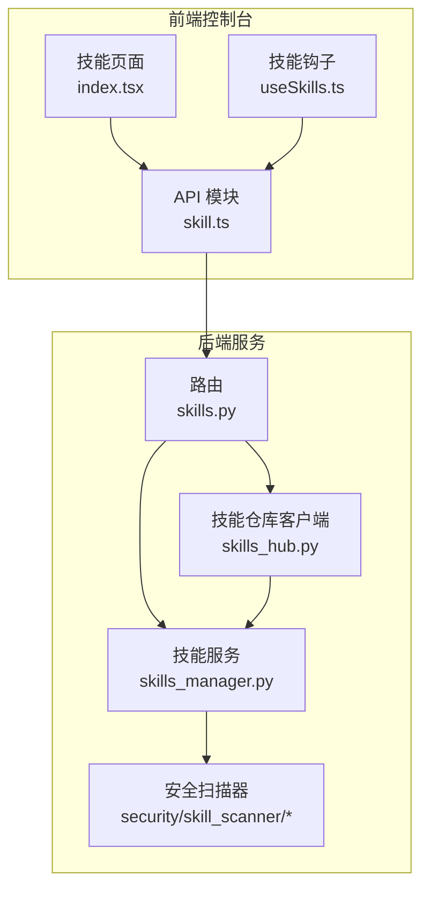
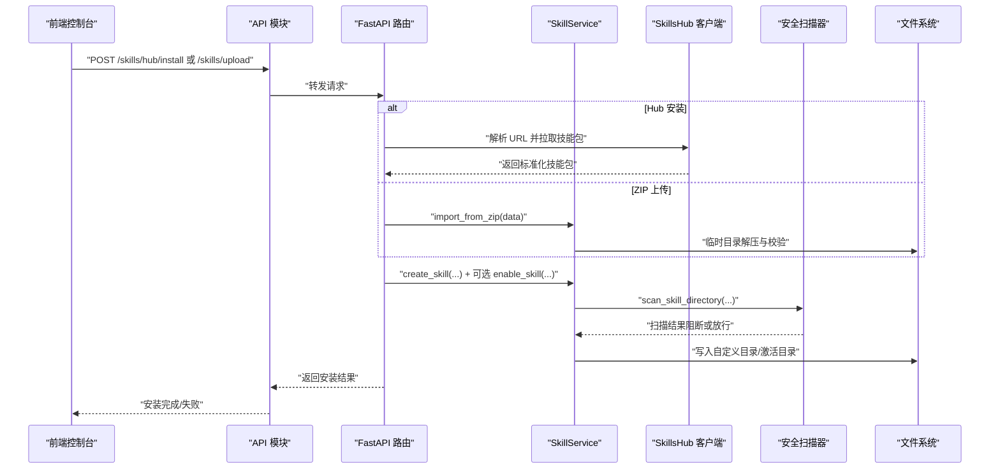
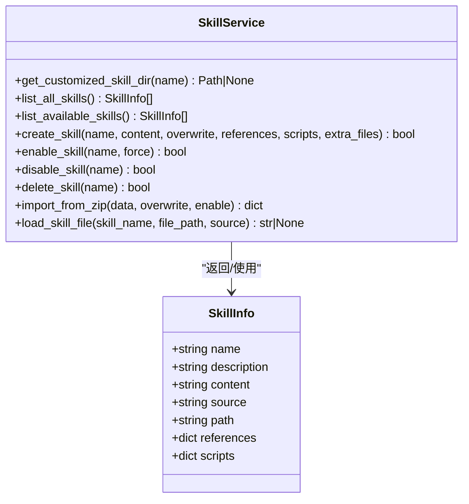
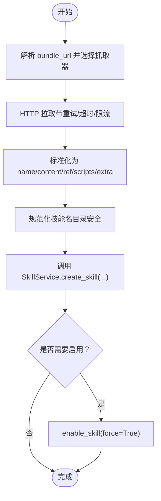
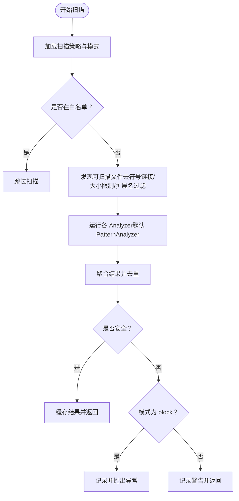
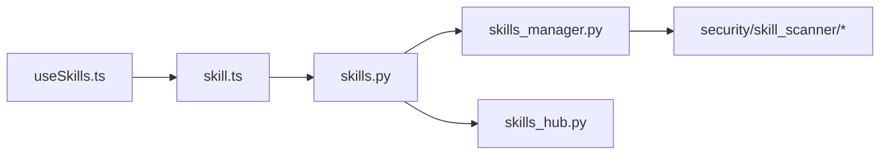

# 技能安装与管理

<cite>
**本文引用的文件**
- [skills_manager.py](file://src/copaw/agents/skills_manager.py)
- [skills_hub.py](file://src/copaw/agents/skills_hub.py)
- [skills.py](file://src/copaw/app/routers/skills.py)
- [skill.ts](file://console/src/api/modules/skill.ts)
- [skill.ts（类型定义）](file://console/src/api/types/skill.ts)
- [useSkills.ts](file://console/src/pages/Agent/Skills/useSkills.ts)
- [index.tsx（技能页面）](file://console/src/pages/Agent/Skills/index.tsx)
- [skills_cmd.py](file://src/copaw/cli/skills_cmd.py)
- [__init__.py（技能扫描器入口）](file://src/copaw/security/skill_scanner/__init__.py)
- [scanner.py（扫描器编排器）](file://src/copaw/security/skill_scanner/scanner.py)
- [download_task_store.py](file://src/copaw/app/download_task_store.py)
</cite>

## 目录
1. [简介](#简介)
2. [项目结构](#项目结构)
3. [核心组件](#核心组件)
4. [架构总览](#架构总览)
5. [详细组件分析](#详细组件分析)
6. [依赖分析](#依赖分析)
7. [性能考虑](#性能考虑)
8. [故障排查指南](#故障排查指南)
9. [结论](#结论)
10. [附录](#附录)

## 简介
本技术文档围绕 CoPaw 的“技能安装与管理”能力，系统阐述从技能下载、ZIP 解压与校验、目录结构规范化、启用/禁用、卸载清理、版本回滚与冲突处理，到进度跟踪、取消机制与错误恢复策略，并覆盖技能管理 API 与批量操作。文档同时提供面向前端与后端的关键流程图示，帮助开发者与运维人员快速理解并扩展该能力。

## 项目结构
技能相关代码主要分布在以下模块：
- 后端服务层：FastAPI 路由与业务编排
- 技能管理服务：技能读取、创建、启用/禁用、导入 ZIP、删除等
- 技能仓库客户端：从 Hub 拉取技能包、HTTP 请求与重试、超时控制
- 安全扫描：安装/启用前后的威胁检测与阻断
- 前端控制台：技能列表、上传、Hub 导入、启用/禁用、删除、批量操作

图表来源
- [skills.py:119-753](file://src/copaw/app/routers/skills.py#L119-L753)
- [skills_manager.py:654-1233](file://src/copaw/agents/skills_manager.py#L654-L1233)
- [skills_hub.py:1-800](file://src/copaw/agents/skills_hub.py#L1-L800)
- [__init__.py（技能扫描器入口）:415-505](file://src/copaw/security/skill_scanner/__init__.py#L415-L505)

章节来源
- [skills.py:119-753](file://src/copaw/app/routers/skills.py#L119-L753)
- [skills_manager.py:654-1233](file://src/copaw/agents/skills_manager.py#L654-L1233)
- [skills_hub.py:1-800](file://src/copaw/agents/skills_hub.py#L1-L800)
- [__init__.py（技能扫描器入口）:415-505](file://src/copaw/security/skill_scanner/__init__.py#L415-L505)

## 核心组件
- 技能服务（SkillService）
  - 提供技能的创建、导入 ZIP、启用/禁用、删除、文件读取等能力
  - 支持从内置与自定义目录同步技能到工作目录
- 技能仓库客户端（SkillsHub）
  - 支持多种 Hub 来源（ClawHub、Skills.sh、LobeHub、ModelScope、SkillsMP、GitHub 等）
  - 内置 HTTP 请求重试、超时、速率限制处理与取消检查
- 安全扫描器（SkillScanner）
  - 在安装/启用前后执行威胁扫描，支持阻断模式
  - 可缓存扫描结果，避免重复扫描
- FastAPI 路由
  - 对外暴露技能列表、上传 ZIP、Hub 安装、启用/禁用、删除、批量操作等接口
  - 支持后台任务与取消机制

章节来源
- [skills_manager.py:654-1233](file://src/copaw/agents/skills_manager.py#L654-L1233)
- [skills_hub.py:1-800](file://src/copaw/agents/skills_hub.py#L1-L800)
- [__init__.py（技能扫描器入口）:415-505](file://src/copaw/security/skill_scanner/__init__.py#L415-L505)
- [skills.py:119-753](file://src/copaw/app/routers/skills.py#L119-L753)

## 架构总览
下图展示从前端发起技能安装请求到后端完成安装与启用的完整链路，包括 ZIP 导入与 Hub 安装两条路径。

图表来源
- [skills.py:344-514](file://src/copaw/app/routers/skills.py#L344-L514)
- [skills_manager.py:1027-1113](file://src/copaw/agents/skills_manager.py#L1027-L1113)
- [skills_hub.py:1566-1618](file://src/copaw/agents/skills_hub.py#L1566-L1618)
- [__init__.py（技能扫描器入口）:415-505](file://src/copaw/security/skill_scanner/__init__.py#L415-L505)

## 详细组件分析

### 组件一：技能服务（SkillService）
职责与关键点：
- 列出所有技能（内置+自定义），并去重优先使用自定义
- 从 ZIP 导入技能：校验 ZIP 结构与安全、提取技能目录、写入自定义目录
- 创建技能：校验 SKILL.md YAML Front Matter，按需创建 references/scripts 子树
- 启用/禁用：将技能复制到 active_skills 或移除；启用前进行安全扫描
- 删除：仅删除自定义目录中的技能
- 文件读取：安全地从 builtin/customized 的 references/scripts 中读取文件

图表来源
- [skills_manager.py:28-1233](file://src/copaw/agents/skills_manager.py#L28-L1233)

章节来源
- [skills_manager.py:654-1233](file://src/copaw/agents/skills_manager.py#L654-L1233)

### 组件二：技能仓库客户端（SkillsHub）
职责与关键点：
- 多源支持：ClawHub、Skills.sh、LobeHub、ModelScope、SkillsMP、GitHub 等
- HTTP 请求与重试：可配置重试次数、指数退避、超时、最大响应体大小
- 取消机制：通过上下文变量与事件标志实现用户取消
- 包标准化：统一输出 name、content、references、scripts、extra_files
- ZIP 安全校验：限制未压缩体积、路径合法性、禁止符号链接

图表来源
- [skills_hub.py:1539-1618](file://src/copaw/agents/skills_hub.py#L1539-L1618)
- [skills_manager.py:726-887](file://src/copaw/agents/skills_manager.py#L726-L887)

章节来源
- [skills_hub.py:1-800](file://src/copaw/agents/skills_hub.py#L1-L800)
- [skills_hub.py:1539-1618](file://src/copaw/agents/skills_hub.py#L1539-L1618)

### 组件三：安全扫描器（SkillScanner）
职责与关键点：
- 扫描模式：block/warn/off，可通过环境变量或配置覆盖
- 缓存：基于目录 mtime 的扫描结果缓存，减少重复扫描
- 白名单：支持按技能名与内容哈希白名单跳过扫描
- 文件发现：遍历技能目录，过滤符号链接、大文件、扩展名黑名单
- 阻断行为：当扫描结果不安全且模式为 block 时抛出异常

图表来源
- [__init__.py（技能扫描器入口）:415-505](file://src/copaw/security/skill_scanner/__init__.py#L415-L505)
- [scanner.py:148-242](file://src/copaw/security/skill_scanner/scanner.py#L148-L242)

章节来源
- [__init__.py（技能扫描器入口）:415-505](file://src/copaw/security/skill_scanner/__init__.py#L415-L505)
- [scanner.py:148-242](file://src/copaw/security/skill_scanner/scanner.py#L148-L242)

### 组件四：HTTP 请求与重试机制
- 超时与重试：可配置超时与重试次数，指数退避上限
- 重试条件：针对特定 HTTP 状态码（如 429/5xx）与网络错误
- 速率限制：对 GitHub API 自动识别并提示设置令牌
- 读取控制：分块读取响应体，限制最大字节数

章节来源
- [skills_hub.py:70-120](file://src/copaw/agents/skills_hub.py#L70-L120)
- [skills_hub.py:226-335](file://src/copaw/agents/skills_hub.py#L226-L335)

### 组件五：ZIP 文件解压与校验
- 安全校验：限制未压缩总大小、路径合法性、禁止符号链接
- 临时目录：使用系统临时目录，结束后清理
- 目录展开：自动去除单一层级包装目录，定位真实技能根
- 错误处理：非法 ZIP、无技能、校验失败均抛出明确错误

章节来源
- [skills_manager.py:556-577](file://src/copaw/agents/skills_manager.py#L556-L577)
- [skills_manager.py:1027-1113](file://src/copaw/agents/skills_manager.py#L1027-L1113)

### 组件六：技能目录结构规范化与文件权限
- 目录规范化：将含斜杠的显示名转换为安全目录名
- 文件树构建：将扁平映射转为嵌套字典树，再写入文件系统
- 权限与安全：扫描时跳过符号链接，写入后进行安全扫描

章节来源
- [skills_manager.py:417-449](file://src/copaw/agents/skills_manager.py#L417-L449)
- [skills_manager.py:500-546](file://src/copaw/agents/skills_manager.py#L500-L546)
- [scanner.py:248-299](file://src/copaw/security/skill_scanner/scanner.py#L248-L299)

### 组件七：启用/禁用流程与配置生成
- 启用：先扫描，再复制到 active_skills；支持强制覆盖
- 禁用：直接删除 active_skills 下对应目录
- 配置生成：启用后触发后台热重载（非阻塞）

章节来源
- [skills_manager.py:920-967](file://src/copaw/agents/skills_manager.py#L920-L967)
- [skills.py:591-693](file://src/copaw/app/routers/skills.py#L591-L693)

### 组件八：卸载清理、版本回滚与冲突处理
- 卸载清理：删除自定义目录中的技能；若已启用则保留以避免中断
- 版本回滚：内置技能版本比较，支持从内置回滚到旧版本
- 冲突处理：同名技能优先使用自定义；ZIP 导入支持覆盖选项

章节来源
- [skills_manager.py:78-103](file://src/copaw/agents/skills_manager.py#L78-L103)
- [skills_manager.py:324-345](file://src/copaw/agents/skills_manager.py#L324-L345)
- [skills_manager.py:1027-1113](file://src/copaw/agents/skills_manager.py#L1027-L1113)

### 组件九：安装进度跟踪、取消机制与错误恢复
- 进度跟踪：Hub 安装采用后台任务状态机（pending/importing/completed/failed/cancelled）
- 取消机制：通过线程事件与取消检查函数实现用户取消
- 错误恢复：捕获扫描异常、参数错误、上游错误并返回结构化错误

章节来源
- [skills.py:100-117](file://src/copaw/app/routers/skills.py#L100-L117)
- [skills.py:264-342](file://src/copaw/app/routers/skills.py#L264-L342)
- [skills.py:432-452](file://src/copaw/app/routers/skills.py#L432-L452)

### 组件十：技能管理 API 与批量操作
- 列表与可用技能：GET /skills 与 /skills/available
- Hub 搜索与安装：GET /skills/hub/search；POST /skills/hub/install 与 /skills/hub/install/start
- ZIP 上传：POST /skills/upload
- 启用/禁用/删除：POST /skills/{skill_name}/enable/disable/delete
- 批量操作：POST /skills/batch-enable/disable
- 前端集成：useSkills.ts 实现轮询、取消、扫描告警弹窗

章节来源
- [skills.py:122-753](file://src/copaw/app/routers/skills.py#L122-L753)
- [skill.ts:43-98](file://console/src/api/modules/skill.ts#L43-L98)
- [useSkills.ts:265-337](file://console/src/pages/Agent/Skills/useSkills.ts#L265-L337)

## 依赖分析
- 路由依赖：skills.py 依赖 SkillService 与 SkillsHub，并调用安全扫描器
- 服务依赖：SkillService 依赖文件系统与安全扫描器
- 客户端依赖：SkillsHub 依赖 urllib、frontmatter、yaml、zipfile 等
- 前端依赖：useSkills.ts 依赖 skill.ts API 模块与安全扫描错误解析

图表来源
- [skills.py:13-22](file://src/copaw/app/routers/skills.py#L13-L22)
- [skills_manager.py:856-872](file://src/copaw/agents/skills_manager.py#L856-L872)
- [skills_hub.py:1-25](file://src/copaw/agents/skills_hub.py#L1-L25)
- [useSkills.ts:4-8](file://console/src/pages/Agent/Skills/useSkills.ts#L4-L8)

章节来源
- [skills.py:13-22](file://src/copaw/app/routers/skills.py#L13-L22)
- [skills_manager.py:856-872](file://src/copaw/agents/skills_manager.py#L856-L872)
- [skills_hub.py:1-25](file://src/copaw/agents/skills_hub.py#L1-L25)
- [useSkills.ts:4-8](file://console/src/pages/Agent/Skills/useSkills.ts#L4-L8)

## 性能考虑
- 扫描缓存：基于目录 mtime 的扫描结果缓存，降低重复扫描开销
- 文件发现限制：最大文件数与单文件大小限制，避免大包扫描耗时
- 异步与线程池：Hub 安装在独立线程中执行，避免阻塞主请求
- ZIP 安全校验：提前校验未压缩体积与路径合法性，防止恶意 ZIP 消耗资源

章节来源
- [__init__.py（技能扫描器入口）:327-380](file://src/copaw/security/skill_scanner/__init__.py#L327-L380)
- [scanner.py:100-134](file://src/copaw/security/skill_scanner/scanner.py#L100-L134)
- [skills.py:275-286](file://src/copaw/app/routers/skills.py#L275-L286)

## 故障排查指南
常见问题与处理建议：
- 安装被阻断
  - 现象：返回 422，包含扫描发现项
  - 处理：查看扫描器模式与白名单配置，必要时修复脚本内容
- ZIP 非法或无技能
  - 现象：ValueError，提示无效 ZIP 或未找到有效技能
  - 处理：确认 ZIP 结构与 SKILL.md Front Matter 正确
- Hub 速率限制
  - 现象：429 错误，提示速率限制
  - 处理：设置 GITHUB_TOKEN 环境变量
- 安装被取消
  - 现象：任务状态变为 cancelled
  - 处理：前端轮询到 cancelled 后清理残留目录（禁用+删除）
- 启用失败
  - 现象：启用后未出现在 active_skills
  - 处理：检查扫描结果与日志，确认安全扫描通过

章节来源
- [skills.py:28-50](file://src/copaw/app/routers/skills.py#L28-L50)
- [skills.py:312-342](file://src/copaw/app/routers/skills.py#L312-L342)
- [skills.py:432-452](file://src/copaw/app/routers/skills.py#L432-L452)
- [__init__.py（技能扫描器入口）:393-413](file://src/copaw/security/skill_scanner/__init__.py#L393-L413)

## 结论
CoPaw 的技能安装与管理能力以“安全优先、可扩展、可观测”为核心设计原则：通过严格的 ZIP 校验与安全扫描保障安装安全，通过 Hub 客户端与多源支持提升获取体验，通过后台任务与取消机制提升用户体验，通过缓存与限制优化性能。上述组件协同工作，形成一套完整的技能生命周期管理体系。

## 附录

### API 接口一览（节选）
- GET /skills：列出所有技能（含启用状态）
- GET /skills/available：列出可用技能
- GET /skills/hub/search：搜索 Hub 技能
- POST /skills/hub/install：立即安装 Hub 技能
- POST /skills/hub/install/start：启动后台安装任务
- GET /skills/hub/install/status/{task_id}：查询安装任务状态
- POST /skills/hub/install/cancel/{task_id}：取消安装任务
- POST /skills/upload：上传 ZIP 安装技能
- POST /skills/batch-enable：批量启用
- POST /skills/batch-disable：批量禁用
- POST /skills/{skill_name}/enable：启用技能
- POST /skills/{skill_name}/disable：禁用技能
- DELETE /skills/{skill_name}：删除技能
- GET /skills/{skill_name}/files/{source}/{file_path:path}：读取技能文件

章节来源
- [skills.py:122-753](file://src/copaw/app/routers/skills.py#L122-L753)
- [skill.ts（类型定义）:1-29](file://console/src/api/types/skill.ts#L1-L29)