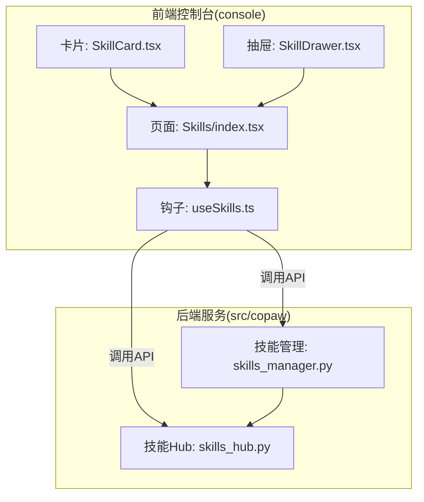
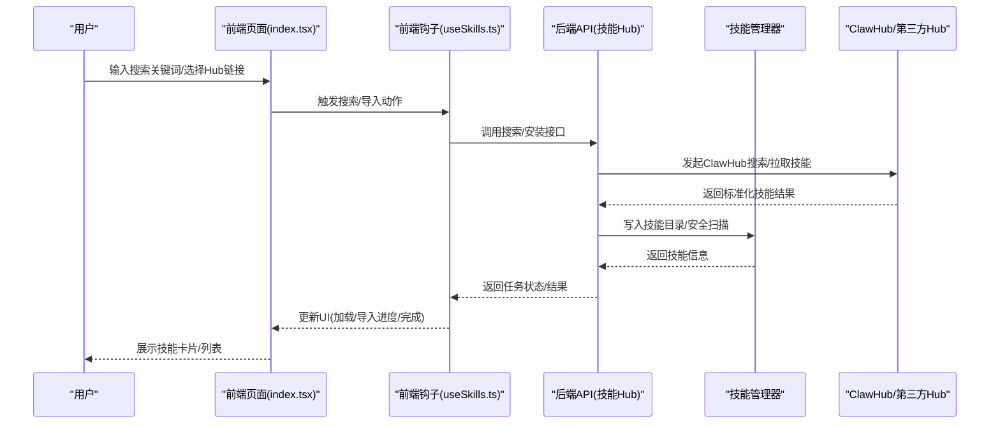
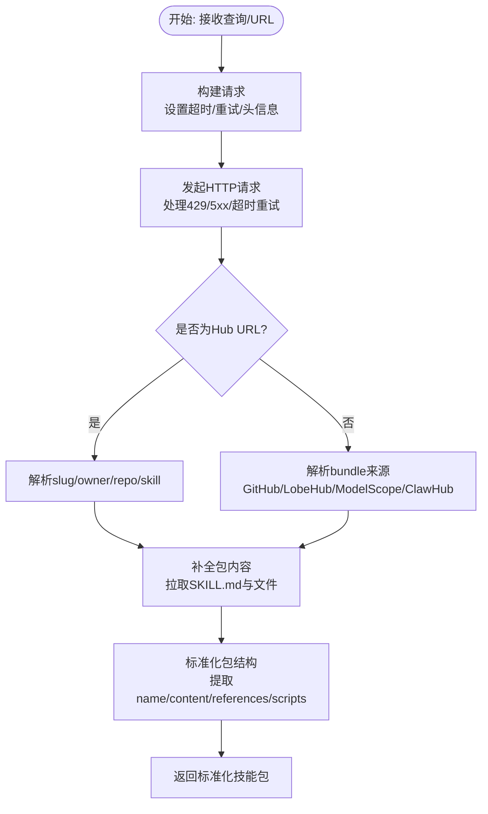
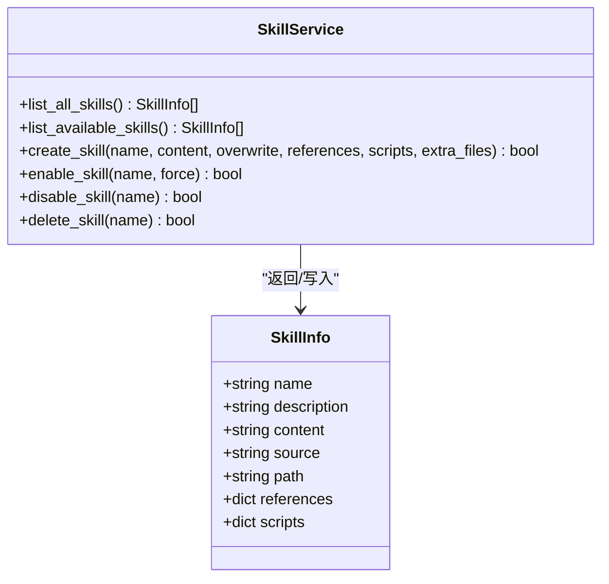
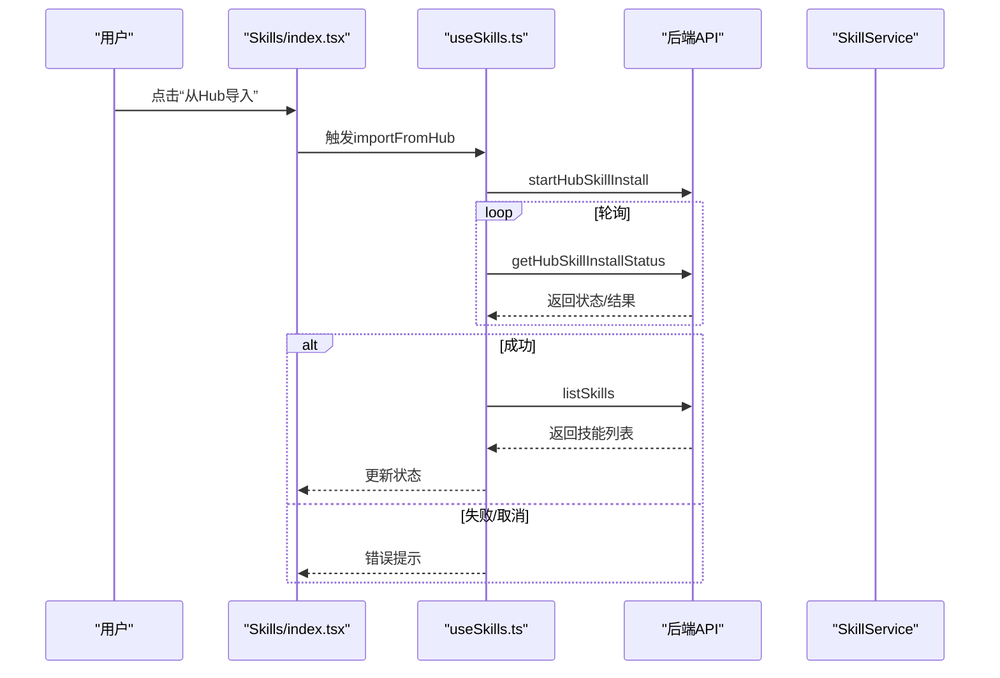

# 技能搜索与发现

<cite>
**本文引用的文件**
- [skills_hub.py](file://src/copaw/agents/skills_hub.py)
- [skills_manager.py](file://src/copaw/agents/skills_manager.py)
- [copaw_source_index/SKILL.md](file://src/copaw/agents/skills/copaw_source_index/SKILL.md)
- [docx/SKILL.md](file://src/copaw/agents/skills/docx/SKILL.md)
- [index.tsx](file://console/src/pages/Agent/Skills/index.tsx)
- [useSkills.ts](file://console/src/pages/Agent/Skills/useSkills.ts)
- [SkillCard.tsx](file://console/src/pages/Agent/Skills/components/SkillCard.tsx)
- [SkillDrawer.tsx](file://console/src/pages/Agent/Skills/components/SkillDrawer.tsx)
</cite>

## 目录
1. [简介](#简介)
2. [项目结构](#项目结构)
3. [核心组件](#核心组件)
4. [架构总览](#架构总览)
5. [详细组件分析](#详细组件分析)
6. [依赖关系分析](#依赖关系分析)
7. [性能考虑](#性能考虑)
8. [故障排查指南](#故障排查指南)
9. [结论](#结论)

## 简介
本文面向CoPaw技能搜索与发现能力，系统化阐述技能中心如何通过ClawHub API进行技能搜索，覆盖搜索算法、过滤机制与排序策略；详解技能元数据提取流程（SKILL.md解析、版本管理与依赖声明）、URL解析与技能标识符提取（支持GitHub、LobeHub、ModelScope等多平台）、搜索结果标准化、技能列表构建与前端展示；并提供性能优化策略、缓存机制与错误处理方案。

## 项目结构
技能搜索与发现涉及前后端协同：
- 后端Python模块负责与ClawHub等外部Hub交互、解析多平台URL、标准化技能包、写入工作目录并进行安全扫描。
- 前端React页面负责用户输入、任务轮询、UI展示与交互。

图表来源
- [index.tsx:1-304](file://console/src/pages/Agent/Skills/index.tsx#L1-L304)
- [useSkills.ts:1-411](file://console/src/pages/Agent/Skills/useSkills.ts#L1-L411)
- [SkillCard.tsx:1-192](file://console/src/pages/Agent/Skills/components/SkillCard.tsx#L1-L192)
- [SkillDrawer.tsx:1-289](file://console/src/pages/Agent/Skills/components/SkillDrawer.tsx#L1-L289)
- [skills_hub.py:1-1619](file://src/copaw/agents/skills_hub.py#L1-L1619)
- [skills_manager.py:1-1233](file://src/copaw/agents/skills_manager.py#L1-L1233)

章节来源
- [index.tsx:1-304](file://console/src/pages/Agent/Skills/index.tsx#L1-L304)
- [useSkills.ts:1-411](file://console/src/pages/Agent/Skills/useSkills.ts#L1-L411)
- [SkillCard.tsx:1-192](file://console/src/pages/Agent/Skills/components/SkillCard.tsx#L1-L192)
- [SkillDrawer.tsx:1-289](file://console/src/pages/Agent/Skills/components/SkillDrawer.tsx#L1-L289)
- [skills_hub.py:1-1619](file://src/copaw/agents/skills_hub.py#L1-L1619)
- [skills_manager.py:1-1233](file://src/copaw/agents/skills_manager.py#L1-L1233)

## 核心组件
- 技能Hub客户端：封装ClawHub API调用、多平台URL解析、技能包标准化、版本与文件拉取、错误与重试策略。
- 技能管理器：负责技能目录结构、SKILL.md解析、版本比对、启用/禁用、导入ZIP、安全扫描集成。
- 前端页面与钩子：提供导入、上传、启用/禁用、删除等操作，轮询Hub安装任务状态，展示技能卡片与详情。

章节来源
- [skills_hub.py:1-1619](file://src/copaw/agents/skills_hub.py#L1-L1619)
- [skills_manager.py:1-1233](file://src/copaw/agents/skills_manager.py#L1-L1233)
- [index.tsx:1-304](file://console/src/pages/Agent/Skills/index.tsx#L1-L304)
- [useSkills.ts:1-411](file://console/src/pages/Agent/Skills/useSkills.ts#L1-L411)

## 架构总览
技能搜索与发现的端到端流程如下：

图表来源
- [index.tsx:1-304](file://console/src/pages/Agent/Skills/index.tsx#L1-L304)
- [useSkills.ts:265-329](file://console/src/pages/Agent/Skills/useSkills.ts#L265-L329)
- [skills_hub.py:1513-1536](file://src/copaw/agents/skills_hub.py#L1513-L1536)
- [skills_manager.py:654-967](file://src/copaw/agents/skills_manager.py#L654-L967)

## 详细组件分析

### 技能Hub客户端（skills_hub.py）
- 外部Hub交互
  - 支持ClawHub基础URL、搜索路径、版本路径、详情路径、文件路径的环境变量配置。
  - 统一封装HTTP请求，支持超时、重试、指数回退、取消检查、429/5xx重试、GitHub速率限制提示。
  - 提供统一的JSON/文本/字节下载方法，限制响应大小，避免内存溢出。
- URL解析与技能标识符提取
  - 支持ClawHub、skills.sh、GitHub、LobeHub、ModelScope、SkillsMP等多平台URL解析。
  - 从URL中抽取slug、owner/repo/skill、分支/版本提示等关键信息。
- 技能包标准化与版本管理
  - 将ClawHub返回的元数据补全为包含文件内容的“包”，自动拉取SKILL.md与相关文件。
  - 从ClawHub详情/版本接口推断版本号，拼接文件下载参数。
- 搜索结果标准化
  - 统一不同Hub返回结构，提取slug/name/displayName/description/version/url等字段，构造HubSkillResult列表。

图表来源
- [skills_hub.py:131-180](file://src/copaw/agents/skills_hub.py#L131-L180)
- [skills_hub.py:226-335](file://src/copaw/agents/skills_hub.py#L226-L335)
- [skills_hub.py:489-570](file://src/copaw/agents/skills_hub.py#L489-L570)
- [skills_hub.py:574-633](file://src/copaw/agents/skills_hub.py#L574-L633)
- [skills_hub.py:1513-1536](file://src/copaw/agents/skills_hub.py#L1513-L1536)

章节来源
- [skills_hub.py:131-180](file://src/copaw/agents/skills_hub.py#L131-L180)
- [skills_hub.py:226-335](file://src/copaw/agents/skills_hub.py#L226-L335)
- [skills_hub.py:489-570](file://src/copaw/agents/skills_hub.py#L489-L570)
- [skills_hub.py:574-633](file://src/copaw/agents/skills_hub.py#L574-L633)
- [skills_hub.py:1513-1536](file://src/copaw/agents/skills_hub.py#L1513-L1536)

### 技能管理器（skills_manager.py）
- 目录与同步
  - 维护内置、定制、激活三类技能目录，提供同步与清理逻辑，确保定制覆盖内置。
  - 支持将激活目录内容回写至定制目录，实现双向同步。
- 元数据解析与版本管理
  - 从SKILL.md解析name/description，使用Pydantic模型封装技能信息。
  - 从SKILL.md metadata中读取builtin_skill_version，用于版本升级判断。
- 安全扫描与启用/禁用
  - 启用前对源目录进行安全扫描，失败则阻断；导入ZIP后同样进行扫描。
  - 提供enable/disable/delete等操作，配合UI展示与交互。

图表来源
- [skills_manager.py:28-61](file://src/copaw/agents/skills_manager.py#L28-L61)
- [skills_manager.py:654-967](file://src/copaw/agents/skills_manager.py#L654-L967)

章节来源
- [skills_manager.py:28-61](file://src/copaw/agents/skills_manager.py#L28-L61)
- [skills_manager.py:169-188](file://src/copaw/agents/skills_manager.py#L169-L188)
- [skills_manager.py:654-967](file://src/copaw/agents/skills_manager.py#L654-L967)

### 前端页面与交互（index.tsx、useSkills.ts、SkillCard.tsx、SkillDrawer.tsx）
- 页面与输入校验
  - 支持从ZIP上传、从Hub URL导入、创建新技能。
  - 校验URL前缀，限定最大上传体积，导入时轮询任务状态，支持手动/超时取消。
- 任务轮询与错误处理
  - 导入流程中定时轮询任务状态，区分completed/failed/cancelled，弹窗提示并更新UI。
  - 对安全扫描错误进行结构化解析与弹窗展示。
- 技能列表与展示
  - 按启用状态优先排序，卡片展示描述、来源、路径等信息，支持启用/禁用与删除（仅定制且未启用）。
  - 抽屉展示SKILL.md内容与元信息，提供AI优化与停止优化能力。

图表来源
- [index.tsx:66-124](file://console/src/pages/Agent/Skills/index.tsx#L66-L124)
- [useSkills.ts:265-329](file://console/src/pages/Agent/Skills/useSkills.ts#L265-L329)

章节来源
- [index.tsx:1-304](file://console/src/pages/Agent/Skills/index.tsx#L1-L304)
- [useSkills.ts:1-411](file://console/src/pages/Agent/Skills/useSkills.ts#L1-L411)
- [SkillCard.tsx:1-192](file://console/src/pages/Agent/Skills/components/SkillCard.tsx#L1-L192)
- [SkillDrawer.tsx:1-289](file://console/src/pages/Agent/Skills/components/SkillDrawer.tsx#L1-L289)

## 依赖关系分析
- 技能Hub客户端依赖技能管理器进行最终的技能落盘与启用。
- 前端通过useSkills钩子与后端API交互，间接依赖技能Hub与技能管理器。
- 多平台URL解析与版本推断由技能Hub客户端集中处理，降低前端复杂度。

图表来源
- [useSkills.ts:1-411](file://console/src/pages/Agent/Skills/useSkills.ts#L1-L411)
- [skills_hub.py:1-1619](file://src/copaw/agents/skills_hub.py#L1-L1619)
- [skills_manager.py:1-1233](file://src/copaw/agents/skills_manager.py#L1-L1233)

章节来源
- [useSkills.ts:1-411](file://console/src/pages/Agent/Skills/useSkills.ts#L1-L411)
- [skills_hub.py:1-1619](file://src/copaw/agents/skills_hub.py#L1-L1619)
- [skills_manager.py:1-1233](file://src/copaw/agents/skills_manager.py#L1-L1233)

## 性能考虑
- 网络层
  - 超时与重试：通过环境变量控制超时、重试次数与回退基数，避免瞬时网络波动影响体验。
  - 流式读取：HTTP响应按块读取，限制最大字节数，防止内存占用过高。
  - 取消检查：支持用户取消导入任务，及时释放资源。
- Hub解析与版本推断
  - 优先使用默认分支，必要时回退到main/master；对ModelScope来源优先走GitHub/ClawHub直链，减少中间层开销。
- 文件收集与ZIP解压
  - 对GitHub树遍历设置上限，避免大型仓库导致的I/O压力；ZIP解压进行大小与条目数限制，防止异常包导致资源耗尽。
- UI轮询
  - 导入轮询间隔固定，超时时间可控，避免频繁请求造成后端压力。

章节来源
- [skills_hub.py:70-105](file://src/copaw/agents/skills_hub.py#L70-L105)
- [skills_hub.py:183-223](file://src/copaw/agents/skills_hub.py#L183-L223)
- [skills_hub.py:1018-1053](file://src/copaw/agents/skills_hub.py#L1018-L1053)
- [skills_hub.py:1315-1367](file://src/copaw/agents/skills_hub.py#L1315-L1367)
- [useSkills.ts:277-317](file://console/src/pages/Agent/Skills/useSkills.ts#L277-L317)

## 故障排查指南
- GitHub速率限制
  - 当返回403且包含“rate limit”时，提示设置GITHUB_TOKEN以提升配额。
- Hub返回429/5xx
  - 自动重试与指数回退；超过重试次数后提示稍后再试，并附带针对GitHub的Token建议。
- ZIP包异常
  - 不是有效ZIP、条目过多、体积过大、非文本文件被过滤等情况均会抛出明确错误。
- 安全扫描告警
  - 前端可解析安全扫描错误并弹窗展示具体违规项；定制技能启用前也会进行扫描，失败将阻断启用。
- URL格式错误
  - 前端对URL前缀进行白名单校验，不支持的来源直接提示无效。

章节来源
- [skills_hub.py:251-301](file://src/copaw/agents/skills_hub.py#L251-L301)
- [skills_hub.py:1348-1356](file://src/copaw/agents/skills_hub.py#L1348-L1356)
- [useSkills.ts:10-24](file://console/src/pages/Agent/Skills/useSkills.ts#L10-L24)
- [useSkills.ts:36-101](file://console/src/pages/Agent/Skills/useSkills.ts#L36-L101)
- [index.tsx:66-78](file://console/src/pages/Agent/Skills/index.tsx#L66-L78)

## 结论
CoPaw的技能搜索与发现通过“前端任务轮询 + 后端Hub解析 + 技能管理落盘”的分层设计，实现了对多平台技能源的统一接入与标准化展示。技能Hub客户端承担了复杂的URL解析、版本推断与包标准化职责，技能管理器负责安全与生命周期管理，前端提供直观的导入、启用/禁用与删除操作。在性能方面，通过超时/重试/流式读取/ZIP限制等策略保障稳定性；在可靠性方面，完善的错误处理与安全扫描确保用户获得安全可靠的技能生态。