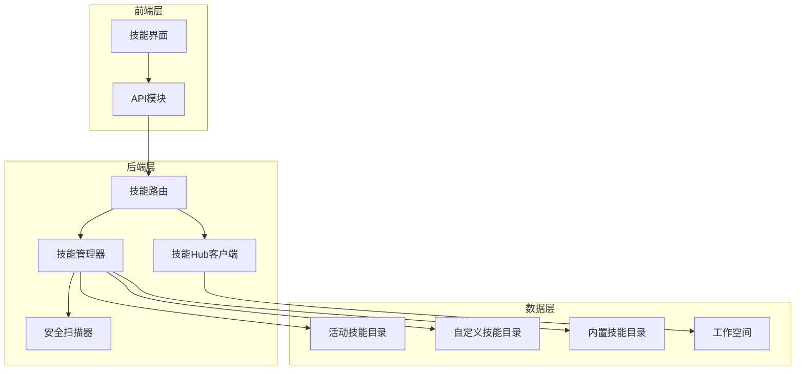
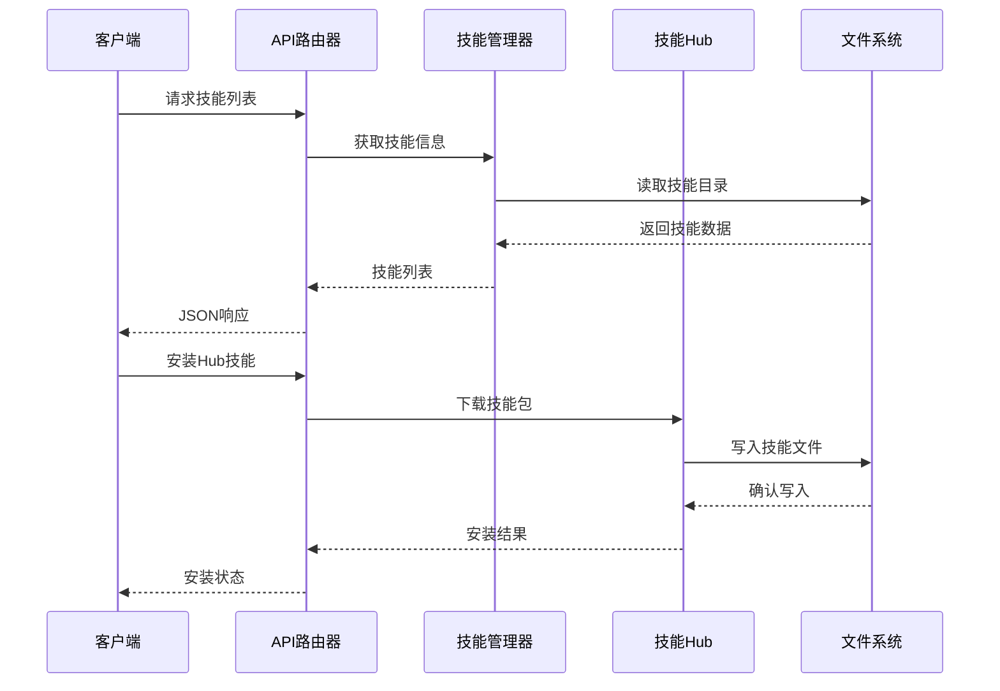
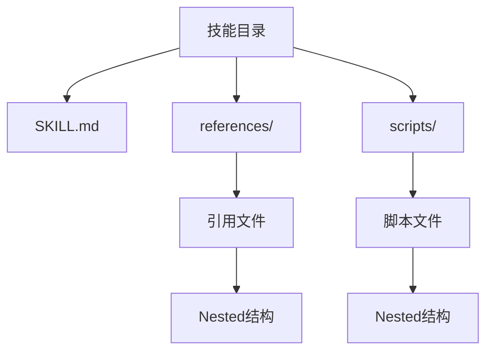
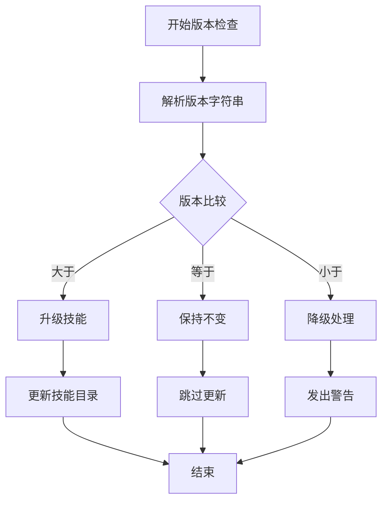
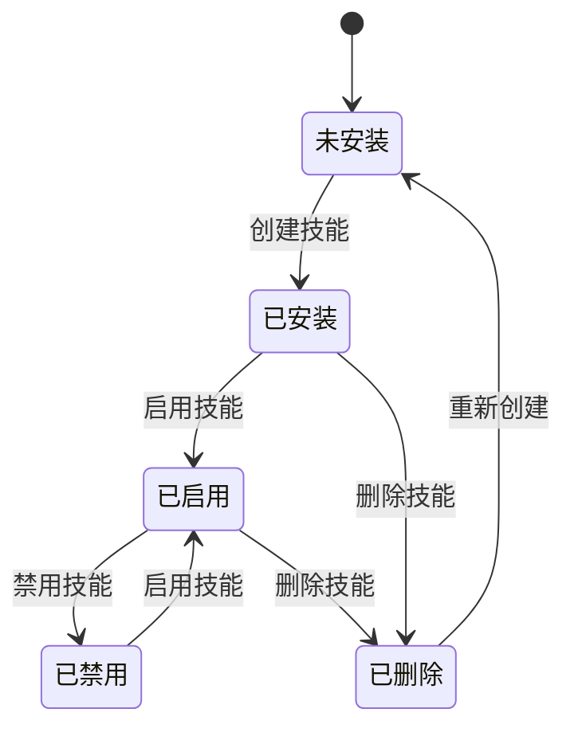
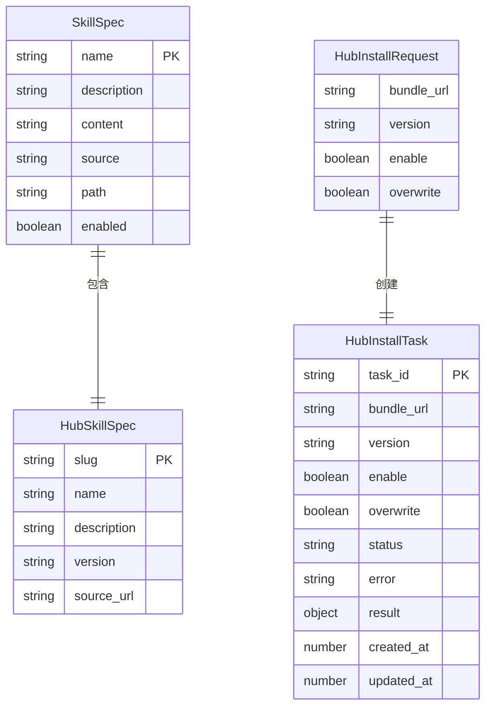
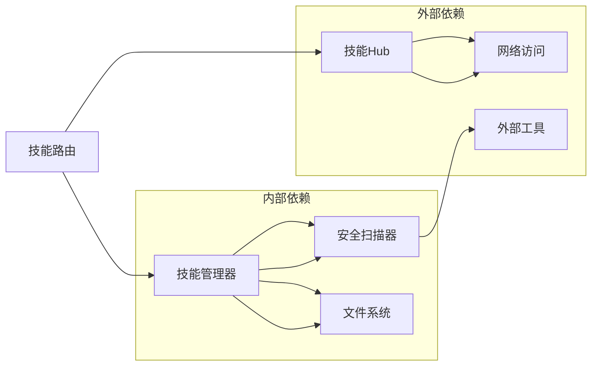
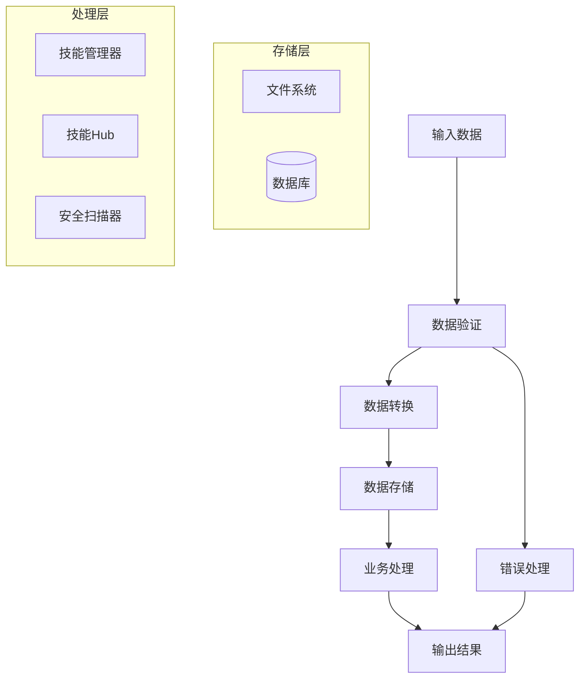

# 技能数据模型

<cite>
**本文档引用的文件**
- [skills.py](file://src/copaw/app/routers/skills.py)
- [skills_hub.py](file://src/copaw/agents/skills_hub.py)
- [skills_manager.py](file://src/copaw/agents/skills_manager.py)
- [skill.ts](file://console/src/api/types/skill.ts)
- [skill.ts](file://console/src/api/modules/skill.ts)
- [SKILL.md](file://src/copaw/agents/skills/copaw_source_index/SKILL.md)
</cite>

## 目录
1. [简介](#简介)
2. [项目结构](#项目结构)
3. [核心组件](#核心组件)
4. [架构概览](#架构概览)
5. [详细组件分析](#详细组件分析)
6. [依赖关系分析](#依赖关系分析)
7. [性能考虑](#性能考虑)
8. [故障排除指南](#故障排除指南)
9. [结论](#结论)

## 简介

CoPaw技能数据模型是整个技能系统的核心基础，负责管理技能的元数据、配置、依赖关系和状态信息。该模型支持多种技能来源（内置技能、自定义技能、Hub技能），提供完整的技能生命周期管理，包括安装、启用、禁用、删除和版本控制。

本文档详细描述了HubSkillResult和HubInstallResult等核心数据结构，阐述了技能元数据模型、配置模型、依赖关系模型以及状态管理机制。

## 项目结构

CoPaw技能系统采用分层架构设计，主要包含以下核心组件：



**图表来源**
- [skills.py:119-161](file://src/copaw/app/routers/skills.py#L119-L161)
- [skills_manager.py:654-712](file://src/copaw/agents/skills_manager.py#L654-L712)
- [skills_hub.py:34-48](file://src/copaw/agents/skills_hub.py#L34-L48)

**章节来源**
- [skills.py:1-753](file://src/copaw/app/routers/skills.py#L1-L753)
- [skills_manager.py:1-1233](file://src/copaw/agents/skills_manager.py#L1-L1233)
- [skills_hub.py:1-1619](file://src/copaw/agents/skills_hub.py#L1-L1619)

## 核心组件

### 技能信息模型

技能信息模型是所有技能数据的基础结构，定义了技能的基本属性和元数据。

**章节来源**
- [skills_manager.py:28-61](file://src/copaw/agents/skills_manager.py#L28-L61)

### Hub技能结果模型

Hub技能结果模型用于表示从技能Hub获取的技能信息，包含技能标识、名称、描述和版本信息。

**章节来源**
- [skills_hub.py:34-48](file://src/copaw/agents/skills_hub.py#L34-L48)

### Hub安装结果模型

Hub安装结果模型用于表示技能安装过程的结果状态，包含安装后的技能名称、启用状态和来源信息。

**章节来源**
- [skills_hub.py:44-48](file://src/copaw/agents/skills_hub.py#L44-L48)

## 架构概览

CoPaw技能系统采用模块化设计，各组件职责清晰分离：



**图表来源**
- [skills.py:122-161](file://src/copaw/app/routers/skills.py#L122-L161)
- [skills_hub.py:1567-1599](file://src/copaw/agents/skills_hub.py#L1567-L1599)
- [skills_manager.py:804-886](file://src/copaw/agents/skills_manager.py#L804-L886)

## 详细组件分析

### 技能元数据模型

技能元数据模型基于YAML Front Matter格式，支持丰富的元数据字段：

#### 基础元数据字段

| 字段名 | 数据类型 | 必填 | 描述 | 示例 |
|--------|----------|------|------|------|
| name | string | 是 | 技能名称 | "copaw_source_index" |
| description | string | 是 | 技能描述 | "将用户问题中的主题映射到文档路径" |
| metadata | object | 否 | 元数据对象 | 包含版本、依赖等信息 |

#### 扩展元数据字段

```yaml
metadata:
  builtin_skill_version: "1.0"
  copaw:
    emoji: "🗂️"
    requires: {}
```

**章节来源**
- [SKILL.md:1-12](file://src/copaw/agents/skills/copaw_source_index/SKILL.md#L1-L12)

### 技能配置模型

技能配置模型支持复杂的文件结构组织：

#### 目录结构规范



**图表来源**
- [skills_manager.py:59-61](file://src/copaw/agents/skills_manager.py#L59-L61)

#### 配置参数定义

| 参数名 | 类型 | 默认值 | 描述 | 约束条件 |
|--------|------|--------|------|----------|
| name | string | - | 技能名称 | 必须唯一，符合命名规范 |
| content | string | - | SKILL.md内容 | 必须包含有效的YAML Front Matter |
| references | dict | {} | 引用文件树 | 支持嵌套字典结构 |
| scripts | dict | {} | 脚本文件树 | 支持嵌套字典结构 |
| overwrite | boolean | false | 是否覆盖现有技能 | 影响文件写入行为 |

**章节来源**
- [skills_manager.py:726-778](file://src/copaw/agents/skills_manager.py#L726-L778)

### 依赖关系模型

技能依赖关系通过元数据中的requires字段定义：

#### 依赖声明格式

```yaml
metadata:
  copaw:
    requires:
      python: ">=3.8"
      packages: ["requests", "numpy"]
```

#### 版本兼容性检查

系统支持语义化版本控制，通过比较版本号确保兼容性：



**图表来源**
- [skills_manager.py:169-188](file://src/copaw/agents/skills_manager.py#L169-L188)

**章节来源**
- [skills_manager.py:324-345](file://src/copaw/agents/skills_manager.py#L324-L345)

### 技能状态模型

技能状态模型管理技能的启用/禁用状态和运行时信息：

#### 状态流转图



#### 运行时状态字段

| 字段名 | 类型 | 描述 | 更新时机 |
|--------|------|------|----------|
| enabled | boolean | 是否启用 | 启用/禁用操作时 |
| source | string | 技能来源 | 技能读取时 |
| path | string | 技能路径 | 技能定位时 |
| references | dict | 引用文件树 | 目录扫描时 |
| scripts | dict | 脚本文件树 | 目录扫描时 |

**章节来源**
- [skills.py:147-159](file://src/copaw/app/routers/skills.py#L147-L159)

### Hub技能数据模型

Hub技能数据模型支持多种技能来源和版本管理：

#### Hub技能规格

| 字段名 | 类型 | 必填 | 描述 | 来源 |
|--------|------|------|------|------|
| slug | string | 是 | Hub标识符 | Hub服务 |
| name | string | 是 | 技能显示名称 | Hub服务 |
| description | string | 否 | 技能描述 | Hub服务 |
| version | string | 否 | 技能版本 | Hub服务 |
| source_url | string | 否 | 源代码URL | Hub服务 |

#### Hub安装请求

| 字段名 | 类型 | 默认值 | 描述 | 约束 |
|--------|------|--------|------|------|
| bundle_url | string | - | 技能包URL | 必须为有效HTTP(S)地址 |
| version | string | "" | 版本标签 | 可选，为空则使用最新版本 |
| enable | boolean | true | 安装后是否启用 | 布尔值 |
| overwrite | boolean | false | 是否覆盖现有技能 | 布尔值 |

**章节来源**
- [skills.py:74-90](file://src/copaw/app/routers/skills.py#L74-L90)

### 数据序列化与验证

#### JSON Schema定义



**图表来源**
- [skills.py:53-111](file://src/copaw/app/routers/skills.py#L53-L111)

#### 验证规则

1. **必填字段验证**: 所有必需字段必须存在且非空
2. **类型验证**: 字段类型必须符合定义
3. **范围验证**: 数值字段必须在允许范围内
4. **格式验证**: URL、邮箱等必须符合格式要求
5. **业务规则验证**: 依赖关系、版本兼容性等

**章节来源**
- [skills.py:28-50](file://src/copaw/app/routers/skills.py#L28-L50)

## 依赖关系分析

### 组件耦合度



**图表来源**
- [skills.py:13-22](file://src/copaw/app/routers/skills.py#L13-L22)

### 数据流向



**图表来源**
- [skills_manager.py:654-712](file://src/copaw/agents/skills_manager.py#L654-L712)
- [skills_hub.py:1567-1599](file://src/copaw/agents/skills_hub.py#L1567-L1599)

**章节来源**
- [skills_manager.py:1-1233](file://src/copaw/agents/skills_manager.py#L1-L1233)
- [skills_hub.py:1-1619](file://src/copaw/agents/skills_hub.py#L1-L1619)

## 性能考虑

### 缓存策略

1. **技能目录缓存**: 缓存技能目录结构，减少重复扫描
2. **元数据缓存**: 缓存SKILL.md解析结果，提高访问速度
3. **Hub响应缓存**: 缓存Hub查询结果，降低网络请求频率

### 并发处理

1. **异步安装**: Hub技能安装使用异步任务，避免阻塞主线程
2. **并发扫描**: 安全扫描支持并发执行，提高处理效率
3. **连接池**: 网络请求使用连接池，复用TCP连接

### 内存优化

1. **流式处理**: 大文件下载使用流式处理，避免内存溢出
2. **分页加载**: Hub查询结果分页加载，控制内存使用
3. **及时释放**: 处理完成后及时释放临时资源

## 故障排除指南

### 常见错误类型

| 错误类型 | 触发条件 | 处理建议 |
|----------|----------|----------|
| 技能扫描失败 | 安全扫描发现高危风险 | 检查技能代码，修复安全问题 |
| 版本冲突 | 依赖版本不兼容 | 升级或降级相关依赖 |
| 文件权限错误 | 文件写入权限不足 | 检查目录权限设置 |
| 网络超时 | Hub访问超时 | 检查网络连接，重试请求 |

### 调试方法

1. **日志分析**: 查看详细日志信息定位问题
2. **状态检查**: 检查技能状态和配置
3. **依赖验证**: 验证技能依赖关系
4. **网络诊断**: 测试Hub连接和访问权限

**章节来源**
- [skills.py:28-50](file://src/copaw/app/routers/skills.py#L28-L50)
- [skills_manager.py:856-872](file://src/copaw/agents/skills_manager.py#L856-L872)

## 结论

CoPaw技能数据模型设计合理，具有良好的扩展性和维护性。通过模块化的架构设计，实现了技能的完整生命周期管理，包括元数据管理、配置管理、依赖关系处理和状态控制。

该模型支持多种技能来源和版本管理，提供了完善的安全机制和错误处理能力。同时，通过合理的性能优化和缓存策略，确保了系统的高效运行。

未来可以进一步增强的功能包括：
1. 更细粒度的权限控制
2. 更丰富的元数据字段
3. 更智能的依赖解析
4. 更完善的监控和告警机制