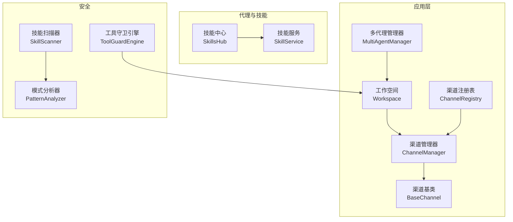
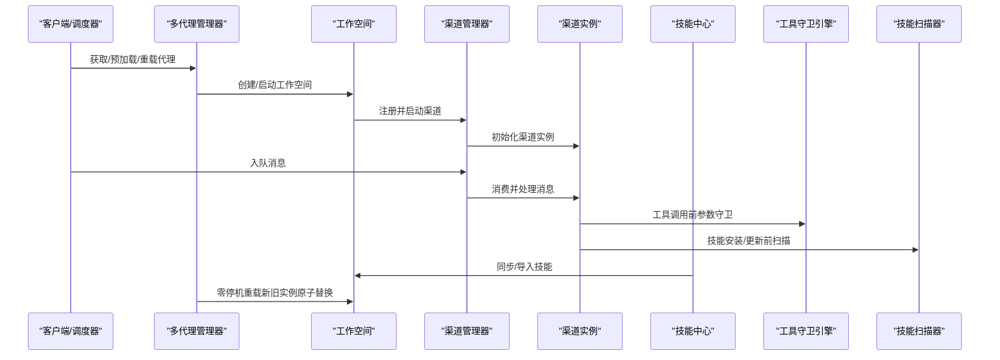
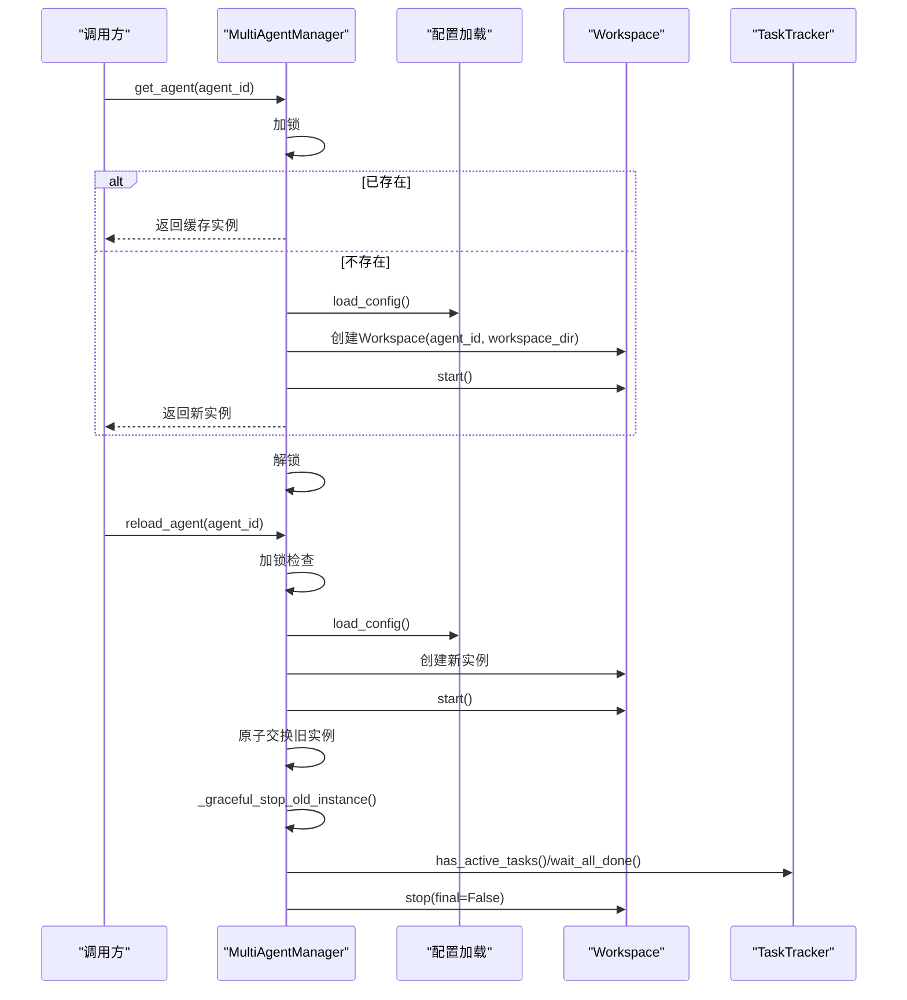
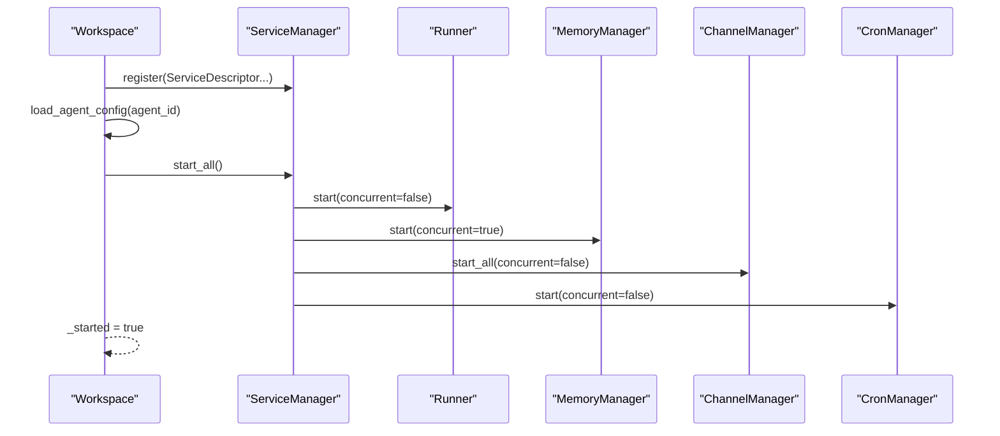
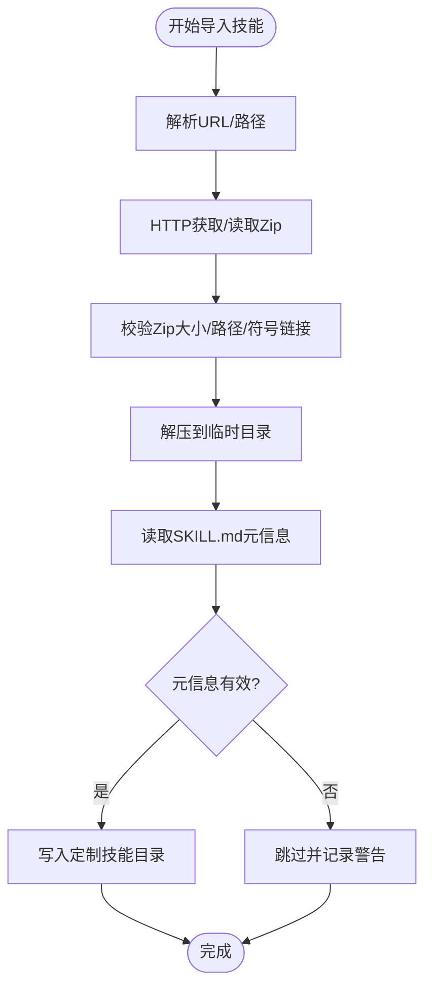
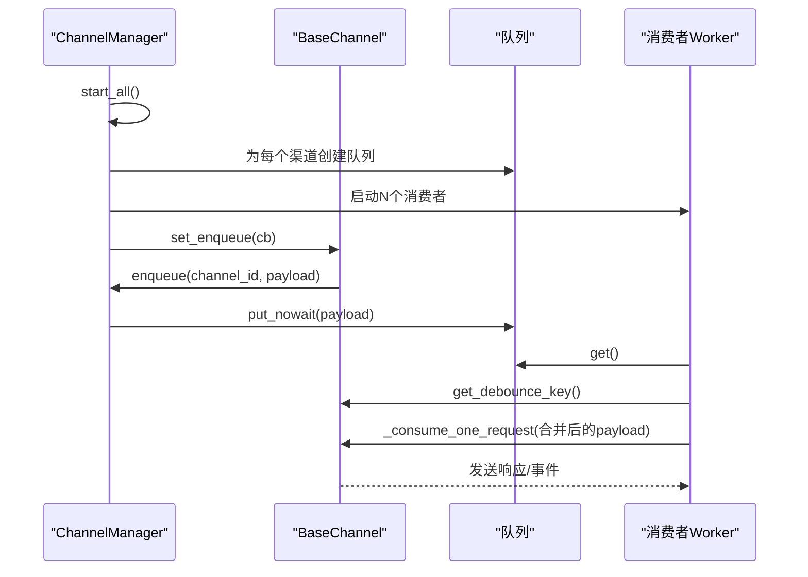
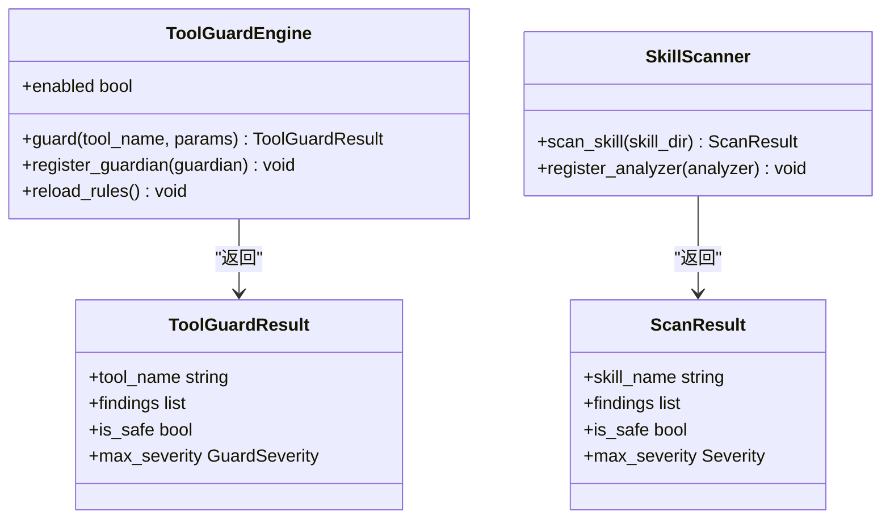
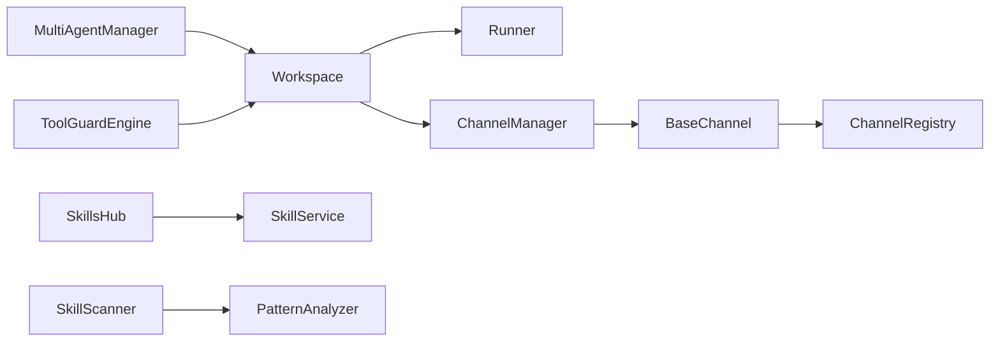

# 核心组件设计

<cite>
**本文引用的文件**
- [multi_agent_manager.py](file://src/copaw/app/multi_agent_manager.py)
- [workspace.py](file://src/copaw/app/workspace/workspace.py)
- [skills_hub.py](file://src/copaw/agents/skills_hub.py)
- [skills_manager.py](file://src/copaw/agents/skills_manager.py)
- [manager.py](file://src/copaw/app/channels/manager.py)
- [base.py](file://src/copaw/app/channels/base.py)
- [registry.py](file://src/copaw/app/channels/registry.py)
- [engine.py](file://src/copaw/security/tool_guard/engine.py)
- [models.py](file://src/copaw/security/tool_guard/models.py)
- [scanner.py](file://src/copaw/security/skill_scanner/scanner.py)
- [pattern_analyzer.py](file://src/copaw/security/skill_scanner/analyzers/pattern_analyzer.py)
</cite>

## 目录
1. [引言](#引言)
2. [项目结构](#项目结构)
3. [核心组件](#核心组件)
4. [架构总览](#架构总览)
5. [详细组件分析](#详细组件分析)
6. [依赖关系分析](#依赖关系分析)
7. [性能考虑](#性能考虑)
8. [故障排查指南](#故障排查指南)
9. [结论](#结论)

## 引言
本技术文档聚焦CoPaw的核心组件设计，围绕以下关键能力进行系统化阐述：
- 多代理管理器（MultiAgentManager）：集中式多代理生命周期与零停机重载机制
- 技能中心（SkillsHub）：技能仓库集成、搜索与动态加载
- 渠道管理器（ChannelManager）：适配器模式、消息路由与状态管理
- 安全防护引擎：工具守卫与技能扫描策略

文档从架构设计、数据流、处理逻辑、接口契约到错误处理与性能优化进行全面剖析，并提供组件交互序列图与状态转换图，帮助读者快速理解并高效使用这些核心模块。

## 项目结构
CoPaw采用分层与功能域结合的组织方式：
- 应用层（app）：多代理管理、工作空间、通道、定时任务等
- 代理与技能（agents）：技能管理、技能仓库集成
- 安全（security）：工具守卫与技能扫描
- 配置与工具（config、utils）：配置加载、环境变量解析
- 控制台前端（console）：用户界面与API对接

图表来源
- [multi_agent_manager.py:17-451](file://src/copaw/app/multi_agent_manager.py#L17-L451)
- [workspace.py:39-367](file://src/copaw/app/workspace/workspace.py#L39-L367)
- [manager.py:114-580](file://src/copaw/app/channels/manager.py#L114-L580)
- [base.py:69-800](file://src/copaw/app/channels/base.py#L69-L800)
- [registry.py:133-138](file://src/copaw/app/channels/registry.py#L133-L138)
- [skills_hub.py:1-800](file://src/copaw/agents/skills_hub.py#L1-L800)
- [skills_manager.py:654-800](file://src/copaw/agents/skills_manager.py#L654-L800)
- [engine.py:53-238](file://src/copaw/security/tool_guard/engine.py#L53-L238)
- [scanner.py:76-319](file://src/copaw/security/skill_scanner/scanner.py#L76-L319)
- [pattern_analyzer.py:236-393](file://src/copaw/security/skill_scanner/analyzers/pattern_analyzer.py#L236-L393)

章节来源
- [multi_agent_manager.py:1-451](file://src/copaw/app/multi_agent_manager.py#L1-L451)
- [workspace.py:1-367](file://src/copaw/app/workspace/workspace.py#L1-L367)
- [manager.py:1-580](file://src/copaw/app/channels/manager.py#L1-L580)
- [base.py:1-800](file://src/copaw/app/channels/base.py#L1-L800)
- [registry.py:1-138](file://src/copaw/app/channels/registry.py#L1-L138)
- [skills_hub.py:1-800](file://src/copaw/agents/skills_hub.py#L1-L800)
- [skills_manager.py:1-800](file://src/copaw/agents/skills_manager.py#L1-L800)
- [engine.py:1-238](file://src/copaw/security/tool_guard/engine.py#L1-L238)
- [scanner.py:1-319](file://src/copaw/security/skill_scanner/scanner.py#L1-L319)
- [pattern_analyzer.py:1-393](file://src/copaw/security/skill_scanner/analyzers/pattern_analyzer.py#L1-L393)

## 核心组件
本节概述四大核心组件的职责与关键特性：
- 多代理管理器（MultiAgentManager）
  - 职责：集中管理多个Agent工作空间，支持懒加载、并发启动、零停机重载、优雅停止与清理
  - 关键机制：异步锁保护、延迟清理后台任务、可复用组件热替换
- 工作空间（Workspace）
  - 职责：封装单个Agent的完整运行时（Runner、ChannelManager、MemoryManager、MCPClientManager、CronManager）
  - 关键机制：服务描述符注册、可并发/串行初始化、可复用组件注入
- 技能中心（SkillsHub）
  - 职责：技能仓库集成、搜索、版本选择、下载与解包、内容归一化
  - 关键机制：HTTP请求与重试退避、取消检查、ZIP安全校验、内容树构建
- 渠道管理器（ChannelManager）
  - 职责：统一管理各渠道队列与消费者，实现适配器模式与消息路由
  - 关键机制：去抖动合并、会话隔离、多消费者并行处理、替换通道原子切换
- 安全防护引擎
  - 工具守卫引擎（ToolGuardEngine）：多守护者聚合、规则集重载、启用控制
  - 技能扫描器（SkillScanner）：文件发现、分析器聚合、策略驱动的扫描结果

章节来源
- [multi_agent_manager.py:17-451](file://src/copaw/app/multi_agent_manager.py#L17-L451)
- [workspace.py:39-367](file://src/copaw/app/workspace/workspace.py#L39-L367)
- [skills_hub.py:1-800](file://src/copaw/agents/skills_hub.py#L1-L800)
- [manager.py:114-580](file://src/copaw/app/channels/manager.py#L114-L580)
- [engine.py:53-238](file://src/copaw/security/tool_guard/engine.py#L53-L238)
- [scanner.py:76-319](file://src/copaw/security/skill_scanner/scanner.py#L76-L319)

## 架构总览
下图展示核心组件之间的交互关系与数据流：

图表来源
- [multi_agent_manager.py:200-311](file://src/copaw/app/multi_agent_manager.py#L200-L311)
- [workspace.py:311-358](file://src/copaw/app/workspace/workspace.py#L311-L358)
- [manager.py:322-426](file://src/copaw/app/channels/manager.py#L322-L426)
- [base.py:443-583](file://src/copaw/app/channels/base.py#L443-L583)
- [skills_hub.py:1-800](file://src/copaw/agents/skills_hub.py#L1-L800)
- [engine.py:169-226](file://src/copaw/security/tool_guard/engine.py#L169-L226)
- [scanner.py:148-242](file://src/copaw/security/skill_scanner/scanner.py#L148-L242)

## 详细组件分析

### 多代理管理器（MultiAgentManager）
- 设计要点
  - 懒加载：首次访问才创建并启动工作空间
  - 生命周期管理：支持停止、重载、批量启动、优雅关闭
  - 线程安全：使用异步锁保护共享状态
  - 零停机重载：新实例先启动，再原子替换旧实例；旧实例在无活动任务时立即停止或延后清理
- 关键流程
  - 获取代理：检查缓存，不存在则读取配置、创建并启动工作空间
  - 重载代理：双阶段启动（新实例）、原子交换、旧实例延后清理
  - 停止所有：取消待执行清理任务、逐个停止工作空间
- 错误处理
  - 启动失败：回滚并抛出异常
  - 重载失败：清理新实例、保留旧实例继续服务
  - 延迟清理：记录异常但不影响新实例服务

图表来源
- [multi_agent_manager.py:34-82](file://src/copaw/app/multi_agent_manager.py#L34-L82)
- [multi_agent_manager.py:200-311](file://src/copaw/app/multi_agent_manager.py#L200-L311)
- [multi_agent_manager.py:83-179](file://src/copaw/app/multi_agent_manager.py#L83-L179)

章节来源
- [multi_agent_manager.py:17-451](file://src/copaw/app/multi_agent_manager.py#L17-L451)

### 工作空间（Workspace）
- 设计要点
  - 服务化：通过ServiceDescriptor声明式注册Runner、MemoryManager、MCPClientManager、ChatManager、ChannelManager、CronManager等
  - 可复用组件：支持在重载时注入可复用组件（如MemoryManager、ChatManager），避免重建
  - 启停顺序：按优先级串行/并发组合启动，确保Runner在ChannelManager之前启动
- 关键流程
  - 启动：加载Agent配置，通过ServiceManager统一启动
  - 停止：根据final标志决定是否停止可复用组件
  - 设置复用组件：在start前注入旧实例组件

图表来源
- [workspace.py:134-278](file://src/copaw/app/workspace/workspace.py#L134-L278)
- [workspace.py:311-358](file://src/copaw/app/workspace/workspace.py#L311-L358)

章节来源
- [workspace.py:39-367](file://src/copaw/app/workspace/workspace.py#L39-L367)

### 技能中心（SkillsHub）与技能服务（SkillService）
- 设计要点
  - SkillsHub：面向外部仓库的技能导入与同步，支持HTTP请求、重试与退避、ZIP安全校验、内容树构建
  - SkillService：面向工作空间的技能管理，负责内置/定制技能目录与活跃技能目录的同步、列表与创建
- 关键流程
  - 技能导入：从URL/Zip提取内容，校验SKILL.md元信息，写入定制目录
  - 活跃技能同步：内置技能覆盖定制技能，支持强制覆盖与版本比较
  - 列表与读取：遍历活跃技能目录，解析SKILL.md与references/scripts树

图表来源
- [skills_hub.py:548-652](file://src/copaw/agents/skills_hub.py#L548-L652)
- [skills_hub.py:556-577](file://src/copaw/agents/skills_hub.py#L556-L577)
- [skills_manager.py:607-652](file://src/copaw/agents/skills_manager.py#L607-L652)

章节来源
- [skills_hub.py:1-800](file://src/copaw/agents/skills_hub.py#L1-L800)
- [skills_manager.py:654-800](file://src/copaw/agents/skills_manager.py#L654-L800)

### 渠道管理器（ChannelManager）与适配器模式
- 设计要点
  - 适配器模式：ChannelManager持有多种BaseChannel实例，统一入队与消费流程
  - 队列与消费者：每个渠道维护独立队列与固定数量消费者，支持同会话去抖动合并
  - 会话隔离：基于debounce_key与key_lock保证同一会话不被并发处理
- 关键流程
  - 初始化：从配置/环境加载可用渠道，注册回调与队列
  - 入队：线程安全地将payload放入对应渠道队列
  - 消费：消费者循环取出payload，按渠道类型合并与处理
  - 替换通道：原子替换旧渠道，新渠道先start再交换

图表来源
- [manager.py:365-426](file://src/copaw/app/channels/manager.py#L365-L426)
- [manager.py:322-383](file://src/copaw/app/channels/manager.py#L322-L383)
- [base.py:443-583](file://src/copaw/app/channels/base.py#L443-L583)

章节来源
- [manager.py:114-580](file://src/copaw/app/channels/manager.py#L114-L580)
- [base.py:69-800](file://src/copaw/app/channels/base.py#L69-L800)
- [registry.py:133-138](file://src/copaw/app/channels/registry.py#L133-L138)

### 安全防护引擎（工具守卫与技能扫描）
- 工具守卫引擎（ToolGuardEngine）
  - 职责：对工具调用参数进行安全检查，聚合多个守护者结果
  - 特性：启用控制（环境变量/配置）、默认守护者集合、规则重载、受保护工具集
- 技能扫描器（SkillScanner）
  - 职责：扫描技能包中的文件，运行多个分析器（默认模式分析器）
  - 特性：策略驱动（ScanPolicy）、文件发现与过滤、去重与严重度计算

图表来源
- [engine.py:53-238](file://src/copaw/security/tool_guard/engine.py#L53-L238)
- [models.py:103-185](file://src/copaw/security/tool_guard/models.py#L103-L185)
- [scanner.py:76-319](file://src/copaw/security/skill_scanner/scanner.py#L76-L319)
- [pattern_analyzer.py:236-393](file://src/copaw/security/skill_scanner/analyzers/pattern_analyzer.py#L236-L393)

章节来源
- [engine.py:53-238](file://src/copaw/security/tool_guard/engine.py#L53-L238)
- [models.py:1-185](file://src/copaw/security/tool_guard/models.py#L1-L185)
- [scanner.py:76-319](file://src/copaw/security/skill_scanner/scanner.py#L76-L319)
- [pattern_analyzer.py:1-393](file://src/copaw/security/skill_scanner/analyzers/pattern_analyzer.py#L1-L393)

## 依赖关系分析
- 组件耦合
  - MultiAgentManager依赖Workspace与配置加载；Workspace依赖ServiceManager与各类服务
  - ChannelManager依赖ChannelRegistry与BaseChannel；BaseChannel依赖MessageRenderer与配置
  - SkillsHub与SkillService分别面向外部仓库与工作空间目录
  - ToolGuardEngine与SkillScanner作为独立安全模块，通过工具调用与技能安装流程被调用
- 外部依赖
  - HTTP请求与重试（SkillsHub）
  - 文件系统操作（SkillService）
  - 异步事件循环（ChannelManager、MultiAgentManager）

图表来源
- [multi_agent_manager.py:17-451](file://src/copaw/app/multi_agent_manager.py#L17-L451)
- [workspace.py:39-367](file://src/copaw/app/workspace/workspace.py#L39-L367)
- [manager.py:114-580](file://src/copaw/app/channels/manager.py#L114-L580)
- [base.py:69-800](file://src/copaw/app/channels/base.py#L69-L800)
- [registry.py:133-138](file://src/copaw/app/channels/registry.py#L133-L138)
- [skills_hub.py:1-800](file://src/copaw/agents/skills_hub.py#L1-L800)
- [skills_manager.py:654-800](file://src/copaw/agents/skills_manager.py#L654-L800)
- [engine.py:53-238](file://src/copaw/security/tool_guard/engine.py#L53-L238)
- [scanner.py:76-319](file://src/copaw/security/skill_scanner/scanner.py#L76-L319)
- [pattern_analyzer.py:236-393](file://src/copaw/security/skill_scanner/analyzers/pattern_analyzer.py#L236-L393)

章节来源
- [multi_agent_manager.py:1-451](file://src/copaw/app/multi_agent_manager.py#L1-L451)
- [workspace.py:1-367](file://src/copaw/app/workspace/workspace.py#L1-L367)
- [manager.py:1-580](file://src/copaw/app/channels/manager.py#L1-L580)
- [base.py:1-800](file://src/copaw/app/channels/base.py#L1-L800)
- [registry.py:1-138](file://src/copaw/app/channels/registry.py#L1-L138)
- [skills_hub.py:1-800](file://src/copaw/agents/skills_hub.py#L1-L800)
- [skills_manager.py:1-800](file://src/copaw/agents/skills_manager.py#L1-L800)
- [engine.py:1-238](file://src/copaw/security/tool_guard/engine.py#L1-L238)
- [scanner.py:1-319](file://src/copaw/security/skill_scanner/scanner.py#L1-L319)
- [pattern_analyzer.py:1-393](file://src/copaw/security/skill_scanner/analyzers/pattern_analyzer.py#L1-L393)

## 性能考虑
- 并发与队列
  - ChannelManager为每个渠道设置固定消费者数量，提升吞吐量；队列容量限制防止内存膨胀
  - MultiAgentManager在重载时尽量将耗时步骤（创建工作空间）放在加锁之外，最小化锁持有时间
- I/O与网络
  - SkillsHub对HTTP请求设置超时与重试退避，限制响应体大小与ZIP解压大小，避免资源滥用
- 内存与资源
  - Workspace支持可复用组件，减少重复初始化成本；清理任务在后台异步执行，避免阻塞主线程
- 扫描策略
  - SkillScanner通过策略控制文件上限、文件大小与去重，平衡扫描质量与性能

## 故障排查指南
- 多代理管理器
  - 重载失败：检查新实例启动日志，确认旧实例延后清理是否正常；必要时手动停止
  - 停止异常：查看清理任务异常日志，确认是否被取消或等待超时
- 工作空间
  - 启动失败：检查配置加载与服务启动顺序；确认Runner在ChannelManager之前启动
  - 停止异常：确认final标志与可复用组件释放
- 渠道管理器
  - 消费异常：检查渠道实现的consume_one/_consume_one_request；关注去抖动与合并逻辑
  - 替换通道失败：确认新渠道start成功后再交换
- 技能中心
  - 导入失败：检查URL/Zip合法性、SKILL.md元信息完整性、目标目录权限
  - 同步冲突：定制技能覆盖内置技能，注意版本比较与强制覆盖选项
- 安全防护
  - 工具守卫未生效：检查启用开关与受保护工具集；规则重载后确认已刷新
  - 技能扫描异常：检查策略配置、文件发现与分析器异常

章节来源
- [multi_agent_manager.py:313-361](file://src/copaw/app/multi_agent_manager.py#L313-L361)
- [workspace.py:338-358](file://src/copaw/app/workspace/workspace.py#L338-L358)
- [manager.py:427-426](file://src/copaw/app/channels/manager.py#L427-L426)
- [skills_hub.py:548-652](file://src/copaw/agents/skills_hub.py#L548-L652)
- [engine.py:148-154](file://src/copaw/security/tool_guard/engine.py#L148-L154)
- [scanner.py:148-242](file://src/copaw/security/skill_scanner/scanner.py#L148-L242)

## 结论
CoPaw的核心组件以清晰的职责划分与稳健的工程实践实现了高可用与可扩展性：
- 多代理管理器通过零停机重载保障服务连续性
- 工作空间的服务化设计简化了组件装配与生命周期管理
- 渠道管理器的适配器模式与去抖动合并提升了消息处理效率
- 安全防护引擎提供了可插拔的工具守卫与策略化的技能扫描能力

建议在生产环境中结合监控与告警，持续优化队列容量、扫描策略与守护者规则，确保系统在高负载下的稳定性与安全性。