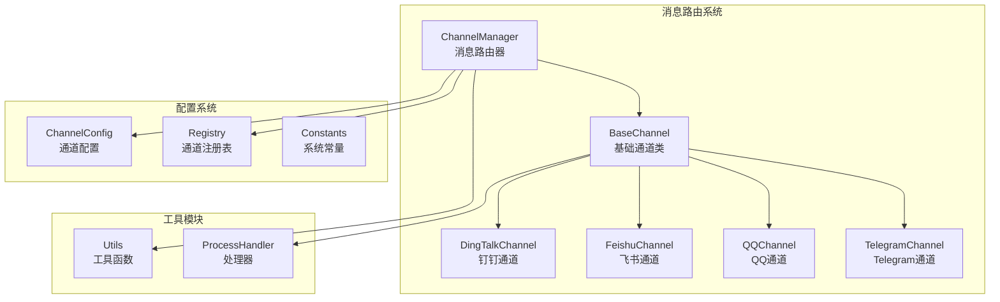
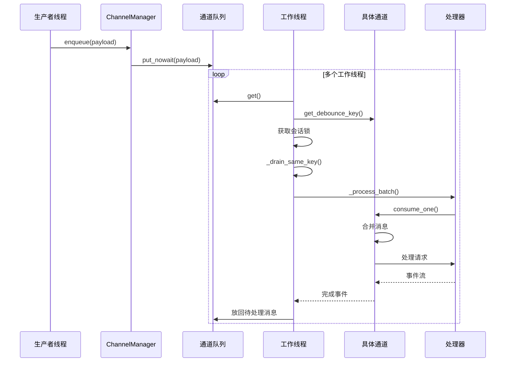
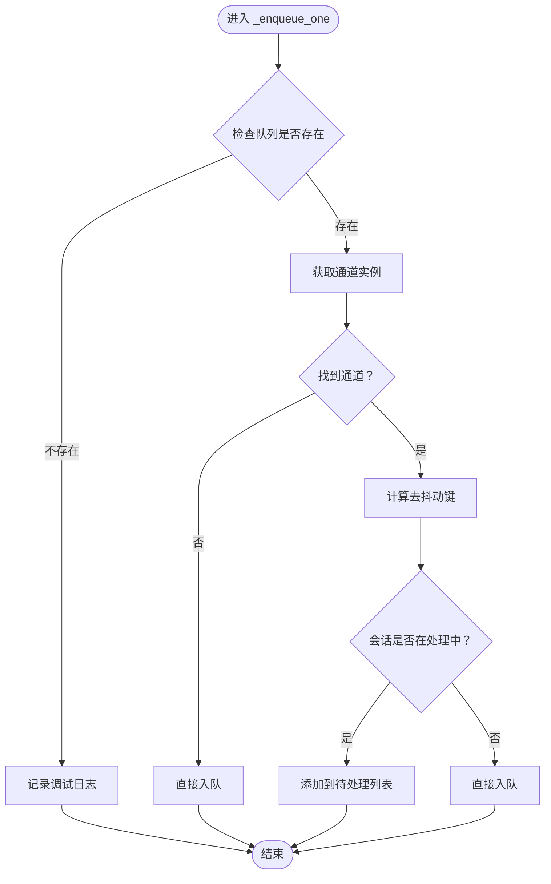
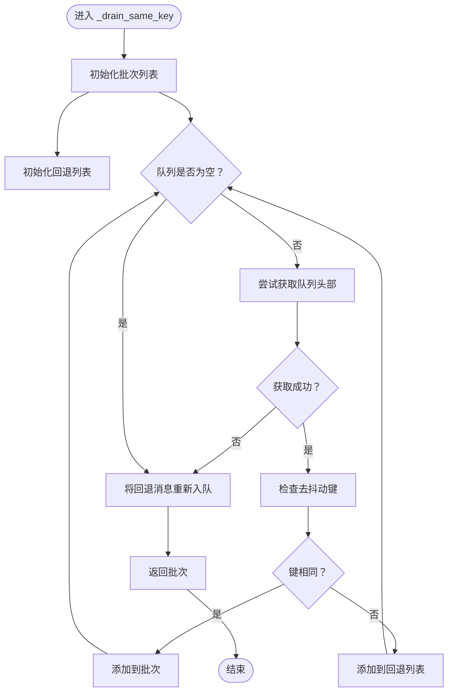
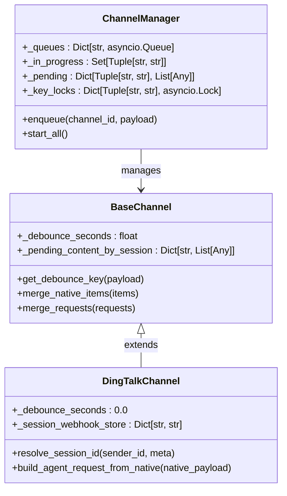
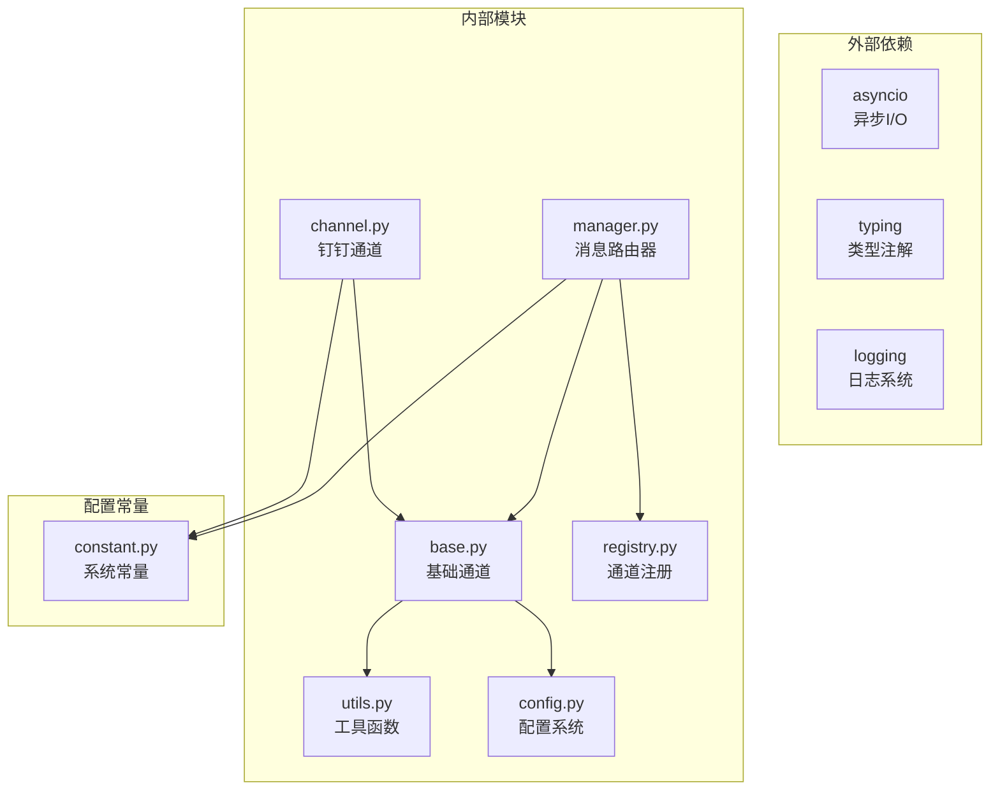

# 消息路由机制

<cite>
**本文档引用的文件**
- [manager.py](file://src/copaw/app/channels/manager.py)
- [base.py](file://src/copaw/app/channels/base.py)
- [channel.py](file://src/copaw/app/channels/dingtalk/channel.py)
- [utils.py](file://src/copaw/app/channels/utils.py)
- [registry.py](file://src/copaw/app/channels/registry.py)
- [config.py](file://src/copaw/config/config.py)
- [constant.py](file://src/copaw/constant.py)
- [channels.en.md](file://website/public/docs/channels.en.md)
</cite>

## 目录
1. [简介](#简介)
2. [项目结构](#项目结构)
3. [核心组件](#核心组件)
4. [架构概览](#架构概览)
5. [详细组件分析](#详细组件分析)
6. [依赖关系分析](#依赖关系分析)
7. [性能考虑](#性能考虑)
8. [故障排除指南](#故障排除指南)
9. [结论](#结论)

## 简介

CoPaw的消息路由机制是一个基于异步队列的高性能消息处理系统，专门设计用于处理来自不同通信渠道（如微信、钉钉、飞书等）的消息。该系统通过ChannelManager统一管理所有渠道的消息队列，实现了会话级别的去抖动、批量处理和并发控制，确保消息处理的准确性和效率。

该机制的核心特点包括：
- 基于会话的去抖动处理，避免重复消息
- 批量消息合并，提高处理效率
- 多工作线程并发处理，支持高并发场景
- 完整的消息生命周期管理
- 内存友好的队列容量控制

## 项目结构

CoPaw的消息路由系统主要位于`src/copaw/app/channels/`目录下，包含以下关键组件：

**图表来源**
- [manager.py:114-134](file://src/copaw/app/channels/manager.py#L114-L134)
- [base.py:69-116](file://src/copaw/app/channels/base.py#L69-L116)
- [registry.py:19-34](file://src/copaw/app/channels/registry.py#L19-L34)

**章节来源**
- [manager.py:1-580](file://src/copaw/app/channels/manager.py#L1-L580)
- [base.py:1-868](file://src/copaw/app/channels/base.py#L1-L868)
- [registry.py:1-138](file://src/copaw/app/channels/registry.py#L1-L138)

## 核心组件

### ChannelManager - 主要路由器

ChannelManager是整个消息路由系统的核心，负责管理所有通道的消息队列和消费者循环。

**关键特性：**
- 每个通道维护独立的异步队列
- 支持多工作线程并发处理
- 实现会话级别的去抖动机制
- 提供线程安全的入队接口

**主要数据结构：**
- `_queues`: 每个通道的队列映射
- `_in_progress`: 正在处理的会话集合
- `_pending`: 待处理的会话消息缓冲区
- `_key_locks`: 会话级别的互斥锁

**章节来源**
- [manager.py:114-134](file://src/copaw/app/channels/manager.py#L114-L134)
- [manager.py:365-393](file://src/copaw/app/channels/manager.py#L365-L393)

### BaseChannel - 通道基类

BaseChannel定义了所有具体通道的通用接口和行为规范。

**核心功能：**
- 会话ID解析和去抖动键生成
- 消息内容合并逻辑
- 时间去抖动处理
- 错误处理和响应发送

**章节来源**
- [base.py:69-116](file://src/copaw/app/channels/base.py#L69-L116)
- [base.py:130-144](file://src/copaw/app/channels/base.py#L130-L144)

## 架构概览

CoPaw的消息路由架构采用生产者-消费者模式，结合会话去抖动和批量处理机制：

**图表来源**
- [manager.py:272-320](file://src/copaw/app/channels/manager.py#L272-L320)
- [manager.py:322-363](file://src/copaw/app/channels/manager.py#L322-L363)
- [base.py:443-479](file://src/copaw/app/channels/base.py#L443-L479)

## 详细组件分析

### _enqueue_one 方法实现原理

_enqueue_one方法是消息入队的核心逻辑，实现了会话去抖动和队列管理策略：

**图表来源**
- [manager.py:272-302](file://src/copaw/app/channels/manager.py#L272-L302)

**实现细节：**
1. **队列检查**: 首先验证目标通道是否有对应的队列
2. **通道查找**: 通过通道ID查找具体的通道实例
3. **去抖动键生成**: 使用`get_debounce_key()`方法生成会话标识
4. **状态判断**: 检查该会话是否正在被其他工作线程处理
5. **分支处理**: 
   - 如果会话正在处理中，将消息添加到`_pending`缓冲区
   - 如果会话空闲，直接入队到队列

**章节来源**
- [manager.py:272-302](file://src/copaw/app/channels/manager.py#L272-L302)

### _drain_same_key 函数批量提取算法

_drain_same_key函数实现了同一会话消息的批量提取和合并处理：

**图表来源**
- [manager.py:42-62](file://src/copaw/app/channels/manager.py#L42-L62)

**算法特点：**
1. **批量提取**: 连续从队列中提取具有相同去抖动键的消息
2. **智能回退**: 将不同会话的消息暂时放回队列
3. **内存优化**: 只保留必要的消息，避免内存泄漏
4. **原子性**: 在单个会话锁保护下执行，确保一致性

**章节来源**
- [manager.py:42-62](file://src/copaw/app/channels/manager.py#L42-L62)

### 并发控制机制

CoPaw实现了多层次的并发控制机制：

#### 1. 会话级互斥锁
每个会话（由去抖动键标识）都有独立的异步锁，确保同一会话的消息不会被多个工作线程同时处理。

#### 2. 工作线程池
每个通道默认启动4个工作线程，支持不同会话的并行处理：

**图表来源**
- [manager.py:114-134](file://src/copaw/app/channels/manager.py#L114-L134)
- [base.py:69-116](file://src/copaw/app/channels/base.py#L69-L116)
- [channel.py:81-179](file://src/copaw/app/channels/dingtalk/channel.py#L81-L179)

#### 3. 队列容量管理
- 默认队列最大容量：1000条消息
- 支持动态调整队列大小
- 防止内存溢出和资源耗尽

**章节来源**
- [manager.py:35-39](file://src/copaw/app/channels/manager.py#L35-L39)
- [manager.py:370-373](file://src/copaw/app/channels/manager.py#L370-L373)

### 消息优先级处理

CoPaw的消息路由系统采用以下优先级策略：

1. **会话内消息优先**: 同一会话内的消息按到达顺序处理
2. **通道间公平调度**: 不同通道的消息在各自的工作线程池中公平分配
3. **实时性要求**: 对于需要立即响应的消息（如语音消息），系统会跳过去抖动等待

### 队列容量管理和内存优化

#### 内存优化策略：
1. **批量处理**: 通过_drain_same_key函数合并同一会话的消息
2. **待处理缓冲**: 使用`_pending`字典避免重复创建队列对象
3. **会话锁定**: 使用`_key_locks`字典减少锁竞争
4. **时间去抖动**: 对于不包含文本的内容，使用`_pending_content_by_session`进行缓冲

#### 队列容量控制：
- **固定容量**: 每个通道队列最大1000条消息
- **自动清理**: 当队列满时，新消息可能被丢弃或阻塞
- **监控告警**: 系统会记录队列满的情况以便调试

**章节来源**
- [base.py:117-125](file://src/copaw/app/channels/base.py#L117-L125)
- [manager.py:94-112](file://src/copaw/app/channels/manager.py#L94-L112)

## 依赖关系分析

CoPaw消息路由系统的依赖关系如下：

**图表来源**
- [manager.py:23-25](file://src/copaw/app/channels/manager.py#L23-L25)
- [base.py:23-37](file://src/copaw/app/channels/base.py#L23-L37)
- [registry.py:11-12](file://src/copaw/app/channels/registry.py#L11-L12)

**章节来源**
- [manager.py:1-580](file://src/copaw/app/channels/manager.py#L1-L580)
- [base.py:1-868](file://src/copaw/app/channels/base.py#L1-L868)

## 性能考虑

### 并发性能优化

1. **工作线程数量**: 每个通道4个工作线程，平衡CPU利用率和内存占用
2. **会话锁定粒度**: 使用细粒度的会话级锁，减少锁竞争
3. **批量处理**: 合并同一会话的消息，减少处理器调用开销

### 内存使用优化

1. **队列容量限制**: 防止内存无限增长
2. **消息合并**: 减少消息对象的数量
3. **及时清理**: 定期清理已完成的会话状态

### 网络性能优化

1. **去抖动机制**: 减少重复消息的网络传输
2. **批量发送**: 合并多个响应为单次发送
3. **连接复用**: 复用HTTP连接和WebSocket连接

## 故障排除指南

### 常见问题及解决方案

#### 1. 消息丢失问题
**症状**: 某些消息没有被处理
**原因**: 队列已满导致新消息被丢弃
**解决**: 
- 增加队列容量
- 检查工作线程是否正常运行
- 监控队列长度指标

#### 2. 消息重复问题
**症状**: 同一条消息被处理多次
**原因**: 去抖动机制失效
**解决**: 
- 检查去抖动键生成逻辑
- 验证会话ID解析正确性
- 确认互斥锁正常工作

#### 3. 性能下降问题
**症状**: 消息处理延迟增加
**原因**: 工作线程不足或锁竞争严重
**解决**: 
- 增加工作线程数量
- 优化批量处理算法
- 减少不必要的锁持有时间

**章节来源**
- [manager.py:358-363](file://src/copaw/app/channels/manager.py#L358-L363)
- [base.py:477-479](file://src/copaw/app/channels/base.py#L477-L479)

## 结论

CoPaw的消息路由机制通过精心设计的架构和算法，实现了高效、可靠的消息处理系统。其核心优势包括：

1. **会话去抖动**: 有效防止重复消息和乱序问题
2. **批量处理**: 显著提高消息处理吞吐量
3. **并发控制**: 支持高并发场景下的稳定运行
4. **内存优化**: 通过多种策略控制内存使用
5. **扩展性**: 支持新增通道类型和自定义处理逻辑

该系统为构建企业级聊天机器人和多渠道消息处理应用提供了坚实的基础，其设计理念和实现方式值得在类似场景中借鉴和参考。