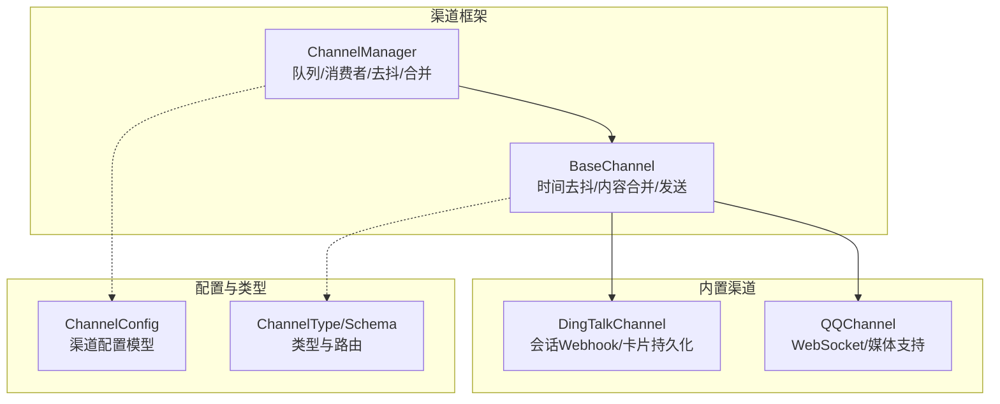
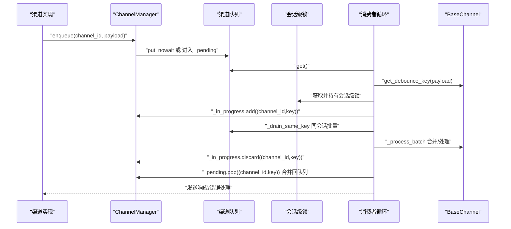
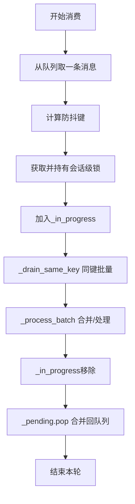
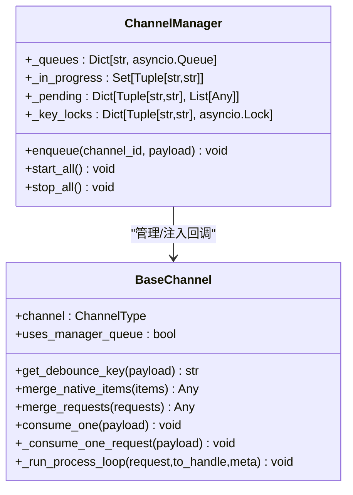
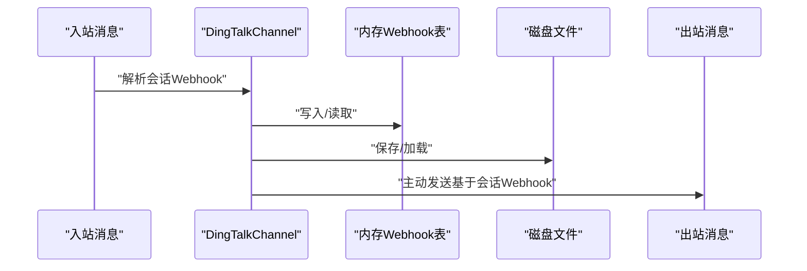
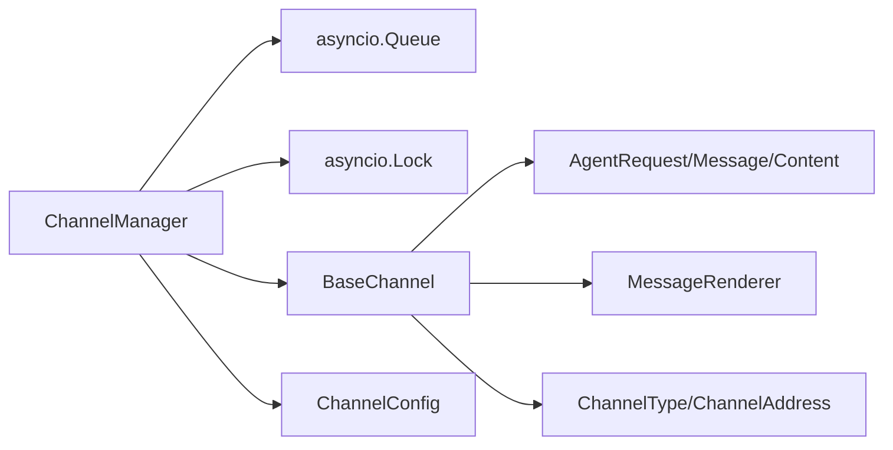

# 渠道状态管理

<cite>
**本文引用的文件**
- [src/copaw/app/channels/manager.py](file://src/copaw/app/channels/manager.py)
- [src/copaw/app/channels/base.py](file://src/copaw/app/channels/base.py)
- [src/copaw/app/channels/dingtalk/channel.py](file://src/copaw/app/channels/dingtalk/channel.py)
- [src/copaw/app/channels/dingtalk/ai_card.py](file://src/copaw/app/channels/dingtalk/ai_card.py)
- [src/copaw/app/channels/schema.py](file://src/copaw/app/channels/schema.py)
- [src/copaw/config/config.py](file://src/copaw/config/config.py)
- [website/public/docs/channels.en.md](file://website/public/docs/channels.en.md)
</cite>

## 目录
1. [简介](#简介)
2. [项目结构](#项目结构)
3. [核心组件](#核心组件)
4. [架构总览](#架构总览)
5. [详细组件分析](#详细组件分析)
6. [依赖分析](#依赖分析)
7. [性能考量](#性能考量)
8. [故障排查指南](#故障排查指南)
9. [结论](#结论)
10. [附录](#附录)

## 简介
本文件聚焦于CoPaw的“渠道状态管理”，围绕以下关键数据结构与机制展开：
- _channel_queue：按渠道ID组织的消息队列映射，负责承载来自各渠道的入站消息。
- _in_progress：基于（渠道ID，防抖键）的进行中会话集合，用于去抖动与并发控制。
- _pending：待处理消息缓存，按会话键聚合，等待当前处理完成后合并回队列。
- _key_locks：细粒度的会话级锁，确保同一会话在任一时刻仅由一个消费者处理，避免拆分与乱序。
- 状态持久化与资源清理：如钉钉会话Webhook存储、AI卡片持久化等。

目标是帮助读者从架构、数据流、并发控制到性能与稳定性进行全面理解，并提供可操作的排障建议。

## 项目结构
CoPaw的渠道状态管理主要位于应用层的channels子系统，核心文件如下：
- ChannelManager：统一管理队列、消费者循环、会话去抖与合并。
- BaseChannel：定义渠道通用接口、时间去抖、内容合并、发送流程等。
- 具体渠道实现：如钉钉、QQ等，扩展BaseChannel并实现特定逻辑。
- 配置与类型：ChannelConfig、ChannelType等，支撑渠道启用与参数注入。
- 文档：channels.en.md对数据流与队列使用有概要说明。

图表来源
- [src/copaw/app/channels/manager.py](file://src/copaw/app/channels/manager.py)
- [src/copaw/app/channels/base.py](file://src/copaw/app/channels/base.py)
- [src/copaw/app/channels/dingtalk/channel.py](file://src/copaw/app/channels/dingtalk/channel.py)
- [src/copaw/config/config.py](file://src/copaw/config/config.py)
- [src/copaw/app/channels/schema.py](file://src/copaw/app/channels/schema.py)

章节来源
- [src/copaw/app/channels/manager.py](file://src/copaw/app/channels/manager.py)
- [src/copaw/app/channels/base.py](file://src/copaw/app/channels/base.py)
- [src/copaw/app/channels/schema.py](file://src/copaw/app/channels/schema.py)
- [website/public/docs/channels.en.md](file://website/public/docs/channels.en.md)

## 核心组件
- ChannelManager
  - 维护每个渠道的异步队列（_queues），以及多个消费者任务（_consumer_tasks）。
  - 提供线程安全的enqueue入口，内部通过事件循环调度保证一致性。
  - 使用_set（_in_progress）、字典（_pending）、字典（_key_locks）实现会话级去抖与合并。
- BaseChannel
  - 定义get_debounce_key、merge_native_items、merge_requests等方法，统一不同渠道的合并策略。
  - 支持时间去抖（_debounce_seconds）与“无文本去抖”（_pending_content_by_session），提升用户体验。
  - 提供consume_one/_consume_one_request/_run_process_loop等处理链路。
- 具体渠道（以钉钉为例）
  - 重写resolve_session_id、to_handle_from_target等，确保会话键稳定且适合主动发送。
  - 实现会话Webhook存储与持久化，保障重启后仍可主动推送。
  - 提供AI卡片状态持久化，便于崩溃恢复。

章节来源
- [src/copaw/app/channels/manager.py](file://src/copaw/app/channels/manager.py)
- [src/copaw/app/channels/base.py](file://src/copaw/app/channels/base.py)
- [src/copaw/app/channels/dingtalk/channel.py](file://src/copaw/app/channels/dingtalk/channel.py)

## 架构总览
下图展示ChannelManager如何协调队列、消费者、去抖与合并，以及BaseChannel如何参与请求构建与发送。

图表来源
- [src/copaw/app/channels/manager.py](file://src/copaw/app/channels/manager.py)
- [src/copaw/app/channels/base.py](file://src/copaw/app/channels/base.py)

## 详细组件分析

### ChannelManager：队列、去抖与合并
- _channel_queue（_queues）
  - 结构：Dict[str, asyncio.Queue]，按channel_id映射到队列。
  - 作用：承载来自各渠道的入站消息；每个渠道可独立配置最大长度。
  - 线程安全：enqueue通过事件循环调用（call_soon_threadsafe），避免跨线程竞态。
- _in_progress（去抖动状态）
  - 结构：Set[Tuple[str, str]]，记录“（渠道ID，防抖键）”正在处理。
  - 作用：当新消息到达时，若该会话已在处理，则进入_pending，避免重复处理与乱序。
- _pending（待处理消息缓存）
  - 结构：Dict[Tuple[str, str], List[Any]]，按（渠道ID，防抖键）聚合。
  - 作用：在消费者完成当前批次后，将缓存合并回队列，确保顺序与完整性。
- _key_locks（细粒度锁）
  - 结构：Dict[Tuple[str, str], asyncio.Lock]，按（渠道ID，防抖键）分配。
  - 作用：同一会话仅允许一个消费者占用，防止拆分与并发冲突；同时避免死锁（每个会话仅持有一个锁）。
- 消费者循环（_consume_channel_loop）
  - 步骤：取队列消息→计算防抖键→获取并持有会话级锁→标记_in_progress→同键批量drain→合并处理→释放_in_progress→合并_pending回队列。
  - 并发：每渠道多消费者并行，不同会话可并行处理，同一会话串行。

图表来源
- [src/copaw/app/channels/manager.py](file://src/copaw/app/channels/manager.py)

章节来源
- [src/copaw/app/channels/manager.py](file://src/copaw/app/channels/manager.py)

### BaseChannel：时间去抖与内容合并
- 时间去抖（_debounce_seconds）
  - 当payload为原生字典且设置了去抖秒数时，将消息暂存至缓冲区并在定时器触发后合并发送。
  - 适用于需要合并连续输入或等待完整内容的场景。
- 无文本去抖（_pending_content_by_session）
  - 若内容不含文本但包含音频，则立即处理；否则累积到会话级缓冲，直到出现文本再合并发送。
  - 避免“只有图片/语音”的消息被拆分或丢失。
- 内容合并
  - merge_native_items：合并原生payload的内容块与元信息。
  - merge_requests：合并多个AgentRequest的输入内容，保持首个请求的元信息。
- 处理流程
  - consume_one：根据是否启用时间去抖决定直接处理或延时合并。
  - _consume_one_request：构建AgentRequest、应用去抖、运行处理循环、发送消息、错误处理。
  - _run_process_loop：遍历事件流，消息完成时回调on_event_message_completed，最后触发_on_reply_sent。

图表来源
- [src/copaw/app/channels/base.py](file://src/copaw/app/channels/base.py)
- [src/copaw/app/channels/manager.py](file://src/copaw/app/channels/manager.py)

章节来源
- [src/copaw/app/channels/base.py](file://src/copaw/app/channels/base.py)

### 钉钉渠道：会话Webhook持久化与AI卡片恢复
- 会话Webhook存储
  - 内存：_session_webhook_store（Dict[str, str]）。
  - 持久化：通过_disk文件保存/加载，路径根据工作空间或全局配置决定。
  - 保护：访问时使用_asyncio.Lock，写入后落盘，失败时记录调试日志。
- AI卡片持久化
  - AICardPendingStore：以JSON格式保存未终结的卡片记录，含版本号与更新时间。
  - 保存策略：仅保留非终结状态的卡片，写入临时文件后原子替换，避免损坏。
- 会话键与路由
  - resolve_session_id：从conversation_id提取短会话ID，便于定时任务查找。
  - to_handle_from_target：将session_id转换为“dingtalk:sw:<session_id>”以便主动发送。

图表来源
- [src/copaw/app/channels/dingtalk/channel.py](file://src/copaw/app/channels/dingtalk/channel.py)
- [src/copaw/app/channels/dingtalk/ai_card.py](file://src/copaw/app/channels/dingtalk/ai_card.py)

章节来源
- [src/copaw/app/channels/dingtalk/channel.py](file://src/copaw/app/channels/dingtalk/channel.py)
- [src/copaw/app/channels/dingtalk/ai_card.py](file://src/copaw/app/channels/dingtalk/ai_card.py)

### 会话键与防抖键设计
- 防抖键（debounce_key）
  - 默认由payload中的session_id或通过resolve_session_id(sender_id, meta)推导。
  - 对于钉钉，会话ID采用conversation_id的短后缀，便于定时任务检索。
- 去抖策略
  - 时间去抖：BaseChannel在收到原生payload时，按debounce_key聚合，定时器到期后合并发送。
  - 无文本去抖：累积内容直到出现文本或音频，音频直达处理，避免长尾等待。
- 合并策略
  - 原生合并：合并content_parts与关键meta字段（如回复句柄、消息ID等）。
  - 请求合并：拼接首个请求的输入内容，保留首个请求的元信息与会话上下文。

章节来源
- [src/copaw/app/channels/base.py](file://src/copaw/app/channels/base.py)
- [src/copaw/app/channels/dingtalk/channel.py](file://src/copaw/app/channels/dingtalk/channel.py)

## 依赖分析
- ChannelManager依赖
  - asyncio.Queue：作为线程安全的消息队列。
  - asyncio.Lock：管理全局与会话级锁，避免竞争与死锁。
  - BaseChannel：通过get_debounce_key、merge_*等接口实现统一处理。
- BaseChannel依赖
  - agentscope_runtime引擎的AgentRequest/Message/Content类型，用于构建与发送。
  - 渲染器MessageRenderer，将消息转换为渠道可发送的内容部件。
- 配置与类型
  - ChannelConfig：提供渠道启用、策略与目录等配置项。
  - ChannelType/ChannelAddress：统一渠道标识与路由协议。

图表来源
- [src/copaw/app/channels/manager.py](file://src/copaw/app/channels/manager.py)
- [src/copaw/app/channels/base.py](file://src/copaw/app/channels/base.py)
- [src/copaw/config/config.py](file://src/copaw/config/config.py)
- [src/copaw/app/channels/schema.py](file://src/copaw/app/channels/schema.py)

章节来源
- [src/copaw/app/channels/manager.py](file://src/copaw/app/channels/manager.py)
- [src/copaw/app/channels/base.py](file://src/copaw/app/channels/base.py)
- [src/copaw/config/config.py](file://src/copaw/config/config.py)
- [src/copaw/app/channels/schema.py](file://src/copaw/app/channels/schema.py)

## 性能考量
- 并发模型
  - 多消费者：每渠道固定数量消费者，不同会话可并行处理，提升吞吐。
  - 会话串行：同一会话仅由一个消费者处理，避免拆分与乱序，保证一致性。
- 队列容量与背压
  - 每渠道队列设置最大长度，避免内存无限增长；高负载时可结合限流与降级策略。
- 合并策略
  - 批量drain与合并减少重复处理成本，降低渠道API调用频率。
- 锁粒度
  - 会话级锁最小化争用范围，避免全局锁瓶颈；注意避免长时间持有锁。
- IO与持久化
  - Webhook与卡片持久化采用原子写入与异步锁，降低IO开销与失败风险。

## 故障排查指南
- 消息未送达或乱序
  - 检查_in_progress是否长期存在，确认消费者循环是否正常退出。
  - 查看_pending是否堆积，确认合并回队列逻辑是否执行。
- 死锁或长时间阻塞
  - 排查_key_locks是否被异常持有；确认消费者循环finally分支是否执行。
- 会话Webhook失效
  - 检查_dingtalk_session_webhooks.json是否成功保存/加载。
  - 确认会话ID生成规则与to_handle转换是否一致。
- 资源清理
  - 停止时调用stop_all，取消消费者任务并清空队列与状态；检查是否有任务超时未完成。

章节来源
- [src/copaw/app/channels/manager.py](file://src/copaw/app/channels/manager.py)
- [src/copaw/app/channels/dingtalk/channel.py](file://src/copaw/app/channels/dingtalk/channel.py)

## 结论
CoPaw的渠道状态管理通过ChannelManager与BaseChannel的协作，实现了：
- 基于会话键的去抖与合并，兼顾吞吐与一致性；
- 细粒度的会话级锁，避免并发拆分与乱序；
- 可扩展的渠道实现与统一处理链路；
- 关键状态的持久化与资源清理，提升可用性与稳定性。

在实际部署中，建议结合业务流量特征调整队列大小、消费者数量与去抖阈值，并持续监控_in_progress与_pending的健康状况。

## 附录
- 数据模型（简化）
  - _queues：Dict[channel_id, asyncio.Queue]
  - _in_progress：Set[Tuple[channel_id, debounce_key]]
  - _pending：Dict[Tuple[channel_id, debounce_key], List[payload]]
  - _key_locks：Dict[Tuple[channel_id, debounce_key], asyncio.Lock]

章节来源
- [src/copaw/app/channels/manager.py](file://src/copaw/app/channels/manager.py)
- [src/copaw/app/channels/base.py](file://src/copaw/app/channels/base.py)
- [src/copaw/app/channels/schema.py](file://src/copaw/app/channels/schema.py)