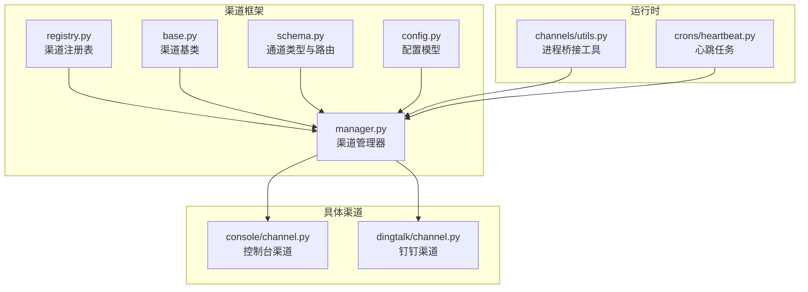
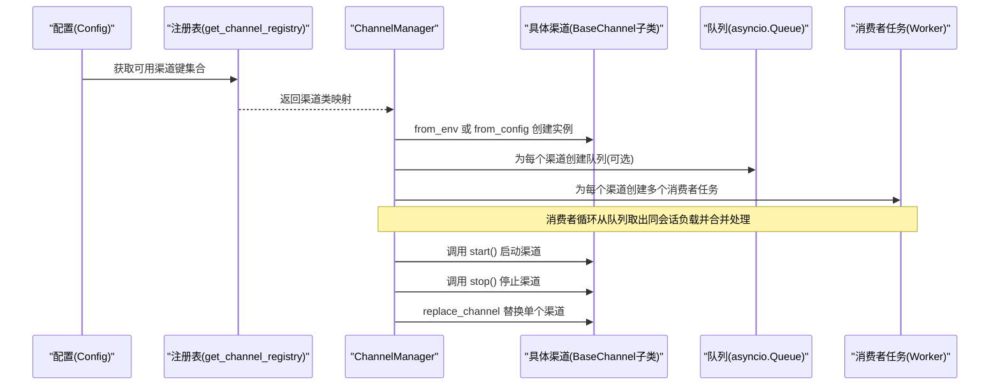
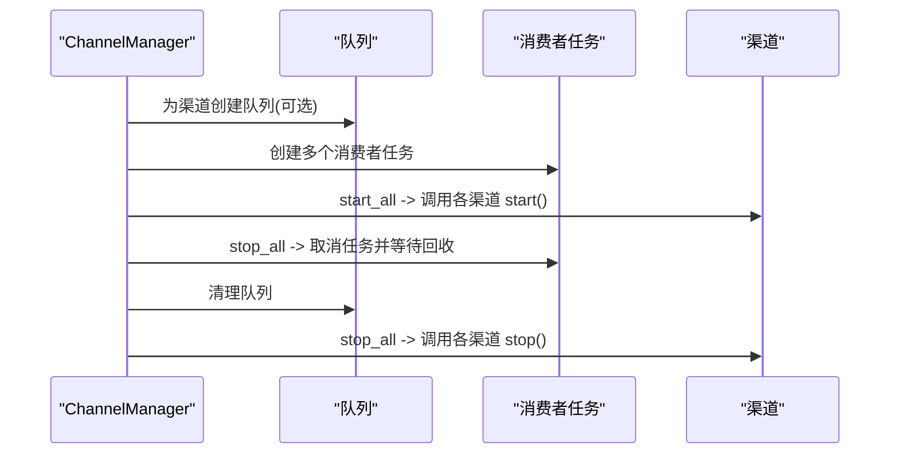
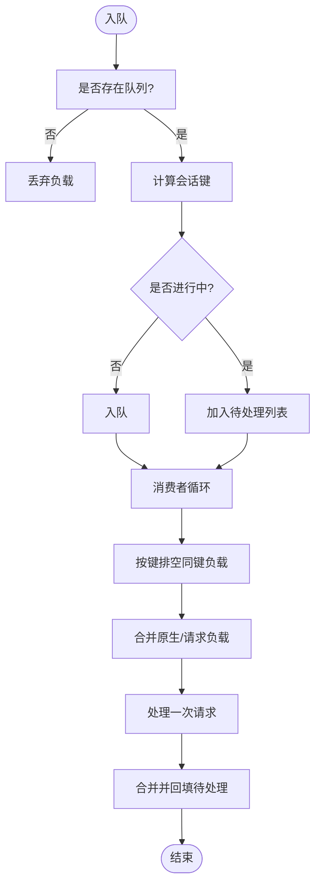
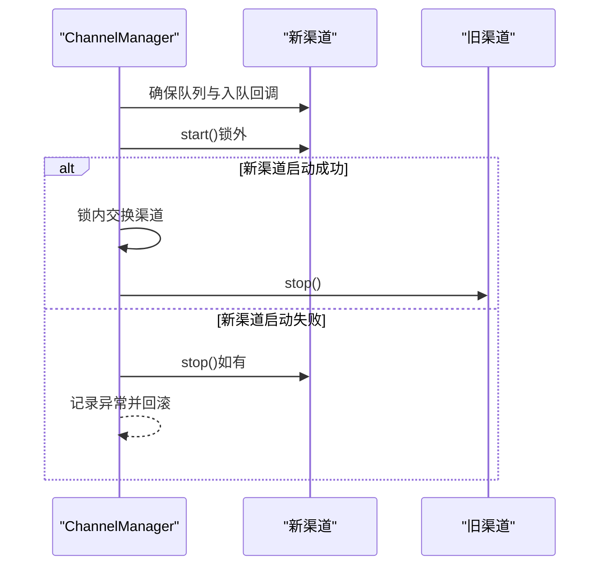
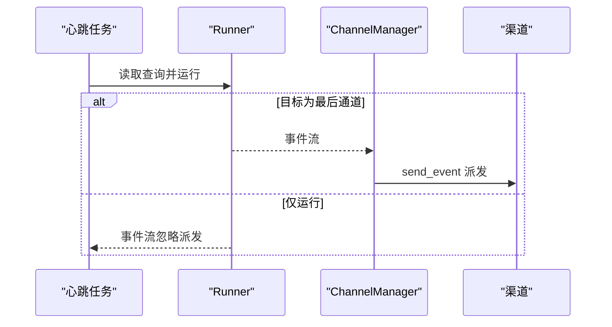
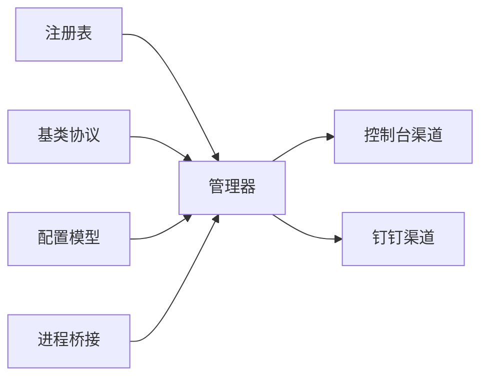

# 渠道生命周期管理

<cite>
**本文引用的文件**
- [src/copaw/app/channels/__init__.py](file://src/copaw/app/channels/__init__.py)
- [src/copaw/app/channels/manager.py](file://src/copaw/app/channels/manager.py)
- [src/copaw/app/channels/base.py](file://src/copaw/app/channels/base.py)
- [src/copaw/app/channels/registry.py](file://src/copaw/app/channels/registry.py)
- [src/copaw/app/channels/schema.py](file://src/copaw/app/channels/schema.py)
- [src/copaw/config/config.py](file://src/copaw/config/config.py)
- [src/copaw/app/channels/console/channel.py](file://src/copaw/app/channels/console/channel.py)
- [src/copaw/app/channels/dingtalk/channel.py](file://src/copaw/app/channels/dingtalk/channel.py)
- [src/copaw/app/crons/heartbeat.py](file://src/copaw/app/crons/heartbeat.py)
- [src/copaw/app/channels/utils.py](file://src/copaw/app/channels/utils.py)
</cite>

## 目录
1. [简介](#简介)
2. [项目结构](#项目结构)
3. [核心组件](#核心组件)
4. [架构总览](#架构总览)
5. [详细组件分析](#详细组件分析)
6. [依赖分析](#依赖分析)
7. [性能考量](#性能考量)
8. [故障排查指南](#故障排查指南)
9. [结论](#结论)
10. [附录](#附录)

## 简介
本文件面向CoPaw的渠道生命周期管理，系统性阐述渠道的初始化与创建方式（from_env与from_config）、启动与停止流程（start_all与stop_all）、队列与并发控制（_channel_queue、消费者工作数）、渠道替换（replace_channel）以及状态监控、健康检查与故障恢复机制。目标是帮助开发者在不深入源码的前提下，也能准确理解并正确使用渠道生命周期管理能力。

## 项目结构
围绕渠道生命周期管理的关键模块如下：
- 渠道注册与发现：registry.py
- 渠道基类与通用协议：base.py
- 渠道管理器：manager.py（包含队列、消费者、启动/停止、替换等）
- 渠道类型与路由：schema.py
- 配置模型：config.py（内置各渠道配置项）
- 具体渠道实现示例：console/channel.py、dingtalk/channel.py
- 心跳与健康检查：crons/heartbeat.py
- 进程桥接工具：channels/utils.py

图表来源
- [src/copaw/app/channels/registry.py:133-138](file://src/copaw/app/channels/registry.py#L133-L138)
- [src/copaw/app/channels/base.py:69-125](file://src/copaw/app/channels/base.py#L69-L125)
- [src/copaw/app/channels/schema.py:12-50](file://src/copaw/app/channels/schema.py#L12-L50)
- [src/copaw/app/channels/manager.py:114-134](file://src/copaw/app/channels/manager.py#L114-L134)
- [src/copaw/config/config.py:31-200](file://src/copaw/config/config.py#L31-L200)
- [src/copaw/app/channels/console/channel.py:57-184](file://src/copaw/app/channels/console/channel.py#L57-L184)
- [src/copaw/app/channels/dingtalk/channel.py:81-256](file://src/copaw/app/channels/dingtalk/channel.py#L81-L256)
- [src/copaw/app/crons/heartbeat.py:89-183](file://src/copaw/app/crons/heartbeat.py#L89-L183)
- [src/copaw/app/channels/utils.py:121-134](file://src/copaw/app/channels/utils.py#L121-L134)

章节来源
- [src/copaw/app/channels/__init__.py:1-14](file://src/copaw/app/channels/__init__.py#L1-L14)
- [src/copaw/app/channels/registry.py:19-86](file://src/copaw/app/channels/registry.py#L19-L86)
- [src/copaw/app/channels/base.py:69-125](file://src/copaw/app/channels/base.py#L69-L125)
- [src/copaw/app/channels/manager.py:114-134](file://src/copaw/app/channels/manager.py#L114-L134)
- [src/copaw/app/channels/schema.py:12-50](file://src/copaw/app/channels/schema.py#L12-L50)
- [src/copaw/config/config.py:31-200](file://src/copaw/config/config.py#L31-L200)
- [src/copaw/app/channels/console/channel.py:57-184](file://src/copaw/app/channels/console/channel.py#L57-L184)
- [src/copaw/app/channels/dingtalk/channel.py:81-256](file://src/copaw/app/channels/dingtalk/channel.py#L81-L256)
- [src/copaw/app/crons/heartbeat.py:89-183](file://src/copaw/app/crons/heartbeat.py#L89-L183)
- [src/copaw/app/channels/utils.py:121-134](file://src/copaw/app/channels/utils.py#L121-L134)

## 核心组件
- 渠道注册表：提供内置渠道清单与自定义渠道发现，支持缓存与失败策略。
- 渠道基类：统一渠道协议、会话去抖、消息合并、发送与错误处理钩子。
- 渠道管理器：负责队列创建与消费者任务调度、启动/停止、替换、事件派发。
- 渠道类型与路由：定义通道类型标识、统一路由地址与转换协议。
- 配置模型：内置各渠道配置项，支持from_config按配置启用与参数注入。
- 进程桥接：将runner.stream_query作为所有渠道的统一处理函数。

章节来源
- [src/copaw/app/channels/registry.py:19-86](file://src/copaw/app/channels/registry.py#L19-L86)
- [src/copaw/app/channels/base.py:69-125](file://src/copaw/app/channels/base.py#L69-L125)
- [src/copaw/app/channels/manager.py:114-134](file://src/copaw/app/channels/manager.py#L114-L134)
- [src/copaw/app/channels/schema.py:12-50](file://src/copaw/app/channels/schema.py#L12-L50)
- [src/copaw/config/config.py:31-200](file://src/copaw/config/config.py#L31-L200)
- [src/copaw/app/channels/utils.py:121-134](file://src/copaw/app/channels/utils.py#L121-L134)

## 架构总览
下图展示从配置到渠道实例化、队列与消费者、以及事件派发的整体流程。

图表来源
- [src/copaw/app/channels/manager.py:135-262](file://src/copaw/app/channels/manager.py#L135-L262)
- [src/copaw/app/channels/registry.py:133-138](file://src/copaw/app/channels/registry.py#L133-L138)
- [src/copaw/app/channels/base.py:317-339](file://src/copaw/app/channels/base.py#L317-L339)
- [src/copaw/app/channels/manager.py:365-426](file://src/copaw/app/channels/manager.py#L365-L426)

## 详细组件分析

### 初始化方式：from_env 与 from_config 的区别与适用场景
- from_env
  - 从环境变量中读取渠道开关与参数，适合快速启用/禁用或轻量配置。
  - 适用于开发调试、最小化部署或通过环境变量集中管理渠道。
- from_config
  - 从配置对象（如config.json或agent.json）中解析渠道配置，支持更细粒度的参数与过滤策略。
  - 适用于生产环境、需要持久化配置与多渠道组合的场景。

两者均通过注册表获取渠道类，并调用对应渠道的构造方法完成实例化；差异在于参数来源与可扩展性。

章节来源
- [src/copaw/app/channels/manager.py:135-155](file://src/copaw/app/channels/manager.py#L135-L155)
- [src/copaw/app/channels/manager.py:157-262](file://src/copaw/app/channels/manager.py#L157-L262)
- [src/copaw/app/channels/registry.py:133-138](file://src/copaw/app/channels/registry.py#L133-L138)
- [src/copaw/config/config.py:31-200](file://src/copaw/config/config.py#L31-L200)

### 启动与停止：start_all 与 stop_all 的实现原理
- start_all
  - 在运行事件循环上为每个渠道创建队列（若渠道声明使用管理队列），并设置入队回调。
  - 为每个渠道创建固定数量的消费者任务，执行消费循环。
  - 最后依次调用每个渠道的start()，完成渠道侧初始化。
- stop_all
  - 取消所有消费者任务，等待最多超时时间回收。
  - 清理队列、消费者任务集合与进行中的会话标记。
  - 将入队回调置空，然后逆序调用每个渠道的stop()，确保有序清理。

图表来源
- [src/copaw/app/channels/manager.py:365-426](file://src/copaw/app/channels/manager.py#L365-L426)

章节来源
- [src/copaw/app/channels/manager.py:365-426](file://src/copaw/app/channels/manager.py#L365-L426)

### _channel_queue 的创建与管理：大小限制、工作数与并发控制
- 队列大小限制
  - 默认最大长度由常量定义，避免内存无限增长。
- 工作数配置
  - 每个渠道默认创建固定数量的消费者任务，提升同一渠道内不同会话的并行度。
- 并发控制策略
  - 会话级去重：同一会话在处理期间被标记为“进行中”，新负载进入待处理缓冲，待处理完成后合并入队。
  - 键锁：对同一会话键加锁，保证同键负载在任一时刻仅被一个消费者处理，避免跨消费者拆分导致的消息顺序问题。
  - 时间去抖：对无文本内容的负载进行缓冲，待出现文本后再合并发送，保障语音等无文本输入的完整性。

图表来源
- [src/copaw/app/channels/manager.py:322-364](file://src/copaw/app/channels/manager.py#L322-L364)
- [src/copaw/app/channels/manager.py:42-112](file://src/copaw/app/channels/manager.py#L42-L112)
- [src/copaw/app/channels/base.py:126-144](file://src/copaw/app/channels/base.py#L126-L144)

章节来源
- [src/copaw/app/channels/manager.py:35-40](file://src/copaw/app/channels/manager.py#L35-L40)
- [src/copaw/app/channels/manager.py:322-364](file://src/copaw/app/channels/manager.py#L322-L364)
- [src/copaw/app/channels/manager.py:42-112](file://src/copaw/app/channels/manager.py#L42-L112)
- [src/copaw/app/channels/base.py:126-144](file://src/copaw/app/channels/base.py#L126-L144)

### 渠道替换：replace_channel 的实现细节（零停机重载、平滑切换与回滚）
- 流程要点
  - 确保新渠道具备队列与入队回调，以便其注册处理器。
  - 在管理器锁外启动新渠道（可能耗时，如钉钉流式连接），降低锁持有时间。
  - 在锁内交换旧渠道与新渠道，并停止旧渠道。
- 回滚策略
  - 若新渠道启动失败，记录异常并尝试停止新渠道，保持旧渠道继续运行，实现回滚。

图表来源
- [src/copaw/app/channels/manager.py:434-498](file://src/copaw/app/channels/manager.py#L434-L498)

章节来源
- [src/copaw/app/channels/manager.py:434-498](file://src/copaw/app/channels/manager.py#L434-L498)

### 渠道状态监控、健康检查与故障恢复
- 心跳任务
  - 定期读取心跳查询文件，运行代理并可选择将结果派发至最近一次对话的目标渠道。
  - 支持活动时段校验与超时保护，避免在非活跃时段触发。
- 故障恢复
  - 渠道消费循环捕获异常并记录日志，避免单次异常导致整个消费者退出。
  - 管理器stop_all时取消消费者任务并等待回收，确保资源释放。

图表来源
- [src/copaw/app/crons/heartbeat.py:89-183](file://src/copaw/app/crons/heartbeat.py#L89-L183)
- [src/copaw/app/channels/manager.py:499-526](file://src/copaw/app/channels/manager.py#L499-L526)

章节来源
- [src/copaw/app/crons/heartbeat.py:89-183](file://src/copaw/app/crons/heartbeat.py#L89-L183)
- [src/copaw/app/channels/manager.py:357-364](file://src/copaw/app/channels/manager.py#L357-L364)
- [src/copaw/app/channels/manager.py:394-426](file://src/copaw/app/channels/manager.py#L394-L426)

### 具体渠道实现要点（示例）
- 控制台渠道（ConsoleChannel）
  - 通过标准输出打印消息，支持媒体路径解析与推送存储。
  - 生命周期：start/stop简单实现，主要用于开发与测试。
- 钉钉渠道（DingTalkChannel）
  - 使用钉钉流式SDK与会话Webhook进行消息收发，支持AI卡片与媒体上传。
  - 会话键短化以适配定时任务查找，具备去重与批量回复能力。

章节来源
- [src/copaw/app/channels/console/channel.py:57-184](file://src/copaw/app/channels/console/channel.py#L57-L184)
- [src/copaw/app/channels/dingtalk/channel.py:81-256](file://src/copaw/app/channels/dingtalk/channel.py#L81-L256)

## 依赖分析
- 注册表与渠道类
  - 注册表维护内置渠道映射与自定义渠道发现，ChannelManager通过注册表创建渠道实例。
- 渠道基类与协议
  - 所有渠道继承基类，遵循统一的构建请求、消费与发送协议，便于管理器统一对待。
- 配置与参数注入
  - from_config根据配置对象动态注入参数，支持字典与Pydantic对象两种形态。
- 进程桥接
  - 通过工具函数将runner.stream_query注入渠道，形成统一处理链路。

图表来源
- [src/copaw/app/channels/registry.py:133-138](file://src/copaw/app/channels/registry.py#L133-L138)
- [src/copaw/app/channels/base.py:69-125](file://src/copaw/app/channels/base.py#L69-L125)
- [src/copaw/config/config.py:31-200](file://src/copaw/config/config.py#L31-L200)
- [src/copaw/app/channels/utils.py:121-134](file://src/copaw/app/channels/utils.py#L121-L134)
- [src/copaw/app/channels/manager.py:135-262](file://src/copaw/app/channels/manager.py#L135-L262)

章节来源
- [src/copaw/app/channels/registry.py:133-138](file://src/copaw/app/channels/registry.py#L133-L138)
- [src/copaw/app/channels/base.py:69-125](file://src/copaw/app/channels/base.py#L69-L125)
- [src/copaw/config/config.py:31-200](file://src/copaw/config/config.py#L31-L200)
- [src/copaw/app/channels/utils.py:121-134](file://src/copaw/app/channels/utils.py#L121-L134)
- [src/copaw/app/channels/manager.py:135-262](file://src/copaw/app/channels/manager.py#L135-L262)

## 性能考量
- 队列容量与背压
  - 合理设置队列上限，避免高并发下的内存膨胀；结合消费者数量平衡吞吐与延迟。
- 消费者并行度
  - 多消费者允许不同会话并行处理，但需注意渠道自身的限流与幂等性。
- 会话去抖与合并
  - 对无文本输入进行缓冲合并，减少重复请求与网络往返，提高整体效率。
- 异步与锁粒度
  - 采用键级锁避免跨消费者拆分，同时尽量缩短锁持有时间，提升并发度。

## 故障排查指南
- 启动失败
  - from_config创建渠道时捕获异常并跳过该渠道，检查配置项与依赖库安装。
- 消费异常
  - 消费循环捕获异常并记录日志，定位具体渠道与会话键，查看合并与去抖逻辑。
- 停止卡顿
  - stop_all等待消费者任务回收，若超时仍有未完成任务，检查渠道内部阻塞点（如网络I/O）。
- 替换失败
  - 新渠道启动失败会回滚至旧渠道，确认新渠道参数与外部服务可用性。

章节来源
- [src/copaw/app/channels/manager.py:252-260](file://src/copaw/app/channels/manager.py#L252-L260)
- [src/copaw/app/channels/manager.py:357-364](file://src/copaw/app/channels/manager.py#L357-L364)
- [src/copaw/app/channels/manager.py:394-426](file://src/copaw/app/channels/manager.py#L394-L426)
- [src/copaw/app/channels/manager.py:464-474](file://src/copaw/app/channels/manager.py#L464-L474)

## 结论
CoPaw的渠道生命周期管理通过注册表、基类协议与管理器实现了标准化的初始化、启动/停止、队列与并发控制、以及零停机替换能力。配合心跳与错误处理机制，可在复杂生产环境中实现稳定、可观测且可演进的渠道体系。建议在生产部署中结合配置模型与渠道特性，合理设置队列容量与消费者数量，并完善监控与告警以保障稳定性。

## 附录
- 关键常量与配置
  - 队列最大长度、每渠道消费者数量、渠道类型枚举与路由协议。
- 进程桥接
  - 统一将runner.stream_query注入渠道，简化渠道与代理之间的交互。

章节来源
- [src/copaw/app/channels/manager.py:35-40](file://src/copaw/app/channels/manager.py#L35-L40)
- [src/copaw/app/channels/schema.py:12-50](file://src/copaw/app/channels/schema.py#L12-L50)
- [src/copaw/app/channels/utils.py:121-134](file://src/copaw/app/channels/utils.py#L121-L134)