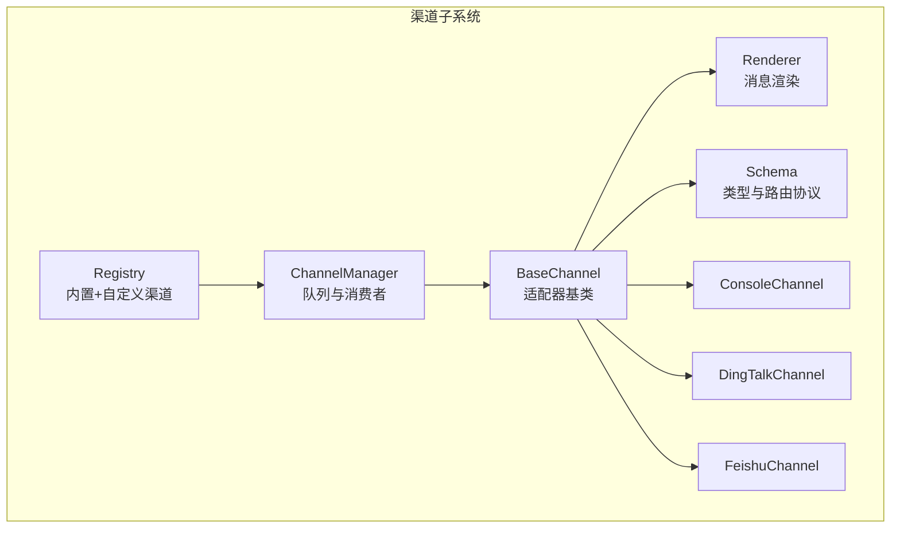
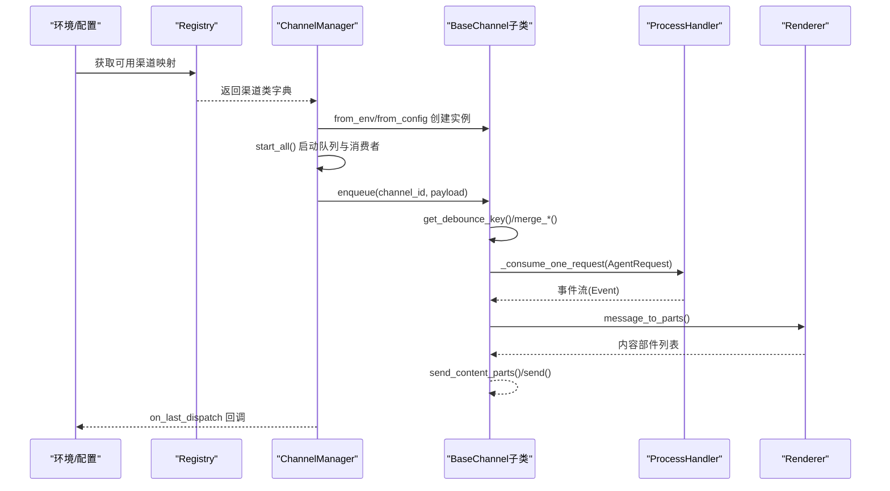
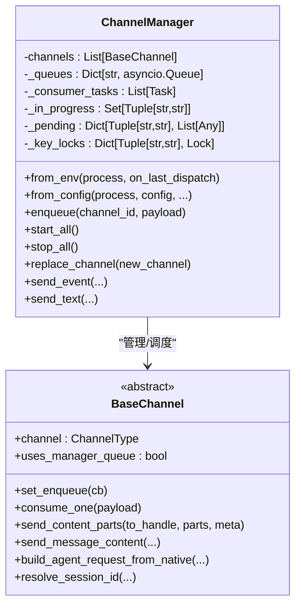
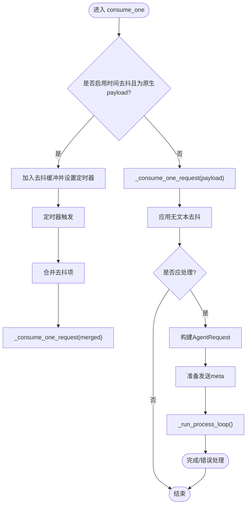
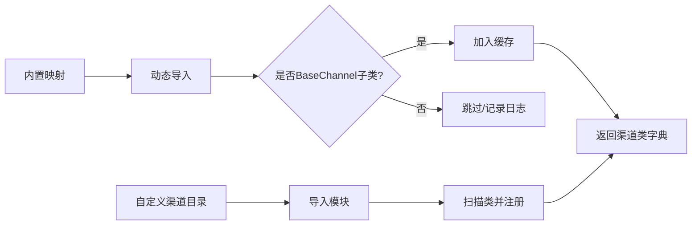
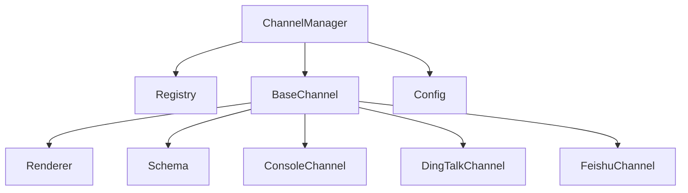

# 渠道管理器

<cite>
**本文引用的文件**
- [manager.py](file://src/copaw/app/channels/manager.py)
- [base.py](file://src/copaw/app/channels/base.py)
- [registry.py](file://src/copaw/app/channels/registry.py)
- [schema.py](file://src/copaw/app/channels/schema.py)
- [renderer.py](file://src/copaw/app/channels/renderer.py)
- [channel.py（控制台）](file://src/copaw/app/channels/console/channel.py)
- [channel.py（钉钉）](file://src/copaw/app/channels/dingtalk/channel.py)
- [channel.py（飞书）](file://src/copaw/app/channels/feishu/channel.py)
- [config.py](file://src/copaw/config/config.py)
</cite>

## 目录
1. [简介](#简介)
2. [项目结构](#项目结构)
3. [核心组件](#核心组件)
4. [架构总览](#架构总览)
5. [详细组件分析](#详细组件分析)
6. [依赖分析](#依赖分析)
7. [性能考虑](#性能考虑)
8. [故障排查指南](#故障排查指南)
9. [结论](#结论)
10. [附录](#附录)

## 简介
本文件面向CoPaw的渠道管理器（ChannelManager），系统性阐述其“渠道适配器模式”的设计与实现，覆盖以下主题：
- 渠道注册机制与运行时发现
- 消息路由与去抖合并策略
- 会话状态管理与并发消费者模型
- 基类设计、抽象接口与具体实现模式
- 多平台消息处理统一接口与渲染管线
- 配置管理、连接状态监控与错误处理
- 新渠道接入开发指南、接口规范与最佳实践
- 性能优化、并发处理与资源管理策略

## 项目结构
围绕渠道子系统的关键目录与文件如下：
- 渠道管理器：负责实例化、启动/停止、队列与消费者调度
- 渠道基类：定义统一的适配器接口、消息合并与发送流程
- 注册表：内置渠道与自定义渠道的动态加载
- 渲染器：将运行时消息转换为各渠道可发送的内容部件
- 具体渠道：如控制台、钉钉、飞书等适配器的具体实现
- 配置：渠道配置模型与可用渠道集合

图表来源
- [manager.py](file://src/copaw/app/channels/manager.py)
- [registry.py](file://src/copaw/app/channels/registry.py)
- [base.py](file://src/copaw/app/channels/base.py)
- [renderer.py](file://src/copaw/app/channels/renderer.py)
- [schema.py](file://src/copaw/app/channels/schema.py)
- [channel.py（控制台）](file://src/copaw/app/channels/console/channel.py)
- [channel.py（钉钉）](file://src/copaw/app/channels/dingtalk/channel.py)
- [channel.py（飞书）](file://src/copaw/app/channels/feishu/channel.py)

章节来源
- [manager.py](file://src/copaw/app/channels/manager.py)
- [registry.py](file://src/copaw/app/channels/registry.py)
- [base.py](file://src/copaw/app/channels/base.py)
- [renderer.py](file://src/copaw/app/channels/renderer.py)
- [schema.py](file://src/copaw/app/channels/schema.py)
- [channel.py（控制台）](file://src/copaw/app/channels/console/channel.py)
- [channel.py（钉钉）](file://src/copaw/app/channels/dingtalk/channel.py)
- [channel.py（飞书）](file://src/copaw/app/channels/feishu/channel.py)

## 核心组件
- ChannelManager：持有各渠道实例、队列与消费者任务；提供从环境或配置创建渠道、入队、启动/停止、替换渠道、主动发送等能力。
- BaseChannel：所有渠道适配器的抽象基类，定义统一的消费流程、时间去抖、内容合并、消息渲染与发送接口。
- Registry：内置渠道映射与自定义渠道扫描，提供渠道类字典。
- Renderer：将运行时消息转换为渠道可发送的内容部件（文本、图片、音频、视频、文件、拒绝）。
- Schema：统一的渠道类型标识、路由地址与转换协议。
- 具体渠道：ConsoleChannel、DingTalkChannel、FeishuChannel等，实现各自的解析、发送与生命周期管理。

章节来源
- [manager.py](file://src/copaw/app/channels/manager.py)
- [base.py](file://src/copaw/app/channels/base.py)
- [registry.py](file://src/copaw/app/channels/registry.py)
- [renderer.py](file://src/copaw/app/channels/renderer.py)
- [schema.py](file://src/copaw/app/channels/schema.py)

## 架构总览
ChannelManager作为框架拥有者，负责：
- 通过Registry发现并按可用渠道列表创建渠道实例
- 为每个渠道创建独立队列与多个消费者（并发处理同渠道不同会话）
- 对同一会话的消息进行去抖合并，避免重复与乱序
- 将统一的AgentRequest事件流经渠道适配器，完成渲染与发送

图表来源
- [manager.py](file://src/copaw/app/channels/manager.py)
- [base.py](file://src/copaw/app/channels/base.py)
- [renderer.py](file://src/copaw/app/channels/renderer.py)
- [registry.py](file://src/copaw/app/channels/registry.py)

## 详细组件分析

### ChannelManager 设计与实现
- 初始化与创建
  - 支持从环境变量与配置两种方式创建渠道实例，过滤不可用渠道
  - 从配置创建时，自动解析额外字段、启用开关、工具过滤与思考过滤等参数
- 队列与消费者
  - 为每个使用管理队列的渠道创建固定大小队列
  - 为每个渠道启动固定数量的消费者任务，实现同渠道多会话并发处理
- 入队与去抖
  - 通过去抖键（session_id或渠道解析）识别同一会话
  - 若会话正在处理，则暂存到pending，待处理完成后合并入队
  - 提供线程安全入队接口，支持从同步上下文调用
- 消费循环
  - 按会话提取一批payload，合并后调用渠道的消费方法
  - 使用key级锁确保同一会话不被多个worker拆分，避免内容错配
- 替换与停止
  - 支持在不停止其他渠道的情况下替换单个渠道
  - 停止时取消消费者任务并清理资源，保证优雅退出

图表来源
- [manager.py](file://src/copaw/app/channels/manager.py)
- [base.py](file://src/copaw/app/channels/base.py)

章节来源
- [manager.py](file://src/copaw/app/channels/manager.py)

### BaseChannel 抽象与适配器模式
- 统一接口
  - from_env/from_config：从环境或配置创建实例
  - resolve_session_id：将发送者与元数据映射为会话ID
  - build_agent_request_from_native：将原生消息转为AgentRequest
  - consume_one/_consume_one_request：统一的消费入口与处理流程
  - send_content_parts/send_message_content：发送内容部件与消息
- 去抖与合并
  - 时间去抖：对原生payload按去抖键缓存，超时后合并发送
  - 无文本去抖：若内容不含文本且非音频，缓冲至出现文本再合并发送
  - 合并策略：原生消息合并content_parts并保留关键meta；请求合并拼接输入内容
- 渲染与发送
  - Renderer将消息转换为渠道可发送部件（文本、图片、音频、视频、文件、拒绝）
  - 默认发送逻辑：将文本与媒体组合为一条消息，媒体以占位符形式附加
- 生命周期钩子
  - _before_consume_process：消费前保存必要上下文（如接收ID）
  - on_event_message_completed/on_event_response：事件到达时的处理点
  - _on_consume_error：错误回调，默认以纯文本回复

图表来源
- [base.py](file://src/copaw/app/channels/base.py)

章节来源
- [base.py](file://src/copaw/app/channels/base.py)
- [renderer.py](file://src/copaw/app/channels/renderer.py)

### Registry 渠道注册机制
- 内置渠道映射：键为渠道名，值为模块路径与类名
- 自定义渠道扫描：从工作目录的自定义渠道目录中导入并注册
- 缓存与线程安全：内置渠道类缓存，避免重复导入
- 必需渠道：某些内置渠道失败将直接抛出异常，确保关键功能可用

图表来源
- [registry.py](file://src/copaw/app/channels/registry.py)

章节来源
- [registry.py](file://src/copaw/app/channels/registry.py)

### Schema 渠道类型与路由协议
- ChannelType：字符串类型，允许插件自定义渠道键
- ChannelAddress：统一路由结构，包含kind/id/extra，并提供可读的handle
- ChannelMessageConverter：渠道消息转换协议，要求实现原生消息到AgentRequest的转换与响应发送

章节来源
- [schema.py](file://src/copaw/app/channels/schema.py)

### 具体渠道实现模式
- 控制台渠道（ConsoleChannel）
  - 输出侧：将消息Pretty-print到终端，支持颜色与前缀
  - 输入侧：支持从HTTP接口或队列消费，流式输出SSE事件
  - 文件上传：根据工作区媒体目录解析本地文件引用
- 钉钉渠道（DingTalkChannel）
  - 会话Webhook存储：用于主动发送；会话ID短化以便请求与定时任务使用
  - AI卡片：支持卡片状态管理与流式更新
  - 去抖关闭：由管理器合并后再调用，避免重复回复
- 飞书渠道（FeishuChannel）
  - WebSocket接收、Open API发送
  - 会话ID基于群聊或个人标识；存储receive_id用于回复与去重
  - 文件大小限制与媒体扩展检测

章节来源
- [channel.py（控制台）](file://src/copaw/app/channels/console/channel.py)
- [channel.py（钉钉）](file://src/copaw/app/channels/dingtalk/channel.py)
- [channel.py（飞书）](file://src/copaw/app/channels/feishu/channel.py)

### 渠道配置管理
- BaseChannelConfig：通用渠道配置（启用、前缀、工具过滤、思考过滤、白名单策略、提及要求等）
- 各渠道专属配置：如钉钉、飞书、QQ、Telegram、MQTT等，均继承通用配置
- 可用渠道集合：从配置中读取可用渠道列表，结合Registry进行实例化

章节来源
- [config.py](file://src/copaw/config/config.py)

## 依赖分析
- ChannelManager依赖Registry获取渠道类，依赖BaseChannel统一接口，依赖配置模块读取可用渠道
- BaseChannel依赖Renderer进行消息部件转换，依赖Schema中的类型与路由协议
- 具体渠道实现依赖各自平台SDK与第三方库（如钉钉流、飞书OAPI等）

图表来源
- [manager.py](file://src/copaw/app/channels/manager.py)
- [registry.py](file://src/copaw/app/channels/registry.py)
- [base.py](file://src/copaw/app/channels/base.py)
- [renderer.py](file://src/copaw/app/channels/renderer.py)
- [schema.py](file://src/copaw/app/channels/schema.py)
- [channel.py（控制台）](file://src/copaw/app/channels/console/channel.py)
- [channel.py（钉钉）](file://src/copaw/app/channels/dingtalk/channel.py)
- [channel.py（飞书）](file://src/copaw/app/channels/feishu/channel.py)

章节来源
- [manager.py](file://src/copaw/app/channels/manager.py)
- [registry.py](file://src/copaw/app/channels/registry.py)
- [base.py](file://src/copaw/app/channels/base.py)
- [renderer.py](file://src/copaw/app/channels/renderer.py)
- [schema.py](file://src/copaw/app/channels/schema.py)
- [channel.py（控制台）](file://src/copaw/app/channels/console/channel.py)
- [channel.py（钉钉）](file://src/copaw/app/channels/dingtalk/channel.py)
- [channel.py（飞书）](file://src/copaw/app/channels/feishu/channel.py)

## 性能考虑
- 并发模型
  - 每个渠道固定数量的消费者任务，实现同渠道多会话并行
  - 同一会话仅由一个worker处理，配合key级锁避免拆分与重排
- 队列与背压
  - 渠道队列有最大长度，防止内存膨胀
  - 入队采用线程安全调用，支持同步上下文
- 去抖与合并
  - 时间去抖与无文本去抖减少重复与空内容发送
  - 合并原生消息与请求消息，降低API调用次数
- 渲染与发送
  - Renderer按渠道能力选择格式，减少无效内容
  - 发送阶段将文本与媒体合并，媒体以占位符附加，避免多次往返

## 故障排查指南
- 渠道无法启动
  - 检查可用渠道列表与Registry加载结果
  - 关注from_config过程中参数解析与异常日志
- 消息未送达或重复
  - 核对去抖键生成与会话ID解析
  - 查看pending队列与in_progress集合状态
- 错误处理
  - BaseChannel默认错误回调会以纯文本形式回复
  - 检查_run_process_loop中的错误提取与on_last_dispatch回调
- 平台特定问题
  - 钉钉：关注AI卡片状态与Webhook有效期
  - 飞书：检查租户令牌刷新与文件大小限制

章节来源
- [manager.py](file://src/copaw/app/channels/manager.py)
- [base.py](file://src/copaw/app/channels/base.py)

## 结论
ChannelManager通过“渠道适配器模式”实现了多平台消息处理的统一抽象与高效执行。借助Registry的动态发现、BaseChannel的标准化接口、Renderer的跨渠道渲染以及完善的去抖与合并策略，系统在保证一致性的同时具备良好的扩展性与稳定性。建议在新增渠道时遵循现有接口规范，充分利用去抖与合并机制，并在配置层面明确启用开关与权限策略。

## 附录

### 新渠道接入开发指南
- 接口规范
  - 实现from_env与from_config类方法，接受process、on_reply_sent等参数
  - 实现build_agent_request_from_native，将原生payload解析为AgentRequest
  - 实现resolve_session_id，确保会话隔离
  - 可选：重写consume_one/_consume_one_request、send_content_parts等以适配平台特性
- 配置模型
  - 在配置模块中添加专属配置类，继承BaseChannelConfig
  - 在Registry映射中注册渠道键与类名（内置渠道）
- 最佳实践
  - 明确uses_manager_queue：若渠道自管队列则设为False
  - 正确设置去抖秒数：若平台天然有序则可关闭时间去抖
  - 使用Renderer能力：尽量复用统一渲染逻辑
  - 错误处理：在_on_consume_error中提供友好的用户提示

章节来源
- [base.py](file://src/copaw/app/channels/base.py)
- [config.py](file://src/copaw/config/config.py)
- [registry.py](file://src/copaw/app/channels/registry.py)