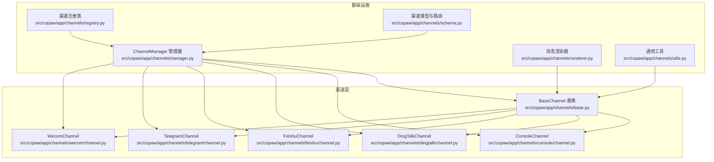
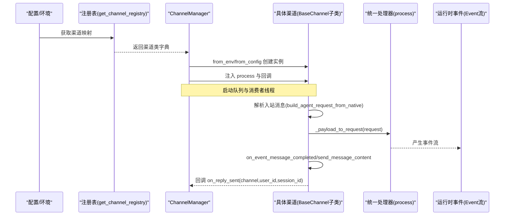
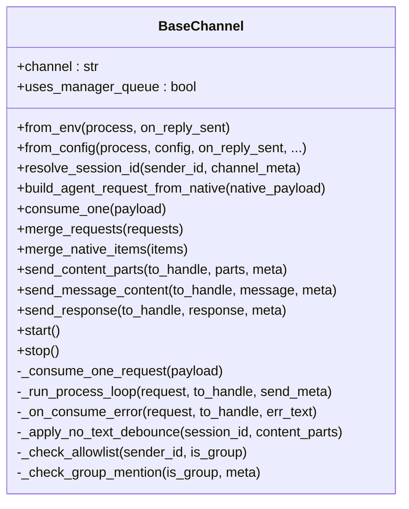
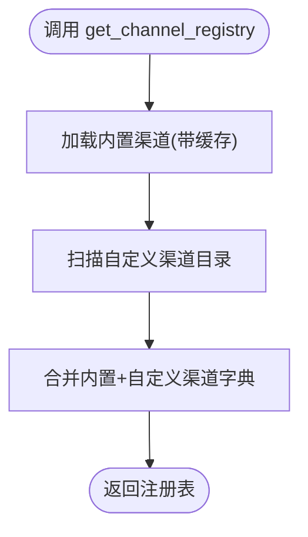
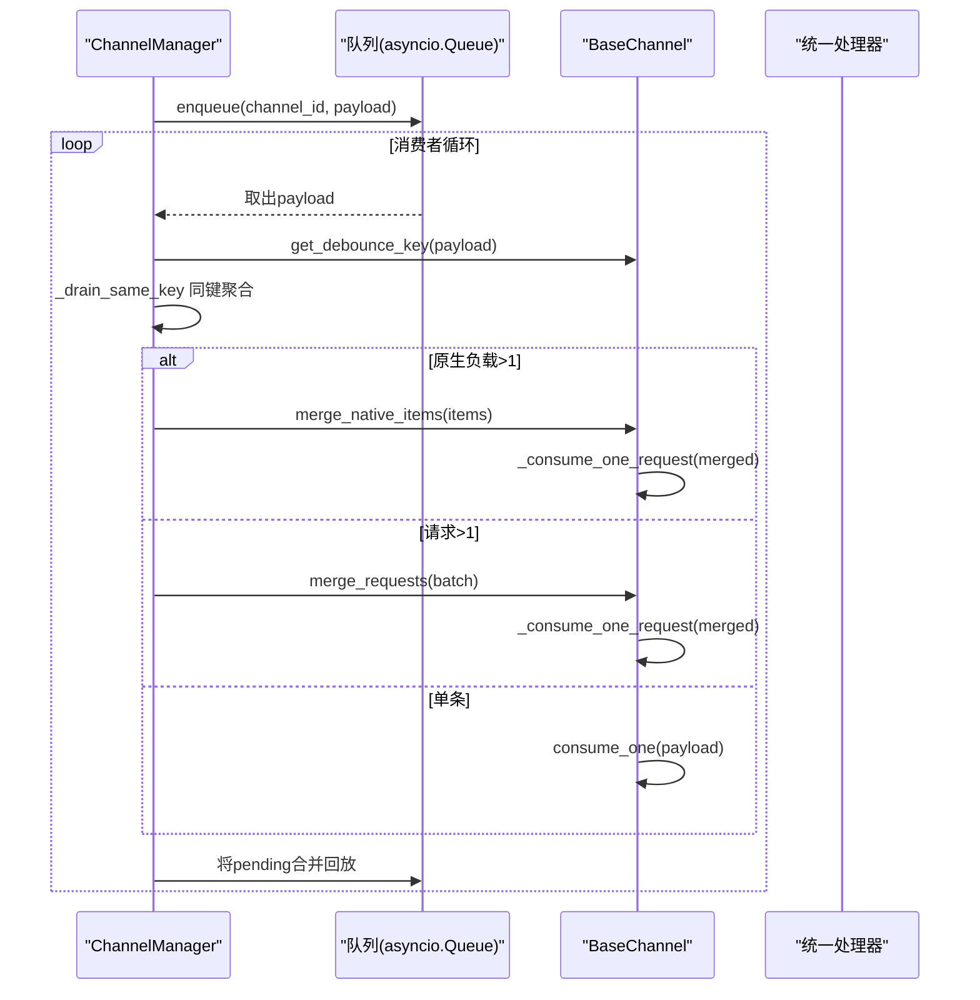
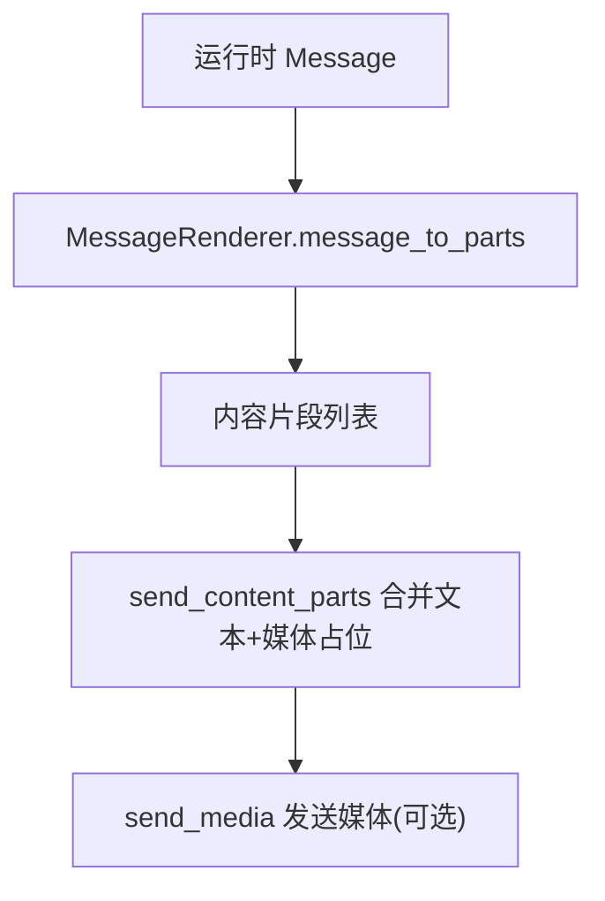
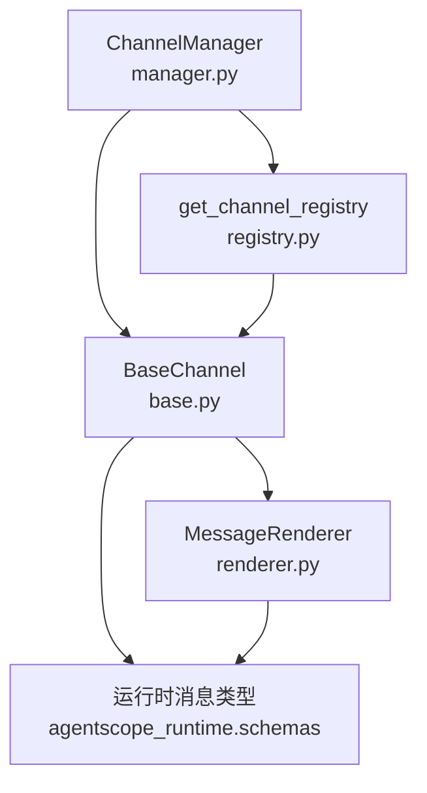

# 渠道适配器模式

<cite>
**本文档引用的文件**
- [src/copaw/app/channels/base.py](file://src/copaw/app/channels/base.py)
- [src/copaw/app/channels/registry.py](file://src/copaw/app/channels/registry.py)
- [src/copaw/app/channels/manager.py](file://src/copaw/app/channels/manager.py)
- [src/copaw/app/channels/schema.py](file://src/copaw/app/channels/schema.py)
- [src/copaw/app/channels/renderer.py](file://src/copaw/app/channels/renderer.py)
- [src/copaw/app/channels/console/channel.py](file://src/copaw/app/channels/console/channel.py)
- [src/copaw/app/channels/dingtalk/channel.py](file://src/copaw/app/channels/dingtalk/channel.py)
- [src/copaw/app/channels/feishu/channel.py](file://src/copaw/app/channels/feishu/channel.py)
- [src/copaw/app/channels/telegram/channel.py](file://src/copaw/app/channels/telegram/channel.py)
- [src/copaw/app/channels/wecom/channel.py](file://src/copaw/app/channels/wecom/channel.py)
- [src/copaw/app/channels/utils.py](file://src/copaw/app/channels/utils.py)
- [src/copaw/config/config.py](file://src/copaw/config/config.py)
- [src/copaw/constant.py](file://src/copaw/constant.py)
- [src/copaw/app/channels/dingtalk/constants.py](file://src/copaw/app/channels/dingtalk/constants.py)
- [src/copaw/app/channels/feishu/constants.py](file://src/copaw/app/channels/feishu/constants.py)
</cite>

## 目录
1. [引言](#引言)
2. [项目结构](#项目结构)
3. [核心组件](#核心组件)
4. [架构总览](#架构总览)
5. [详细组件分析](#详细组件分析)
6. [依赖分析](#依赖分析)
7. [性能考虑](#性能考虑)
8. [故障排查指南](#故障排查指南)
9. [结论](#结论)
10. [附录](#附录)

## 引言
本文件系统性阐述 CoPaw 的“渠道适配器模式”，围绕 BaseChannel 基类设计、标准化接口规范（consume_one、merge_requests、merge_native_items）、渠道注册与动态加载机制（get_channel_registry）、以及继承规范、接口契约与最佳实践展开。文档同时覆盖渠道配置参数、环境变量处理与错误处理策略，帮助开发者快速理解并扩展新的渠道适配器。

## 项目结构
CoPaw 的渠道适配器位于 src/copaw/app/channels 目录下，采用“按渠道分模块”的组织方式：每个渠道一个子包，包含 channel.py 实现、常量与工具模块；公共基础设施包括基类、注册表、管理器、渲染器与通用工具。

图表来源
- [src/copaw/app/channels/base.py:69-868](file://src/copaw/app/channels/base.py#L69-L868)
- [src/copaw/app/channels/registry.py:133-138](file://src/copaw/app/channels/registry.py#L133-L138)
- [src/copaw/app/channels/manager.py:114-580](file://src/copaw/app/channels/manager.py#L114-L580)
- [src/copaw/app/channels/renderer.py:78-384](file://src/copaw/app/channels/renderer.py#L78-L384)
- [src/copaw/app/channels/schema.py:12-71](file://src/copaw/app/channels/schema.py#L12-L71)

章节来源
- [src/copaw/app/channels/base.py:69-868](file://src/copaw/app/channels/base.py#L69-L868)
- [src/copaw/app/channels/registry.py:133-138](file://src/copaw/app/channels/registry.py#L133-L138)
- [src/copaw/app/channels/manager.py:114-580](file://src/copaw/app/channels/manager.py#L114-L580)
- [src/copaw/app/channels/renderer.py:78-384](file://src/copaw/app/channels/renderer.py#L78-L384)
- [src/copaw/app/channels/schema.py:12-71](file://src/copaw/app/channels/schema.py#L12-L71)

## 核心组件
- BaseChannel 抽象基类：统一渠道的消息处理、会话解析、请求构建、内容发送与生命周期管理；提供时间去抖动、合并策略与错误回调等通用能力。
- ChannelManager 管理器：负责渠道实例化、队列与消费者线程、批量合并与去抖动、事件派发与主动推送。
- 渠道注册表：内置渠道清单与自定义渠道目录扫描，统一暴露 get_channel_registry 接口。
- 消息渲染器：将运行时 Message 转换为各渠道可发送的内容片段，支持过滤与样式控制。
- 渠道 Schema：定义渠道类型标识、路由地址模型与转换协议。

章节来源
- [src/copaw/app/channels/base.py:69-868](file://src/copaw/app/channels/base.py#L69-L868)
- [src/copaw/app/channels/manager.py:114-580](file://src/copaw/app/channels/manager.py#L114-L580)
- [src/copaw/app/channels/registry.py:133-138](file://src/copaw/app/channels/registry.py#L133-L138)
- [src/copaw/app/channels/renderer.py:78-384](file://src/copaw/app/channels/renderer.py#L78-L384)
- [src/copaw/app/channels/schema.py:12-71](file://src/copaw/app/channels/schema.py#L12-L71)

## 架构总览
下图展示从配置到渠道消费的端到端流程：ChannelManager 通过注册表创建渠道实例，注入统一的 process 处理器；入站消息经渠道解析为 AgentRequest，交由 process 流式生成事件；渠道根据事件完成状态进行内容渲染与发送。

图表来源
- [src/copaw/app/channels/registry.py:133-138](file://src/copaw/app/channels/registry.py#L133-L138)
- [src/copaw/app/channels/manager.py:135-155](file://src/copaw/app/channels/manager.py#L135-L155)
- [src/copaw/app/channels/base.py:404-540](file://src/copaw/app/channels/base.py#L404-L540)

章节来源
- [src/copaw/app/channels/registry.py:133-138](file://src/copaw/app/channels/registry.py#L133-L138)
- [src/copaw/app/channels/manager.py:135-155](file://src/copaw/app/channels/manager.py#L135-L155)
- [src/copaw/app/channels/base.py:404-540](file://src/copaw/app/channels/base.py#L404-L540)

## 详细组件分析

### BaseChannel 基类设计与抽象接口
- 渠道标识符与队列策略
  - channel 属性用于唯一标识渠道类型；uses_manager_queue 控制是否由 ChannelManager 统一创建队列与消费者循环。
- 标准化接口
  - consume_one：单条入站负载处理入口，支持时间去抖动与文本缓冲合并。
  - merge_requests：对同一会话的多个 AgentRequest 进行输入内容拼接合并。
  - merge_native_items：对同一会话的原生负载进行内容与元数据合并。
  - build_agent_request_from_native：将渠道原生消息转为运行时 AgentRequest。
  - send_* 系列：send_content_parts/send_message_content/send_response 等，统一输出格式。
- 生命周期与钩子
  - start/stop：通道级启动停止。
  - _before_consume_process/on_event_message_completed/on_event_response/_on_consume_error：消费前、消息完成、响应接收、错误处理等钩子。
- 会话与去抖动
  - resolve_session_id：默认使用 channel:sender_id，子类可按需缩短或规范化。
  - 时间去抖动：_debounce_seconds > 0 时，按 get_debounce_key 聚合同一会话的原生负载，延迟 flush 后统一 _consume_one_request。
  - 文本去抖动：若内容不含文本则缓冲，待后续文本到达后合并发送，音频类输入可绕过此规则立即处理。
- 安全与权限
  - _check_allowlist：基于开放/白名单策略与 deny_message。
  - _check_group_mention：群聊需被提及或满足命令触发条件。
- 配置与渲染
  - 通过 load_config 读取全局工具显示设置，结合 RenderStyle 控制工具详情、思考块、代码围栏等渲染行为。

图表来源
- [src/copaw/app/channels/base.py:69-868](file://src/copaw/app/channels/base.py#L69-L868)

章节来源
- [src/copaw/app/channels/base.py:69-868](file://src/copaw/app/channels/base.py#L69-L868)

### 渠道注册机制与动态加载
- 内置渠道清单：_BUILTIN_SPECS 映射渠道键到模块名与类名，确保统一加载。
- 缓存与容错：_BUILTIN_CHANNEL_CACHE 全进程缓存，失败的内置渠道在必需项时抛出异常，非必需项记录调试日志并跳过。
- 自定义渠道：扫描 CUSTOM_CHANNELS_DIR，导入模块并收集继承自 BaseChannel 的子类，要求类具备 channel 属性作为键。
- 注册表入口：get_channel_registry 返回内置与自定义渠道的合并字典。

图表来源
- [src/copaw/app/channels/registry.py:133-138](file://src/copaw/app/channels/registry.py#L133-L138)

章节来源
- [src/copaw/app/channels/registry.py:19-138](file://src/copaw/app/channels/registry.py#L19-L138)
- [src/copaw/constant.py:150-153](file://src/copaw/constant.py#L150-L153)

### ChannelManager 生命周期与批处理
- 实例化：from_env/from_config 依据可用渠道与配置创建渠道实例，注入统一 process 与回调。
- 队列与消费者：对启用队列的渠道创建 asyncio.Queue 与固定数量消费者任务；每个会话键（debounce_key）持有一把锁，保证同一会话不被并发拆分。
- 批处理与合并：_drain_same_key 提取同键负载；_process_batch 根据负载类型选择 merge_native_items 或 merge_requests；_put_pending_merged 将合并结果回放到队列。
- 主动发送：send_text/send_event 将用户/会话信息转换为渠道目标句柄并调用 send_content_parts。

图表来源
- [src/copaw/app/channels/manager.py:42-112](file://src/copaw/app/channels/manager.py#L42-L112)
- [src/copaw/app/channels/manager.py:322-364](file://src/copaw/app/channels/manager.py#L322-L364)

章节来源
- [src/copaw/app/channels/manager.py:114-580](file://src/copaw/app/channels/manager.py#L114-L580)

### 渲染器与内容发送策略
- 渲染风格：RenderStyle 控制是否显示工具详情、是否过滤工具消息/思考块、是否支持代码围栏等。
- 渲染流程：MessageRenderer.message_to_parts 将运行时内容块转换为渠道可发送的 OutgoingContentPart 列表；支持文本、图片、视频、音频、文件与拒绝内容。
- 发送策略：send_content_parts 将多部分内容合并为文本正文并附加媒体占位，随后逐个调用 send_media；部分渠道可重写以实现真实附件发送。

图表来源
- [src/copaw/app/channels/renderer.py:78-384](file://src/copaw/app/channels/renderer.py#L78-L384)
- [src/copaw/app/channels/base.py:674-764](file://src/copaw/app/channels/base.py#L674-L764)

章节来源
- [src/copaw/app/channels/renderer.py:37-384](file://src/copaw/app/channels/renderer.py#L37-L384)
- [src/copaw/app/channels/base.py:674-764](file://src/copaw/app/channels/base.py#L674-L764)

### 渠道实现示例与继承规范

#### ConsoleChannel（终端输出）
- 继承规范：实现 from_env/from_config，必要时重写 resolve_session_id/build_agent_request_from_native/consume_one。
- 特性：支持过滤工具消息/思考块、媒体目录解析、SSE 流式输出、前端推送。

章节来源
- [src/copaw/app/channels/console/channel.py:57-506](file://src/copaw/app/channels/console/channel.py#L57-L506)

#### DingTalkChannel（企业钉钉）
- 继承规范：实现 from_env/from_config，重写 resolve_session_id（短会话 ID）、build_agent_request_from_native、to_handle_from_target/_route_from_handle。
- 特性：会话 Webhook 存储与持久化、AI卡片状态管理、媒体上传、去抖动关闭（由管理器合并）。

章节来源
- [src/copaw/app/channels/dingtalk/channel.py:81-800](file://src/copaw/app/channels/dingtalk/channel.py#L81-L800)
- [src/copaw/app/channels/dingtalk/constants.py:1-29](file://src/copaw/app/channels/dingtalk/constants.py#L1-L29)

#### FeishuChannel（飞书/多邻国）
- 继承规范：实现 from_env/from_config，重写 resolve_session_id（短会话 ID）、build_agent_request_from_native、merge_native_items、to_handle_from_target/_route_from_handle。
- 特性：WebSocket 接收、Open API 发送、消息去重、昵称缓存、媒体下载与上传。

章节来源
- [src/copaw/app/channels/feishu/channel.py:150-1933](file://src/copaw/app/channels/feishu/channel.py#L150-L1933)
- [src/copaw/app/channels/feishu/constants.py:1-21](file://src/copaw/app/channels/feishu/constants.py#L1-L21)

#### TelegramChannel（电报）
- 继承规范：实现 from_env/from_config，重写 build_agent_request_from_native（解析实体与提及）、to_handle_from_target/_route_from_handle。
- 特性：文件下载/解析、HTML 格式转换、分片发送、重连与限流。

章节来源
- [src/copaw/app/channels/telegram/channel.py:1-200](file://src/copaw/app/channels/telegram/channel.py#L1-L200)

#### WecomChannel（企业微信）
- 继承规范：实现 from_env/from_config，重写 resolve_session_id（区分单聊/群聊）、to_handle_from_target/_route_from_handle。
- 特性：WebSocket 接收与回复流、消息去重、欢迎语、最大重连次数。

章节来源
- [src/copaw/app/channels/wecom/channel.py:49-829](file://src/copaw/app/channels/wecom/channel.py#L49-L829)

### 标准化接口规范详解

#### consume_one 方法
- 默认行为：若 _debounce_seconds > 0 且负载为原生字典，则按 get_debounce_key 聚合并延时 flush；否则直接 _consume_one_request。
- 合并策略：_apply_no_text_debounce 对无文本内容进行缓冲，待文本到达后合并发送；音频类输入可绕过缓冲立即处理。
- 错误处理：_on_consume_error 统一发送错误文本；_run_process_loop 捕获异常并记录日志。

章节来源
- [src/copaw/app/channels/base.py:443-583](file://src/copaw/app/channels/base.py#L443-L583)

#### merge_requests 与 merge_native_items
- merge_requests：将同一会话的多个 AgentRequest 的 input 内容拼接为单一请求，保留首个请求的元信息。
- merge_native_items：将同一会话的多个原生负载合并，拼接 content_parts 并合并 meta 字段（如 reply_future、incoming_message 等）。

章节来源
- [src/copaw/app/channels/base.py:176-206](file://src/copaw/app/channels/base.py#L176-L206)
- [src/copaw/app/channels/base.py:145-174](file://src/copaw/app/channels/base.py#L145-L174)

### 渠道注册流程与动态加载
- get_channel_registry：先加载内置渠道缓存，再扫描 CUSTOM_CHANNELS_DIR，收集具备 channel 属性的 BaseChannel 子类。
- ChannelManager.from_env/from_config：通过 get_channel_registry 与 get_available_channels 获取可用渠道，逐一实例化并注入 process 与回调。

章节来源
- [src/copaw/app/channels/registry.py:133-138](file://src/copaw/app/channels/registry.py#L133-L138)
- [src/copaw/app/channels/manager.py:135-262](file://src/copaw/app/channels/manager.py#L135-L262)

### 继承规范、接口契约与最佳实践
- 必须实现
  - from_env/from_config：从环境变量/配置对象创建渠道实例。
  - build_agent_request_from_native：将原生负载解析为运行时 AgentRequest。
- 可选重写
  - resolve_session_id：按渠道特性定制会话键（如短后缀）。
  - merge_native_items/merge_requests：按渠道合并策略优化。
  - to_handle_from_target/_route_from_handle：主动发送的目标句柄映射。
  - _before_consume_process/on_event_message_completed：消费前后钩子与消息完成处理。
- 最佳实践
  - 使用 RenderStyle 控制渲染细节，避免硬编码格式。
  - 对于长连接渠道（如 DingTalk/Feishu/Wecom），注意去重与会话存储（如 sessionWebhook）。
  - 合理设置 _debounce_seconds 与去抖动键，避免并发拆分导致内容错乱。
  - 在错误路径统一走 _on_consume_error，保障用户体验一致。

章节来源
- [src/copaw/app/channels/base.py:321-436](file://src/copaw/app/channels/base.py#L321-L436)
- [src/copaw/app/channels/renderer.py:78-384](file://src/copaw/app/channels/renderer.py#L78-L384)

### 渠道配置参数与环境变量处理
- 渠道通用配置
  - enabled、bot_prefix、filter_tool_messages、filter_thinking、dm_policy、group_policy、allow_from、deny_message、require_mention。
- 渠道特定配置
  - 例如 DingTalkConfig、FeishuConfig、TelegramConfig、WecomConfig 等，包含各自 API 凭据、媒体目录、域名与超时等。
- 环境变量
  - 通过 os.getenv 读取，如 DINGTALK_*、FEISHU_*、TELEGRAM_*、WECOM_* 等；ConsoleChannel 支持 CONSOLE_*。
- 工作目录与媒体目录
  - 通过 WORKING_DIR/CUSTOM_CHANNELS_DIR/DEFAULT_MEDIA_DIR 等常量统一管理。

章节来源
- [src/copaw/config/config.py:31-200](file://src/copaw/config/config.py#L31-L200)
- [src/copaw/constant.py:72-153](file://src/copaw/constant.py#L72-L153)
- [src/copaw/app/channels/console/channel.py:135-184](file://src/copaw/app/channels/console/channel.py#L135-L184)
- [src/copaw/app/channels/dingtalk/channel.py:184-256](file://src/copaw/app/channels/dingtalk/channel.py#L184-L256)
- [src/copaw/app/channels/feishu/channel.py:234-297](file://src/copaw/app/channels/feishu/channel.py#L234-L297)
- [src/copaw/app/channels/telegram/channel.py:1-200](file://src/copaw/app/channels/telegram/channel.py#L1-L200)
- [src/copaw/app/channels/wecom/channel.py:108-168](file://src/copaw/app/channels/wecom/channel.py#L108-L168)

### 错误处理策略
- 统一错误回调：_on_consume_error 将错误文本通过 send_content_parts 发送给用户。
- 运行时响应错误提取：_get_response_error_message 从 AgentResponse/Event 包装体中提取错误信息。
- 日志记录：消费异常与关键路径均记录日志，便于定位问题。
- 管理器兜底：消费者循环捕获异常并记录，避免中断整个队列。

章节来源
- [src/copaw/app/channels/base.py:584-646](file://src/copaw/app/channels/base.py#L584-L646)
- [src/copaw/app/channels/manager.py:356-363](file://src/copaw/app/channels/manager.py#L356-L363)

## 依赖分析
- 渠道基类依赖运行时消息类型（Message/Content/Event）与渲染器；通过 MessageRenderer 将运行时内容转换为渠道可发送片段。
- 管理器依赖注册表与配置模块，按可用渠道创建实例并注入统一 process。
- 渲染器独立于具体渠道，仅依赖运行时内容类型与 RenderStyle。

图表来源
- [src/copaw/app/channels/base.py:23-36](file://src/copaw/app/channels/base.py#L23-L36)
- [src/copaw/app/channels/manager.py:23-25](file://src/copaw/app/channels/manager.py#L23-L25)
- [src/copaw/app/channels/registry.py:12-12](file://src/copaw/app/channels/registry.py#L12-L12)
- [src/copaw/app/channels/renderer.py:14-22](file://src/copaw/app/channels/renderer.py#L14-L22)

章节来源
- [src/copaw/app/channels/base.py:23-36](file://src/copaw/app/channels/base.py#L23-L36)
- [src/copaw/app/channels/manager.py:23-25](file://src/copaw/app/channels/manager.py#L23-L25)
- [src/copaw/app/channels/registry.py:12-12](file://src/copaw/app/channels/registry.py#L12-L12)
- [src/copaw/app/channels/renderer.py:14-22](file://src/copaw/app/channels/renderer.py#L14-L22)

## 性能考虑
- 去抖动与合并
  - 时间去抖动减少频繁小消息的往返开销；文本去抖动避免空内容重复发送。
  - 合并策略（merge_native_items/merge_requests）降低请求/消息数量，提升吞吐。
- 并发与锁
  - 每个会话键一把锁，避免并发拆分导致内容错乱；消费者数量可控，避免资源争用。
- 渲染与发送
  - 渲染器按需生成文本与媒体占位，减少不必要的网络请求；媒体发送可异步执行。
- 媒体与文件
  - 下载/上传媒体需注意大小限制与超时，必要时分片或本地缓存。

## 故障排查指南
- 渠道未加载
  - 检查 get_channel_registry 是否返回目标渠道类；确认 CUSTOM_CHANNELS_DIR 结构与类声明。
- 消费异常
  - 查看 _run_process_loop 中的日志；确认 _on_consume_error 是否被调用。
- 会话错乱
  - 检查 resolve_session_id 与 get_debounce_key 的键生成逻辑；确保同一会话键一致。
- 主动发送失败
  - 确认 to_handle_from_target/_route_from_handle 的映射正确；检查渠道特定存储（如 DingTalk Webhook）是否可用。

章节来源
- [src/copaw/app/channels/registry.py:95-127](file://src/copaw/app/channels/registry.py#L95-L127)
- [src/copaw/app/channels/manager.py:356-363](file://src/copaw/app/channels/manager.py#L356-L363)
- [src/copaw/app/channels/base.py:584-646](file://src/copaw/app/channels/base.py#L584-L646)

## 结论
CoPaw 的渠道适配器模式通过 BaseChannel 抽象统一了消息处理、会话管理与生命周期控制，借助 ChannelManager 的批处理与去抖动机制，实现了高吞吐与低延迟的跨渠道通信。get_channel_registry 提供了灵活的动态加载能力，配合渲染器与通用工具，使新增渠道的成本降到最低。遵循本文档的继承规范与最佳实践，可快速扩展新的渠道适配器并保持一致的用户体验。

## 附录
- 渠道类型与路由
  - ChannelType 为字符串，内置类型集合见 BUILTIN_CHANNEL_TYPES；ChannelAddress 提供统一路由模型。
- 通用工具
  - 文本切分、文件 URL 解析、从 Runner 构造 process 等辅助函数。

章节来源
- [src/copaw/app/channels/schema.py:30-71](file://src/copaw/app/channels/schema.py#L30-L71)
- [src/copaw/app/channels/utils.py:18-134](file://src/copaw/app/channels/utils.py#L18-L134)