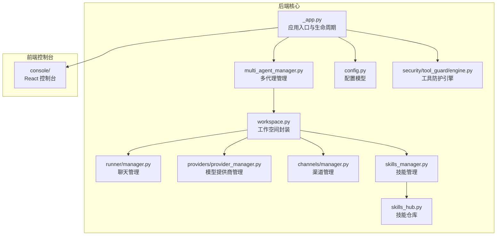
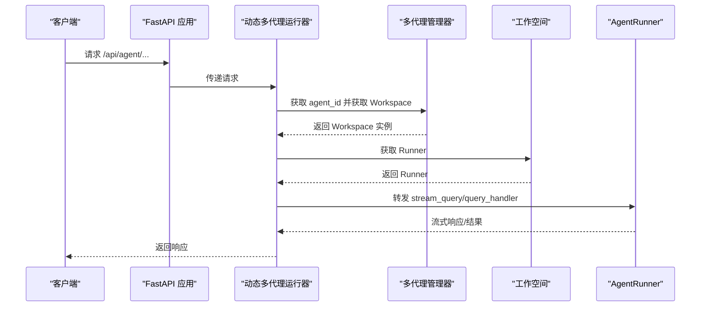
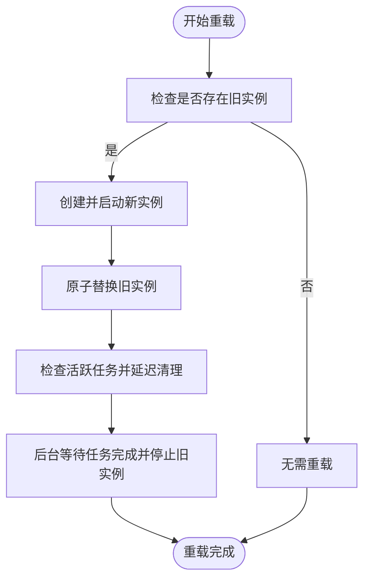
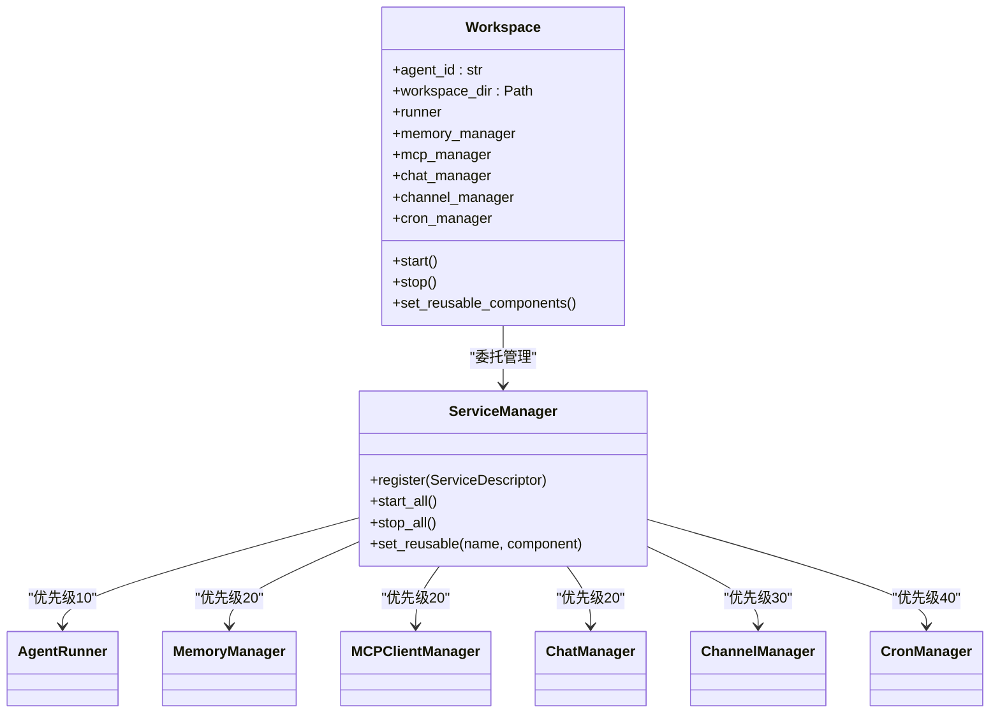
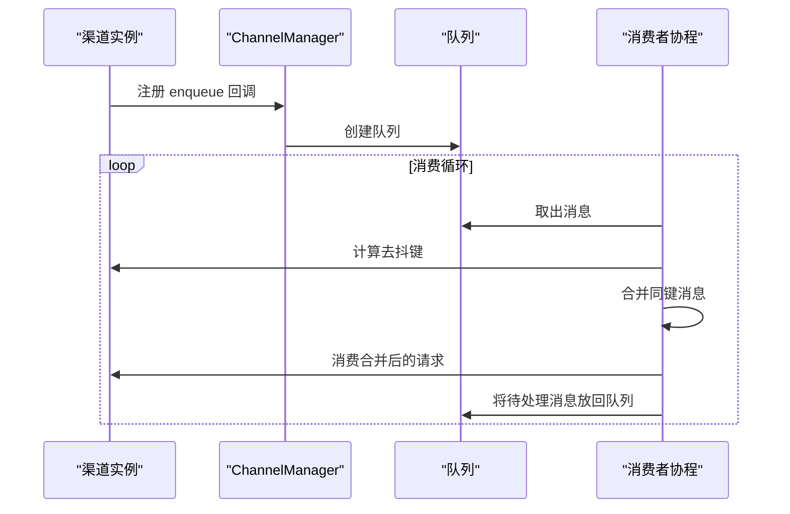
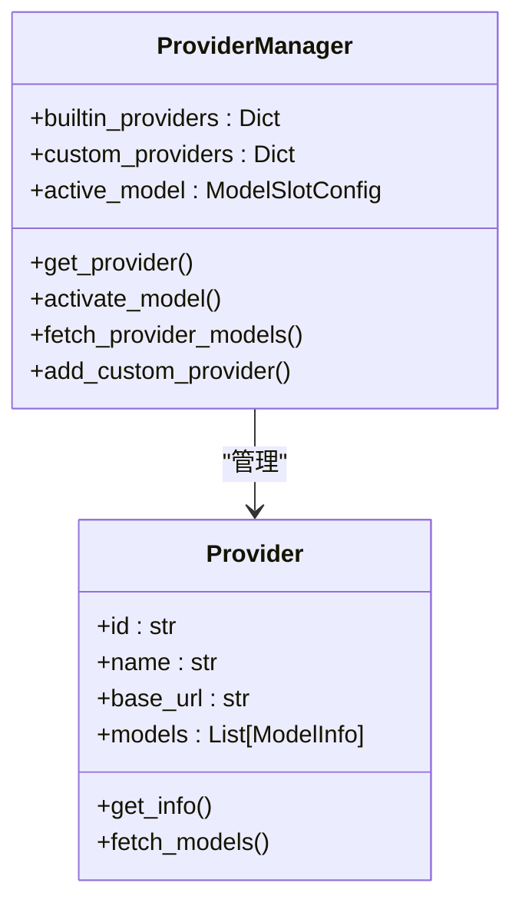
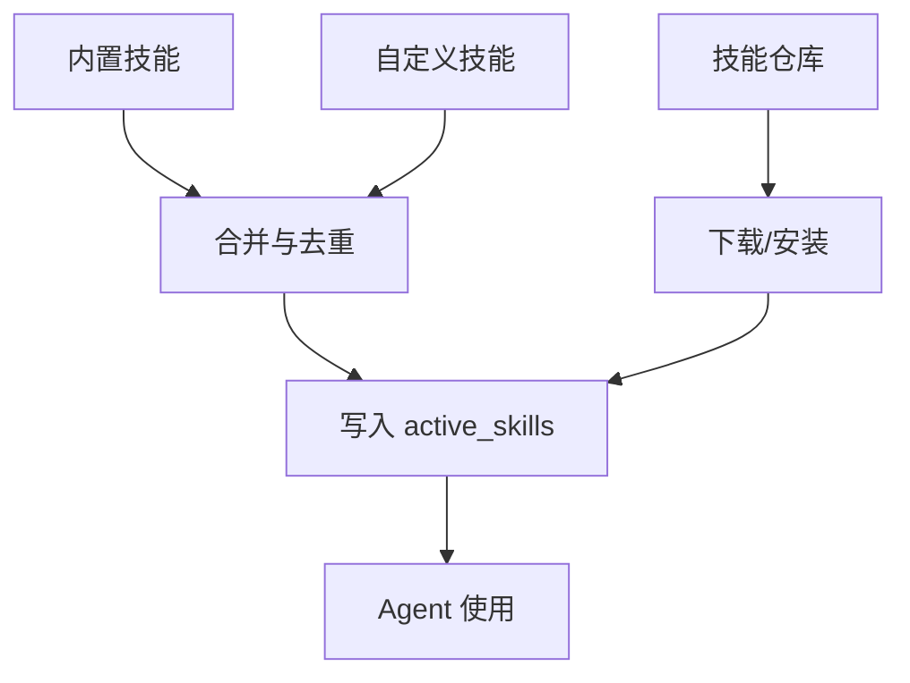
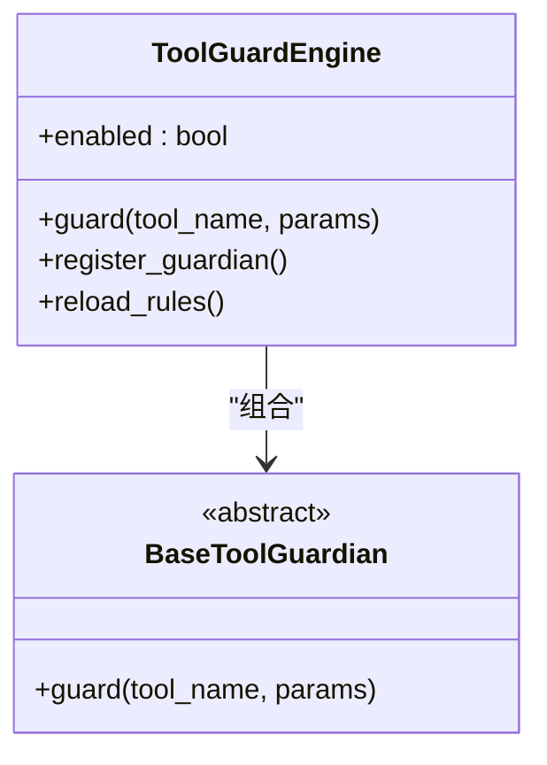
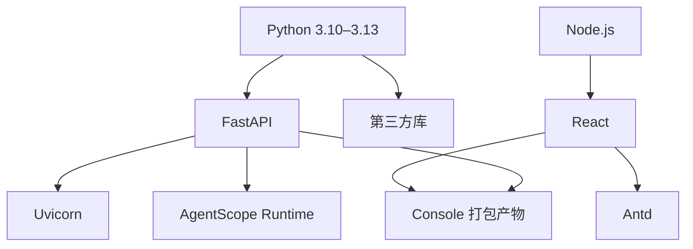

# 系统架构设计

<cite>
**本文档引用的文件**
- [README.md](file://README.md)
- [__init__.py](file://src/copaw/__init__.py)
- [__main__.py](file://src/copaw/__main__.py)
- [pyproject.toml](file://pyproject.toml)
- [package.json](file://console/package.json)
- [_app.py](file://src/copaw/app/_app.py)
- [multi_agent_manager.py](file://src/copaw/app/multi_agent_manager.py)
- [workspace.py](file://src/copaw/app/workspace/workspace.py)
- [manager.py](file://src/copaw/app/runner/manager.py)
- [config.py](file://src/copaw/config/config.py)
- [provider_manager.py](file://src/copaw/providers/provider_manager.py)
- [manager.py](file://src/copaw/app/channels/manager.py)
- [skills_manager.py](file://src/copaw/agents/skills_manager.py)
- [skills_hub.py](file://src/copaw/agents/skills_hub.py)
- [engine.py](file://src/copaw/security/tool_guard/engine.py)
</cite>

## 目录
1. [引言](#引言)
2. [项目结构](#项目结构)
3. [核心组件](#核心组件)
4. [架构总览](#架构总览)
5. [详细组件分析](#详细组件分析)
6. [依赖关系分析](#依赖关系分析)
7. [性能考量](#性能考量)
8. [故障排除指南](#故障排除指南)
9. [结论](#结论)
10. [附录](#附录)

## 引言
本系统是一个个人智能助手平台，支持多渠道接入（如钉钉、飞书、QQ、Discord、iMessage 等），具备多代理管理、技能系统、工具防护与 MCP 客户端管理能力。系统采用前后端分离架构：后端基于 FastAPI 提供统一 API 服务，前端使用 React 构建控制台界面；运行时基于 AgentScope Runtime，通过动态多代理路由实现多租户隔离与零停机热重载。

## 项目结构
项目采用分层与功能域结合的组织方式：
- 后端核心：src/copaw 下按领域划分模块（app、agents、providers、config、security 等）
- 前端控制台：console 目录，构建产物打包到后端包内
- 部署与打包：deploy、scripts 提供容器化与安装脚本
- 文档与网站：website 提供静态站点文档

图表来源
- [_app.py:149-241](file://src/copaw/app/_app.py#L149-L241)
- [multi_agent_manager.py:17-33](file://src/copaw/app/multi_agent_manager.py#L17-L33)
- [workspace.py:39-77](file://src/copaw/app/workspace/workspace.py#L39-L77)
- [manager.py:17-41](file://src/copaw/app/runner/manager.py#L17-L41)
- [config.py:519-560](file://src/copaw/config/config.py#L519-L560)
- [provider_manager.py:573-624](file://src/copaw/providers/provider_manager.py#L573-L624)
- [manager.py:114-134](file://src/copaw/app/channels/manager.py#L114-L134)
- [skills_manager.py:654-724](file://src/copaw/agents/skills_manager.py#L654-L724)
- [skills_hub.py:1-120](file://src/copaw/agents/skills_hub.py#L1-L120)
- [engine.py:53-82](file://src/copaw/security/tool_guard/engine.py#L53-L82)

章节来源
- [README.md:1-120](file://README.md#L1-L120)
- [pyproject.toml:1-60](file://pyproject.toml#L1-L60)
- [package.json:1-60](file://console/package.json#L1-L60)

## 核心组件
- 多代理管理器（MultiAgentManager）：负责多个 Agent 工作空间的懒加载、生命周期管理与零停机热重载
- 工作空间（Workspace）：封装单个 Agent 的完整运行时组件（Runner、ChannelManager、MemoryManager、MCPClientManager、CronManager）
- 聊天管理（ChatManager）：负责聊天规格的持久化与查询
- 渠道管理（ChannelManager）：统一处理多渠道消息入队、去抖、合并与消费
- 模型提供商管理（ProviderManager）：内置多家云模型与本地模型（llama.cpp、MLX、Ollama）的注册与发现
- 技能管理（SkillService）：内置/自定义/激活技能的同步与版本管理
- 工具防护引擎（ToolGuardEngine）：对工具调用进行规则与路径级安全检查
- 应用入口（FastAPI + AgentApp）：统一路由、中间件、静态资源与生命周期管理

章节来源
- [multi_agent_manager.py:17-82](file://src/copaw/app/multi_agent_manager.py#L17-L82)
- [workspace.py:39-122](file://src/copaw/app/workspace/workspace.py#L39-L122)
- [manager.py:17-82](file://src/copaw/app/runner/manager.py#L17-L82)
- [manager.py:114-165](file://src/copaw/app/channels/manager.py#L114-L165)
- [provider_manager.py:573-624](file://src/copaw/providers/provider_manager.py#L573-L624)
- [skills_manager.py:654-724](file://src/copaw/agents/skills_manager.py#L654-L724)
- [engine.py:53-82](file://src/copaw/security/tool_guard/engine.py#L53-L82)
- [_app.py:149-241](file://src/copaw/app/_app.py#L149-L241)

## 架构总览
系统采用“动态多代理 + 统一运行时”的架构模式：
- 动态多代理路由：根据请求头中的 Agent ID 动态选择对应 Workspace 的 Runner
- 统一运行时：AgentApp 将所有 Agent 的请求统一交由 Runner 处理，实现共享资源与独立隔离并存
- 生命周期管理：应用启动时初始化 MultiAgentManager 并并发启动所有已配置 Agent；关闭时优雅停止

图表来源
- [_app.py:49-146](file://src/copaw/app/_app.py#L49-L146)
- [multi_agent_manager.py:34-82](file://src/copaw/app/multi_agent_manager.py#L34-L82)
- [workspace.py:80-114](file://src/copaw/app/workspace/workspace.py#L80-L114)

## 详细组件分析

### 多代理管理与零停机热重载
- 懒加载：首次请求某 Agent 时才创建并启动其 Workspace
- 原子替换：新实例完全启动后再原子替换旧实例，确保请求不中断
- 延迟清理：若旧实例仍有活跃任务，后台等待完成后停止，避免资源泄漏
- 并发启动：应用启动时并发启动所有已配置 Agent，提升可用性

图表来源
- [multi_agent_manager.py:200-311](file://src/copaw/app/multi_agent_manager.py#L200-L311)

章节来源
- [multi_agent_manager.py:17-451](file://src/copaw/app/multi_agent_manager.py#L17-L451)

### 工作空间组件装配
- 服务管理器（ServiceManager）：声明式注册各组件（Runner、MemoryManager、MCPClientManager、ChatManager、ChannelManager、CronManager），支持并发初始化与可复用组件
- 可复用组件：在热重载时可保留 MemoryManager、ChatManager 等，减少重启成本
- 启停顺序：先启动 Runner，再启动 Channel/Cron 等外部服务，最后启动配置监听器

图表来源
- [workspace.py:39-277](file://src/copaw/app/workspace/workspace.py#L39-L277)

章节来源
- [workspace.py:134-367](file://src/copaw/app/workspace/workspace.py#L134-L367)

### 渠道适配器与消息处理
- 统一队列与消费者：每个渠道拥有独立队列与固定数量的消费者，按会话键去抖与合并
- 去抖与合并：同一会话的消息在处理中被合并，避免重复与乱序
- 替换与热更新：支持在不重启应用的情况下替换某个渠道实例

图表来源
- [manager.py:322-382](file://src/copaw/app/channels/manager.py#L322-L382)
- [manager.py:427-580](file://src/copaw/app/channels/manager.py#L427-L580)

章节来源
- [manager.py:114-580](file://src/copaw/app/channels/manager.py#L114-L580)

### 模型提供商与多模态能力
- 内置提供商：OpenAI、Azure OpenAI、Anthropic、Gemini、DashScope、ModelScope、Kimi、DeepSeek、MiniMax 等
- 本地模型：llama.cpp、MLX、Ollama、LM Studio
- 自动探测：对非本地模型自动探测图像/视频支持能力
- 激活与切换：通过 ProviderManager 激活当前模型槽位，支持多 Agent 独立配置

图表来源
- [provider_manager.py:573-800](file://src/copaw/providers/provider_manager.py#L573-L800)

章节来源
- [provider_manager.py:1-1126](file://src/copaw/providers/provider_manager.py#L1-L1126)

### 技能系统与技能仓库
- 技能来源：内置技能目录、自定义技能目录、激活技能目录（active_skills）
- 同步策略：自定义覆盖内置，支持强制覆盖与版本比较
- Hub 集成：支持从技能仓库下载、安装与取消导入
- 导入校验：ZIP 安全解压、隐藏文件过滤、路径合法性检查

图表来源
- [skills_manager.py:210-287](file://src/copaw/agents/skills_manager.py#L210-L287)
- [skills_hub.py:226-335](file://src/copaw/agents/skills_hub.py#L226-L335)

章节来源
- [skills_manager.py:1-1233](file://src/copaw/agents/skills_manager.py#L1-L1233)
- [skills_hub.py:1-800](file://src/copaw/agents/skills_hub.py#L1-L800)

### 工具防护与安全
- 防护引擎：默认启用，支持规则与路径双重检查
- 可插拔守护者：规则守护者与文件路径守护者
- 禁用与白名单：可通过环境变量或配置控制是否启用及受保护工具集

图表来源
- [engine.py:53-164](file://src/copaw/security/tool_guard/engine.py#L53-L164)

章节来源
- [engine.py:1-238](file://src/copaw/security/tool_guard/engine.py#L1-L238)

### 配置与运行时行为
- 配置模型：ChannelConfig、AgentsConfig、ToolsConfig、MCPConfig 等
- 运行时参数：最大迭代次数、LLM 重试策略、记忆压缩阈值、令牌计数策略等
- 语言与音频模式：支持多语言与音频转写策略

章节来源
- [config.py:31-590](file://src/copaw/config/config.py#L31-L590)
- [config.py:591-1196](file://src/copaw/config/config.py#L591-L1196)

## 依赖关系分析
- 技术栈：Python 3.10–3.13、FastAPI、Uvicorn、AgentScope Runtime、React、Ant Design
- 第三方库：discord.py、dingtalk-stream、apscheduler、playwright、python-socks、twilio、matrix-nio、paho-mqtt、google-genai 等
- 可选依赖：llama-cpp-python、mlx-lm、ollama、openai-whisper 等
- 前端依赖：@agentscope-ai/chat、antd、react-router-dom、zustand 等

图表来源
- [pyproject.toml:6-37](file://pyproject.toml#L6-L37)
- [package.json:18-40](file://console/package.json#L18-L40)

章节来源
- [pyproject.toml:1-101](file://pyproject.toml#L1-L101)
- [package.json:1-60](file://console/package.json#L1-L60)

## 性能考量
- 并发与异步：多代理管理器与渠道消费者均采用 asyncio，最大化并发吞吐
- 零停机重载：通过新旧实例原子替换与延迟清理，保证服务连续性
- 缓存与探测：模型提供商支持自动探测多模态能力，减少无效调用
- 队列与去抖：渠道消息按会话键合并，降低重复处理开销
- 静态资源：前端构建产物直接打包进后端包，减少 CDN 依赖

## 故障排除指南
- 日志与追踪：应用启动时设置日志级别，并在生命周期钩子里记录关键事件
- Telemetry：首次升级时收集匿名使用数据，便于定位问题与优化
- 常见问题：
  - 渠道连接失败：检查渠道配置与网络代理设置
  - LLM 调用超时：调整重试次数与退避策略
  - 技能导入失败：检查 ZIP 文件完整性与路径合法性
  - 工具调用被拒绝：查看工具防护规则与路径限制

章节来源
- [_app.py:149-241](file://src/copaw/app/_app.py#L149-L241)
- [README.md:468-484](file://README.md#L468-L484)

## 结论
该系统以“动态多代理 + 统一运行时”为核心，结合完善的渠道适配、技能系统与安全防护，实现了高可用、可扩展且易维护的个人智能助手平台。通过零停机热重载与并发启动策略，系统在上线与运维过程中具备良好的连续性；通过可插拔的安全与模型管理机制，满足不同场景下的定制化需求。

## 附录
- 部署拓扑建议：
  - 单机部署：Docker 或本地安装，适合个人与小团队
  - 云原生部署：结合容器编排与持久化存储，支持水平扩展
- 可扩展性：
  - 新增渠道：遵循 BaseChannel 接口，注册到渠道注册表
  - 新增模型：通过 ProviderManager 注册新提供商或本地后端
  - 新增技能：在自定义目录编写 SKILL.md 并通过 SkillService 管理
- 安全与合规：
  - 工具防护：默认启用，支持规则与路径检查
  - 数据隔离：多代理工作空间相互隔离，权限最小化
  - 审计日志：关键操作与错误信息记录在应用日志中