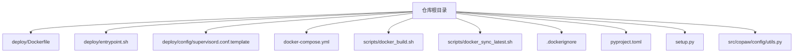
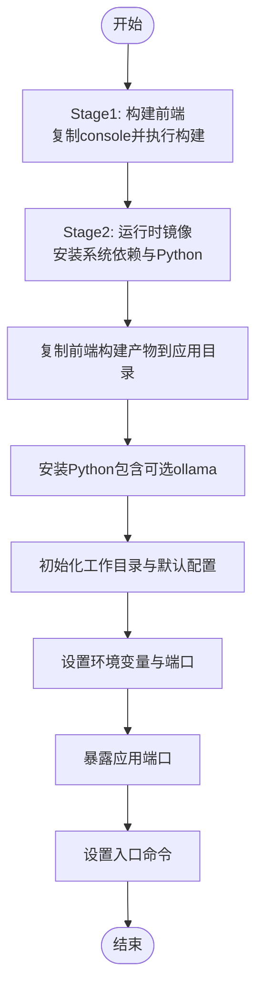
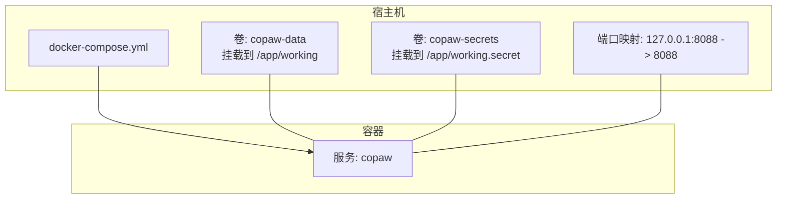
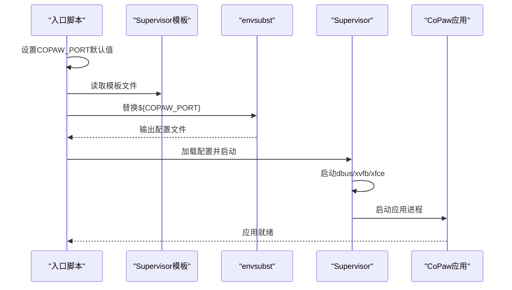
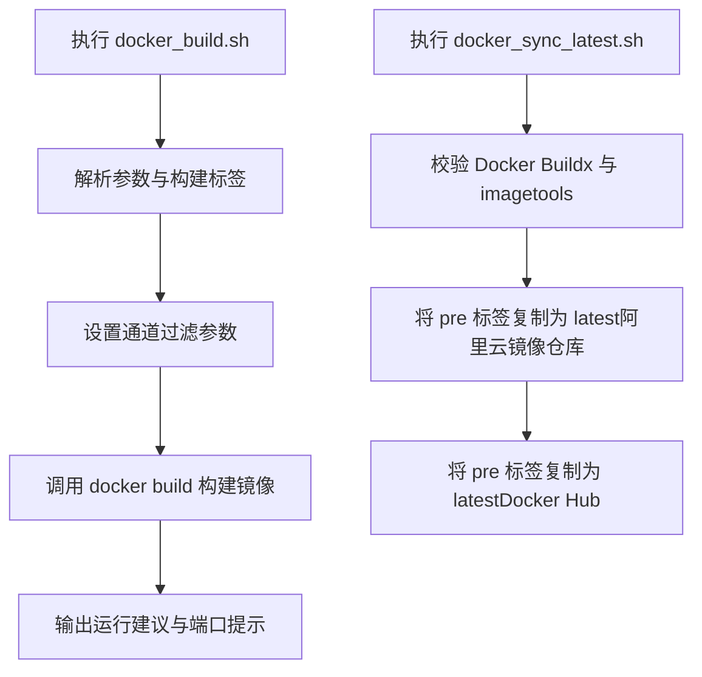
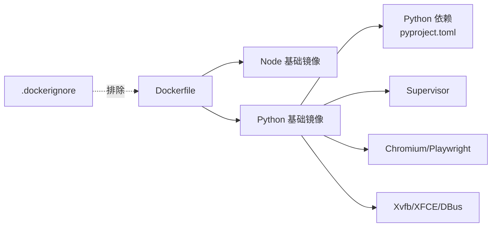

# Docker容器化部署

<cite>
**本文引用的文件**
- [deploy/Dockerfile](file://deploy/Dockerfile)
- [docker-compose.yml](file://docker-compose.yml)
- [deploy/entrypoint.sh](file://deploy/entrypoint.sh)
- [deploy/config/supervisord.conf.template](file://deploy/config/supervisord.conf.template)
- [scripts/docker_build.sh](file://scripts/docker_build.sh)
- [scripts/docker_sync_latest.sh](file://scripts/docker_sync_latest.sh)
- [.dockerignore](file://.dockerignore)
- [pyproject.toml](file://pyproject.toml)
- [setup.py](file://setup.py)
- [src/copaw/config/utils.py](file://src/copaw/config/utils.py)
</cite>

## 目录
1. [简介](#简介)
2. [项目结构](#项目结构)
3. [核心组件](#核心组件)
4. [架构总览](#架构总览)
5. [详细组件分析](#详细组件分析)
6. [依赖关系分析](#依赖关系分析)
7. [性能考虑](#性能考虑)
8. [故障排查指南](#故障排查指南)
9. [结论](#结论)
10. [附录](#附录)

## 简介
本文件面向运维与开发人员，提供CoPaw项目的Docker容器化部署完整指南。内容涵盖镜像构建（含多阶段构建与参数化）、docker-compose编排、Supervisor进程管理、日志与端口配置、数据卷与网络策略、以及镜像版本同步与发布流程。读者可据此在本地或生产环境中稳定运行CoPaw控制台与应用服务。

## 项目结构
与容器化部署直接相关的目录与文件如下：
- 镜像构建：deploy/Dockerfile、deploy/entrypoint.sh、deploy/config/supervisord.conf.template
- 编排配置：docker-compose.yml
- 构建脚本：scripts/docker_build.sh、scripts/docker_sync_latest.sh
- 排除规则：.dockerignore
- 包与依赖：pyproject.toml、setup.py
- 运行时检测：src/copaw/config/utils.py



图表来源
- [deploy/Dockerfile:1-103](file://deploy/Dockerfile#L1-L103)
- [docker-compose.yml:1-23](file://docker-compose.yml#L1-L23)
- [deploy/entrypoint.sh:1-10](file://deploy/entrypoint.sh#L1-L10)
- [deploy/config/supervisord.conf.template:1-40](file://deploy/config/supervisord.conf.template#L1-L40)
- [scripts/docker_build.sh:1-32](file://scripts/docker_build.sh#L1-L32)
- [scripts/docker_sync_latest.sh:1-77](file://scripts/docker_sync_latest.sh#L1-L77)
- [.dockerignore:1-59](file://.dockerignore#L1-L59)
- [pyproject.toml:1-102](file://pyproject.toml#L1-L102)
- [setup.py:1-5](file://setup.py#L1-L5)
- [src/copaw/config/utils.py:366-397](file://src/copaw/config/utils.py#L366-L397)

章节来源
- [deploy/Dockerfile:1-103](file://deploy/Dockerfile#L1-L103)
- [docker-compose.yml:1-23](file://docker-compose.yml#L1-L23)

## 核心组件
- 多阶段Dockerfile：前端构建与后端打包分离，减少最终镜像体积并提升安全性。
- Supervisor进程管理：统一启动DBus、Xvfb、XFCE桌面会话与CoPaw应用进程，并自动拉起失败任务。
- 入口脚本：动态替换Supervisor配置中的端口变量，确保容器内端口可配置。
- docker-compose编排：持久化工作目录与密钥目录，绑定主机端口到容器内部端口，设置重启策略。
- 构建脚本：封装镜像构建参数（通道过滤、端口等），支持自定义标签与额外构建参数。
- 版本同步脚本：通过Buildx镜像工具将“预发布”标签升级为“latest”。

章节来源
- [deploy/Dockerfile:1-103](file://deploy/Dockerfile#L1-L103)
- [deploy/config/supervisord.conf.template:1-40](file://deploy/config/supervisord.conf.template#L1-L40)
- [deploy/entrypoint.sh:1-10](file://deploy/entrypoint.sh#L1-L10)
- [docker-compose.yml:1-23](file://docker-compose.yml#L1-L23)
- [scripts/docker_build.sh:1-32](file://scripts/docker_build.sh#L1-L32)
- [scripts/docker_sync_latest.sh:1-77](file://scripts/docker_sync_latest.sh#L1-L77)

## 架构总览
下图展示容器启动时的关键交互：入口脚本注入端口变量，Supervisor按优先级启动系统服务与应用；应用监听指定端口并通过Playwright使用系统Chromium。

```mermaid
graph TB
subgraph "容器"
EP["入口脚本<br/>entrypoint.sh"] --> SV["Supervisor<br/>supervisord.conf.template"]
SV --> DB["DBus 进程"]
SV --> XV["Xvfb 进程"]
SV --> XF["XFCE 桌面进程"]
SV --> APP["CoPaw 应用进程<br/>copaw app --host 0.0.0.0 --port ${COPAW_PORT}"]
end
subgraph "宿主机"
PORT["宿主机端口映射<br/>127.0.0.1:8088:8088"]
end
PORT <- --> APP
```

图表来源
- [deploy/entrypoint.sh:1-10](file://deploy/entrypoint.sh#L1-L10)
- [deploy/config/supervisord.conf.template:1-40](file://deploy/config/supervisord.conf.template#L1-L40)
- [docker-compose.yml:14-15](file://docker-compose.yml#L14-L15)

## 详细组件分析

### Dockerfile 多阶段构建与配置项
- 前端构建阶段（console-builder）：基于Node基础镜像，安装依赖并执行构建，产物输出至dist目录。
- 运行时阶段：安装Python、Chromium、Supervisor等运行时依赖；启用无沙箱模式以适配容器环境；复制前端构建产物；安装Python包（含可选的ollama支持）；初始化工作目录与默认配置；暴露应用端口并设置入口命令。
- 关键构建参数与环境变量：
  - 通道过滤：COPAW_DISABLED_CHANNELS（黑名单，推荐）与COPAW_ENABLED_CHANNELS（白名单）。两者同时设置时白名单优先。
  - 端口：COPAW_PORT，默认8088，可通过容器运行时覆盖。
  - 容器标识：COPAW_RUNNING_IN_CONTAINER=1，用于运行时行为调整（如Chromium无沙箱）。
- 运行时依赖与环境：
  - Chromium与Playwright：通过环境变量指向系统Chromium并禁用自动下载浏览器。
  - X11虚拟帧缓冲与桌面：Xvfb、XFCE、DBus，配合DISPLAY=:1提供图形界面能力。



图表来源
- [deploy/Dockerfile:1-103](file://deploy/Dockerfile#L1-L103)

章节来源
- [deploy/Dockerfile:1-103](file://deploy/Dockerfile#L1-L103)
- [src/copaw/config/utils.py:342-347](file://src/copaw/config/utils.py#L342-L347)

### docker-compose.yml 编排配置
- 数据卷：
  - copaw-data：挂载至/app/working，存放工作区配置与数据。
  - copaw-secrets：挂载至/app/working.secret，存放敏感配置与密钥。
- 网络与端口：
  - 将宿主机127.0.0.1:8088映射到容器内部8088端口，限制仅本地访问。
- 重启策略：
  - restart: always，保证容器异常退出后自动恢复。
- 可选环境变量：
  - 可通过environment字段开启认证（如用户名/密码）等高级功能。



图表来源
- [docker-compose.yml:3-23](file://docker-compose.yml#L3-L23)

章节来源
- [docker-compose.yml:1-23](file://docker-compose.yml#L1-L23)

### 入口脚本与Supervisor配置
- 入口脚本职责：
  - 设置COPAW_PORT默认值（若未提供则使用8088）。
  - 使用envsubst将模板中的${COPAW_PORT}替换为实际值。
  - 启动Supervisor，加载生成后的配置。
- Supervisor配置要点：
  - supervisord：以非守护进程模式运行，集中管理子进程。
  - dbus：系统总线，供桌面与Chromium使用。
  - xvfb：虚拟显示设备，提供无头图形环境。
  - xfce：桌面环境，等待Xvfb可用后启动。
  - app：CoPaw应用，监听0.0.0.0与指定端口，设置DISPLAY与Chromium路径等环境变量。



图表来源
- [deploy/entrypoint.sh:1-10](file://deploy/entrypoint.sh#L1-L10)
- [deploy/config/supervisord.conf.template:1-40](file://deploy/config/supervisord.conf.template#L1-L40)

章节来源
- [deploy/entrypoint.sh:1-10](file://deploy/entrypoint.sh#L1-L10)
- [deploy/config/supervisord.conf.template:1-40](file://deploy/config/supervisord.conf.template#L1-L40)

### 构建脚本与版本同步策略
- docker_build.sh：
  - 支持传入镜像标签与额外构建参数（如--no-cache）。
  - 通过构建参数控制通道过滤（COPAW_DISABLED_CHANNELS/COPAW_ENABLED_CHANNELS）。
  - 默认端口提示与运行示例输出。
- docker_sync_latest.sh：
  - 通过Docker Buildx与imagetools将“pre”标签复制为“latest”，分别推送至阿里云镜像仓库与Docker Hub。
  - 自动安装/校验buildx插件与imagetools能力。



图表来源
- [scripts/docker_build.sh:1-32](file://scripts/docker_build.sh#L1-L32)
- [scripts/docker_sync_latest.sh:1-77](file://scripts/docker_sync_latest.sh#L1-L77)

章节来源
- [scripts/docker_build.sh:1-32](file://scripts/docker_build.sh#L1-L32)
- [scripts/docker_sync_latest.sh:1-77](file://scripts/docker_sync_latest.sh#L1-L77)

### 运行时环境变量与容器检测
- 环境变量：
  - COPAW_PORT：应用监听端口，默认8088。
  - COPAW_DISABLED_CHANNELS / COPAW_ENABLED_CHANNELS：通道白/黑名单，白名单优先。
  - COPAW_RUNNING_IN_CONTAINER：标记容器运行环境，影响Chromium等行为。
- 容器检测：
  - 运行时可通过环境变量或探测文件系统判断是否处于容器中，便于条件化配置。

章节来源
- [deploy/Dockerfile:14-25](file://deploy/Dockerfile#L14-L25)
- [deploy/Dockerfile:74-78](file://deploy/Dockerfile#L74-L78)
- [src/copaw/config/utils.py:366-397](file://src/copaw/config/utils.py#L366-L397)

## 依赖关系分析
- 构建期依赖：Node基础镜像用于前端构建；Python基础镜像用于后端打包。
- 运行期依赖：Python运行时、Chromium、Supervisor、Xvfb、XFCE、DBus等。
- 包管理：pyproject.toml声明主依赖与可选特性（如ollama、llamacpp、whisper等），setup.py作为打包入口。
- 构建排除：.dockerignore避免将测试、IDE缓存、Node模块与日志等带入镜像，仅保留必要的前端dist。



图表来源
- [deploy/Dockerfile:1-103](file://deploy/Dockerfile#L1-L103)
- [.dockerignore:1-59](file://.dockerignore#L1-L59)
- [pyproject.toml:1-102](file://pyproject.toml#L1-L102)
- [setup.py:1-5](file://setup.py#L1-L5)

章节来源
- [.dockerignore:1-59](file://.dockerignore#L1-L59)
- [pyproject.toml:1-102](file://pyproject.toml#L1-L102)
- [setup.py:1-5](file://setup.py#L1-L5)

## 性能考虑
- 多阶段构建：分离前端构建与运行时镜像，显著减小最终镜像体积，缩短拉取时间。
- 无沙箱Chromium：容器内启用无沙箱模式，降低安全风险但提升兼容性；建议结合网络隔离与最小权限原则。
- 进程管理：Supervisor统一管理多个进程，避免僵尸进程与资源泄漏；优先级设置确保关键服务先启动。
- 端口与网络：仅映射必要端口，限制外网访问；通过本地回环绑定减少暴露面。
- 日志：各进程独立日志文件，便于定位问题；建议结合外部日志收集系统集中存储。

## 故障排查指南
- 应用无法访问或端口不通
  - 检查docker-compose端口映射是否正确（宿主机127.0.0.1:8088）。
  - 确认COPAW_PORT是否被覆盖且与映射一致。
  - 查看Supervisor日志：/var/log/app.err.log、/var/log/supervisord.log。
- 图形界面相关错误
  - 确认Xvfb已启动且DISPLAY=:1可用。
  - 检查Chromium路径与PLAYWRIGHT_CHROMIUM_EXECUTABLE_PATH环境变量。
- 进程异常退出
  - 查看Supervisor配置中各program的stderr_logfile与autorestart设置。
  - 确保容器内时钟同步与网络连通性。
- 通道不可用或被过滤
  - 检查COPAW_ENABLED_CHANNELS与COPAW_DISABLED_CHANNELS的设置与优先级。
  - 若同时设置，白名单优先生效。
- 镜像构建失败
  - 检查构建参数（通道过滤、额外构建参数）与网络代理。
  - 使用--no-cache重新构建以排除缓存影响。
- 版本标签未更新
  - 确认Docker Buildx与imagetools可用。
  - 检查镜像仓库凭证与网络连通性。

章节来源
- [deploy/config/supervisord.conf.template:1-40](file://deploy/config/supervisord.conf.template#L1-L40)
- [deploy/entrypoint.sh:1-10](file://deploy/entrypoint.sh#L1-L10)
- [docker-compose.yml:14-15](file://docker-compose.yml#L14-L15)
- [scripts/docker_build.sh:1-32](file://scripts/docker_build.sh#L1-L32)
- [scripts/docker_sync_latest.sh:1-77](file://scripts/docker_sync_latest.sh#L1-L77)
- [src/copaw/config/utils.py:342-347](file://src/copaw/config/utils.py#L342-L347)

## 结论
通过多阶段Dockerfile、Supervisor进程管理与docker-compose编排，CoPaw可在容器中稳定运行并提供图形化桌面与多通道能力。合理设置端口、通道过滤与数据卷，结合版本同步脚本，可实现从构建到发布的自动化流程。建议在生产环境中进一步强化网络安全、日志监控与备份策略。

## 附录

### 容器启动、停止、重启操作流程
- 启动
  - 使用docker-compose启动：docker compose up -d
  - 或使用docker run（单容器场景）：docker run -d --restart always -p 127.0.0.1:8088:8088 copaw:latest
- 停止
  - docker compose stop 或 docker stop copaw
- 重启
  - docker compose restart 或 docker restart copaw

章节来源
- [docker-compose.yml:13-22](file://docker-compose.yml#L13-L22)

### 环境变量参考表
- COPAW_PORT：应用监听端口，默认8088
- COPAW_DISABLED_CHANNELS：通道黑名单（以逗号分隔）
- COPAW_ENABLED_CHANNELS：通道白名单（以逗号分隔）
- COPAW_RUNNING_IN_CONTAINER：容器运行标记（1/true/yes）

章节来源
- [deploy/Dockerfile:14-25](file://deploy/Dockerfile#L14-L25)
- [deploy/Dockerfile:74-78](file://deploy/Dockerfile#L74-L78)
- [src/copaw/config/utils.py:342-347](file://src/copaw/config/utils.py#L342-L347)