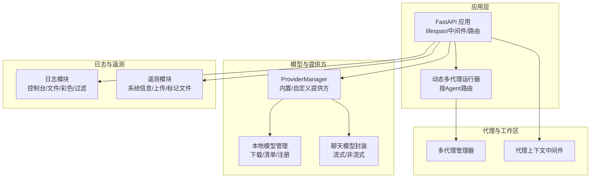
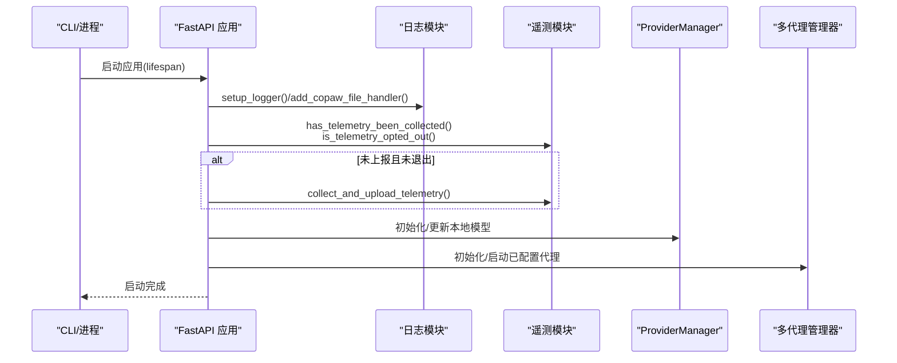
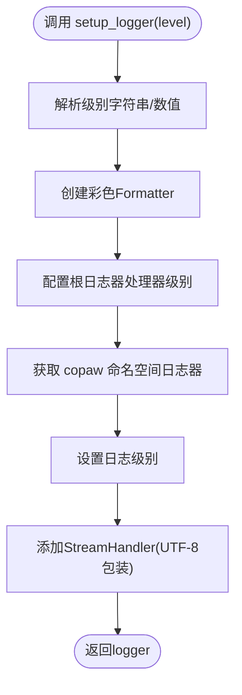
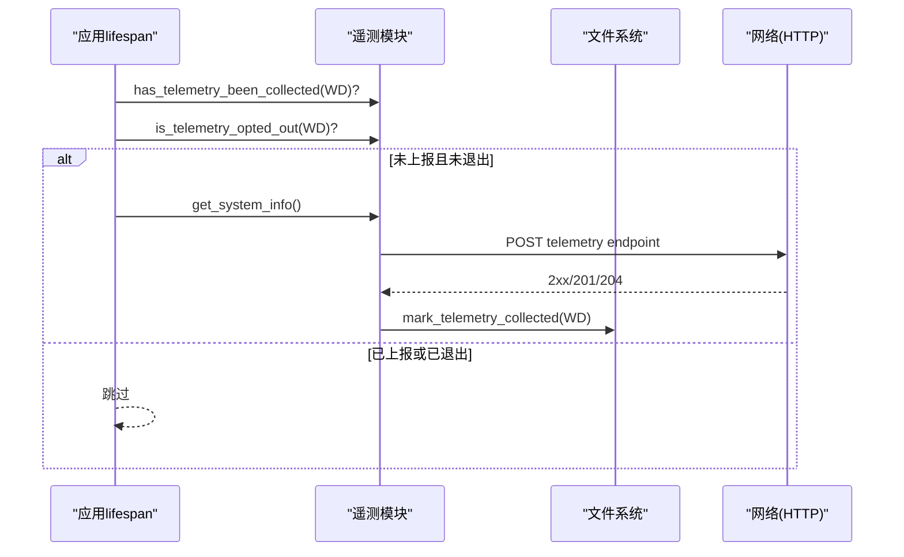
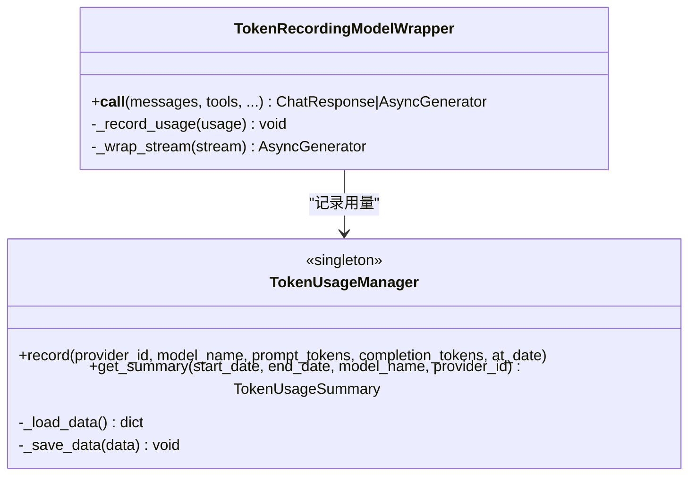
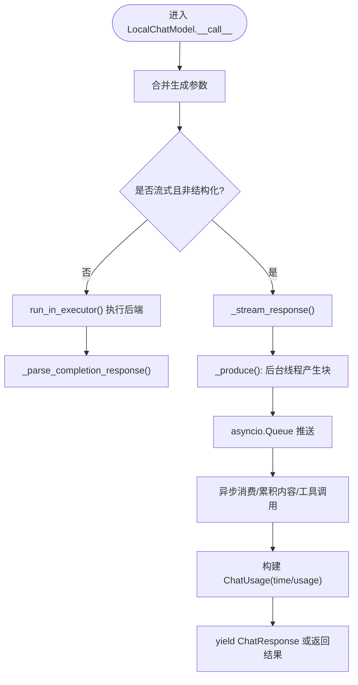
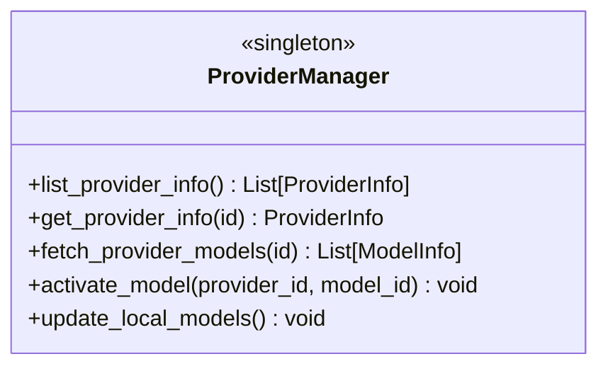
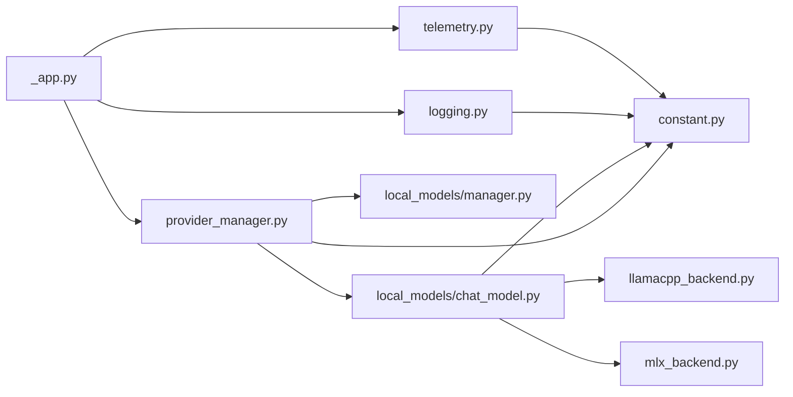

# 性能监控与优化

<cite>
**本文引用的文件**
- [src/copaw/utils/logging.py](file://src/copaw/utils/logging.py)
- [src/copaw/utils/telemetry.py](file://src/copaw/utils/telemetry.py)
- [src/copaw/token_usage/manager.py](file://src/copaw/token_usage/manager.py)
- [src/copaw/token_usage/model_wrapper.py](file://src/copaw/token_usage/model_wrapper.py)
- [src/copaw/local_models/chat_model.py](file://src/copaw/local_models/chat_model.py)
- [src/copaw/local_models/manager.py](file://src/copaw/local_models/manager.py)
- [src/copaw/local_models/backends/llamacpp_backend.py](file://src/copaw/local_models/backends/llamacpp_backend.py)
- [src/copaw/local_models/backends/mlx_backend.py](file://src/copaw/local_models/backends/mlx_backend.py)
- [src/copaw/app/_app.py](file://src/copaw/app/_app.py)
- [src/copaw/constant.py](file://src/copaw/constant.py)
- [src/copaw/providers/provider_manager.py](file://src/copaw/providers/provider_manager.py)
- [src/copaw/cli/main.py](file://src/copaw/cli/main.py)
</cite>

## 目录
1. [简介](#简介)
2. [项目结构](#项目结构)
3. [核心组件](#核心组件)
4. [架构总览](#架构总览)
5. [详细组件分析](#详细组件分析)
6. [依赖关系分析](#依赖关系分析)
7. [性能考量](#性能考量)
8. [故障排查指南](#故障排查指南)
9. [结论](#结论)
10. [附录](#附录)

## 简介
本文件面向CoPaw项目的性能监控与优化，聚焦以下目标：
- 日志系统：配置与使用（级别、轮转、集中化）
- 遥测数据：采集与分析（安装信息、使用统计、错误追踪）
- Token用量：统计、限额与成本控制
- 系统性能指标：CPU、内存、磁盘、网络
- 代理性能优化：推理优化、缓存、并发控制
- 故障诊断：慢查询、内存泄漏、死锁排查
- 基准测试与效果评估

## 项目结构
CoPaw后端采用FastAPI应用，结合多代理运行器、模型提供方管理与本地模型后端，形成“服务层-代理层-模型层”的分层架构。前端控制台通过静态资源提供，API路由统一由应用生命周期管理。

图示来源
- [src/copaw/app/_app.py:149-241](file://src/copaw/app/_app.py#L149-L241)
- [src/copaw/providers/provider_manager.py:573-800](file://src/copaw/providers/provider_manager.py#L573-L800)
- [src/copaw/local_models/manager.py:94-413](file://src/copaw/local_models/manager.py#L94-L413)
- [src/copaw/local_models/chat_model.py:39-362](file://src/copaw/local_models/chat_model.py#L39-L362)
- [src/copaw/utils/logging.py:104-185](file://src/copaw/utils/logging.py#L104-L185)
- [src/copaw/utils/telemetry.py:292-311](file://src/copaw/utils/telemetry.py#L292-L311)

章节来源
- [src/copaw/app/_app.py:149-241](file://src/copaw/app/_app.py#L149-L241)
- [src/copaw/constant.py:72-130](file://src/copaw/constant.py#L72-L130)

## 核心组件
- 日志系统：统一命名空间、彩色输出、控制台与文件处理器、访问日志过滤、跨平台轮转策略
- 遥测模块：安装方式识别、系统信息采集、GPU检测、同步上传、版本标记与退出策略
- Token用量：基于文件的聚合统计、按日期/模型/提供方汇总、异步读写与并发保护
- 本地模型：本地聊天模型封装、线程池执行、流式/非流式响应解析、后端抽象（llama.cpp/MLX）
- ProviderManager：内置/自定义提供方注册、模型发现、激活与探测、本地模型集成
- CLI与启动：延迟加载、初始化计时、日志级别注入、应用生命周期

章节来源
- [src/copaw/utils/logging.py:104-185](file://src/copaw/utils/logging.py#L104-L185)
- [src/copaw/utils/telemetry.py:292-311](file://src/copaw/utils/telemetry.py#L292-L311)
- [src/copaw/token_usage/manager.py:62-309](file://src/copaw/token_usage/manager.py#L62-L309)
- [src/copaw/token_usage/model_wrapper.py:15-71](file://src/copaw/token_usage/model_wrapper.py#L15-L71)
- [src/copaw/local_models/chat_model.py:39-362](file://src/copaw/local_models/chat_model.py#L39-L362)
- [src/copaw/providers/provider_manager.py:573-800](file://src/copaw/providers/provider_manager.py#L573-L800)
- [src/copaw/cli/main.py:55-90](file://src/copaw/cli/main.py#L55-L90)

## 架构总览
应用启动时在lifespan中完成日志初始化、遥测上报、迁移与多代理初始化，并挂载中间件与路由。动态运行器根据请求中的代理上下文选择对应工作区运行器，实现多租户/多代理隔离。

图示来源
- [src/copaw/app/_app.py:149-241](file://src/copaw/app/_app.py#L149-L241)
- [src/copaw/utils/telemetry.py:194-311](file://src/copaw/utils/telemetry.py#L194-L311)
- [src/copaw/providers/provider_manager.py:573-800](file://src/copaw/providers/provider_manager.py#L573-L800)

## 详细组件分析

### 日志系统
- 命名空间与级别：仅输出copaw命名空间日志，根日志器按平台设置不同阈值；支持字符串级别映射
- 控制台输出：彩色Formatter，自动检测TTY以启用ANSI颜色；路径相对化显示
- 文件输出：Windows/Linux使用FileHandler避免锁冲突；macOS使用RotatingFileHandler；重复添加幂等
- 访问日志过滤：可按路径子串抑制uvicorn访问日志，降低噪声
- 跨平台支持：Windows ANSI启用、UTF-8流包装stderr

图示来源
- [src/copaw/utils/logging.py:104-139](file://src/copaw/utils/logging.py#L104-L139)

章节来源
- [src/copaw/utils/logging.py:104-185](file://src/copaw/utils/logging.py#L104-L185)
- [src/copaw/constant.py:123-125](file://src/copaw/constant.py#L123-L125)

### 遥测数据
- 数据采集：安装方式、操作系统、Python版本、架构、GPU检测
- 上传策略：同步HTTP上传，失败静默不阻断；使用短超时
- 版本与退出策略：版本标记文件记录已采集版本列表；用户可永久退出
- 运行时机：应用启动lifespan中检查并上报一次

图示来源
- [src/copaw/app/_app.py:162-177](file://src/copaw/app/_app.py#L162-L177)
- [src/copaw/utils/telemetry.py:194-311](file://src/copaw/utils/telemetry.py#L194-L311)

章节来源
- [src/copaw/utils/telemetry.py:29-161](file://src/copaw/utils/telemetry.py#L29-L161)
- [src/copaw/utils/telemetry.py:163-182](file://src/copaw/utils/telemetry.py#L163-L182)
- [src/copaw/utils/telemetry.py:194-311](file://src/copaw/utils/telemetry.py#L194-L311)

### Token用量监控
- 统计维度：按日期、提供方、模型聚合；支持按时间范围与过滤条件查询
- 存储模型：Pydantic模型定义，JSON文件持久化；异步读写与文件锁
- 记录点：模型封装在每次调用后记录usage（prompt/completion/call）
- 汇总接口：按模型、提供方、日期生成汇总对象

图示来源
- [src/copaw/token_usage/manager.py:62-309](file://src/copaw/token_usage/manager.py#L62-L309)
- [src/copaw/token_usage/model_wrapper.py:15-71](file://src/copaw/token_usage/model_wrapper.py#L15-L71)

章节来源
- [src/copaw/token_usage/manager.py:19-60](file://src/copaw/token_usage/manager.py#L19-L60)
- [src/copaw/token_usage/manager.py:110-156](file://src/copaw/token_usage/manager.py#L110-L156)
- [src/copaw/token_usage/manager.py:198-294](file://src/copaw/token_usage/manager.py#L198-L294)
- [src/copaw/token_usage/model_wrapper.py:26-39](file://src/copaw/token_usage/model_wrapper.py#L26-L39)

### 本地模型推理与性能
- 封装层：LocalChatModel将后端抽象为统一接口，支持流式与非流式；内部记录耗时与usage
- 线程池：非流式调用在线程池执行，避免阻塞事件循环
- 流式处理：后台线程驱动同步迭代器，通过队列向异步消费者传递块
- 后端：llama.cpp/MLX分别适配消息规范化、采样参数、结构化输出提示

图示来源
- [src/copaw/local_models/chat_model.py:58-94](file://src/copaw/local_models/chat_model.py#L58-L94)
- [src/copaw/local_models/chat_model.py:96-258](file://src/copaw/local_models/chat_model.py#L96-L258)
- [src/copaw/local_models/chat_model.py:259-362](file://src/copaw/local_models/chat_model.py#L259-L362)

章节来源
- [src/copaw/local_models/chat_model.py:39-362](file://src/copaw/local_models/chat_model.py#L39-L362)
- [src/copaw/local_models/backends/llamacpp_backend.py:45-140](file://src/copaw/local_models/backends/llamacpp_backend.py#L45-L140)
- [src/copaw/local_models/backends/mlx_backend.py:57-236](file://src/copaw/local_models/backends/mlx_backend.py#L57-L236)

### ProviderManager与并发控制
- 提供方注册：内置/自定义提供方集合，支持模型发现与探测
- 并发模式：异步批量获取提供方信息；后台任务进行多模态探测
- 本地模型集成：自动更新本地模型清单与可用性
- 激活模型：保存当前激活槽位，触发自动探测

图示来源
- [src/copaw/providers/provider_manager.py:573-800](file://src/copaw/providers/provider_manager.py#L573-L800)

章节来源
- [src/copaw/providers/provider_manager.py:573-800](file://src/copaw/providers/provider_manager.py#L573-L800)

### CLI与启动性能
- 延迟加载：LazyGroup按需导入子命令，减少启动开销
- 初始化计时：记录各模块导入耗时，便于定位瓶颈
- 日志注入：app_cmd中重新记录初始化阶段日志，便于调试

章节来源
- [src/copaw/cli/main.py:55-90](file://src/copaw/cli/main.py#L55-L90)
- [src/copaw/cli/main.py:28-53](file://src/copaw/cli/main.py#L28-L53)

## 依赖关系分析
- 应用层依赖日志与遥测模块，在lifespan中完成初始化与上报
- ProviderManager依赖本地模型管理器与后端实现，负责模型发现与激活
- 本地模型封装依赖后端抽象，后端依赖第三方库（如llama-cpp-python、mlx-lm）
- Token用量模块依赖工作目录常量与文件系统

图示来源
- [src/copaw/app/_app.py:149-241](file://src/copaw/app/_app.py#L149-L241)
- [src/copaw/utils/logging.py:104-185](file://src/copaw/utils/logging.py#L104-L185)
- [src/copaw/utils/telemetry.py:292-311](file://src/copaw/utils/telemetry.py#L292-L311)
- [src/copaw/providers/provider_manager.py:573-800](file://src/copaw/providers/provider_manager.py#L573-L800)
- [src/copaw/local_models/chat_model.py:39-362](file://src/copaw/local_models/chat_model.py#L39-L362)
- [src/copaw/local_models/manager.py:94-413](file://src/copaw/local_models/manager.py#L94-L413)
- [src/copaw/local_models/backends/llamacpp_backend.py:45-140](file://src/copaw/local_models/backends/llamacpp_backend.py#L45-L140)
- [src/copaw/local_models/backends/mlx_backend.py:57-236](file://src/copaw/local_models/backends/mlx_backend.py#L57-L236)
- [src/copaw/constant.py:72-130](file://src/copaw/constant.py#L72-L130)

章节来源
- [src/copaw/constant.py:72-130](file://src/copaw/constant.py#L72-L130)

## 性能考量
- 日志级别与输出
  - 使用环境变量设置全局日志级别，生产建议INFO以上
  - 文件日志在Windows/Linux使用FileHandler避免锁争用；macOS使用RotatingFileHandler
  - 访问日志可通过过滤器抑制特定路径，降低I/O与噪声
- 遥测与上报
  - 上报超时极短，失败静默，不影响启动
  - 版本标记文件避免重复上报，支持降级重试
- Token用量
  - 异步读写与文件锁保证并发安全；建议定期归档/清理历史数据
  - 按模型/提供方/日期聚合，便于成本控制与限额预警
- 本地模型推理
  - 非流式调用在线程池执行，避免阻塞事件循环
  - 流式通过后台线程与队列解耦，注意队列容量与背压
  - 后端参数（如n_gpu_layers、采样参数）直接影响吞吐与延迟
- ProviderManager并发
  - 异步批量操作与后台探测，避免阻塞主流程
  - 激活模型后触发自动探测，减少UI误判
- CLI启动
  - 延迟加载与初始化计时，有助于定位启动慢问题

章节来源
- [src/copaw/utils/logging.py:104-185](file://src/copaw/utils/logging.py#L104-L185)
- [src/copaw/utils/telemetry.py:163-182](file://src/copaw/utils/telemetry.py#L163-L182)
- [src/copaw/token_usage/manager.py:73-109](file://src/copaw/token_usage/manager.py#L73-L109)
- [src/copaw/local_models/chat_model.py:78-94](file://src/copaw/local_models/chat_model.py#L78-L94)
- [src/copaw/local_models/chat_model.py:96-127](file://src/copaw/local_models/chat_model.py#L96-L127)
- [src/copaw/providers/provider_manager.py:629-636](file://src/copaw/providers/provider_manager.py#L629-L636)
- [src/copaw/cli/main.py:55-90](file://src/copaw/cli/main.py#L55-L90)

## 故障排查指南
- 慢查询与延迟
  - 在本地模型封装处记录耗时与usage，结合日志查看每步耗时
  - 对长文本/复杂工具调用场景，优先考虑非流式批处理或分段输入
- 内存泄漏
  - 关注后端卸载：llama.cpp/MLX后端提供unload接口，确保不再使用时释放
  - 定期检查本地模型目录与清单一致性，避免悬挂引用
- 死锁排查
  - 流式处理使用asyncio.Queue，确认消费者与生产者配对关闭
  - 线程池执行避免在回调中再次阻塞主线程
- 日志与遥测
  - 若日志缺失，检查命名空间与文件处理器是否正确添加
  - 遥测失败不影响启动，可在debug日志中查看异常堆栈

章节来源
- [src/copaw/local_models/chat_model.py:244-257](file://src/copaw/local_models/chat_model.py#L244-L257)
- [src/copaw/local_models/backends/llamacpp_backend.py:131-140](file://src/copaw/local_models/backends/llamacpp_backend.py#L131-L140)
- [src/copaw/local_models/backends/mlx_backend.py:225-236](file://src/copaw/local_models/backends/mlx_backend.py#L225-L236)
- [src/copaw/utils/logging.py:142-185](file://src/copaw/utils/logging.py#L142-L185)
- [src/copaw/utils/telemetry.py:172-182](file://src/copaw/utils/telemetry.py#L172-L182)

## 结论
CoPaw在日志、遥测、Token用量与本地模型推理方面提供了完善的基础设施。通过合理的级别控制、文件轮转与集中化收集，可有效支撑生产运维；通过ProviderManager与本地模型后端的抽象，可灵活扩展与优化推理性能；借助Token用量统计与并发控制策略，可实现成本与质量的平衡。

## 附录
- 环境变量与配置要点
  - 日志级别：通过环境变量设置全局日志级别
  - 工作目录与文件名：Token用量文件、心跳文件、聊天文件等
  - Provider连接检查超时、CORS来源、Playwright可执行路径等

章节来源
- [src/copaw/constant.py:72-210](file://src/copaw/constant.py#L72-L210)