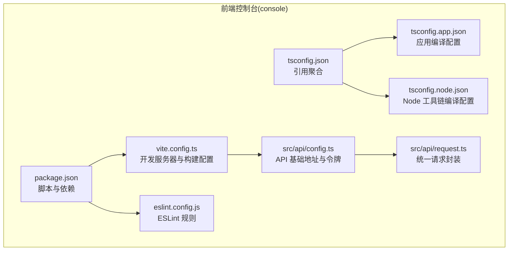
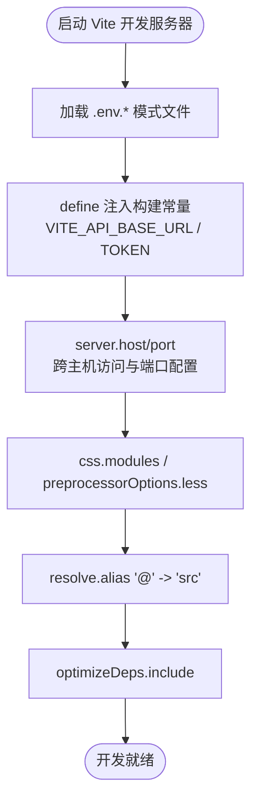
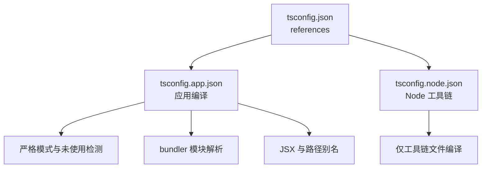
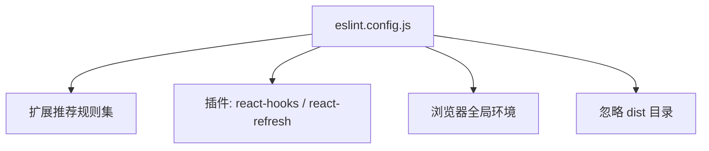
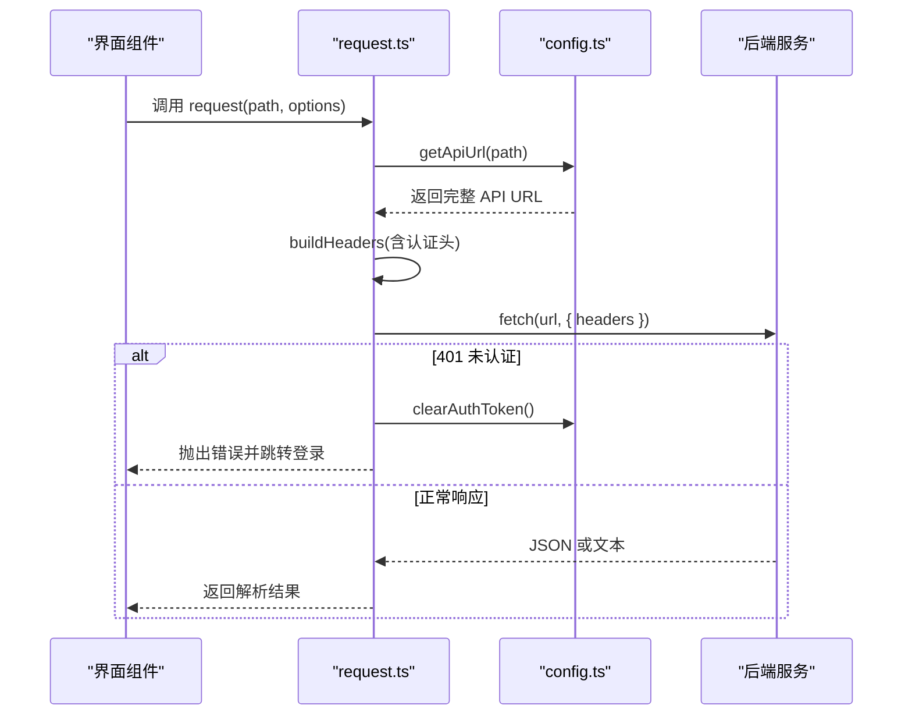
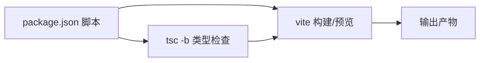

# 本地开发环境

<cite>
**本文引用的文件**
- [console/package.json](file://console/package.json)
- [console/vite.config.ts](file://console/vite.config.ts)
- [console/tsconfig.json](file://console/tsconfig.json)
- [console/tsconfig.app.json](file://console/tsconfig.app.json)
- [console/tsconfig.node.json](file://console/tsconfig.node.json)
- [console/eslint.config.js](file://console/eslint.config.js)
- [console/src/api/config.ts](file://console/src/api/config.ts)
- [console/src/api/request.ts](file://console/src/api/request.ts)
</cite>

## 目录
1. [简介](#简介)
2. [项目结构](#项目结构)
3. [核心组件](#核心组件)
4. [架构总览](#架构总览)
5. [详细组件分析](#详细组件分析)
6. [依赖关系分析](#依赖关系分析)
7. [性能考虑](#性能考虑)
8. [故障排查指南](#故障排查指南)
9. [结论](#结论)
10. [附录](#附录)

## 简介
本文件面向在本地搭建 CoPaw 前后端分离开发环境的开发者，聚焦前端控制台（console）的开发配置与运行方式，涵盖以下主题：
- Node.js 版本与包管理器选择
- Vite 开发服务器配置（热重载、主机与端口、CSS 预处理、路径别名）
- TypeScript 编译配置（严格模式、模块解析、输出策略）
- ESLint 代码规范与 VS Code 推荐配置
- 构建脚本与模式参数说明
- 开发调试技巧（断点调试、网络请求拦截、状态检查）
- 常见问题与性能优化建议

## 项目结构
前端控制台位于 console 目录，采用 Vite + React + TypeScript 技术栈，使用 ESLint 进行代码质量管控，并通过多份 tsconfig 文件实现应用与 Node 工具链的分层编译。



**图表来源**
- [console/package.json:1-60](file://console/package.json#L1-L60)
- [console/vite.config.ts:1-49](file://console/vite.config.ts#L1-L49)
- [console/tsconfig.json:1-8](file://console/tsconfig.json#L1-L8)
- [console/tsconfig.app.json:1-31](file://console/tsconfig.app.json#L1-L31)
- [console/tsconfig.node.json:1-23](file://console/tsconfig.node.json#L1-L23)
- [console/eslint.config.js:1-29](file://console/eslint.config.js#L1-L29)
- [console/src/api/config.ts:1-42](file://console/src/api/config.ts#L1-L42)
- [console/src/api/request.ts:1-65](file://console/src/api/request.ts#L1-L65)

**章节来源**
- [console/package.json:1-60](file://console/package.json#L1-L60)
- [console/vite.config.ts:1-49](file://console/vite.config.ts#L1-L49)
- [console/tsconfig.json:1-8](file://console/tsconfig.json#L1-L8)
- [console/tsconfig.app.json:1-31](file://console/tsconfig.app.json#L1-L31)
- [console/tsconfig.node.json:1-23](file://console/tsconfig.node.json#L1-L23)
- [console/eslint.config.js:1-29](file://console/eslint.config.js#L1-L29)
- [console/src/api/config.ts:1-42](file://console/src/api/config.ts#L1-L42)
- [console/src/api/request.ts:1-65](file://console/src/api/request.ts#L1-L65)

## 核心组件
- 包管理与脚本：使用 npm 脚本定义 dev/build/preview/lint/format 等命令，支持生产与测试模式构建。
- 开发服务器：Vite 提供热重载与跨主机访问能力；支持通过环境变量注入 API 基础地址与令牌常量。
- 类型系统：双 tsconfig 分层，分别约束应用与 Node 工具链；严格模式开启并启用未使用检测。
- 代码规范：ESLint 使用 TypeScript ESLint 配置，结合 React Hooks 与 React Refresh 插件。
- 请求层：统一请求封装，自动处理认证头、401 登出、JSON 解析与非 JSON 文本响应。

**章节来源**
- [console/package.json:6-16](file://console/package.json#L6-L16)
- [console/vite.config.ts:5-48](file://console/vite.config.ts#L5-L48)
- [console/tsconfig.app.json:2-27](file://console/tsconfig.app.json#L2-L27)
- [console/tsconfig.node.json:2-19](file://console/tsconfig.node.json#L2-L19)
- [console/eslint.config.js:7-28](file://console/eslint.config.js#L7-L28)
- [console/src/api/config.ts:11-27](file://console/src/api/config.ts#L11-L27)
- [console/src/api/request.ts:23-64](file://console/src/api/request.ts#L23-L64)

## 架构总览
下图展示本地开发时前端控制台与后端 API 的交互关系，以及 Vite 在开发阶段如何注入构建常量与代理后端服务。

```mermaid
graph TB
Dev["开发者浏览器"]
ViteDev["Vite 开发服务器<br/>端口 5173<br/>host=0.0.0.0"]
API["后端 API 服务<br/>示例: 8088"]
Env["Vite 环境变量<br/>VITE_API_BASE_URL<br/>TOKEN"]
Dev --> |HTTP(S)| ViteDev
ViteDev --> |转发到| API
ViteDev --> |注入常量| Env
Env --> |构建时注入| ViteDev
```

**图表来源**
- [console/vite.config.ts:34-37](file://console/vite.config.ts#L34-L37)
- [console/vite.config.ts:9-16](file://console/vite.config.ts#L9-L16)
- [console/src/api/config.ts:11-27](file://console/src/api/config.ts#L11-L27)

## 详细组件分析

### Vite 开发服务器配置
- 主机与端口：允许外部访问，便于多设备联调。
- 环境变量注入：通过 define 将 VITE_API_BASE_URL 与 TOKEN 注入到客户端代码中，避免硬编码。
- CSS 模块与预处理器：启用 CSS Modules 并配置 Less 支持，开启 JavaScript 启用以支持动态计算。
- 路径别名：@ 指向 src，提升导入可读性。
- 依赖预优化：包含特定依赖以加速冷启动。
- 可选构建输出：注释掉的构建输出指向后端目录，便于一体化部署场景。



**图表来源**
- [console/vite.config.ts:5-48](file://console/vite.config.ts#L5-L48)

**章节来源**
- [console/vite.config.ts:34-37](file://console/vite.config.ts#L34-L37)
- [console/vite.config.ts:11-16](file://console/vite.config.ts#L11-L16)
- [console/vite.config.ts:18-27](file://console/vite.config.ts#L18-L27)
- [console/vite.config.ts:29-33](file://console/vite.config.ts#L29-L33)
- [console/vite.config.ts:38-40](file://console/vite.config.ts#L38-L40)

### TypeScript 编译配置
- 引用聚合：根 tsconfig.json 通过 references 引用应用与 Node 两套配置，实现分层编译。
- 应用配置（app）：目标语言 ES2020，模块解析 bundler，严格模式开启，启用 JSX 与路径别名。
- Node 配置（node）：目标 ES2022，模块解析 bundler，严格模式开启，仅用于工具链文件如 vite.config.ts。



**图表来源**
- [console/tsconfig.json:1-8](file://console/tsconfig.json#L1-L8)
- [console/tsconfig.app.json:2-27](file://console/tsconfig.app.json#L2-L27)
- [console/tsconfig.node.json:2-19](file://console/tsconfig.node.json#L2-L19)

**章节来源**
- [console/tsconfig.json:3-6](file://console/tsconfig.json#L3-L6)
- [console/tsconfig.app.json:4-8](file://console/tsconfig.app.json#L4-L8)
- [console/tsconfig.app.json:10-14](file://console/tsconfig.app.json#L10-L14)
- [console/tsconfig.node.json:4-7](file://console/tsconfig.node.json#L4-L7)
- [console/tsconfig.node.json:9-12](file://console/tsconfig.node.json#L9-L12)

### ESLint 代码规范配置
- 扩展规则集：基于 @eslint/js 与 TypeScript ESLint 推荐规则。
- 插件集成：React Hooks 与 React Refresh 插件，确保 Hooks 使用正确与组件刷新行为符合预期。
- 全局环境：浏览器环境，便于 React/Vite 场景下的全局对象识别。
- 忽略项：忽略 dist 输出目录，避免对构建产物进行二次检查。



**图表来源**
- [console/eslint.config.js:7-28](file://console/eslint.config.js#L7-L28)

**章节来源**
- [console/eslint.config.js:10-15](file://console/eslint.config.js#L10-L15)
- [console/eslint.config.js:16-26](file://console/eslint.config.js#L16-L26)

### API 请求与认证配置
- API 基础地址：通过 VITE_API_BASE_URL 注入，支持空值（同源）或自定义域名；统一拼接 /api 前缀。
- 认证令牌：优先从 localStorage 获取；若无则回退到构建时注入的 TOKEN 常量。
- 统一请求封装：自动添加认证头、处理 401 清理令牌并跳转登录页、区分 JSON 与文本响应。



**图表来源**
- [console/src/api/request.ts:23-64](file://console/src/api/request.ts#L23-L64)
- [console/src/api/config.ts:11-27](file://console/src/api/config.ts#L11-L27)

**章节来源**
- [console/src/api/config.ts:11-27](file://console/src/api/config.ts#L11-L27)
- [console/src/api/request.ts:4-21](file://console/src/api/request.ts#L4-L21)
- [console/src/api/request.ts:36-52](file://console/src/api/request.ts#L36-L52)
- [console/src/api/request.ts:58-64](file://console/src/api/request.ts#L58-L64)

## 依赖关系分析
- 脚本与依赖：package.json 定义了开发、构建、预览、格式化与 Lint 脚本；开发依赖包含 Vite、React 插件、TypeScript 与 ESLint 生态。
- 构建管线：先执行 tsc -b 生成类型检查与增量信息，再由 Vite 执行打包；支持 production 与 test 模式切换。
- 类型安全：tsconfig.app.json 与 tsconfig.node.json 分别约束应用与工具链，确保严格模式与模块解析一致性。



**图表来源**
- [console/package.json:6-16](file://console/package.json#L6-L16)
- [console/tsconfig.app.json:2-8](file://console/tsconfig.app.json#L2-L8)
- [console/tsconfig.node.json:2-7](file://console/tsconfig.node.json#L2-L7)

**章节来源**
- [console/package.json:6-16](file://console/package.json#L6-L16)
- [console/tsconfig.app.json:2-8](file://console/tsconfig.app.json#L2-L8)
- [console/tsconfig.node.json:2-7](file://console/tsconfig.node.json#L2-L7)

## 性能考虑
- 依赖预优化：通过 optimizeDeps.include 预热常用依赖，缩短冷启动时间。
- 模块解析：bundler 模式与路径别名减少解析开销，提升开发体验。
- CSS Modules：作用域样式与哈希命名降低冲突概率，同时利于 Tree Shaking。
- 构建模式：按需选择 production 或 test 模式，平衡体积与调试信息。

**章节来源**
- [console/vite.config.ts:38-40](file://console/vite.config.ts#L38-L40)
- [console/tsconfig.app.json:10-14](file://console/tsconfig.app.json#L10-L14)
- [console/tsconfig.app.json:18-27](file://console/tsconfig.app.json#L18-L27)

## 故障排查指南
- 无法访问开发服务器
  - 确认 server.host 设置为 0.0.0.0，允许外部访问。
  - 检查端口占用，必要时调整 server.port。
- API 请求失败或 401
  - 核对 VITE_API_BASE_URL 是否正确；为空表示同源。
  - 确认 TOKEN 或登录后的 localStorage 中的认证令牌是否有效。
- 类型检查报错
  - 确保 tsconfig.app.json 与 tsconfig.node.json 的严格模式与模块解析一致。
  - 使用 tsc -b 进行增量检查，定位未使用变量或类型不匹配问题。
- ESLint 报错
  - 按照 eslint.config.js 的规则修正；React Refresh 与 Hooks 规则需遵循插件建议。
- 构建失败
  - 先执行 tsc -b 再执行 vite build，确保类型检查通过。
  - 如需生产模式，使用 build:prod；测试模式使用 build:test。

**章节来源**
- [console/vite.config.ts:34-37](file://console/vite.config.ts#L34-L37)
- [console/src/api/config.ts:11-27](file://console/src/api/config.ts#L11-L27)
- [console/src/api/request.ts:36-52](file://console/src/api/request.ts#L36-L52)
- [console/tsconfig.app.json:18-27](file://console/tsconfig.app.json#L18-L27)
- [console/eslint.config.js:20-26](file://console/eslint.config.js#L20-L26)
- [console/package.json:8-16](file://console/package.json#L8-L16)

## 结论
通过上述配置，前端控制台可在本地快速启动并连接后端 API，具备良好的开发体验与质量保障。建议在团队内统一 Node.js 版本、包管理器与编辑器设置，以减少环境差异带来的问题。

## 附录

### 开发环境搭建步骤
- 安装 Node.js 与包管理器
  - 使用 Node.js LTS 版本；推荐使用 npm 作为默认包管理器。
- 安装依赖
  - 在 console 目录执行安装命令，拉取开发依赖与运行时依赖。
- 启动开发服务器
  - 执行 dev 脚本，打开浏览器访问开发服务器地址。
- 配置后端 API
  - 若后端运行在其他端口或域名，请设置 VITE_API_BASE_URL；如需内置令牌，可通过 TOKEN 常量注入。
- 代码规范与格式化
  - 使用 lint 脚本检查代码风格；使用 format 或 format:check 保持代码整洁。

**章节来源**
- [console/package.json:6-16](file://console/package.json#L6-L16)
- [console/vite.config.ts:9-16](file://console/vite.config.ts#L9-L16)

### VS Code 推荐配置
- 安装扩展
  - ESLint、Prettier、TypeScript Importer、ES7+ React/Redux/React-Native snippets。
- 工作区设置
  - 启用 editor.formatOnSave 与 editor.codeActionsOnSave；设置默认 formatter 为 Prettier。
  - 在工作区 settings.json 中配置 TypeScript 与 ESLint 使用推荐的 tsconfig 引用。

[本节为通用实践建议，不直接分析具体文件，故不附加“章节来源”]