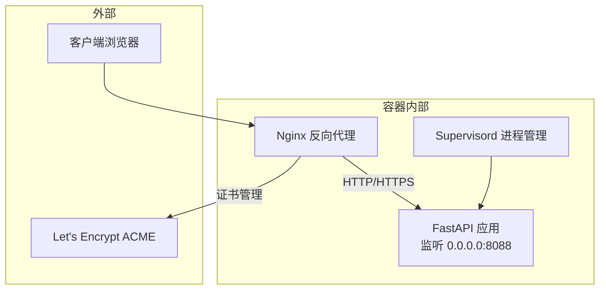
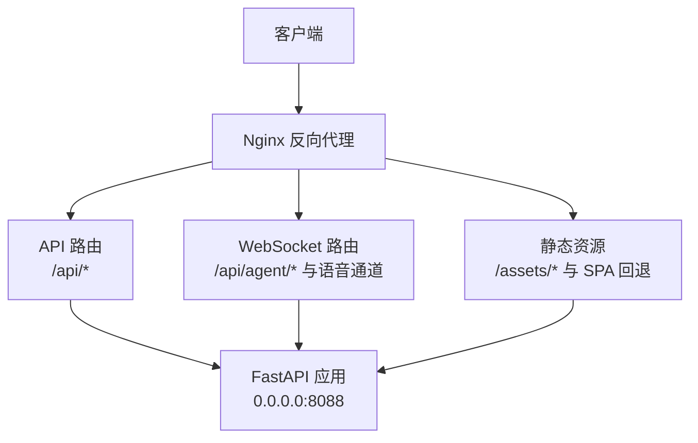
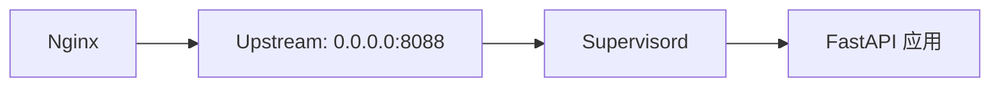
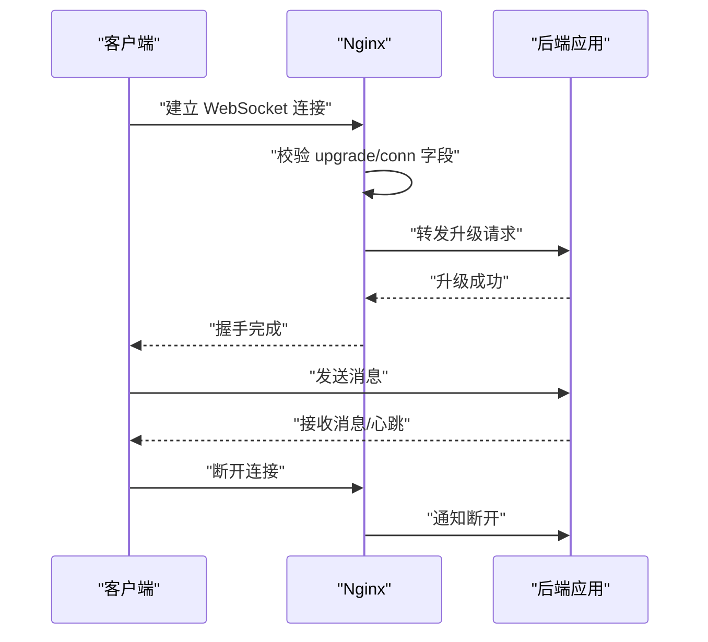

# Nginx反向代理配置

<cite>
**本文引用的文件**
- [Dockerfile](file://deploy/Dockerfile)
- [docker-compose.yml](file://docker-compose.yml)
- [_app.py](file://src/copaw/app/_app.py)
- [console.py](file://src/copaw/app/routers/console.py)
- [agent.py](file://src/copaw/app/routers/agent.py)
- [supervisord.conf.template](file://deploy/config/supervisord.conf.template)
- [entrypoint.sh](file://deploy/entrypoint.sh)
- [test_app_startup.py](file://tests/integrated/test_app_startup.py)
- [security.zh.md](file://website/public/docs/security.zh.md)
</cite>

## 目录
1. [简介](#简介)
2. [项目结构](#项目结构)
3. [核心组件](#核心组件)
4. [架构总览](#架构总览)
5. [详细组件分析](#详细组件分析)
6. [依赖分析](#依赖分析)
7. [性能考虑](#性能考虑)
8. [故障排除指南](#故障排除指南)
9. [结论](#结论)
10. [附录](#附录)

## 简介
本文件为 CoPaw 提供完整的 Nginx 反向代理配置指南，涵盖以下关键主题：
- Nginx server 块定义、监听端口与 SSL 证书配置
- 静态文件服务：前端资源缓存策略、压缩与安全头
- WebSocket 代理：长连接、超时与心跳处理
- API 路由：后端服务转发、负载均衡与健康检查
- SSL/TLS：证书获取、自动续期与安全协议
- 安全最佳实践：HTTP 安全头、CORS、访问控制
- 性能优化：缓存、连接池与压缩
- 配置验证与故障排除

## 项目结构
CoPaw 后端基于 FastAPI，容器内通过 supervisord 启动应用进程，默认监听 8088 端口。前端构建产物位于容器内的 console 目录，Nginx 将作为反向代理，将 /api 前缀的请求转发至后端，并提供静态资源服务与 WebSocket 代理。

图表来源
- [Dockerfile:94-100](file://deploy/Dockerfile#L94-L100)
- [supervisord.conf.template:14-21](file://deploy/config/supervisord.conf.template#L14-L21)
- [docker-compose.yml:14-15](file://docker-compose.yml#L14-L15)

章节来源
- [Dockerfile:94-100](file://deploy/Dockerfile#L94-L100)
- [docker-compose.yml:14-15](file://docker-compose.yml#L14-L15)
- [supervisord.conf.template:14-21](file://deploy/config/supervisord.conf.template#L14-L21)

## 核心组件
- 后端服务：FastAPI 应用，提供 /api 前缀的 REST 接口与 /console 前端路由；静态资源通过 /assets 与 SPA 回退路由提供。
- 进程管理：supervisord 启动并守护应用进程，支持环境变量 COPAW_PORT 动态替换。
- 容器编排：docker-compose 将容器内 8088 映射到宿主机回环地址，便于本地开发或受控网络访问。
- 测试验证：集成测试通过 /api/version 与 /console/ 路径验证后端可用性与前端可达性。

章节来源
- [_app.py:329-344](file://src/copaw/app/_app.py#L329-L344)
- [_app.py:346-410](file://src/copaw/app/_app.py#L346-L410)
- [supervisord.conf.template:14-21](file://deploy/config/supervisord.conf.template#L14-L21)
- [docker-compose.yml:14-15](file://docker-compose.yml#L14-L15)
- [test_app_startup.py:86-114](file://tests/integrated/test_app_startup.py#L86-L114)

## 架构总览
下图展示 Nginx 作为反向代理如何组织请求流向：静态资源直接由 Nginx 提供；API 请求转发至后端；WebSocket 用于实时通信。

图表来源
- [_app.py:346-410](file://src/copaw/app/_app.py#L346-L410)
- [_app.py:329-344](file://src/copaw/app/_app.py#L329-L344)

## 详细组件分析

### Nginx server 块与监听端口
- 监听端口：建议在生产环境监听 443/TCP（HTTPS），并在 80/TCP 提供 HTTP 到 HTTPS 的重定向。
- 主机名：根据域名配置 server_name，确保与证书匹配。
- 访问日志与错误日志：便于审计与问题定位。

章节来源
- [Dockerfile:94-100](file://deploy/Dockerfile#L94-L100)
- [docker-compose.yml:14-15](file://docker-compose.yml#L14-L15)

### SSL/TLS 与证书管理
- 证书来源：推荐使用 Let's Encrypt（ACME），通过 certbot 或 acme-dns 实现自动化签发与续期。
- 证书路径：将证书与私钥放置于 Nginx 可读目录，配置 ssl_certificate 与 ssl_certificate_key。
- 协议与套件：禁用不安全协议与弱密码套件，启用 HTTP/2，开启 OCSP Stapling。
- HSTS：在 HTTPS 响应中添加 Strict-Transport-Security 头，提升安全性。

章节来源
- [security.zh.md:165-176](file://website/public/docs/security.zh.md#L165-L176)

### 静态文件服务与缓存策略
- 前端资源：将 /assets/* 映射到 console 构建产物目录，启用 gzip/br 压缩与长期缓存（immutable）。
- SPA 回退：对 /console 与 /console/* 提供回退，确保前端路由正常工作。
- 安全头：设置 Content-Security-Policy、X-Frame-Options、X-Content-Type-Options、Referrer-Policy 等。
- 缓存控制：对静态资源设置 Cache-Control: public, immutable, max-age=31536000；对动态内容设置 no-store/no-cache。

章节来源
- [_app.py:346-410](file://src/copaw/app/_app.py#L346-L410)
- [_app.py:385-391](file://src/copaw/app/_app.py#L385-L391)

### WebSocket 代理与长连接
- 路由范围：/api/agent/* 与语音通道 WS 路由（如 /voice/ws）需启用 proxy_http_version 1.1 与 upgrade。
- 超时设置：proxy_read_timeout、proxy_send_timeout、proxy_connect_timeout 依据业务场景调整。
- 心跳与断线重连：后端通道实现心跳与指数退避重连逻辑，Nginx 保持连接活跃，避免中间设备断开。
- 传输优化：启用 http2 与 keepalive，减少握手开销。

章节来源
- [_app.py:342-344](file://src/copaw/app/_app.py#L342-L344)
- [console.py:68-151](file://src/copaw/app/routers/console.py#L68-L151)

### API 路由与后端转发
- 路由前缀：/api/* 转发至后端 FastAPI 应用，确保路径与后端一致。
- 负载均衡：多实例部署时，可在上游配置多个后端节点，结合健康检查与会话亲和。
- 健康检查：通过 /api/version 或 /console/ 探测后端可用性，失败时自动摘除节点。
- 身份认证：若启用 Web 登录认证，Nginx 不应拦截已由后端处理的令牌，仅做透明转发。

章节来源
- [_app.py:329-344](file://src/copaw/app/_app.py#L329-L344)
- [test_app_startup.py:86-114](file://tests/integrated/test_app_startup.py#L86-L114)
- [security.zh.md:165-176](file://website/public/docs/security.zh.md#L165-L176)

### CORS 与跨域配置
- 后端 CORS：当设置 CORS_ORIGINS 时，后端会注入 CORS 中间件，允许指定来源访问。
- Nginx 层面：如需在 Nginx 层强制限制来源，可结合 allow/deny 或基于请求头的策略，但通常建议由后端统一处理。

章节来源
- [_app.py:255-265](file://src/copaw/app/_app.py#L255-L265)

### 安全头与访问控制
- 安全头：X-Frame-Options、X-Content-Type-Options、Referrer-Policy、Permissions-Policy、Content-Security-Policy。
- 认证与授权：若启用 COPAW_AUTH_ENABLED，后端将要求令牌；Nginx 保持透明，不干预认证流程。
- 速率限制：可结合 Nginx limit_req/limit_conn 控制请求频率，防止滥用。

章节来源
- [security.zh.md:165-176](file://website/public/docs/security.zh.md#L165-L176)
- [_app.py:253-265](file://src/copaw/app/_app.py#L253-L265)

### 性能优化
- 压缩：启用 gzip/br 对 JS/CSS/HTML/JSON 压缩，合理设置压缩级别与缓冲区。
- 缓存：静态资源强缓存，动态接口禁用缓存或设置短 TTL。
- 连接池：后端连接池参数与 Nginx upstream 连接数协调，避免队列积压。
- 传输优化：启用 HTTP/2、ALPN、OCSP Stapling，减少延迟与握手成本。

## 依赖分析
Nginx 与后端的交互依赖于容器编排与进程管理：

图表来源
- [docker-compose.yml:14-15](file://docker-compose.yml#L14-L15)
- [supervisord.conf.template:14-21](file://deploy/config/supervisord.conf.template#L14-L21)

章节来源
- [docker-compose.yml:14-15](file://docker-compose.yml#L14-L15)
- [supervisord.conf.template:14-21](file://deploy/config/supervisord.conf.template#L14-L21)

## 性能考虑
- 静态资源：使用 CDN 或本地缓存，设置合理的缓存头与 ETag。
- API：合理拆分接口，避免一次性返回大对象；对流式响应（SSE/WS）保持连接稳定。
- 连接：限制并发连接数，启用 keepalive，避免频繁握手。
- 日志：控制访问日志级别与轮转，避免磁盘 IO 抖动。

## 故障排除指南
- 后端不可达
  - 检查容器映射：确认 docker-compose 将 8088 映射到宿主机回环地址。
  - 检查进程状态：supervisord 是否正常启动应用进程。
  - 验证端口：curl http://127.0.0.1:8088/api/version 是否返回版本信息。
- 前端 404 或路由异常
  - 确认 /console 与 SPA 回退路由已正确挂载。
  - 检查 /assets 静态目录是否映射正确。
- WebSocket 断连
  - 检查 proxy_http_version 1.1 与 upgrade 配置。
  - 调整 proxy_read_timeout、proxy_send_timeout。
  - 查看后端心跳与重连逻辑是否生效。
- 认证问题
  - 若启用 COPAW_AUTH_ENABLED，确认浏览器存储的令牌有效且未过期。
  - 检查后端 CORS 配置与来源白名单。

章节来源
- [docker-compose.yml:14-15](file://docker-compose.yml#L14-L15)
- [supervisord.conf.template:14-21](file://deploy/config/supervisord.conf.template#L14-L21)
- [test_app_startup.py:86-114](file://tests/integrated/test_app_startup.py#L86-L114)
- [_app.py:346-410](file://src/copaw/app/_app.py#L346-L410)

## 结论
通过 Nginx 反向代理，CoPaw 可以在生产环境中实现安全、高性能与高可用的访问体验。建议遵循本文档的 SSL/TLS、静态资源缓存、WebSocket 与 API 路由配置要点，并结合容器编排与进程管理工具，确保系统稳定运行。

## 附录

### Nginx 配置要点清单
- 监听 443/TCP，80/TCP 重定向至 HTTPS
- 证书与私钥路径正确，启用 HTTP/2 与 OCSP Stapling
- /assets/* 与 SPA 回退路由配置
- /api/* 转发至 0.0.0.0:8088
- WebSocket 路由启用 proxy_http_version 1.1 与 upgrade
- 设置必要的安全头与缓存策略
- 启用压缩与合理的超时参数
- 健康检查与负载均衡策略

### 关键流程图：WebSocket 连接序列

图表来源
- [_app.py:342-344](file://src/copaw/app/_app.py#L342-L344)
- [console.py:68-151](file://src/copaw/app/routers/console.py#L68-L151)