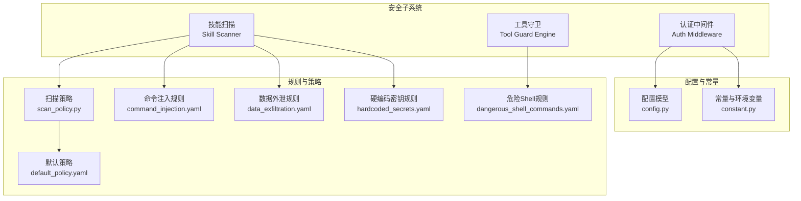
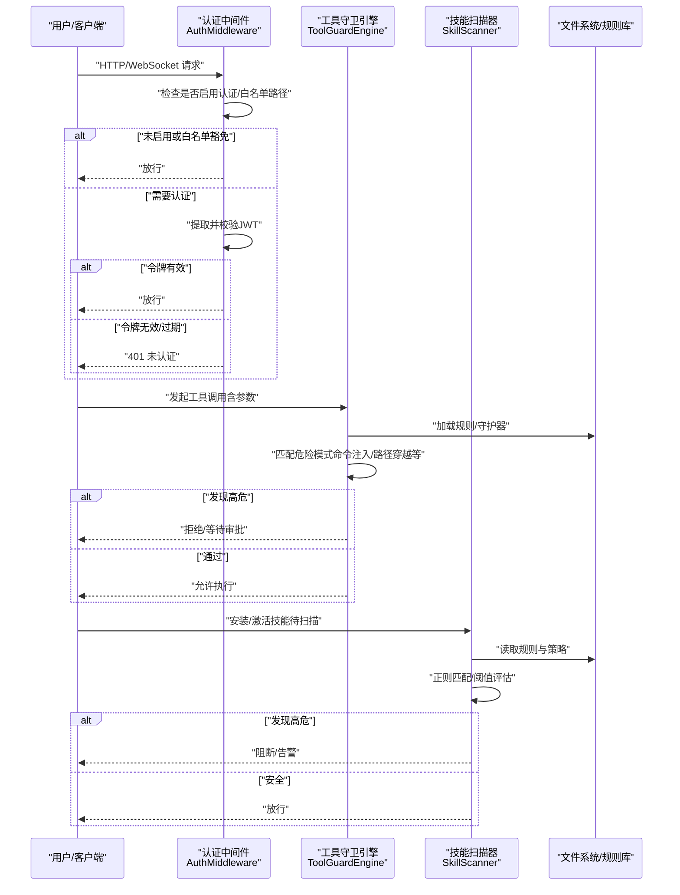
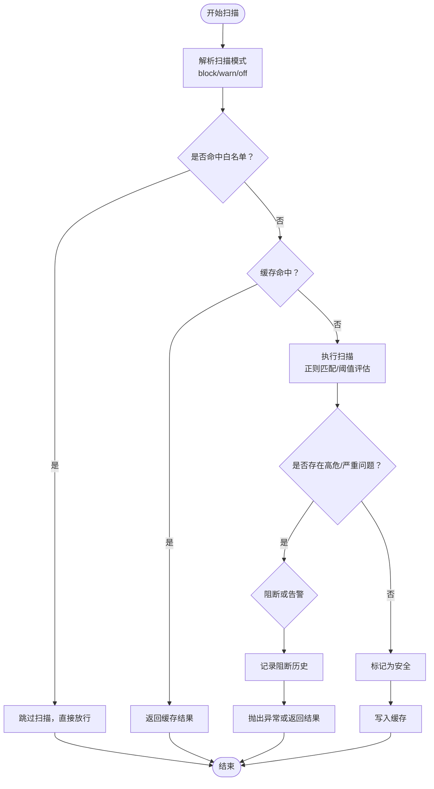
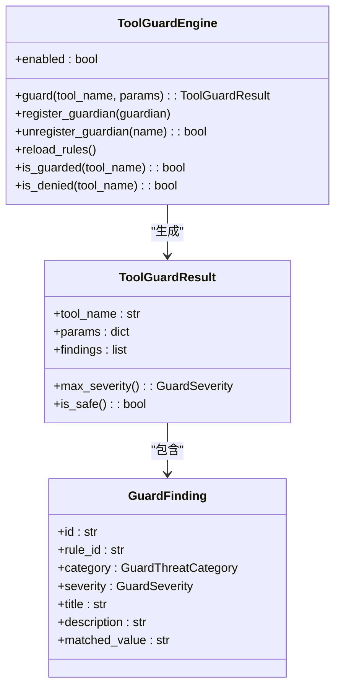
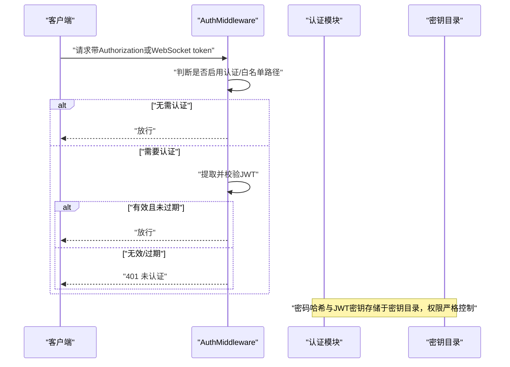
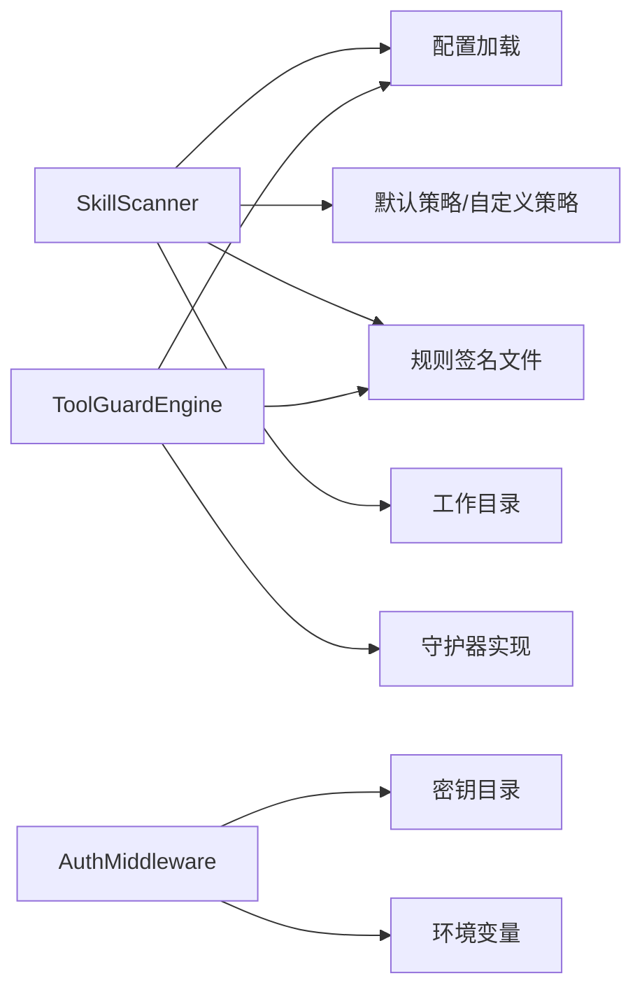

# 安全配置策略

<cite>
**本文档引用的文件**
- [SECURITY.md](file://SECURITY.md)
- [src/copaw/security/__init__.py](file://src/copaw/security/__init__.py)
- [src/copaw/security/skill_scanner/__init__.py](file://src/copaw/security/skill_scanner/__init__.py)
- [src/copaw/security/skill_scanner/models.py](file://src/copaw/security/skill_scanner/models.py)
- [src/copaw/security/skill_scanner/scan_policy.py](file://src/copaw/security/skill_scanner/scan_policy.py)
- [src/copaw/security/skill_scanner/data/default_policy.yaml](file://src/copaw/security/skill_scanner/data/default_policy.yaml)
- [src/copaw/security/skill_scanner/rules/signatures/command_injection.yaml](file://src/copaw/security/skill_scanner/rules/signatures/command_injection.yaml)
- [src/copaw/security/skill_scanner/rules/signatures/data_exfiltration.yaml](file://src/copaw/security/skill_scanner/rules/signatures/data_exfiltration.yaml)
- [src/copaw/security/skill_scanner/rules/signatures/hardcoded_secrets.yaml](file://src/copaw/security/skill_scanner/rules/signatures/hardcoded_secrets.yaml)
- [src/copaw/security/tool_guard/__init__.py](file://src/copaw/security/tool_guard/__init__.py)
- [src/copaw/security/tool_guard/engine.py](file://src/copaw/security/tool_guard/engine.py)
- [src/copaw/security/tool_guard/models.py](file://src/copaw/security/tool_guard/models.py)
- [src/copaw/security/tool_guard/rules/dangerous_shell_commands.yaml](file://src/copaw/security/tool_guard/rules/dangerous_shell_commands.yaml)
- [src/copaw/app/auth.py](file://src/copaw/app/auth.py)
- [src/copaw/cli/auth_cmd.py](file://src/copaw/cli/auth_cmd.py)
- [src/copaw/config/config.py](file://src/copaw/config/config.py)
- [src/copaw/constant.py](file://src/copaw/constant.py)
</cite>

## 目录
1. [简介](#简介)
2. [项目结构](#项目结构)
3. [核心组件](#核心组件)
4. [架构总览](#架构总览)
5. [详细组件分析](#详细组件分析)
6. [依赖关系分析](#依赖关系分析)
7. [性能考虑](#性能考虑)
8. [故障排除指南](#故障排除指南)
9. [结论](#结论)
10. [附录](#附录)

## 简介
本文件面向CoPaw的安全配置与运营团队，提供一套可落地的安全策略文档，覆盖防火墙与网络访问控制、网络安全（TLS/证书）、访问控制（认证与授权）、数据保护（传输与存储）、安全审计（日志与合规）、DDoS防护、安全更新与补丁管理、安全事件响应流程，以及安全配置验证与渗透测试指南。所有策略均以代码库中的实现为依据，并结合项目信任模型与部署假设进行阐述。

## 项目结构
CoPaw在安全方面采用“双引擎”设计：技能扫描（Skill Scanner）与工具调用守卫（Tool Guard）。两者分别在“安装/激活阶段”和“运行时执行前”对潜在威胁进行静态与动态拦截；同时，应用层提供基于环境变量的认证开关与中间件，配合工作目录与密钥目录的权限约束，形成基础的访问控制与数据保护边界。

**图表来源**
- [src/copaw/security/skill_scanner/__init__.py:1-505](file://src/copaw/security/skill_scanner/__init__.py#L1-L505)
- [src/copaw/security/tool_guard/engine.py:1-238](file://src/copaw/security/tool_guard/engine.py#L1-L238)
- [src/copaw/app/auth.py:1-405](file://src/copaw/app/auth.py#L1-L405)
- [src/copaw/config/config.py:1-800](file://src/copaw/config/config.py#L1-L800)
- [src/copaw/constant.py:1-210](file://src/copaw/constant.py#L1-L210)

**章节来源**
- [src/copaw/security/__init__.py:1-17](file://src/copaw/security/__init__.py#L1-L17)
- [src/copaw/security/skill_scanner/__init__.py:1-505](file://src/copaw/security/skill_scanner/__init__.py#L1-L505)
- [src/copaw/security/tool_guard/__init__.py:1-59](file://src/copaw/security/tool_guard/__init__.py#L1-L59)
- [src/copaw/app/auth.py:1-405](file://src/copaw/app/auth.py#L1-L405)
- [src/copaw/config/config.py:1-800](file://src/copaw/config/config.py#L1-L800)
- [src/copaw/constant.py:1-210](file://src/copaw/constant.py#L1-L210)

## 核心组件
- 技能扫描（Skill Scanner）
  - 在技能安装/激活前进行静态扫描，支持模式匹配规则与可插拔分析器，具备缓存与白名单机制。
  - 关键能力：扫描模式（block/warn/off）、超时控制、内容哈希、阻断历史记录、扫描结果缓存。
- 工具守卫（Tool Guard Engine）
  - 在工具调用前对参数进行规则匹配，识别命令注入、路径穿越、敏感文件访问等高危行为。
  - 关键能力：守护器注册/注销、受保护工具集、拒绝工具集、规则重载、超时与失败回退。
- 认证与访问控制（Auth Middleware）
  - 基于环境变量启用/禁用Web认证，使用HMAC-SHA256签名的JWT令牌，支持自动注册与凭据轮换。
  - 关键能力：密码哈希（salted SHA-256）、JWT签发与校验、白名单路径与本地回环豁免、密钥目录权限控制。
- 配置与常量
  - 提供通道配置、工具配置、CORS、日志级别、容器运行标记等安全相关配置项。
  - 关键能力：工作目录与密钥目录分离、媒体目录默认位置、工具守卫审批超时等。

**章节来源**
- [src/copaw/security/skill_scanner/__init__.py:415-505](file://src/copaw/security/skill_scanner/__init__.py#L415-L505)
- [src/copaw/security/tool_guard/engine.py:53-238](file://src/copaw/security/tool_guard/engine.py#L53-L238)
- [src/copaw/app/auth.py:191-405](file://src/copaw/app/auth.py#L191-L405)
- [src/copaw/config/config.py:1-800](file://src/copaw/config/config.py#L1-L800)
- [src/copaw/constant.py:72-210](file://src/copaw/constant.py#L72-L210)

## 架构总览
下图展示从请求进入至工具执行的关键安全控制点，包括认证、工具守卫与技能扫描的协同关系。

**图表来源**
- [src/copaw/app/auth.py:339-405](file://src/copaw/app/auth.py#L339-L405)
- [src/copaw/security/tool_guard/engine.py:169-227](file://src/copaw/security/tool_guard/engine.py#L169-L227)
- [src/copaw/security/skill_scanner/__init__.py:415-505](file://src/copaw/security/skill_scanner/__init__.py#L415-L505)

## 详细组件分析

### 技能扫描（Skill Scanner）
- 扫描模式与阈值
  - 模式：block（阻断）、warn（告警）、off（关闭），优先级为环境变量 > 配置 > 默认warn。
  - 超时：按配置或默认30秒，超时返回None并记录警告。
  - 白名单：支持按技能名与内容哈希匹配，避免重复扫描。
  - 缓存：基于目录修改时间的LRU缓存，减少重复扫描开销。
- 结果与持久化
  - 阻断历史记录保存到工作目录下的JSON文件，包含技能名、最高严重等级、发现列表、内容哈希与动作。
- 规则与策略
  - 默认策略定义了隐藏文件、规则作用域、凭证抑制、文件分类、文件数量/大小限制、分析阈值等。
  - 内置规则覆盖命令注入、数据外泄、硬编码密钥等威胁类别。

**图表来源**
- [src/copaw/security/skill_scanner/__init__.py:415-505](file://src/copaw/security/skill_scanner/__init__.py#L415-L505)
- [src/copaw/security/skill_scanner/scan_policy.py:236-476](file://src/copaw/security/skill_scanner/scan_policy.py#L236-L476)
- [src/copaw/security/skill_scanner/data/default_policy.yaml:1-245](file://src/copaw/security/skill_scanner/data/default_policy.yaml#L1-L245)

**章节来源**
- [src/copaw/security/skill_scanner/__init__.py:85-114](file://src/copaw/security/skill_scanner/__init__.py#L85-L114)
- [src/copaw/security/skill_scanner/__init__.py:141-168](file://src/copaw/security/skill_scanner/__init__.py#L141-L168)
- [src/copaw/security/skill_scanner/__init__.py:231-303](file://src/copaw/security/skill_scanner/__init__.py#L231-L303)
- [src/copaw/security/skill_scanner/scan_policy.py:1-476](file://src/copaw/security/skill_scanner/scan_policy.py#L1-L476)
- [src/copaw/security/skill_scanner/data/default_policy.yaml:1-245](file://src/copaw/security/skill_scanner/data/default_policy.yaml#L1-L245)
- [src/copaw/security/skill_scanner/models.py:1-235](file://src/copaw/security/skill_scanner/models.py#L1-L235)

### 工具守卫（Tool Guard Engine）
- 启用与范围
  - 通过环境变量或配置控制启用状态，默认启用；可限定受保护工具集合与拒绝工具集合。
  - 支持规则重载与守护器注册/注销。
- 结果聚合
  - 统一收集各守护器的发现，按严重等级排序，输出最大严重等级与失败守护器列表。
- 危险规则示例
  - 危险Shell命令：rm/mv、格式化/擦除块设备、fork炸弹、管道下载执行、反向Shell、计划任务/SSH密钥/SUDO配置、权限变更、混淆执行等。

**图表来源**
- [src/copaw/security/tool_guard/engine.py:53-238](file://src/copaw/security/tool_guard/engine.py#L53-L238)
- [src/copaw/security/tool_guard/models.py:103-185](file://src/copaw/security/tool_guard/models.py#L103-L185)

**章节来源**
- [src/copaw/security/tool_guard/engine.py:35-164](file://src/copaw/security/tool_guard/engine.py#L35-L164)
- [src/copaw/security/tool_guard/engine.py:169-227](file://src/copaw/security/tool_guard/engine.py#L169-L227)
- [src/copaw/security/tool_guard/models.py:25-185](file://src/copaw/security/tool_guard/models.py#L25-L185)
- [src/copaw/security/tool_guard/rules/dangerous_shell_commands.yaml:1-120](file://src/copaw/security/tool_guard/rules/dangerous_shell_commands.yaml#L1-L120)

### 认证与访问控制（Auth Middleware）
- 认证启用
  - 通过环境变量启用/禁用Web认证；仅允许单用户注册；支持从环境变量自动注册管理员账户。
- 密码与令牌
  - 密码采用salted SHA-256哈希存储于密钥目录；JWT使用HMAC-SHA256签名，包含签发时间与过期时间。
  - 凭据更新会轮换JWT密钥，使既有会话失效。
- 中间件逻辑
  - 公共路径与静态资源豁免；仅对/api/路由生效；本地回环（127.0.0.1/::1）请求豁免认证。
  - 从Authorization头或WebSocket查询参数中提取令牌。

**图表来源**
- [src/copaw/app/auth.py:191-405](file://src/copaw/app/auth.py#L191-L405)
- [src/copaw/constant.py:72-86](file://src/copaw/constant.py#L72-L86)

**章节来源**
- [src/copaw/app/auth.py:4-16](file://src/copaw/app/auth.py#L4-L16)
- [src/copaw/app/auth.py:191-201](file://src/copaw/app/auth.py#L191-L201)
- [src/copaw/app/auth.py:214-239](file://src/copaw/app/auth.py#L214-L239)
- [src/copaw/app/auth.py:315-332](file://src/copaw/app/auth.py#L315-L332)
- [src/copaw/app/auth.py:339-405](file://src/copaw/app/auth.py#L339-L405)
- [src/copaw/cli/auth_cmd.py:1-67](file://src/copaw/cli/auth_cmd.py#L1-L67)
- [src/copaw/constant.py:72-86](file://src/copaw/constant.py#L72-L86)

### 配置与常量（安全相关）
- 工作目录与密钥目录
  - 工作目录用于存放配置、内存、媒体等；密钥目录用于存放认证数据与敏感文件，权限严格控制（如0600）。
- CORS与文档暴露
  - 开发模式可通过环境变量配置CORS来源；生产环境默认不暴露OpenAPI文档。
- 容器运行与日志
  - 支持容器内运行标记；日志级别通过环境变量控制。
- 工具守卫审批超时
  - 工具守卫审批超时可通过环境变量配置，默认约10分钟。

**章节来源**
- [src/copaw/constant.py:72-86](file://src/copaw/constant.py#L72-L86)
- [src/copaw/constant.py:176-180](file://src/copaw/constant.py#L176-L180)
- [src/copaw/constant.py:126-131](file://src/copaw/constant.py#L126-L131)
- [src/copaw/constant.py:200-210](file://src/copaw/constant.py#L200-L210)
- [src/copaw/config/config.py:1-800](file://src/copaw/config/config.py#L1-L800)

## 依赖关系分析
- 技能扫描依赖
  - 依赖配置加载以获取扫描模式与超时；依赖默认策略与规则签名文件；依赖工作目录进行阻断历史记录持久化。
- 工具守卫依赖
  - 依赖配置加载以获取启用状态与受保护工具集；依赖规则文件与守护器实现；支持运行时重载规则。
- 认证依赖
  - 依赖密钥目录存放认证数据；依赖环境变量控制启用与自动注册；依赖中间件对请求进行拦截与放行。

**图表来源**
- [src/copaw/security/skill_scanner/__init__.py:85-114](file://src/copaw/security/skill_scanner/__init__.py#L85-L114)
- [src/copaw/security/skill_scanner/scan_policy.py:261-282](file://src/copaw/security/skill_scanner/scan_policy.py#L261-L282)
- [src/copaw/security/tool_guard/engine.py:44-51](file://src/copaw/security/tool_guard/engine.py#L44-L51)
- [src/copaw/app/auth.py:32-36](file://src/copaw/app/auth.py#L32-L36)

**章节来源**
- [src/copaw/security/skill_scanner/__init__.py:85-114](file://src/copaw/security/skill_scanner/__init__.py#L85-L114)
- [src/copaw/security/tool_guard/engine.py:44-51](file://src/copaw/security/tool_guard/engine.py#L44-L51)
- [src/copaw/app/auth.py:32-36](file://src/copaw/app/auth.py#L32-L36)

## 性能考虑
- 技能扫描
  - 使用缓存与白名单降低重复扫描成本；超时控制避免长时间阻塞；内容哈希仅在白名单匹配失败时计算。
- 工具守卫
  - 仅在启用状态下执行；守护器失败不影响主流程但会记录失败信息；支持规则重载与最小化守护器集合。
- 认证
  - 密钥目录权限严格控制，避免频繁I/O；JWT签名校验为轻量级操作。

[本节为通用指导，无需特定文件引用]

## 故障排除指南
- 技能扫描
  - 若扫描被关闭或命中白名单，返回None；若超时，记录警告并返回None；阻断历史记录可用于追溯。
  - 可通过清理阻断历史或调整策略/规则缓解误报。
- 工具守卫
  - 若发现高危，需人工审批或调整规则；守护器失败会记录错误，便于定位问题。
- 认证
  - 若出现401错误，检查令牌有效性与过期时间；确认是否命中公共路径豁免；必要时轮换JWT密钥。

**章节来源**
- [src/copaw/security/skill_scanner/__init__.py:477-487](file://src/copaw/security/skill_scanner/__init__.py#L477-L487)
- [src/copaw/security/skill_scanner/__init__.py:231-303](file://src/copaw/security/skill_scanner/__init__.py#L231-L303)
- [src/copaw/security/tool_guard/engine.py:214-224](file://src/copaw/security/tool_guard/engine.py#L214-L224)
- [src/copaw/app/auth.py:354-367](file://src/copaw/app/auth.py#L354-L367)

## 结论
CoPaw的安全策略以“预防为主、双引擎协同、最小权限”为核心原则：技能扫描在安装/激活阶段阻断高危内容，工具守卫在运行时参数层面拦截危险操作，认证中间件确保访问边界可控。结合严格的密钥目录权限、容器运行建议与策略/规则的可定制化，可在个人助理场景下实现稳健的安全基线。建议在生产环境中启用认证、限制通道与用户、定期审查配置与技能，并建立安全事件响应流程与持续审计机制。

[本节为总结性内容，无需特定文件引用]

## 附录

### 防火墙与网络访问控制
- 本项目未内置iptables/ufw等系统防火墙管理功能。建议在宿主机或容器编排层配置：
  - 仅开放必需端口（如HTTP/HTTPS、WebSocket、本地调试端口）；
  - 对外网暴露进行严格源地址限制；
  - 使用网络策略（如Kubernetes NetworkPolicy）隔离实例。
- 通道配置中部分协议支持TLS（如MQTT），可结合平台证书配置提升传输安全。

**章节来源**
- [src/copaw/config/config.py:99-113](file://src/copaw/config/config.py#L99-L113)

### 网络安全（TLS/证书与协议）
- MQTT通道支持TLS参数（CA证书、客户端证书/私钥），建议在生产环境启用并使用受信CA颁发的证书。
- Web服务未内置TLS终止逻辑，建议通过反向代理（如Nginx/Caddy）统一处理TLS终止与证书管理。

**章节来源**
- [src/copaw/config/config.py:99-113](file://src/copaw/config/config.py#L99-L113)

### 访问控制（IP白名单、认证与权限）
- 认证
  - 通过环境变量启用Web认证；单用户注册；HMAC-SHA256 JWT；本地回环豁免；密钥目录权限严格控制。
- 通道与用户
  - 通道配置支持开放/白名单模式、允许/拒绝列表、提及要求等；建议在共享实例中为不同用户/群组使用独立配置与凭据。
- 权限
  - 技能与工具以进程权限运行；建议最小权限与沙箱化（容器/受限用户）。

**章节来源**
- [src/copaw/app/auth.py:4-16](file://src/copaw/app/auth.py#L4-L16)
- [src/copaw/app/auth.py:191-201](file://src/copaw/app/auth.py#L191-L201)
- [src/copaw/app/auth.py:339-405](file://src/copaw/app/auth.py#L339-L405)
- [src/copaw/config/config.py:31-43](file://src/copaw/config/config.py#L31-L43)

### 数据保护（传输、存储与密钥）
- 存储
  - 密钥目录（含认证数据）严格权限控制；工作目录用于非敏感数据；建议将密钥目录置于独立卷并开启只读挂载（容器场景）。
- 传输
  - 通道配置中部分协议支持TLS；建议通过反向代理统一处理TLS终止。
- 密钥管理
  - 不在工作目录或技能可达路径中存放密钥；使用环境变量或外部密钥管理服务。

**章节来源**
- [src/copaw/app/auth.py:166-189](file://src/copaw/app/auth.py#L166-L189)
- [src/copaw/constant.py:72-86](file://src/copaw/constant.py#L72-L86)
- [src/copaw/config/config.py:99-113](file://src/copaw/config/config.py#L99-L113)

### 安全审计（日志、监控与合规）
- 日志
  - 日志级别通过环境变量控制；建议在生产环境启用详细审计日志并集中化存储。
- 监控与告警
  - 建议结合系统监控（CPU/内存/磁盘/网络）与应用指标（请求量、错误率、扫描阻断数）建立告警。
- 合规
  - 严格遵循“单操作员边界”模型；定期审查配置与技能；对外部暴露与多租户共享场景进行风险评估。

**章节来源**
- [src/copaw/constant.py:124-125](file://src/copaw/constant.py#L124-L125)
- [SECURITY.md:57-158](file://SECURITY.md#L57-L158)

### DDoS防护
- 本项目未内置DDoS防护组件。建议在基础设施层实施：
  - 流量清洗与限速（CDN/云厂商WAF）；
  - 连接/请求速率限制；
  - 异常检测（基于行为与统计特征）。
- 应用侧可结合工具守卫与扫描策略降低恶意输入带来的资源消耗。

**章节来源**
- [src/copaw/security/tool_guard/engine.py:169-227](file://src/copaw/security/tool_guard/engine.py#L169-L227)
- [src/copaw/security/skill_scanner/__init__.py:477-487](file://src/copaw/security/skill_scanner/__init__.py#L477-L487)

### 安全更新与补丁管理
- 语言与依赖
  - Python版本需保持当前安全更新；第三方依赖尽量使用受支持版本。
- 镜像与容器
  - 容器镜像应定期更新基础镜像与运行时；非root运行、只读根文件系统、最小化权限。
- 规则与策略
  - 定期更新扫描规则与策略文件，关注新威胁与误报修复。

**章节来源**
- [SECURITY.md:154-158](file://SECURITY.md#L154-L158)
- [src/copaw/security/skill_scanner/scan_policy.py:261-282](file://src/copaw/security/skill_scanner/scan_policy.py#L261-L282)

### 安全事件响应流程
- 发现与分级
  - 将安全事件按严重等级分类（CRITICAL/HIGH/MEDIUM/LOW/INFO）。
- 处置
  - 立即隔离受影响实例；回滚可疑变更；审查阻断历史与日志。
- 报告
  - 按安全政策提交报告，提供复现步骤、影响范围与修复建议。
- 预防
  - 更新规则与策略；加强培训与演练；完善自动化扫描与告警。

**章节来源**
- [SECURITY.md:1-158](file://SECURITY.md#L1-L158)
- [src/copaw/security/skill_scanner/__init__.py:231-303](file://src/copaw/security/skill_scanner/__init__.py#L231-L303)

### 安全配置验证与渗透测试指南
- 验证清单
  - 认证：启用/禁用切换、令牌有效性、本地回环豁免、密钥目录权限。
  - 扫描：阻断历史存在、白名单命中、缓存命中、超时控制。
  - 守卫：规则命中与审批流程、守护器失败记录。
- 渗透测试
  - 基于规则签名构造测试用例（命令注入、路径穿越、硬编码密钥、危险Shell命令等）。
  - 评估通道TLS配置与CORS策略；验证白名单与用户限制效果。

**章节来源**
- [src/copaw/security/skill_scanner/rules/signatures/command_injection.yaml:1-195](file://src/copaw/security/skill_scanner/rules/signatures/command_injection.yaml#L1-L195)
- [src/copaw/security/skill_scanner/rules/signatures/data_exfiltration.yaml:1-142](file://src/copaw/security/skill_scanner/rules/signatures/data_exfiltration.yaml#L1-L142)
- [src/copaw/security/skill_scanner/rules/signatures/hardcoded_secrets.yaml:1-150](file://src/copaw/security/skill_scanner/rules/signatures/hardcoded_secrets.yaml#L1-L150)
- [src/copaw/security/tool_guard/rules/dangerous_shell_commands.yaml:1-120](file://src/copaw/security/tool_guard/rules/dangerous_shell_commands.yaml#L1-L120)