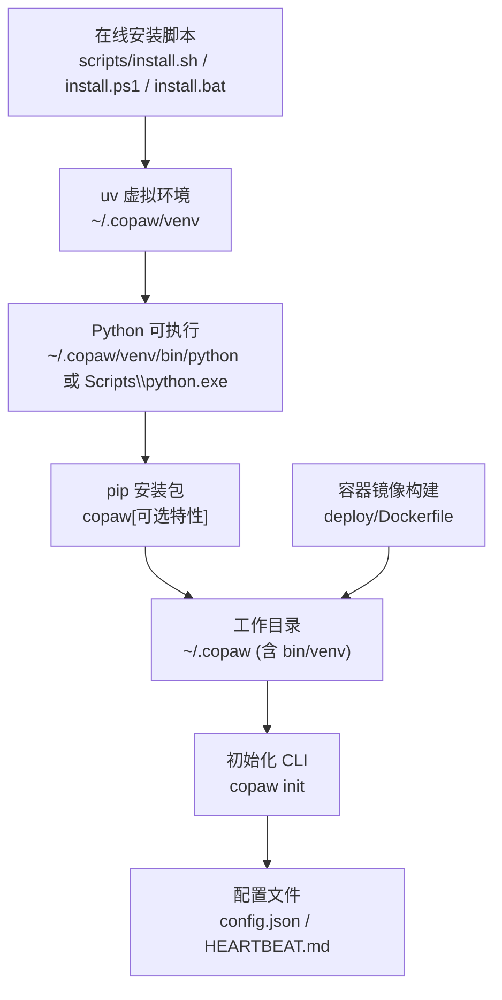
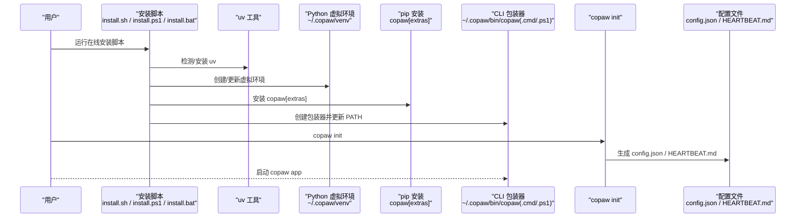
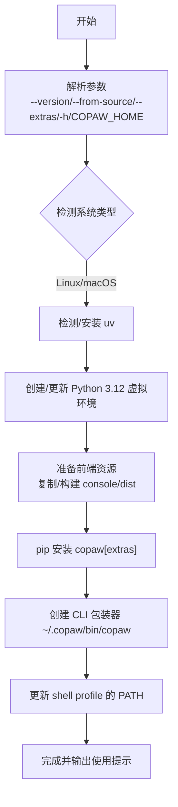
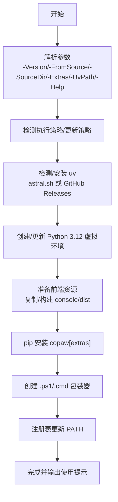
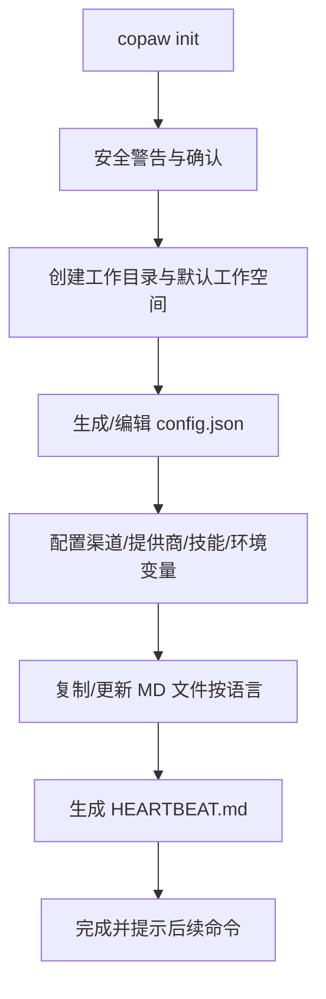
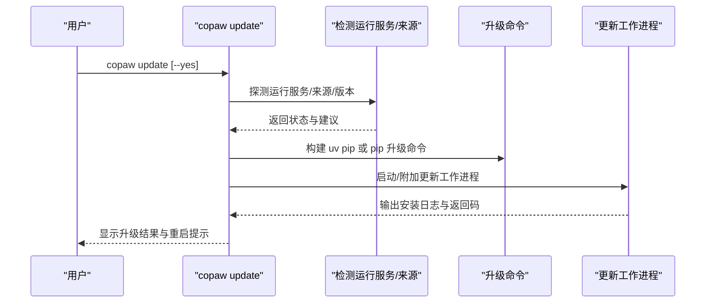
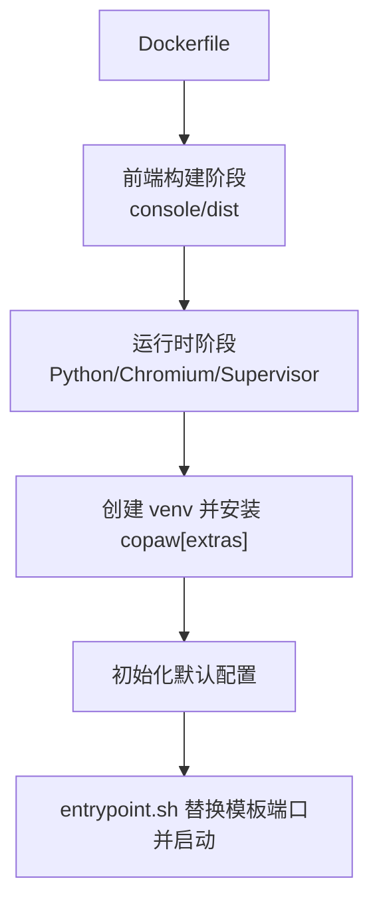
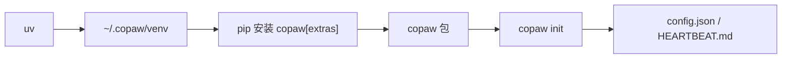

# 安装部署流程

<cite>
**本文引用的文件**
- [install.sh](file://scripts/install.sh)
- [install.ps1](file://scripts/install.ps1)
- [install.bat](file://scripts/install.bat)
- [pyproject.toml](file://pyproject.toml)
- [setup.py](file://setup.py)
- [README.md](file://README.md)
- [Dockerfile](file://deploy/Dockerfile)
- [entrypoint.sh](file://deploy/entrypoint.sh)
- [uninstall_cmd.py](file://src/copaw/cli/uninstall_cmd.py)
- [update_cmd.py](file://src/copaw/cli/update_cmd.py)
- [init_cmd.py](file://src/copaw/cli/init_cmd.py)
- [config.py](file://src/copaw/config/config.py)
- [constant.py](file://src/copaw/constant.py)
- [__version__.py](file://src/copaw/__version__.py)
</cite>

## 目录
1. [简介](#简介)
2. [项目结构](#项目结构)
3. [核心组件](#核心组件)
4. [架构总览](#架构总览)
5. [详细组件分析](#详细组件分析)
6. [依赖关系分析](#依赖关系分析)
7. [性能考虑](#性能考虑)
8. [故障排除指南](#故障排除指南)
9. [结论](#结论)
10. [附录](#附录)

## 简介
本文件面向首次安装与持续运维 CoPaw 的用户，提供从在线安装脚本到初始化配置、从虚拟环境管理到升级卸载的完整流程说明。内容覆盖 Linux、macOS 与 Windows 平台的安装方式，解释 uv 虚拟环境与 Python 版本管理机制，以及安装后的工作目录、配置文件与权限设置。同时给出常见问题的诊断与解决方案，并说明如何在受限网络环境下进行安装。

## 项目结构
围绕安装部署的关键文件与目录如下：
- 在线安装脚本：scripts/install.sh（Linux/macOS）、scripts/install.ps1（PowerShell）、scripts/install.bat（Windows CMD）
- 包元数据与可选特性：pyproject.toml、setup.py
- 安装后初始化与配置：src/copaw/cli/init_cmd.py、src/copaw/config/config.py、src/copaw/constant.py
- 升级与卸载：src/copaw/cli/update_cmd.py、src/copaw/cli/uninstall_cmd.py
- 容器化部署：deploy/Dockerfile、deploy/entrypoint.sh
- 版本信息：src/copaw/__version__.py

图表来源
- [install.sh:104-147](file://scripts/install.sh#L104-L147)
- [install.ps1:193-209](file://scripts/install.ps1#L193-L209)
- [install.bat:306-329](file://scripts/install.bat#L306-L329)
- [pyproject.toml:62-63](file://pyproject.toml#L62-L63)
- [Dockerfile:82-89](file://deploy/Dockerfile#L82-L89)

章节来源
- [install.sh:1-340](file://scripts/install.sh#L1-L340)
- [install.ps1:1-477](file://scripts/install.ps1#L1-L477)
- [install.bat:1-557](file://scripts/install.bat#L1-L557)
- [pyproject.toml:1-101](file://pyproject.toml#L1-L101)
- [Dockerfile:1-103](file://deploy/Dockerfile#L1-L103)

## 核心组件
- 在线安装脚本
  - Linux/macOS：curl 管道安装与 bash 执行两种方式；支持 --version、--from-source、--extras 等参数；自动选择 PyPI 镜像；自动清理旧虚拟环境；创建 uv-managed Python 环境；复制/构建前端资源；创建 CLI 包装器；更新 PATH。
  - Windows：PowerShell 与 CMD 两套脚本，均支持 -Version、-FromSource、-SourceDir、-Extras、-UvPath 参数；自动检测执行策略与 PATH；支持从 astral.sh 或 GitHub Releases 获取 uv；注册表更新 PATH。
- 包与可选特性
  - pyproject.toml 定义了 copaw 主包、动态版本、依赖与可选分组（dev、local、llamacpp、mlx、ollama、whisper、full）。
  - setup.py 使用 setuptools 动态读取版本。
- 初始化与配置
  - copaw init 交互式创建工作目录、config.json、HEARTBEAT.md；支持 --defaults、--force、--accept-security；收集匿名遥测；同步技能与 MD 文件。
  - 配置模型定义了通道、代理运行时、工具、MCP 等结构。
- 升级与卸载
  - copaw update 自动探测运行服务、构建升级命令、后台/前台执行；copaw uninstall 清理 venv/bin、shell profile 中的 PATH 条目，支持 --purge。
- 容器化
  - 多阶段 Dockerfile 构建前端与应用；入口脚本替换模板端口并启动 supervisord。

章节来源
- [install.sh:57-93](file://scripts/install.sh#L57-L93)
- [install.ps1:17-62](file://scripts/install.ps1#L17-L62)
- [install.bat:1-94](file://scripts/install.bat#L1-L94)
- [pyproject.toml:65-93](file://pyproject.toml#L65-L93)
- [setup.py:1-5](file://setup.py#L1-L5)
- [init_cmd.py:119-492](file://src/copaw/cli/init_cmd.py#L119-L492)
- [config.py:1-210](file://src/copaw/config/config.py#L1-L210)
- [update_cmd.py:631-730](file://src/copaw/cli/update_cmd.py#L631-L730)
- [uninstall_cmd.py:46-90](file://src/copaw/cli/uninstall_cmd.py#L46-L90)
- [Dockerfile:1-103](file://deploy/Dockerfile#L1-L103)
- [entrypoint.sh:1-10](file://deploy/entrypoint.sh#L1-L10)

## 架构总览
下图展示从安装到初始化的整体流程与关键文件交互：

图表来源
- [install.sh:104-147](file://scripts/install.sh#L104-L147)
- [install.ps1:193-325](file://scripts/install.ps1#L193-L325)
- [install.bat:306-459](file://scripts/install.bat#L306-L459)
- [init_cmd.py:119-492](file://src/copaw/cli/init_cmd.py#L119-L492)

## 详细组件分析

### 在线安装脚本（Linux/macOS）
- 支持的参数
  - --version <版本号>：安装指定版本
  - --from-source [本地目录或空]：从本地源码或克隆 GitHub 源码安装
  - --extras <逗号分隔特性>：如 llamacpp、mlx、ollama、whisper、full
  - -h/--help：显示帮助
  - 环境变量 COPAW_HOME：自定义安装根目录（默认 ~/.copaw）
- 关键步骤
  - 检测 uv 是否可用，否则自动安装；自动清理旧虚拟环境
  - 创建/更新 Python 3.12 虚拟环境
  - 准备前端资源（复制或构建 console/dist 到 src/copaw/console）
  - pip 安装 copaw[extras]（支持预发布版本）
  - 创建 CLI 包装器 ~/.copaw/bin/copaw
  - 更新 shell profile 的 PATH
  - 输出安装摘要与后续命令提示

图表来源
- [install.sh:57-93](file://scripts/install.sh#L57-L93)
- [install.sh:104-147](file://scripts/install.sh#L104-L147)
- [install.sh:159-241](file://scripts/install.sh#L159-L241)
- [install.sh:256-277](file://scripts/install.sh#L256-L277)
- [install.sh:279-340](file://scripts/install.sh#L279-L340)

章节来源
- [install.sh:1-340](file://scripts/install.sh#L1-L340)

### 在线安装脚本（Windows）
- PowerShell 脚本
  - 参数：-Version、-FromSource、-SourceDir、-Extras、-UvPath、-Help
  - 执行策略检查与自动调整；优先从 astral.sh 安装 uv，失败则回退到 GitHub Releases；注册表更新 PATH；创建 .ps1 与 .cmd 包装器
- CMD 脚本
  - 参数：-Version、-FromSource、-SourceDir、-Extras、-UvPath、-Help
  - 自动下载/提取 uv；注册表更新 PATH；创建 .ps1 与 .cmd 包装器；输入校验防止注入

图表来源
- [install.ps1:17-62](file://scripts/install.ps1#L17-L62)
- [install.ps1:85-193](file://scripts/install.ps1#L85-L193)
- [install.ps1:195-325](file://scripts/install.ps1#L195-L325)
- [install.ps1:333-374](file://scripts/install.ps1#L333-L374)
- [install.ps1:375-476](file://scripts/install.ps1#L375-L476)

章节来源
- [install.ps1:1-477](file://scripts/install.ps1#L1-L477)
- [install.bat:1-557](file://scripts/install.bat#L1-L557)

### 包与可选特性（pyproject.toml）
- 主要依赖与版本范围
  - Python >=3.10,<3.14
  - agentscope、uvicorn、playwright、discord-py、dingtalk-stream、apscheduler、python-telegram-bot、twilio、pywebview、aiofiles、paho-mqtt、wecom-aibot-python-sdk、matrix-nio、google-genai、pyyaml、json-repair 等
- 可选分组
  - dev：开发与测试工具
  - local：本地模型相关（huggingface_hub）
  - llamacpp：llama-cpp-python
  - mlx：mlx-lm（仅 macOS）
  - ollama：ollama
  - whisper：openai-whisper
  - full：local+ollama+llamacpp+whisper（macOS 下额外包含 mlx-lm）

章节来源
- [pyproject.toml:1-101](file://pyproject.toml#L1-L101)

### 初始化与配置（copaw init）
- 交互流程
  - 安全警告与确认（可跳过 --accept-security 与 --defaults 组合）
  - 默认工作空间初始化与内置 QA 代理
  - 配置文件生成：config.json（心跳、语言、音频模式、转录提供商、渠道、工具、MCP 等）
  - 技能同步：默认启用全部或按需选择
  - 环境变量配置（可选）
  - MD 文件复制与语言切换
  - 生成 HEARTBEAT.md
- 关键行为
  - 支持 --defaults、--force、--accept-security
  - 与常量与配置模型协同，确保目录与文件存在

图表来源
- [init_cmd.py:119-492](file://src/copaw/cli/init_cmd.py#L119-L492)
- [config.py:1-210](file://src/copaw/config/config.py#L1-L210)
- [constant.py:72-114](file://src/copaw/constant.py#L72-L114)

章节来源
- [init_cmd.py:1-492](file://src/copaw/cli/init_cmd.py#L1-L492)
- [config.py:1-800](file://src/copaw/config/config.py#L1-L800)
- [constant.py:1-210](file://src/copaw/constant.py#L1-L210)

### 升级与卸载
- 升级（copaw update）
  - 检测当前安装来源（PyPI/本地/源码/VCS），必要时提示覆盖
  - 探测运行中的服务并可强制关闭
  - 基于 uv 或 pip 构建升级命令，后台/前台执行
  - 记录计划并在子进程中执行，输出进度与结果
- 卸载（copaw uninstall）
  - 删除安装器管理的目录（venv、bin）
  - 可选 --purge 删除完整工作目录
  - 清理 shell profile 中的 PATH 注释与导出行

图表来源
- [update_cmd.py:631-730](file://src/copaw/cli/update_cmd.py#L631-L730)
- [update_cmd.py:348-381](file://src/copaw/cli/update_cmd.py#L348-L381)
- [update_cmd.py:400-434](file://src/copaw/cli/update_cmd.py#L400-L434)

章节来源
- [update_cmd.py:1-730](file://src/copaw/cli/update_cmd.py#L1-L730)
- [uninstall_cmd.py:46-90](file://src/copaw/cli/uninstall_cmd.py#L46-L90)

### 容器化部署（Docker）
- 多阶段构建
  - 第一阶段：Node 基础镜像构建 console 前端
  - 第二阶段：安装 Python、Chromium、Supervisor，创建 venv，复制前端产物，pip 安装带可选特性的包
- 入口脚本
  - 通过 envsubst 替换 supervisord.conf 模板中的端口变量，然后启动 supervisord
- 运行参数
  - 端口 COPAW_PORT，默认 8088；工作目录与密钥目录；禁用/启用通道列表

图表来源
- [Dockerfile:1-103](file://deploy/Dockerfile#L1-L103)
- [entrypoint.sh:1-10](file://deploy/entrypoint.sh#L1-L10)

章节来源
- [Dockerfile:1-103](file://deploy/Dockerfile#L1-L103)
- [entrypoint.sh:1-10](file://deploy/entrypoint.sh#L1-L10)

## 依赖关系分析
- 安装脚本对 uv 的依赖
  - 自动检测 uv，缺失时通过官方安装脚本或 GitHub Releases 获取
  - Windows 上优先尝试 astral.sh，失败回退到 GitHub Releases
- 包与可选特性
  - copaw[llamacpp] 用于跨平台本地推理
  - copaw[mlx] 用于 Apple Silicon 本地推理
  - copaw[ollama] 用于连接 Ollama 服务
  - copaw[whisper] 用于语音转写
  - copaw[full] 组合上述特性
- 初始化与配置
  - init 依赖配置模型与常量，确保工作目录、媒体目录、心跳与工具等默认值正确

图表来源
- [install.sh:104-147](file://scripts/install.sh#L104-L147)
- [install.ps1:193-209](file://scripts/install.ps1#L193-L209)
- [install.bat:306-329](file://scripts/install.bat#L306-L329)
- [pyproject.toml:65-93](file://pyproject.toml#L65-L93)
- [init_cmd.py:119-492](file://src/copaw/cli/init_cmd.py#L119-L492)

章节来源
- [pyproject.toml:65-93](file://pyproject.toml#L65-L93)
- [init_cmd.py:119-492](file://src/copaw/cli/init_cmd.py#L119-L492)

## 性能考虑
- uv 与虚拟环境
  - 使用 uv 管理虚拟环境，具备更快的安装与解析速度
  - 自动清理旧环境，避免历史依赖干扰
- 前端资源
  - 安装脚本会复制或构建 console/dist，确保 Web UI 可用；若缺少 Node.js，将跳过构建并提示
- 容器运行
  - 使用系统 Chromium 并禁用沙箱标志，避免 Playwright 重复下载浏览器
  - 通过环境变量控制端口与通道白/黑名单

章节来源
- [install.sh:159-206](file://scripts/install.sh#L159-L206)
- [install.ps1:218-281](file://scripts/install.ps1#L218-L281)
- [install.bat:227-290](file://scripts/install.bat#L227-L290)
- [Dockerfile:71-78](file://deploy/Dockerfile#L71-L78)

## 故障排除指南
- 网络受限或企业防火墙
  - 安装脚本会自动选择 PyPI 镜像；若仍失败，可手动指定镜像源或离线安装
  - Windows 上若 astral.sh 不可达，脚本会回退到 GitHub Releases 下载 uv
- uv 未找到或 PATH 未更新
  - Linux/macOS：检查 ~/.zshrc 或 ~/.bashrc 是否包含 ~/.copaw/bin；重新加载 shell 或新开终端
  - Windows：PowerShell 可能处于受限语言模式导致注册表写入失败；需手动将路径加入系统 PATH
- 前端资源缺失
  - 缺少 Node.js 时，安装脚本会跳过构建；请先安装 Node.js 并重新运行安装脚本
- 升级冲突
  - 若检测到正在运行的服务，升级前会提示并可选择强制关闭；完成后请重启服务
- 卸载残留
  - 使用 --purge 会删除完整工作目录；也可手动清理 ~/.copaw 与 shell profile 中的 PATH 行

章节来源
- [install.sh:33-43](file://scripts/install.sh#L33-L43)
- [install.ps1:150-187](file://scripts/install.ps1#L150-L187)
- [install.bat:194-206](file://scripts/install.bat#L194-L206)
- [update_cmd.py:276-308](file://src/copaw/cli/update_cmd.py#L276-L308)
- [uninstall_cmd.py:25-43](file://src/copaw/cli/uninstall_cmd.py#L25-L43)

## 结论
通过统一的在线安装脚本与 uv 虚拟环境管理，CoPaw 实现了跨平台的一键安装与便捷升级。配合 init 命令的交互式配置与容器化部署能力，用户可在本地或云端快速搭建并维护个人智能助理。遇到问题时，可依据本文的参数说明、环境变量与故障排除建议进行定位与修复。

## 附录

### 平台安装速览
- Linux/macOS
  - curl 管道安装：curl -fsSL https://copaw.agentscope.io/install.sh | bash
  - 指定版本：bash install.sh --version X.Y.Z
  - 从源码安装：bash install.sh --from-source [本地目录]
  - 可选特性：bash install.sh --extras llamacpp,mlx,ollama,whisper,full
- Windows（PowerShell）
  - irm https://copaw.agentscope.io/install.ps1 | iex
  - 指定版本：.\install.ps1 -Version X.Y.Z
  - 从源码安装：.\install.ps1 -FromSource [-SourceDir 本地目录]
  - 可选特性：.\install.ps1 -Extras llamacpp,mlx,ollama,whisper,full
- Windows（CMD）
  - curl -fsSL https://copaw.agentscope.io/install.bat -o install.bat && install.bat
  - 参数同上

章节来源
- [README.md:115-228](file://README.md#L115-L228)

### 安装参数与环境变量
- 安装脚本参数
  - --version、--from-source、--extras、-h/--help
  - COPAW_HOME：自定义安装根目录（默认 ~/.copaw）
- Windows 特有
  - -UvPath：指定已安装的 uv.exe 路径
- 运行时环境变量
  - COPAW_WORKING_DIR：工作目录（默认 ~/.copaw）
  - COPAW_SECRET_DIR：密钥目录（默认 工作目录.secret）
  - COPAW_PORT：服务端口（默认 8088）
  - COPAW_ENABLED_CHANNELS / COPAW_DISABLED_CHANNELS：通道白/黑名单
  - PLAYWRIGHT_CHROMIUM_EXECUTABLE_PATH：容器中指向系统 Chromium

章节来源
- [install.sh:57-93](file://scripts/install.sh#L57-L93)
- [install.ps1:17-62](file://scripts/install.ps1#L17-L62)
- [install.bat:1-94](file://scripts/install.bat#L1-L94)
- [constant.py:72-114](file://src/copaw/constant.py#L72-L114)
- [Dockerfile:14-25](file://deploy/Dockerfile#L14-L25)

### 安装后初始化与目录结构
- 目录
  - ~/.copaw/venv：uv 管理的 Python 环境
  - ~/.copaw/bin：CLI 包装器（copaw、copaw.ps1、copaw.cmd）
  - ~/.copaw/workspaces/default：默认工作空间
- 文件
  - config.json：主配置文件（心跳、语言、音频模式、渠道、工具、MCP 等）
  - HEARTBEAT.md：默认心跳查询
  - token_usage.json：令牌用量统计
  - jobs.json、chats.json：定时任务与聊天记录

章节来源
- [init_cmd.py:119-492](file://src/copaw/cli/init_cmd.py#L119-L492)
- [config.py:1-210](file://src/copaw/config/config.py#L1-L210)
- [constant.py:72-114](file://src/copaw/constant.py#L72-L114)

### 升级与卸载操作
- 升级
  - 重新运行安装脚本（支持 --version 指定目标版本）
  - 或使用 copaw update（自动探测服务与来源，必要时强制关闭服务）
- 卸载
  - copaw uninstall（保留配置与数据）
  - copaw uninstall --purge（删除完整工作目录）
  - 手动清理 shell profile 中的 PATH 导出行

章节来源
- [update_cmd.py:631-730](file://src/copaw/cli/update_cmd.py#L631-L730)
- [uninstall_cmd.py:46-90](file://src/copaw/cli/uninstall_cmd.py#L46-L90)