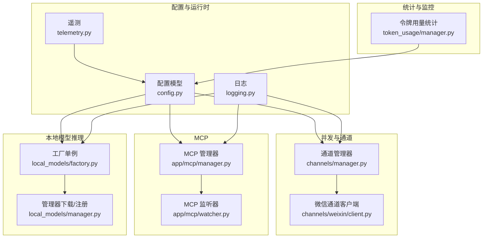
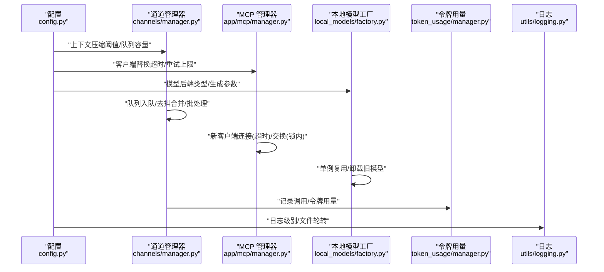
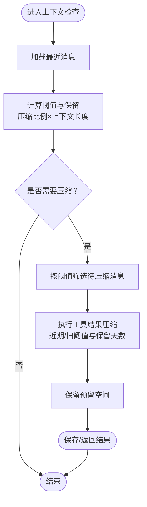
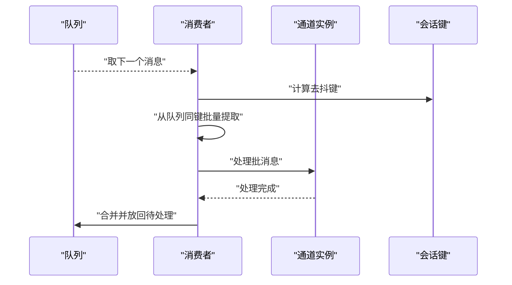
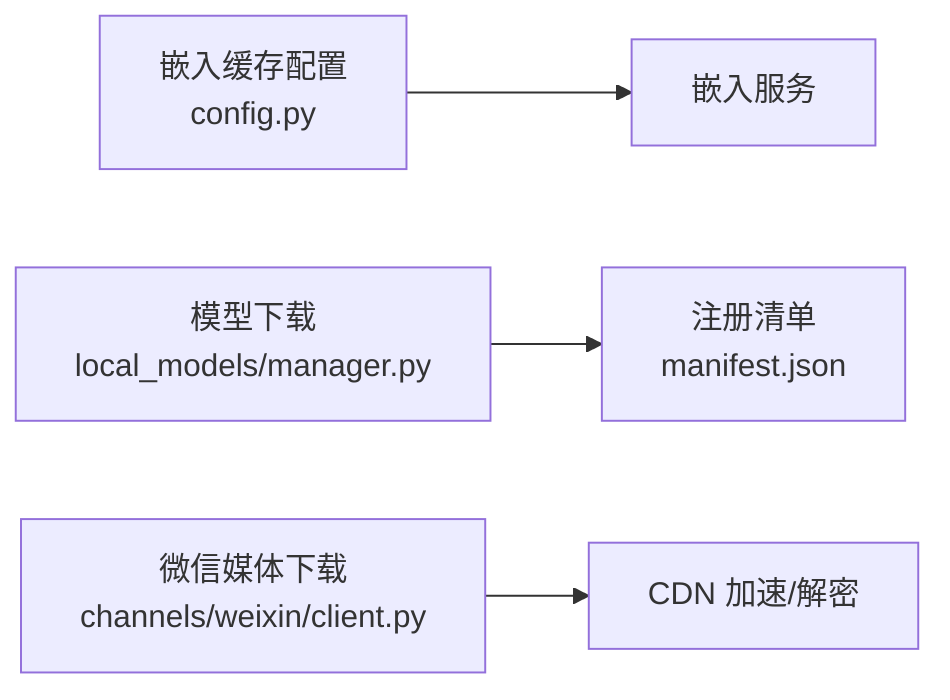
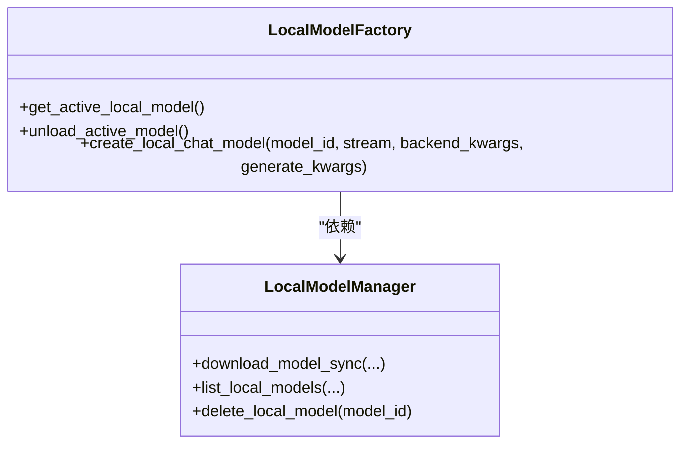
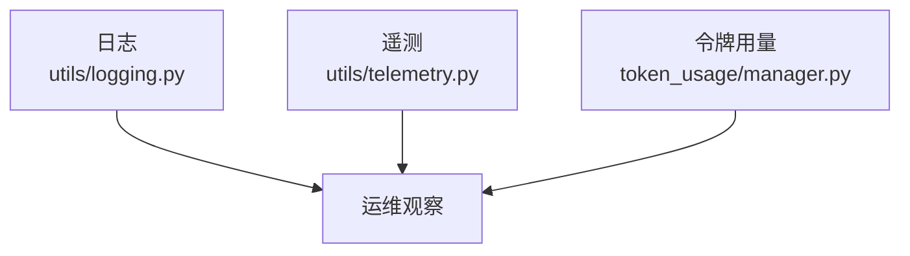

# 性能调优优化

<cite>
**本文引用的文件**
- [config.py](file://src/copaw/config/config.py)
- [manager.py（MCP 客户端）](file://src/copaw/app/mcp/manager.py)
- [watcher.py（MCP 配置监听）](file://src/copaw/app/mcp/watcher.py)
- [manager.py（通道管理器）](file://src/copaw/app/channels/manager.py)
- [client.py（微信通道客户端）](file://src/copaw/app/channels/weixin/client.py)
- [factory.py（本地模型工厂）](file://src/copaw/local_models/factory.py)
- [manager.py（本地模型管理器）](file://src/copaw/local_models/manager.py)
- [manager.py（令牌用量）](file://src/copaw/token_usage/manager.py)
- [logging.py（日志）](file://src/copaw/utils/logging.py)
- [telemetry.py（遥测）](file://src/copaw/utils/telemetry.py)
- [pyproject.toml](file://pyproject.toml)
- [ContextManagementCard.tsx](file://console/src/pages/Agent/Config/components/ContextManagementCard.tsx)
- [heartbeat.ts（心跳类型）](file://console/src/api/types/heartbeat.ts)
- [heartbeat.ts（心跳 API）](file://console/src/api/modules/heartbeat.ts)
- [memory.en.md（内存与向量检索文档）](file://website/public/docs/memory.en.md)
</cite>

## 目录
1. [简介](#简介)
2. [项目结构](#项目结构)
3. [核心组件](#核心组件)
4. [架构总览](#架构总览)
5. [详细组件分析](#详细组件分析)
6. [依赖分析](#依赖分析)
7. [性能考量](#性能考量)
8. [故障排查指南](#故障排查指南)
9. [结论](#结论)
10. [附录](#附录)

## 简介
本文件面向运维与平台工程团队，系统化梳理 CoPaw 在内存管理、并发处理、缓存策略、数据库与网络性能、本地模型推理优化、监控指标与基准测试等方面的现状与可优化点，并给出可落地的配置建议与流程图示，帮助在生产环境中实现稳定、高效与可观测的运行。

## 项目结构
CoPaw 的性能相关能力主要分布在以下模块：
- 配置与运行时行为：配置模型、心跳、嵌入缓存等
- 并发与队列：通道管理器的队列与消费者工作线程
- MCP 客户端：动态替换、连接超时与最小锁持有时间
- 本地模型推理：单例工厂、后端选择、卸载与资源释放
- 令牌用量统计：按日期/模型聚合的持久化统计
- 日志与遥测：日志级别与文件轮转、系统信息采集
- 前端配置入口：上下文压缩阈值、心跳间隔等可视化配置

**图表来源**
- [config.py](file://src/copaw/config/config.py)
- [manager.py（通道管理器）](file://src/copaw/app/channels/manager.py)
- [client.py（微信通道客户端）](file://src/copaw/app/channels/weixin/client.py)
- [manager.py（MCP 客户端）](file://src/copaw/app/mcp/manager.py)
- [watcher.py（MCP 配置监听）](file://src/copaw/app/mcp/watcher.py)
- [factory.py（本地模型工厂）](file://src/copaw/local_models/factory.py)
- [manager.py（本地模型管理器）](file://src/copaw/local_models/manager.py)
- [manager.py（令牌用量）](file://src/copaw/token_usage/manager.py)
- [logging.py（日志）](file://src/copaw/utils/logging.py)
- [telemetry.py（遥测）](file://src/copaw/utils/telemetry.py)

**章节来源**
- [config.py](file://src/copaw/config/config.py)
- [manager.py（通道管理器）](file://src/copaw/app/channels/manager.py)
- [manager.py（MCP 客户端）](file://src/copaw/app/mcp/manager.py)
- [watcher.py（MCP 配置监听）](file://src/copaw/app/mcp/watcher.py)
- [factory.py（本地模型工厂）](file://src/copaw/local_models/factory.py)
- [manager.py（本地模型管理器）](file://src/copaw/local_models/manager.py)
- [manager.py（令牌用量）](file://src/copaw/token_usage/manager.py)
- [logging.py（日志）](file://src/copaw/utils/logging.py)
- [telemetry.py（遥测）](file://src/copaw/utils/telemetry.py)

## 核心组件
- 运行时配置与阈值：最大迭代次数、重试退避、上下文压缩比例与保留比例、工具结果压缩阈值、历史长度限制、嵌入缓存参数等
- 并发与队列：通道队列容量、每通道消费者数量、线程安全入队、去抖键合并、会话级批处理
- MCP 客户端：新旧客户端替换流程、连接超时、失败重试上限、最小锁持有时间
- 本地模型推理：单例工厂、按模型 ID 复用、卸载旧模型、后端类型选择（llama.cpp/MLX）
- 令牌用量统计：按日期/模型聚合、持久化文件锁、汇总接口
- 日志与遥测：控制台彩色输出、文件轮转、系统信息采集与上传

**章节来源**
- [config.py](file://src/copaw/config/config.py)
- [manager.py（通道管理器）](file://src/copaw/app/channels/manager.py)
- [manager.py（MCP 客户端）](file://src/copaw/app/mcp/manager.py)
- [watcher.py（MCP 配置监听）](file://src/copaw/app/mcp/watcher.py)
- [factory.py（本地模型工厂）](file://src/copaw/local_models/factory.py)
- [manager.py（令牌用量）](file://src/copaw/token_usage/manager.py)
- [logging.py（日志）](file://src/copaw/utils/logging.py)
- [telemetry.py（遥测）](file://src/copaw/utils/telemetry.py)

## 架构总览
下图展示性能相关关键路径：配置驱动运行时行为；通道与 MCP 的并发消费；本地模型推理的单例复用；令牌用量统计与日志/遥测输出。

**图表来源**
- [config.py](file://src/copaw/config/config.py)
- [manager.py（通道管理器）](file://src/copaw/app/channels/manager.py)
- [manager.py（MCP 客户端）](file://src/copaw/app/mcp/manager.py)
- [factory.py（本地模型工厂）](file://src/copaw/local_models/factory.py)
- [manager.py（令牌用量）](file://src/copaw/token_usage/manager.py)
- [logging.py（日志）](file://src/copaw/utils/logging.py)

## 详细组件分析

### 内存管理与上下文压缩
- 关键阈值
  - 上下文压缩比例与保留比例：用于在达到阈值时触发压缩，保留一定“预留”空间以避免频繁压缩
  - 工具结果压缩：区分“近期/旧消息”的字符阈值，以及保留天数
  - 历史长度限制：限制 /history 输出长度
- 前端配置入口：工具结果压缩的近期阈值、旧阈值与保留天数可通过前端卡片进行配置
- 向量检索：文档中指出向量语义检索对精确关键词较弱，偏向语义匹配，需结合具体场景选择合适的检索策略

**图表来源**
- [config.py](file://src/copaw/config/config.py)
- [ContextManagementCard.tsx](file://console/src/pages/Agent/Config/components/ContextManagementCard.tsx)
- [memory.en.md](file://website/public/docs/memory.en.md)

**章节来源**
- [config.py](file://src/copaw/config/config.py)
- [ContextManagementCard.tsx](file://console/src/pages/Agent/Config/components/ContextManagementCard.tsx)
- [memory.en.md](file://website/public/docs/memory.en.md)

### 并发处理与队列
- 通道队列
  - 每通道固定队列容量与消费者数量，支持线程安全入队
  - 基于会话键的去抖与批处理，避免重复与抖动
- MCP 客户端替换
  - 新客户端连接在锁外进行，交换与关闭旧客户端在锁内，最小化锁持有时间
  - 支持连接超时与失败重试上限，防止阻塞与无限重试

**图表来源**
- [manager.py（通道管理器）](file://src/copaw/app/channels/manager.py)

**章节来源**
- [manager.py（通道管理器）](file://src/copaw/app/channels/manager.py)
- [manager.py（MCP 客户端）](file://src/copaw/app/mcp/manager.py)
- [watcher.py（MCP 配置监听）](file://src/copaw/app/mcp/watcher.py)

### 缓存策略
- 嵌入缓存
  - 可配置后端、API Key、基础 URL、模型名、维度、启用缓存、最大缓存条目、最大输入长度、最大批大小
- 本地模型缓存
  - 下载模型到本地目录，注册清单；MLX 模型采用快照下载并校验必要文件
- 媒体下载与 CDN
  - 微信媒体下载支持通过 CDN 参数与 AES 解密，提升大文件传输效率

**图表来源**
- [config.py](file://src/copaw/config/config.py)
- [manager.py（本地模型管理器）](file://src/copaw/local_models/manager.py)
- [client.py（微信通道客户端）](file://src/copaw/app/channels/weixin/client.py)

**章节来源**
- [config.py](file://src/copaw/config/config.py)
- [manager.py（本地模型管理器）](file://src/copaw/local_models/manager.py)
- [client.py（微信通道客户端）](file://src/copaw/app/channels/weixin/client.py)

### 数据库与存储性能
- 令牌用量统计采用本地文件持久化，使用文件锁保证并发写入一致性，并提供按日期/模型聚合的查询接口
- 建议
  - 将统计文件置于高性能磁盘或 SSD
  - 控制查询范围（起止日期），避免全量扫描导致的 IO 峰值

**章节来源**
- [manager.py（令牌用量）](file://src/copaw/token_usage/manager.py)

### 网络性能
- HTTP/2 与连接复用
  - 当前未见显式 HTTP/2 或连接池配置项；如需开启，可在上游依赖（如 httpx/uvicorn）层面进行配置
- 超时与重试
  - MCP 客户端连接超时、通道队列消费者循环中的异常处理与日志记录有助于避免长时间阻塞
- CDN 与媒体下载
  - 微信通道客户端支持 CDN 下载与 AES 解密，减少主站带宽压力

**章节来源**
- [manager.py（MCP 客户端）](file://src/copaw/app/mcp/manager.py)
- [client.py（微信通道客户端）](file://src/copaw/app/channels/weixin/client.py)

### 本地模型推理优化
- 单例工厂
  - 同一模型 ID 复用已加载后端，不同模型切换时先卸载旧模型，降低重复初始化开销
- 后端选择
  - llama.cpp 与 MLX 后端按模型类型自动选择，便于在不同硬件上发挥最佳性能
- 资源释放
  - 显式卸载接口用于释放 GPU/CPU 资源，避免长期占用

**图表来源**
- [factory.py（本地模型工厂）](file://src/copaw/local_models/factory.py)
- [manager.py（本地模型管理器）](file://src/copaw/local_models/manager.py)

**章节来源**
- [factory.py（本地模型工厂）](file://src/copaw/local_models/factory.py)
- [manager.py（本地模型管理器）](file://src/copaw/local_models/manager.py)

### 监控指标与告警
- 日志
  - 控制台彩色输出、文件轮转、第三方访问日志过滤，便于定位性能瓶颈
- 遥测
  - 系统信息采集（版本、安装方式、OS、架构、GPU 检测）、上传与标记文件，避免重复上报
- 令牌用量
  - 提供按日期/模型/提供商的聚合统计接口，可用于成本与性能趋势分析

**图表来源**
- [logging.py（日志）](file://src/copaw/utils/logging.py)
- [telemetry.py（遥测）](file://src/copaw/utils/telemetry.py)
- [manager.py（令牌用量）](file://src/copaw/token_usage/manager.py)

**章节来源**
- [logging.py（日志）](file://src/copaw/utils/logging.py)
- [telemetry.py（遥测）](file://src/copaw/utils/telemetry.py)
- [manager.py（令牌用量）](file://src/copaw/token_usage/manager.py)

## 依赖分析
- Python 运行时与依赖
  - Python 版本要求与关键依赖（httpx、uvicorn、transformers、onnxruntime、playwright、ollama 等）
  - 可选依赖（llamacpp、mlx、whisper、ollama）按场景启用
- 本地模型后端
  - llama.cpp 与 MLX 后端分别对应不同的量化格式与平台特性

**章节来源**
- [pyproject.toml](file://pyproject.toml)
- [factory.py（本地模型工厂）](file://src/copaw/local_models/factory.py)

## 性能考量
- 内存
  - 合理设置上下文压缩比例与保留比例，避免频繁压缩造成 CPU 峰值
  - 工具结果压缩的近期/旧阈值与保留天数应结合业务对话长度与历史需求调优
- 并发
  - 通道队列容量与消费者数量需根据消息吞吐与处理耗时平衡；过小导致排队，过大导致上下文切换开销
  - MCP 客户端替换流程已最小化锁持有时间，建议配合超时与重试上限避免阻塞
- 缓存
  - 嵌入缓存的批大小与最大输入长度影响吞吐与延迟；CDN 下载与 AES 解密减少主站带宽
- 存储
  - 令牌用量文件落盘建议使用高性能存储；查询范围控制避免全量扫描
- 网络
  - 如需启用 HTTP/2 与连接复用，请在上游依赖层面配置；当前代码未直接暴露相关开关
- 推理
  - 使用单例工厂复用模型，避免重复加载；根据硬件选择合适后端与量化格式

[本节为通用指导，不直接分析具体文件]

## 故障排查指南
- 心跳任务超时
  - 心跳执行设置了超时保护，超时会记录警告日志，建议检查上游 LLM 与工具链响应时间
- MCP 客户端替换失败
  - 新客户端连接超时或失败会强制清理并抛出异常；检查网络、超时与重试上限配置
- 通道处理异常
  - 消费者循环捕获异常并记录日志，检查队列容量、消费者数量与处理逻辑
- 日志与文件轮转
  - 文件处理器在不同平台采用不同策略；确认日志路径权限与磁盘空间

**章节来源**
- [manager.py（MCP 客户端）](file://src/copaw/app/mcp/manager.py)
- [manager.py（通道管理器）](file://src/copaw/app/channels/manager.py)
- [logging.py（日志）](file://src/copaw/utils/logging.py)

## 结论
CoPaw 在配置驱动的上下文压缩、并发队列与消费者模型、MCP 动态替换、本地模型单例复用与令牌用量统计等方面具备良好的性能基础。建议在生产环境重点关注：合理设置上下文压缩阈值、平衡通道队列与消费者规模、启用合适的本地模型后端与量化策略、控制令牌用量查询范围、完善日志与遥测覆盖，并在需要时引入 HTTP/2 与连接池配置以进一步优化网络层性能。

[本节为总结性内容，不直接分析具体文件]

## 附录

### 关键性能指标（KPI）与告警阈值建议
- KPI
  - 上下文压缩触发频率、平均压缩耗时
  - 通道队列积压时长、消费者空闲率
  - MCP 客户端连接失败率、替换耗时
  - 本地模型加载/卸载耗时、GPU/CPU 占用
  - 令牌用量总量与按模型/提供商的分布
- 告警阈值
  - 心跳执行超时、MCP 连接超时、队列积压超过 N 分钟
  - 令牌用量环比增长异常、模型加载失败率上升

[本节为通用指导，不直接分析具体文件]

### 性能测试与基准测试
- 测试方法
  - 使用现有测试框架与脚本进行回归与集成测试
  - 通过前端配置页面调整上下文压缩阈值与心跳间隔，观察系统行为变化
- 基准测试工具
  - 可基于现有依赖与可选依赖（如 playwright、ollama）构建端到端吞吐与延迟基线
  - 对比不同本地模型后端与量化格式的推理性能

**章节来源**
- [pyproject.toml](file://pyproject.toml)
- [ContextManagementCard.tsx](file://console/src/pages/Agent/Config/components/ContextManagementCard.tsx)
- [heartbeat.ts（心跳类型）](file://console/src/api/types/heartbeat.ts)
- [heartbeat.ts（心跳 API）](file://console/src/api/modules/heartbeat.ts)