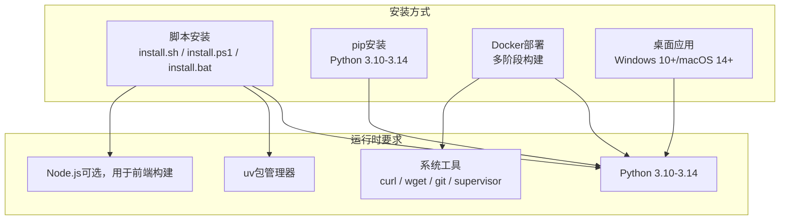
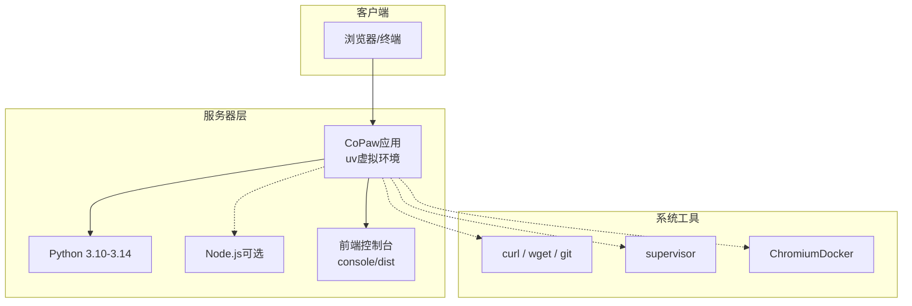
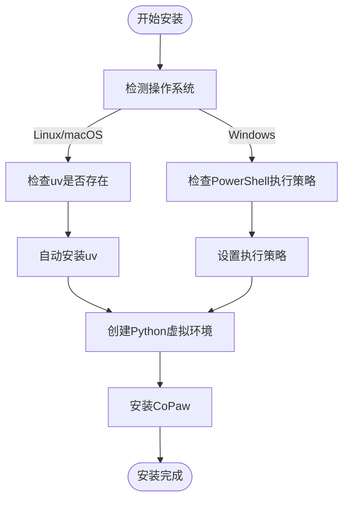
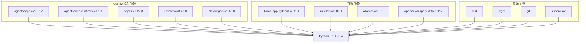

# 服务器环境准备

<cite>
**本文引用的文件**
- [README.md](file://README.md)
- [README_zh.md](file://README_zh.md)
- [CONTRIBUTING.md](file://CONTRIBUTING.md)
- [scripts/install.sh](file://scripts/install.sh)
- [scripts/install.ps1](file://scripts/install.ps1)
- [scripts/install.bat](file://scripts/install.bat)
- [pyproject.toml](file://pyproject.toml)
- [deploy/Dockerfile](file://deploy/Dockerfile)
- [docker-compose.yml](file://docker-compose.yml)
- [scripts/README.md](file://scripts/README.md)
- [website/public/docs/quickstart.en.md](file://website/public/docs/quickstart.en.md)
- [website/public/docs/config.en.md](file://website/public/docs/config.en.md)
</cite>

## 目录
1. [简介](#简介)
2. [项目结构](#项目结构)
3. [核心组件](#核心组件)
4. [架构概览](#架构概览)
5. [详细组件分析](#详细组件分析)
6. [依赖关系分析](#依赖关系分析)
7. [性能考虑](#性能考虑)
8. [故障排除指南](#故障排除指南)
9. [结论](#结论)
10. [附录](#附录)

## 简介
本文件为CoPaw项目的服务器环境准备指南，涵盖操作系统兼容性、系统依赖项、硬件资源需求、系统预检查清单、防火墙与端口配置、安全策略以及第三方依赖的安装方法。内容基于仓库中的安装脚本、Docker配置、文档和项目元数据，确保读者能够根据自身环境正确部署CoPaw。

## 项目结构
CoPaw提供多种部署方式：
- 通过安装脚本自动安装（uv管理Python环境，支持Node.js前端构建）
- 通过pip安装（需要Python 3.10-3.14）
- Docker镜像部署（包含前端构建、Chromium运行时）
- 桌面应用（Windows 10+/macOS 14+，Apple Silicon推荐）

**图表来源**
- [scripts/install.sh:1-340](file://scripts/install.sh#L1-L340)
- [scripts/install.ps1:1-477](file://scripts/install.ps1#L1-L477)
- [scripts/install.bat:1-557](file://scripts/install.bat#L1-L557)
- [pyproject.toml:6-37](file://pyproject.toml#L6-L37)
- [deploy/Dockerfile:29-47](file://deploy/Dockerfile#L29-L47)

**章节来源**
- [README.md:99-180](file://README.md#L99-L180)
- [README_zh.md:99-180](file://README_zh.md#L99-L180)
- [website/public/docs/quickstart.en.md:18-152](file://website/public/docs/quickstart.en.md#L18-L152)

## 核心组件
- Python运行时：要求Python 3.10至3.14（项目元数据明确指定）
- uv包管理器：安装脚本会自动检测并安装uv，作为Python虚拟环境管理工具
- Node.js：用于构建前端控制台（console），安装脚本会在必要时提示安装
- Docker镜像：包含Chromium、supervisor等系统工具，适合容器化部署
- 桌面应用：Windows 10+和macOS 14+，Apple Silicon推荐

**章节来源**
- [pyproject.toml:6](file://pyproject.toml#L6)
- [scripts/install.sh:30](file://scripts/install.sh#L30)
- [scripts/install.ps1:33](file://scripts/install.ps1#L33)
- [deploy/Dockerfile:29-47](file://deploy/Dockerfile#L29-L47)
- [website/public/docs/quickstart.en.md:159-164](file://website/public/docs/quickstart.en.md#L159-L164)

## 架构概览
CoPaw的服务器环境架构支持多种部署模式，核心依赖关系如下：

**图表来源**
- [scripts/install.sh:104-134](file://scripts/install.sh#L104-L134)
- [scripts/install.ps1:121-191](file://scripts/install.ps1#L121-L191)
- [deploy/Dockerfile:29-47](file://deploy/Dockerfile#L29-L47)

## 详细组件分析

### 操作系统要求
- Linux：安装脚本明确支持Linux和macOS
- macOS：支持macOS，桌面应用推荐Apple Silicon
- Windows：提供PowerShell和CMD安装脚本，支持Windows 10+

**图表来源**
- [scripts/install.sh:95-100](file://scripts/install.sh#L95-L100)
- [scripts/install.ps1:68-83](file://scripts/install.ps1#L68-L83)
- [scripts/install.bat:302-308](file://scripts/install.bat#L302-L308)

**章节来源**
- [scripts/install.sh:95-100](file://scripts/install.sh#L95-L100)
- [scripts/install.ps1:68-83](file://scripts/install.ps1#L68-L83)
- [scripts/install.bat:302-308](file://scripts/install.bat#L302-L308)
- [website/public/docs/quickstart.en.md:159-164](file://website/public/docs/quickstart.en.md#L159-L164)

### 系统依赖项
- Python 3.10-3.14：项目元数据明确要求
- uv包管理器：安装脚本自动检测和安装
- Node.js：用于构建前端控制台（console），安装脚本会提示安装
- 系统工具：curl、wget、git、supervisor等（Docker镜像中包含）

**章节来源**
- [pyproject.toml:6](file://pyproject.toml#L6)
- [scripts/install.sh:104-134](file://scripts/install.sh#L104-L134)
- [scripts/install.ps1:121-191](file://scripts/install.ps1#L121-L191)
- [deploy/Dockerfile:29-47](file://deploy/Dockerfile#L29-L47)

### 硬件资源需求
- CPU：无特定要求，建议至少单核处理器
- 内存：无特定要求，建议至少2GB RAM
- 存储空间：无特定要求，建议至少500MB可用空间
- 网络带宽：无特定要求，建议稳定的网络连接

注：以上为通用建议，具体需求取决于使用的模型大小和并发量。

**章节来源**
- [README.md:326-338](file://README.md#L326-L338)
- [README_zh.md:328-338](file://README_zh.md#L328-L338)

### 系统预检查清单
- Python版本检查：确保Python 3.10-3.14
- uv安装检查：安装脚本会自动检测和安装uv
- Node.js检查：前端构建需要Node.js
- 权限检查：确保有写入用户主目录的权限
- 环境变量：COPAW_HOME、PATH等

**章节来源**
- [scripts/install.sh:104-134](file://scripts/install.sh#L104-L134)
- [scripts/install.ps1:121-191](file://scripts/install.ps1#L121-L191)
- [scripts/install.bat:162-225](file://scripts/install.bat#L162-L225)

### 端口配置
- 默认端口：8088（HTTP）
- Docker部署：映射127.0.0.1:8088:8088
- 环境变量：COPAW_PORT可覆盖默认端口

**章节来源**
- [website/public/docs/quickstart.en.md:134-136](file://website/public/docs/quickstart.en.md#L134-L136)
- [docker-compose.yml:14-15](file://docker-compose.yml#L14-L15)
- [deploy/Dockerfile:95](file://deploy/Dockerfile#L95)

### 安全策略配置
- Docker镜像：包含Chromium沙箱配置
- SELinux/AppArmor：容器化部署时可配置安全策略
- 环境变量：COPAW_AUTH_*相关变量用于认证

**章节来源**
- [deploy/Dockerfile:71](file://deploy/Dockerfile#L71)
- [website/public/docs/config.en.md:77-91](file://website/public/docs/config.en.md#L77-L91)

### 第三方依赖安装
- Git：用于源码安装和Docker构建
- curl/wget：用于下载uv和安装脚本
- supervisor：用于进程管理（Docker镜像中包含）

**章节来源**
- [deploy/Dockerfile:29-47](file://deploy/Dockerfile#L29-L47)
- [scripts/install.sh:187-192](file://scripts/install.sh#L187-L192)
- [scripts/install.ps1:244-249](file://scripts/install.ps1#L244-L249)

## 依赖关系分析

**图表来源**
- [pyproject.toml:7-37](file://pyproject.toml#L7-L37)
- [pyproject.toml:76-93](file://pyproject.toml#L76-L93)

**章节来源**
- [pyproject.toml:6-37](file://pyproject.toml#L6-L37)
- [pyproject.toml:76-93](file://pyproject.toml#L76-L93)

## 性能考虑
- Python版本：建议使用Python 3.12，安装脚本默认使用3.12
- 前端构建：Node.js用于构建console前端，可显著提升用户体验
- Docker部署：包含Chromium运行时，适合需要浏览器自动化场景
- 进程管理：supervisor用于进程监控和重启

## 故障排除指南
- Windows企业版LTSC：PowerShell可能运行在受限语言模式，需手动配置PATH
- uv安装失败：可手动安装uv或使用Python -m pip install -U uv
- Node.js缺失：安装脚本会提示安装Node.js以启用Web UI
- Docker网络：容器内localhost指向容器本身，需使用host.docker.internal

**章节来源**
- [README.md:151-173](file://README.md#L151-L173)
- [README_zh.md:151-173](file://README_zh.md#L151-L173)
- [scripts/install.sh:187-192](file://scripts/install.sh#L187-L192)
- [website/public/docs/quickstart.en.md:291-314](file://website/public/docs/quickstart.en.md#L291-L314)

## 结论
CoPaw提供了灵活的部署方式，支持多种操作系统和部署环境。通过安装脚本可以自动处理Python、uv和Node.js的安装，Docker镜像包含了完整的运行时环境。根据项目需求选择合适的部署方式，并按照本文的环境要求进行准备，即可顺利部署CoPaw。

## 附录

### 端口和服务映射
- 8088/tcp：CoPaw Web控制台
- Docker默认映射：127.0.0.1:8088:8088

### 环境变量参考
- COPAW_HOME：安装目录，默认~/.copaw
- COPAW_WORKING_DIR：工作目录，默认~/.copaw
- COPAW_PORT：服务端口，默认8088
- PATH：包含~/.copaw/bin

### 安装选项
- --version：安装指定版本
- --from-source：从源码安装
- --extras：安装额外功能（llamacpp、mlx、ollama等）