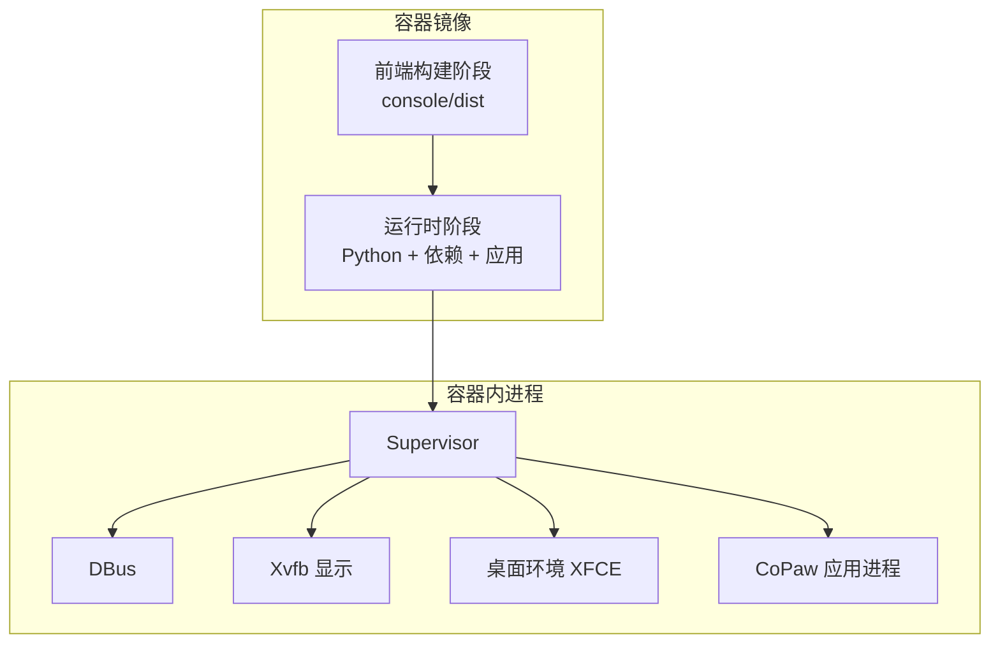
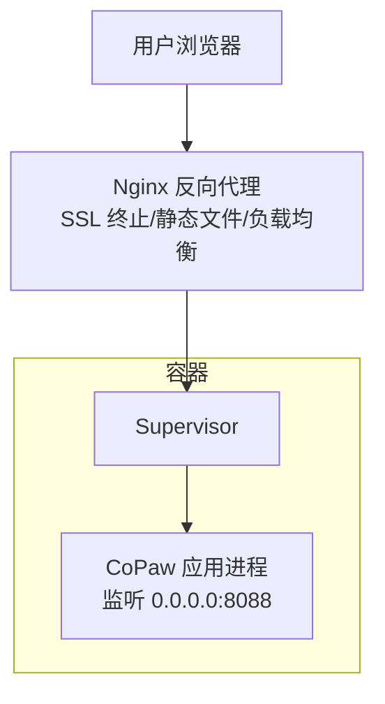
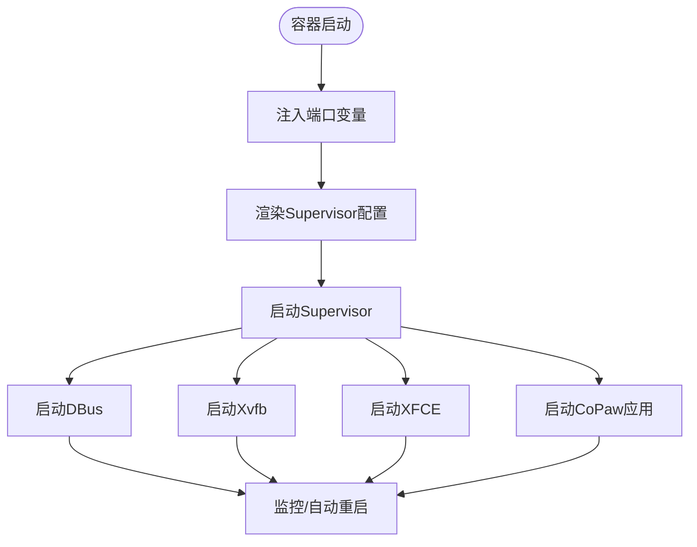
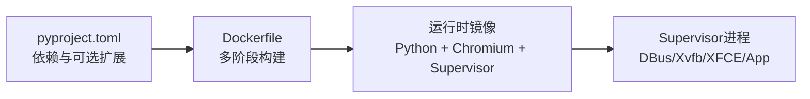

# 生产环境部署

<cite>
**本文引用的文件**
- [Dockerfile](file://deploy/Dockerfile)
- [入口脚本](file://deploy/entrypoint.sh)
- [Supervisor模板](file://deploy/config/supervisord.conf.template)
- [Linux安装脚本](file://scripts/install.sh)
- [Windows安装脚本(PowerShell)](file://scripts/install.ps1)
- [Windows安装脚本(CMD)](file://scripts/install.bat)
- [Docker Compose配置](file://docker-compose.yml)
- [项目构建配置](file://pyproject.toml)
- [安装脚本说明](file://scripts/README.md)
- [桌面打包脚本说明](file://scripts/pack/README.md)
- [版本信息](file://src/copaw/__version__.py)
- [安全与认证文档](file://website/public/docs/security.zh.md)
- [项目总览](file://README.md)
</cite>

## 目录
1. [简介](#简介)
2. [项目结构](#项目结构)
3. [核心组件](#核心组件)
4. [架构总览](#架构总览)
5. [详细组件分析](#详细组件分析)
6. [依赖关系分析](#依赖关系分析)
7. [性能考虑](#性能考虑)
8. [故障排查指南](#故障排查指南)
9. [结论](#结论)
10. [附录](#附录)

## 简介
本文件面向生产环境，提供CoPaw的完整部署指南，涵盖服务器环境准备、安装脚本使用（Linux、Windows、macOS）、Supervisor进程管理、Nginx反向代理、防火墙与安全组、性能调优、监控告警、备份恢复与灾难恢复等。目标是帮助运维团队以最小成本、最高可靠性完成CoPaw的上线与长期维护。

## 项目结构
CoPaw采用多阶段Docker镜像构建，前端控制台在容器构建阶段编译并嵌入应用包；运行时通过Supervisor统一管理应用进程、虚拟显示服务与桌面环境，确保无头场景下的浏览器自动化能力。

图表来源
- [Dockerfile:1-103](file://deploy/Dockerfile#L1-L103)
- [Supervisor模板:1-40](file://deploy/config/supervisord.conf.template#L1-L40)

章节来源
- [Dockerfile:1-103](file://deploy/Dockerfile#L1-L103)
- [Supervisor模板:1-40](file://deploy/config/supervisord.conf.template#L1-L40)
- [Docker Compose配置:1-23](file://docker-compose.yml#L1-L23)

## 核心组件
- 容器镜像与构建
  - 多阶段构建：前端在构建阶段生成dist并注入到运行时镜像中，确保控制台可用。
  - 运行时环境：包含Python、Playwright所需Chromium、Supervisor、桌面虚拟显示等。
- 进程管理
  - Supervisor统一管理DBus、Xvfb、桌面环境与应用进程，支持自动重启与日志轮转。
- 启动入口
  - 入口脚本负责将端口变量注入Supervisor模板并启动Supervisor。
- 安装与部署
  - 提供Linux/macOS一键脚本与Windows三套安装方式（PowerShell/CMD/批处理），支持从源码或PyPI安装，并可选择本地模型扩展。

章节来源
- [Dockerfile:1-103](file://deploy/Dockerfile#L1-L103)
- [入口脚本:1-10](file://deploy/entrypoint.sh#L1-L10)
- [Supervisor模板:1-40](file://deploy/config/supervisord.conf.template#L1-L40)
- [Linux安装脚本:1-340](file://scripts/install.sh#L1-L340)
- [Windows安装脚本(PowerShell):1-477](file://scripts/install.ps1#L1-L477)
- [Windows安装脚本(CMD):1-557](file://scripts/install.bat#L1-L557)

## 架构总览
下图展示生产环境典型拓扑：Nginx作为反向代理与SSL终止，Supervisor管理应用进程，容器内提供Chromium与桌面环境以支持无头自动化。

图表来源
- [Docker Compose配置:1-23](file://docker-compose.yml#L1-L23)
- [Supervisor模板:14-21](file://deploy/config/supervisord.conf.template#L14-L21)

## 详细组件分析

### 服务器环境准备
- 操作系统
  - Linux：推荐Ubuntu 20.04+/22.04+或CentOS/RHEL 8+。
  - Windows：Windows 10/11（企业版LTSC需注意语言模式限制）。
  - macOS：macOS 14+，Apple Silicon更佳（MLX加速）。
- 系统依赖
  - Docker与Docker Compose（推荐）。
  - 若裸机部署，需安装Python 3.10–3.13、Node.js（用于控制台构建）、Git。
- 硬件资源建议
  - 最低：2核CPU、4GB内存、50GB磁盘。
  - 推荐：4核CPU、8GB内存、100GB磁盘（含日志与工作目录）。
  - 若启用本地大模型（如llama.cpp/MLX/Ollama），请根据模型大小预留额外内存与存储。

章节来源
- [项目总览:1-500](file://README.md#L1-L500)
- [项目构建配置:1-102](file://pyproject.toml#L1-L102)

### 安装脚本使用方法
- Linux/macOS一键脚本
  - 自动检测/安装uv，创建Python虚拟环境，安装CoPaw与可选扩展（如ollama、llamacpp、mlx）。
  - 支持从源码安装、指定版本、输出包装器脚本并自动更新PATH。
- Windows安装脚本
  - 提供PowerShell与CMD两套脚本，自动下载uv（优先astral.sh，失败回退GitHub Releases），创建虚拟环境并安装。
  - 支持从源码或PyPI安装，自动更新用户环境变量PATH。
- 使用要点
  - 脚本会自动检查网络状况并选择合适的PyPI镜像。
  - 安装完成后，执行初始化与启动命令即可访问控制台。

章节来源
- [Linux安装脚本:1-340](file://scripts/install.sh#L1-L340)
- [Windows安装脚本(PowerShell):1-477](file://scripts/install.ps1#L1-L477)
- [Windows安装脚本(CMD):1-557](file://scripts/install.bat#L1-L557)

### Supervisor进程管理配置
- 进程分层与职责
  - dbus：系统总线服务。
  - xvfb：虚拟显示服务，提供无头桌面环境。
  - xfce：桌面环境，配合显示服务。
  - app：CoPaw应用进程，绑定0.0.0.0与可配置端口。
- 自动重启与日志
  - 所有程序均开启自动重启，优先级按需调整，标准输出/错误日志分别落盘。
- 端口注入
  - 入口脚本通过环境变量替换模板中的端口占位符，再启动Supervisor。

图表来源
- [入口脚本:1-10](file://deploy/entrypoint.sh#L1-L10)
- [Supervisor模板:1-40](file://deploy/config/supervisord.conf.template#L1-L40)

章节来源
- [入口脚本:1-10](file://deploy/entrypoint.sh#L1-L10)
- [Supervisor模板:1-40](file://deploy/config/supervisord.conf.template#L1-L40)

### Nginx反向代理配置
- 基本功能
  - 反向代理至容器内部端口（默认8088）。
  - SSL证书配置：建议使用Let’s Encrypt自动签发或上传自有证书。
  - 静态文件：控制台前端静态资源由应用内置，Nginx可直接转发。
- 负载均衡
  - 单实例部署时无需LB；多实例可通过上游池实现高可用（需配合共享存储与会话策略）。
- 访问控制
  - 结合Web认证（见“安全与认证”小节）与IP白名单策略，限制管理入口访问。

章节来源
- [Docker Compose配置:1-23](file://docker-compose.yml#L1-L23)
- [安全与认证文档:165-292](file://website/public/docs/security.zh.md#L165-L292)

### 防火墙配置、安全组与访问控制
- 防火墙与安全组
  - 仅开放Nginx对外端口（如443/80），容器内8088仅映射至127.0.0.1，避免公网直连。
- 认证与授权
  - Web登录认证可选，默认关闭；启用后仅允许单用户注册，后续登录使用7天有效期令牌。
  - 本地回环请求（127.0.0.1）自动跳过认证，便于CLI操作。
- 网络隔离
  - 如需连接宿主机服务（如Ollama），使用host.docker.internal或host网络模式，并在应用中配置正确的Base URL。

章节来源
- [Docker Compose配置:14-20](file://docker-compose.yml#L14-L20)
- [安全与认证文档:165-292](file://website/public/docs/security.zh.md#L165-L292)

### 性能调优建议
- 内存管理
  - 控制台与Playwright驱动Chromium，建议为容器分配至少4GB内存；本地模型推理需额外内存。
- 并发处理
  - 根据CPU核心数合理设置并发任务与会话上限；避免同时触发大量浏览器自动化任务。
- 缓存策略
  - 利用应用内置工作目录与缓存目录，定期清理临时文件与旧日志。
- 本地模型优化
  - 选择合适后端（llama.cpp/MLX/Ollama），并根据硬件特性调整批处理与精度。

章节来源
- [项目总览:340-357](file://README.md#L340-L357)
- [项目构建配置:66-94](file://pyproject.toml#L66-L94)

### 监控告警与运维工具集成
- 进程监控
  - 使用Supervisor自带状态查询与日志查看；结合系统监控（如Prometheus Node Exporter）采集容器指标。
- 日志管理
  - Supervisor日志位于/var/log/目录；建议接入集中式日志（如ELK/Fluentd）进行聚合与检索。
- 健康检查
  - 在容器层面暴露健康检查端点（如HTTP GET /health），Nginx可将其作为上游健康探针。
- 告警策略
  - 基于进程退出次数、响应时间、错误率与资源占用阈值触发告警。

章节来源
- [Supervisor模板:1-40](file://deploy/config/supervisord.conf.template#L1-L40)

### 备份恢复与灾难恢复
- 数据卷与持久化
  - 工作目录与密钥目录分别挂载独立卷（copaw-data、copaw-secrets），确保配置、记忆与敏感信息分离。
- 备份策略
  - 定期导出工作目录快照；对密钥目录单独加密备份。
- 恢复流程
  - 停止容器，恢复数据卷，重建容器并验证服务可用性。
- 灾难恢复
  - 多节点部署时，使用共享存储与状态同步；制定跨机房切换预案与演练计划。

章节来源
- [Docker Compose配置:3-7](file://docker-compose.yml#L3-L7)
- [项目总览:273-323](file://README.md#L273-L323)

## 依赖关系分析
- 构建与运行依赖
  - Python版本范围与核心依赖在pyproject.toml中声明；可选扩展（llamacpp、mlx、ollama、whisper）按需启用。
- 容器镜像依赖
  - 多阶段构建确保前端产物注入；运行时安装Chromium与桌面依赖，满足无头自动化需求。

图表来源
- [项目构建配置:1-102](file://pyproject.toml#L1-L102)
- [Dockerfile:1-103](file://deploy/Dockerfile#L1-L103)
- [Supervisor模板:1-40](file://deploy/config/supervisord.conf.template#L1-L40)

章节来源
- [项目构建配置:1-102](file://pyproject.toml#L1-L102)
- [Dockerfile:1-103](file://deploy/Dockerfile#L1-L103)

## 性能考虑
- 端口与网络
  - 默认端口8088，可通过环境变量覆盖；容器内仅映射至127.0.0.1，避免外部直连。
- 进程优先级
  - 显示服务优先级高于应用，确保桌面环境稳定。
- 本地模型
  - 根据硬件选择后端与精度，避免过度占用CPU/GPU导致系统抖动。

章节来源
- [Dockerfile:94-96](file://deploy/Dockerfile#L94-L96)
- [Supervisor模板:23-31](file://deploy/config/supervisord.conf.template#L23-L31)

## 故障排查指南
- 安装问题
  - Linux/macOS：确认uv安装成功、PATH正确；必要时手动安装uv并重试。
  - Windows：PowerShell受限语言模式可能导致下载失败，按提示手动安装uv或使用CMD脚本。
- 进程异常
  - 查看Supervisor日志与各子进程输出；检查Chromium与显示服务是否正常启动。
- 认证问题
  - 启用Web认证后，首次访问需注册管理员账户；本地回环请求不受影响。
- 端口冲突
  - 确认宿主机端口未被占用；如需变更，请同步修改映射与应用配置。

章节来源
- [Linux安装脚本:104-134](file://scripts/install.sh#L104-L134)
- [Windows安装脚本(PowerShell):85-193](file://scripts/install.ps1#L85-L193)
- [Windows安装脚本(CMD):162-225](file://scripts/install.bat#L162-L225)
- [Supervisor模板:1-40](file://deploy/config/supervisord.conf.template#L1-L40)
- [安全与认证文档:165-292](file://website/public/docs/security.zh.md#L165-L292)

## 结论
通过容器化与Supervisor统一管理，CoPaw可在生产环境中实现高可用、易维护的部署。结合Nginx反向代理、严格的访问控制与完善的监控告警体系，可满足企业级对安全性与稳定性的要求。建议在上线前完成充分压测与演练，并建立标准化的备份与灾备流程。

## 附录
- 版本信息
  - 当前版本：参见版本文件。
- 快速参考
  - 容器镜像构建与发布：参见脚本说明。
  - 桌面应用打包：参见桌面打包脚本说明。

章节来源
- [版本信息:1-3](file://src/copaw/__version__.py#L1-L3)
- [安装脚本说明:21-28](file://scripts/README.md#L21-L28)
- [桌面打包脚本说明:1-93](file://scripts/pack/README.md#L1-L93)