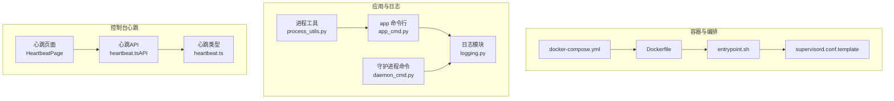
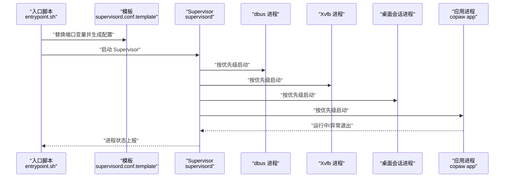
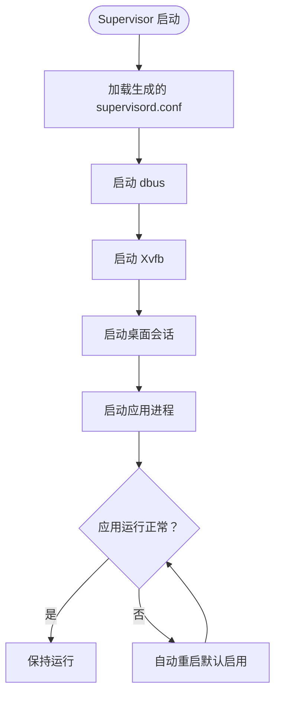
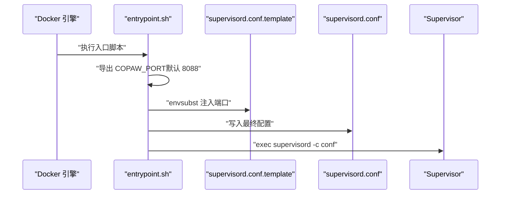
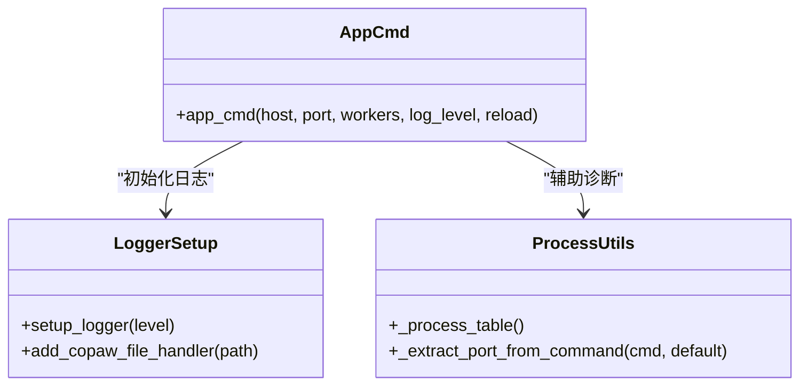
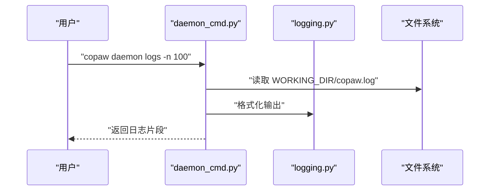
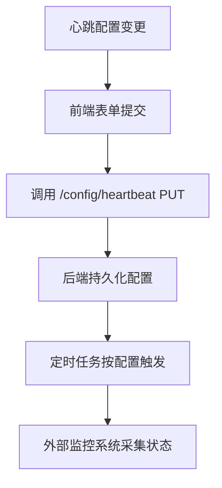
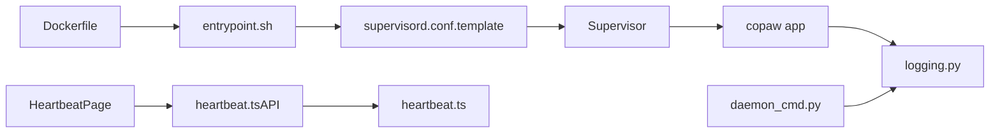

# 进程管理配置

<cite>
**本文引用的文件**
- [supervisord.conf.template](file://deploy/config/supervisord.conf.template)
- [Dockerfile](file://deploy/Dockerfile)
- [entrypoint.sh](file://deploy/entrypoint.sh)
- [docker-compose.yml](file://docker-compose.yml)
- [logging.py](file://src/copaw/utils/logging.py)
- [app_cmd.py](file://src/copaw/cli/app_cmd.py)
- [daemon_cmd.py](file://src/copaw/cli/daemon_cmd.py)
- [process_utils.py](file://src/copaw/cli/process_utils.py)
- [heartbeat.ts](file://console/src/api/types/heartbeat.ts)
- [heartbeat.ts（API）](file://console/src/api/modules/heartbeat.ts)
- [HeartbeatPage](file://console/src/pages/Control/Heartbeat/index.tsx)
</cite>

## 目录
1. [简介](#简介)
2. [项目结构](#项目结构)
3. [核心组件](#核心组件)
4. [架构总览](#架构总览)
5. [详细组件分析](#详细组件分析)
6. [依赖关系分析](#依赖关系分析)
7. [性能考量](#性能考量)
8. [故障排除指南](#故障排除指南)
9. [结论](#结论)
10. [附录](#附录)

## 简介
本文件面向运维与平台工程团队，系统化阐述 CoPaw 的进程管理配置与最佳实践，覆盖 Supervisor 进程编排、自动重启策略、日志管理、进程监控与服务发现、容器化部署与健康检查、优雅关闭等主题。文档以仓库中实际实现为依据，提供可操作的配置说明与排障建议。

## 项目结构
围绕进程管理的关键文件分布如下：
- 容器与进程编排：Dockerfile、docker-compose.yml、entrypoint.sh、supervisord.conf.template
- 应用入口与日志：app 命令行、日志模块、守护进程命令
- 控制台心跳配置：类型定义、API 与前端页面

图表来源
- [Dockerfile:1-103](file://deploy/Dockerfile#L1-L103)
- [docker-compose.yml:1-23](file://docker-compose.yml#L1-L23)
- [entrypoint.sh:1-10](file://deploy/entrypoint.sh#L1-L10)
- [supervisord.conf.template:1-40](file://deploy/config/supervisord.conf.template#L1-L40)
- [app_cmd.py:1-97](file://src/copaw/cli/app_cmd.py#L1-L97)
- [logging.py:1-185](file://src/copaw/utils/logging.py#L1-L185)
- [daemon_cmd.py:1-124](file://src/copaw/cli/daemon_cmd.py#L1-L124)
- [process_utils.py:1-237](file://src/copaw/cli/process_utils.py#L1-L237)
- [heartbeat.ts:1-11](file://console/src/api/types/heartbeat.ts#L1-L11)
- [heartbeat.ts（API）:1-12](file://console/src/api/modules/heartbeat.ts#L1-L12)
- [HeartbeatPage:50-219](file://console/src/pages/Control/Heartbeat/index.tsx#L50-L219)

章节来源
- [Dockerfile:1-103](file://deploy/Dockerfile#L1-L103)
- [docker-compose.yml:1-23](file://docker-compose.yml#L1-L23)
- [entrypoint.sh:1-10](file://deploy/entrypoint.sh#L1-L10)
- [supervisord.conf.template:1-40](file://deploy/config/supervisord.conf.template#L1-L40)
- [app_cmd.py:1-97](file://src/copaw/cli/app_cmd.py#L1-L97)
- [logging.py:1-185](file://src/copaw/utils/logging.py#L1-L185)
- [daemon_cmd.py:1-124](file://src/copaw/cli/daemon_cmd.py#L1-L124)
- [process_utils.py:1-237](file://src/copaw/cli/process_utils.py#L1-L237)
- [heartbeat.ts:1-11](file://console/src/api/types/heartbeat.ts#L1-L11)
- [heartbeat.ts（API）:1-12](file://console/src/api/modules/heartbeat.ts#L1-L12)
- [HeartbeatPage:50-219](file://console/src/pages/Control/Heartbeat/index.tsx#L50-L219)

## 核心组件
- Supervisor 进程编排：通过模板生成最终配置，统一管理 dbus、Xvfb、桌面会话与应用进程。
- 容器入口脚本：在启动时替换端口变量并启动 Supervisor。
- 应用进程：FastAPI 服务，支持多 worker、日志级别与访问日志过滤。
- 日志模块：控制台输出与可选文件落盘，跨平台兼容与轮转策略。
- 守护进程命令：CLI 提供 status/restart/reload-config/version/logs 等能力。
- 进程工具：跨平台进程快照与匹配，辅助诊断与定位。
- 心跳配置：控制台提供心跳开关、周期、目标与活跃时段配置。

章节来源
- [supervisord.conf.template:1-40](file://deploy/config/supervisord.conf.template#L1-L40)
- [entrypoint.sh:1-10](file://deploy/entrypoint.sh#L1-L10)
- [app_cmd.py:1-97](file://src/copaw/cli/app_cmd.py#L1-L97)
- [logging.py:1-185](file://src/copaw/utils/logging.py#L1-L185)
- [daemon_cmd.py:1-124](file://src/copaw/cli/daemon_cmd.py#L1-L124)
- [process_utils.py:1-237](file://src/copaw/cli/process_utils.py#L1-L237)
- [heartbeat.ts:1-11](file://console/src/api/types/heartbeat.ts#L1-L11)
- [heartbeat.ts（API）:1-12](file://console/src/api/modules/heartbeat.ts#L1-L12)
- [HeartbeatPage:50-219](file://console/src/pages/Control/Heartbeat/index.tsx#L50-L219)

## 架构总览
下图展示容器内进程生命周期与关键交互：

图表来源
- [entrypoint.sh:1-10](file://deploy/entrypoint.sh#L1-L10)
- [supervisord.conf.template:1-40](file://deploy/config/supervisord.conf.template#L1-L40)

章节来源
- [entrypoint.sh:1-10](file://deploy/entrypoint.sh#L1-L10)
- [supervisord.conf.template:1-40](file://deploy/config/supervisord.conf.template#L1-L40)

## 详细组件分析

### Supervisor 进程管理配置
- 进程定义与启动参数
  - dbus：系统总线守护，使用命令行启动并设置 autostart/autorestart。
  - Xvfb：虚拟显示服务器，用于无头环境运行桌面应用。
  - 桌面会话：在 Xvfb 就绪后启动桌面会话。
  - 应用：通过 copaw app 启动 FastAPI 服务，绑定主机与端口。
- 工作目录与用户权限
  - 全局 user 设置为 root；各 program 可根据需要单独设置 user（当前模板未显式设置）。
- 自动重启策略
  - 所有 program 默认 autorestart=true，未配置重启延迟与失败次数上限。
- 日志管理
  - 每个 program 配置独立的 stdout/stderr 日志文件路径。
- 优先级与依赖顺序
  - 通过 priority 控制启动顺序：Xvfb(10) < XFCE(20) < App(30) < DBus(未显式设置，默认较低)。

图表来源
- [supervisord.conf.template:1-40](file://deploy/config/supervisord.conf.template#L1-L40)

章节来源
- [supervisord.conf.template:1-40](file://deploy/config/supervisord.conf.template#L1-L40)

### 容器入口与端口注入
- 入口脚本负责：
  - 设置 COPAW_PORT（默认 8088），若未指定则使用默认值。
  - 使用 envsubst 替换模板中的端口变量，生成最终配置。
  - 启动 supervisord 并以前台方式运行，便于容器编排接管。
- docker-compose 映射本地 127.0.0.1:8088:8088，确保仅本机访问。

图表来源
- [entrypoint.sh:1-10](file://deploy/entrypoint.sh#L1-L10)
- [docker-compose.yml:14-15](file://docker-compose.yml#L14-L15)

章节来源
- [entrypoint.sh:1-10](file://deploy/entrypoint.sh#L1-L10)
- [docker-compose.yml:14-15](file://docker-compose.yml#L14-L15)

### 应用进程与日志管理
- 应用启动参数
  - 支持 --host/--port/--workers/--log-level/--reload 等选项。
  - 记录最后一次使用的 host/port，便于其他终端复用。
- 日志配置
  - 控制台输出：彩色格式、包命名空间过滤、仅输出 copaw.*。
  - 文件落盘：跨平台适配（Windows/Linux 使用普通文件句柄，macOS 使用轮转）。
  - 访问日志过滤：可隐藏特定路径的 uvicorn access 日志。
- 进程工具
  - 跨平台进程快照与匹配，辅助识别应用进程与端口解析。

图表来源
- [app_cmd.py:1-97](file://src/copaw/cli/app_cmd.py#L1-L97)
- [logging.py:1-185](file://src/copaw/utils/logging.py#L1-L185)
- [process_utils.py:1-237](file://src/copaw/cli/process_utils.py#L1-L237)

章节来源
- [app_cmd.py:1-97](file://src/copaw/cli/app_cmd.py#L1-L97)
- [logging.py:1-185](file://src/copaw/utils/logging.py#L1-L185)
- [process_utils.py:1-237](file://src/copaw/cli/process_utils.py#L1-L237)

### 守护进程命令与日志查看
- CLI 提供：
  - status：展示工作目录、配置与内存管理器信息。
  - restart：打印重启说明（容器内由 Supervisor 管理进程生命周期）。
  - reload-config：重新读取配置。
  - version：版本与路径信息。
  - logs：查看 copaw.log 最后 N 行（1~2000）。
- 与应用日志模块协同，统一日志输出与落盘策略。

图表来源
- [daemon_cmd.py:105-124](file://src/copaw/cli/daemon_cmd.py#L105-L124)
- [logging.py:142-185](file://src/copaw/utils/logging.py#L142-L185)

章节来源
- [daemon_cmd.py:1-124](file://src/copaw/cli/daemon_cmd.py#L1-L124)
- [logging.py:1-185](file://src/copaw/utils/logging.py#L1-L185)

### 进程监控与健康检查
- 进程监控
  - Supervisor 自动重启策略：默认 autorestart=true，未配置重启延迟与失败次数上限。
  - 进程优先级：Xvfb(10) < XFCE(20) < App(30)，确保显示栈先于应用启动。
- 健康检查与外部集成
  - 控制台提供心跳配置（开关、周期、目标、活跃时段），可通过 API 更新并持久化。
  - 心跳目标支持“主会话”和“最后会话”，周期单位支持分钟/小时。
  - 外部监控系统可结合 Supervisor 状态与应用日志进行集成。

图表来源
- [heartbeat.ts:1-11](file://console/src/api/types/heartbeat.ts#L1-L11)
- [heartbeat.ts（API）:1-12](file://console/src/api/modules/heartbeat.ts#L1-L12)
- [HeartbeatPage:50-219](file://console/src/pages/Control/Heartbeat/index.tsx#L50-L219)

章节来源
- [heartbeat.ts:1-11](file://console/src/api/types/heartbeat.ts#L1-L11)
- [heartbeat.ts（API）:1-12](file://console/src/api/modules/heartbeat.ts#L1-L12)
- [HeartbeatPage:50-219](file://console/src/pages/Control/Heartbeat/index.tsx#L50-L219)

### 容器化部署与资源限制
- Dockerfile 关键点
  - 分阶段构建前端产物并注入到运行镜像。
  - 安装 Python、Chromium、Supervisor、桌面环境与字体。
  - 设置运行时环境变量（如 COPAW_PORT、COPAW_RUNNING_IN_CONTAINER、PLAYWRIGHT_*）。
  - 初始化工作目录与默认配置。
- docker-compose
  - 仅映射本地 127.0.0.1:8088:8088，避免外网暴露。
  - 维护数据卷 copaw-data 与 copaw-secrets。
- 健康检查与优雅关闭
  - 当前未提供容器健康检查探针或优雅关闭信号处理。
  - 建议在生产环境中补充 liveness/readiness 探针与 SIGTERM 处理。

章节来源
- [Dockerfile:1-103](file://deploy/Dockerfile#L1-L103)
- [docker-compose.yml:1-23](file://docker-compose.yml#L1-L23)

## 依赖关系分析
- 容器层
  - Dockerfile 依赖构建产物与运行时依赖。
  - entrypoint.sh 依赖 supervisord.conf.template 与 envsubst。
- 进程层
  - Supervisor 依赖各 program 的命令与环境变量。
  - 应用进程依赖日志模块与配置加载。
- 控制层
  - CLI 守护进程命令依赖日志模块与配置。
  - 前端心跳页面依赖心跳 API 类型与接口。

图表来源
- [Dockerfile:1-103](file://deploy/Dockerfile#L1-L103)
- [entrypoint.sh:1-10](file://deploy/entrypoint.sh#L1-L10)
- [supervisord.conf.template:1-40](file://deploy/config/supervisord.conf.template#L1-L40)
- [app_cmd.py:1-97](file://src/copaw/cli/app_cmd.py#L1-L97)
- [logging.py:1-185](file://src/copaw/utils/logging.py#L1-L185)
- [daemon_cmd.py:1-124](file://src/copaw/cli/daemon_cmd.py#L1-L124)
- [heartbeat.ts:1-11](file://console/src/api/types/heartbeat.ts#L1-L11)
- [heartbeat.ts（API）:1-12](file://console/src/api/modules/heartbeat.ts#L1-L12)
- [HeartbeatPage:50-219](file://console/src/pages/Control/Heartbeat/index.tsx#L50-L219)

章节来源
- [Dockerfile:1-103](file://deploy/Dockerfile#L1-L103)
- [entrypoint.sh:1-10](file://deploy/entrypoint.sh#L1-L10)
- [supervisord.conf.template:1-40](file://deploy/config/supervisord.conf.template#L1-L40)
- [app_cmd.py:1-97](file://src/copaw/cli/app_cmd.py#L1-L97)
- [logging.py:1-185](file://src/copaw/utils/logging.py#L1-L185)
- [daemon_cmd.py:1-124](file://src/copaw/cli/daemon_cmd.py#L1-L124)
- [heartbeat.ts:1-11](file://console/src/api/types/heartbeat.ts#L1-L11)
- [heartbeat.ts（API）:1-12](file://console/src/api/modules/heartbeat.ts#L1-L12)
- [HeartbeatPage:50-219](file://console/src/pages/Control/Heartbeat/index.tsx#L50-L219)

## 性能考量
- 进程优先级与启动顺序
  - 合理设置 priority，确保显示栈先于应用启动，减少应用等待时间。
- 日志轮转与 IO
  - macOS 使用 RotatingFileHandler，避免单文件过大；Windows/Linux 使用普通文件句柄，降低锁竞争。
- 多 worker 与并发
  - 应用支持多 worker，需结合 CPU 与内存资源评估，避免过度竞争。
- 访问日志过滤
  - 对高频访问路径进行过滤，降低日志噪声与 IO 压力。

## 故障排除指南
- 应用无法启动或频繁退出
  - 检查 Supervisor 日志文件（dbus/xvfb/xfce4/app）确认启动顺序与错误。
  - 若出现显示相关问题，确认 Xvfb 与桌面会话已就绪。
- 端口占用或绑定失败
  - 使用进程工具函数解析命令行参数，确认 --port 是否正确传入。
  - 在容器内验证 COPAW_PORT 是否被正确注入。
- 日志缺失或过大
  - 检查是否添加了文件处理器，确认平台差异下的落盘策略。
  - macOS 上注意轮转备份数量与大小限制。
- 心跳不生效
  - 检查控制台心跳配置是否保存成功，确认周期与目标设置。
  - 核对定时任务是否按配置触发。

章节来源
- [supervisord.conf.template:1-40](file://deploy/config/supervisord.conf.template#L1-L40)
- [entrypoint.sh:1-10](file://deploy/entrypoint.sh#L1-L10)
- [logging.py:142-185](file://src/copaw/utils/logging.py#L142-L185)
- [process_utils.py:198-201](file://src/copaw/cli/process_utils.py#L198-L201)
- [HeartbeatPage:77-96](file://console/src/pages/Control/Heartbeat/index.tsx#L77-L96)

## 结论
CoPaw 的进程管理以 Supervisor 为核心，结合容器入口脚本完成端口注入与进程编排。应用层提供灵活的日志策略与守护进程命令，控制台支持心跳配置与外部监控集成。建议在生产环境中补充健康检查探针与优雅关闭处理，并根据业务负载调整 worker 数量与日志策略，以获得更稳健的运行表现。

## 附录
- 关键配置项速查
  - 端口：COPAW_PORT（默认 8088）
  - 显示环境：DISPLAY、PLAYWRIGHT_CHROMIUM_EXECUTABLE_PATH、COPAW_RUNNING_IN_CONTAINER
  - 日志级别：--log-level（critical/error/warning/info/debug/trace）
  - 访问日志过滤：--hide-access-paths（可重复）