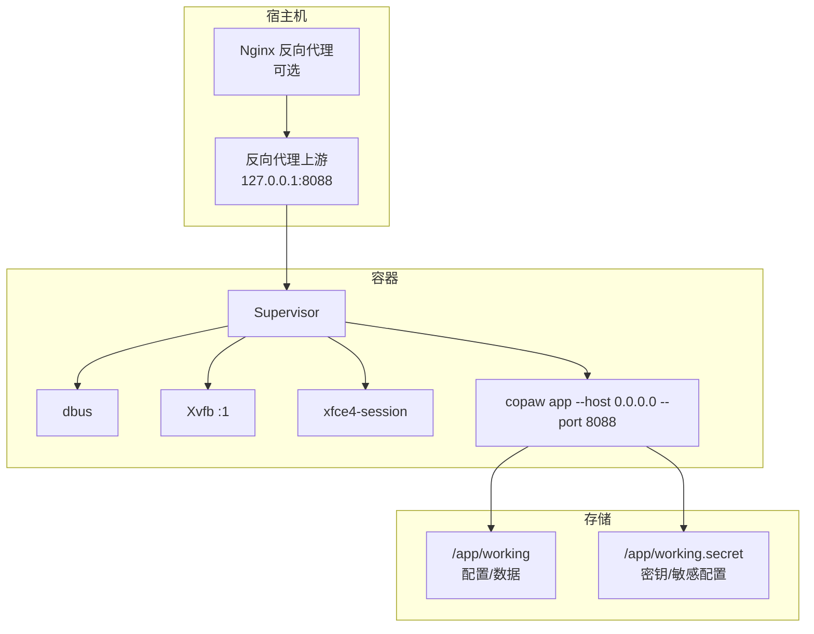
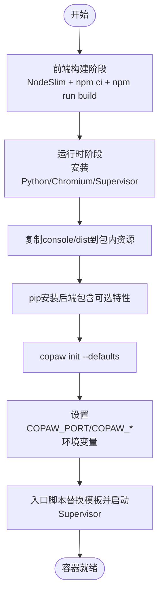
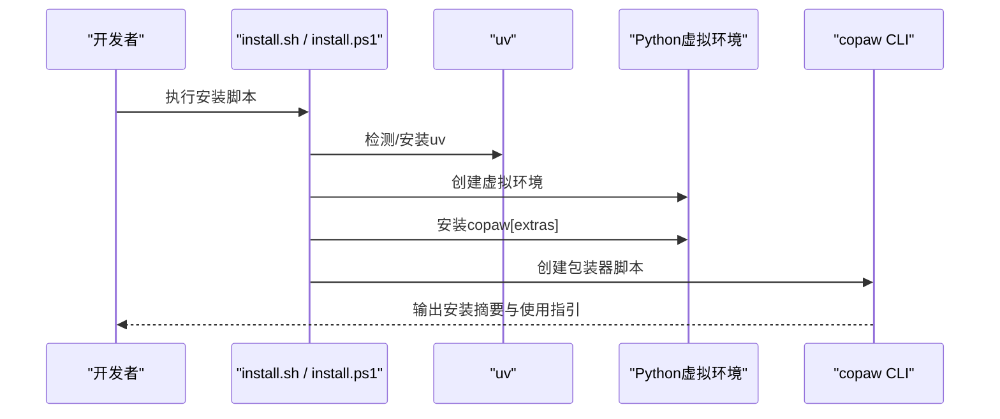
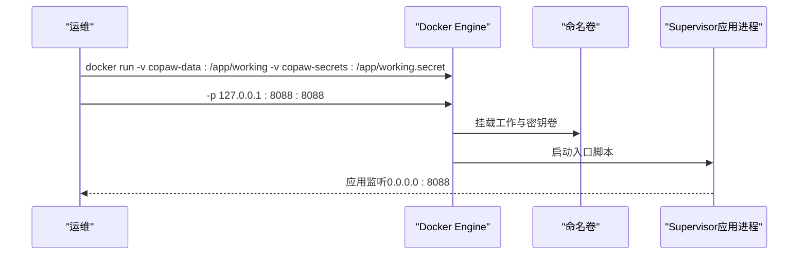
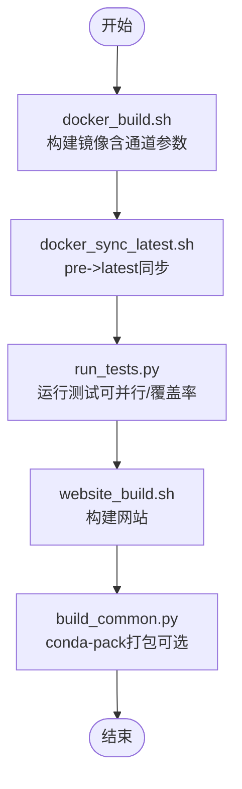
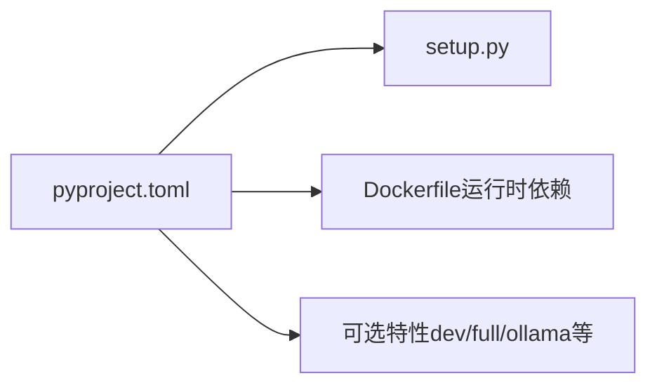

# 部署与运维

<cite>
**本文引用的文件**
- [deploy/Dockerfile](file://deploy/Dockerfile)
- [docker-compose.yml](file://docker-compose.yml)
- [deploy/entrypoint.sh](file://deploy/entrypoint.sh)
- [deploy/config/supervisord.conf.template](file://deploy/config/supervisord.conf.template)
- [scripts/docker_build.sh](file://scripts/docker_build.sh)
- [scripts/docker_sync_latest.sh](file://scripts/docker_sync_latest.sh)
- [scripts/install.sh](file://scripts/install.sh)
- [scripts/install.ps1](file://scripts/install.ps1)
- [scripts/run_tests.py](file://scripts/run_tests.py)
- [scripts/website_build.sh](file://scripts/website_build.sh)
- [scripts/pack/build_common.py](file://scripts/pack/build_common.py)
- [pyproject.toml](file://pyproject.toml)
- [setup.py](file://setup.py)
- [README.md](file://README.md)
</cite>

## 目录
1. [简介](#简介)
2. [项目结构](#项目结构)
3. [核心组件](#核心组件)
4. [架构总览](#架构总览)
5. [详细组件分析](#详细组件分析)
6. [依赖分析](#依赖分析)
7. [性能考虑](#性能考虑)
8. [故障排除指南](#故障排除指南)
9. [结论](#结论)
10. [附录](#附录)

## 简介
本文件面向运维与开发团队，提供CoPaw的完整部署与运维指南，覆盖以下方面：
- Docker容器化部署与镜像构建
- 本地开发环境搭建（含前端构建、后端运行、测试）
- 生产环境部署（含卷管理、环境变量、服务编排）
- 开发环境热重载与调试建议
- 日志与可观测性配置
- Nginx反向代理、SSL证书与性能监控
- 自动构建、测试与发布流程
- 故障排除与运维最佳实践
- 不同部署场景的配置差异与注意事项

## 项目结构
CoPaw采用前后端分离架构：前端位于console目录，通过多阶段Dockerfile在构建阶段生成dist；后端为Python包，打包时将console/dist注入到包内资源，最终由容器内的入口脚本启动Supervisor托管的应用进程。

```mermaid
graph TB
subgraph "构建产物"
A["console/dist<br/>前端构建输出"]
end
subgraph "后端包"
B["src/copaw/<br/>Python源码"]
C["pyproject.toml<br/>依赖与可选特性"]
D["setup.py<br/>构建入口"]
end
subgraph "容器层"
E["deploy/Dockerfile<br/>多阶段构建"]
F["deploy/entrypoint.sh<br/>启动Supervisor"]
G["deploy/config/supervisord.conf.template<br/>应用与桌面虚拟显示"]
end
A --> E
B --> E
C --> E
D --> E
E --> F
F --> G
```

图示来源
- [deploy/Dockerfile:1-103](file://deploy/Dockerfile#L1-L103)
- [deploy/entrypoint.sh:1-10](file://deploy/entrypoint.sh#L1-L10)
- [deploy/config/supervisord.conf.template:1-40](file://deploy/config/supervisord.conf.template#L1-L40)
- [pyproject.toml:1-101](file://pyproject.toml#L1-L101)
- [setup.py:1-5](file://setup.py#L1-L5)

章节来源
- [deploy/Dockerfile:1-103](file://deploy/Dockerfile#L1-L103)
- [docker-compose.yml:1-23](file://docker-compose.yml#L1-L23)
- [deploy/entrypoint.sh:1-10](file://deploy/entrypoint.sh#L1-L10)
- [deploy/config/supervisord.conf.template:1-40](file://deploy/config/supervisord.conf.template#L1-L40)
- [pyproject.toml:1-101](file://pyproject.toml#L1-L101)
- [setup.py:1-5](file://setup.py#L1-L5)

## 核心组件
- 多阶段Dockerfile
  - 前端构建阶段：基于NodeSlim镜像，安装并执行前端构建，产出dist。
  - 运行时阶段：安装Python、Chromium、Supervisor等运行时依赖，复制后端源码与前端dist，安装Python包（含可选特性），初始化工作目录，暴露端口并以入口脚本启动Supervisor。
- 入口脚本
  - 使用环境变量替换模板中的端口，生成Supervisor配置并启动。
- Supervisor配置模板
  - 启动dbus、Xvfb、XFCE4以及应用进程，设置显示环境变量与日志输出。
- 本地安装器
  - install.sh（Linux/macOS）与install.ps1（Windows）：自动检测/安装uv，创建虚拟环境，安装Python包（支持可选特性），准备包装器脚本，并更新PATH或注册表。
- 测试与网站构建脚本
  - run_tests.py：统一运行单元与集成测试，支持覆盖率与并行。
  - website_build.sh：网站前端构建（Vite）。
- 打包脚本
  - build_common.py：用于conda-pack打包，处理特定包的兼容问题与预编译依赖。

章节来源
- [deploy/Dockerfile:1-103](file://deploy/Dockerfile#L1-L103)
- [deploy/entrypoint.sh:1-10](file://deploy/entrypoint.sh#L1-L10)
- [deploy/config/supervisord.conf.template:1-40](file://deploy/config/supervisord.conf.template#L1-L40)
- [scripts/install.sh:1-340](file://scripts/install.sh#L1-L340)
- [scripts/install.ps1:1-477](file://scripts/install.ps1#L1-L477)
- [scripts/run_tests.py:1-282](file://scripts/run_tests.py#L1-L282)
- [scripts/website_build.sh:1-28](file://scripts/website_build.sh#L1-L28)
- [scripts/pack/build_common.py:1-321](file://scripts/pack/build_common.py#L1-L321)

## 架构总览
CoPaw容器内通过Supervisor托管多个进程：虚拟显示栈（Xvfb + XFCE4 + dbus）与应用进程（copaw app）。容器对外暴露固定端口，数据与密钥分别挂载到独立卷，便于持久化与隔离。

图示来源
- [deploy/config/supervisord.conf.template:1-40](file://deploy/config/supervisord.conf.template#L1-L40)
- [deploy/entrypoint.sh:1-10](file://deploy/entrypoint.sh#L1-L10)
- [docker-compose.yml:1-23](file://docker-compose.yml#L1-L23)

章节来源
- [deploy/config/supervisord.conf.template:1-40](file://deploy/config/supervisord.conf.template#L1-L40)
- [deploy/entrypoint.sh:1-10](file://deploy/entrypoint.sh#L1-L10)
- [docker-compose.yml:1-23](file://docker-compose.yml#L1-L23)

## 详细组件分析

### Docker镜像构建与容器编排
- 多阶段构建
  - 前端构建：在专用阶段使用NodeSlim镜像，执行npm ci与构建，产物复制至运行时镜像。
  - 运行时镜像：安装Python、Chromium、Supervisor、vim、gettext、Xfce4等依赖；设置PLAYWRIGHT_*环境变量以使用系统Chromium；创建Python虚拟环境并安装后端包（含可选特性）；初始化工作目录；暴露端口并设置入口脚本。
- 端口与环境变量
  - 默认端口8088，可通过环境变量覆盖；容器内通过入口脚本将端口注入Supervisor配置。
- 数据持久化
  - 工作目录与密钥目录分别映射到独立命名卷，确保配置与密钥分离。
- 服务编排
  - docker-compose定义了两个命名卷与单个服务，限制容器绑定到本地回环地址，仅用于演示；生产中建议结合反向代理与网络策略。

图示来源
- [deploy/Dockerfile:1-103](file://deploy/Dockerfile#L1-L103)
- [deploy/entrypoint.sh:1-10](file://deploy/entrypoint.sh#L1-L10)

章节来源
- [deploy/Dockerfile:1-103](file://deploy/Dockerfile#L1-L103)
- [deploy/entrypoint.sh:1-10](file://deploy/entrypoint.sh#L1-L10)
- [docker-compose.yml:1-23](file://docker-compose.yml#L1-L23)

### 本地开发环境搭建
- 脚本安装（推荐）
  - Linux/macOS：curl安装脚本自动检测/安装uv，创建虚拟环境，安装包（支持可选特性），创建包装器脚本并更新PATH。
  - Windows：PowerShell一键安装，支持自动下载uv（GitHub Releases备用）、更新用户环境变量，创建cmd与ps1包装器。
- 源码安装
  - 先构建前端dist，再复制到后端包内资源目录，最后以可编辑模式安装后端包。
- 测试运行
  - 统一测试脚本支持运行单元/集成测试、覆盖率与并行执行。

图示来源
- [scripts/install.sh:1-340](file://scripts/install.sh#L1-L340)
- [scripts/install.ps1:1-477](file://scripts/install.ps1#L1-L477)

章节来源
- [scripts/install.sh:1-340](file://scripts/install.sh#L1-L340)
- [scripts/install.ps1:1-477](file://scripts/install.ps1#L1-L477)
- [README.md:425-446](file://README.md#L425-L446)

### 生产环境部署
- 镜像与标签
  - 提供latest与pre标签；支持阿里云ACR与Docker Hub。
- 卷与端口
  - 使用命名卷保存工作目录与密钥目录；容器监听0.0.0.0:8088，建议仅映射到127.0.0.1以限制外网访问。
- 环境变量
  - 支持COPAW_PORT、COPAW_*通道过滤、认证开关等（详见镜像构建与入口脚本）。
- 服务发现与网络
  - 如需访问宿主机服务（如Ollama/LM Studio），可使用host.docker.internal或host网络模式。

图示来源
- [docker-compose.yml:1-23](file://docker-compose.yml#L1-L23)
- [deploy/entrypoint.sh:1-10](file://deploy/entrypoint.sh#L1-L10)
- [deploy/config/supervisord.conf.template:1-40](file://deploy/config/supervisord.conf.template#L1-L40)

章节来源
- [README.md:273-315](file://README.md#L273-L315)
- [docker-compose.yml:1-23](file://docker-compose.yml#L1-L23)

### 开发环境热重载与调试
- 前端热重载
  - 在本地开发时，可在console目录下进行开发与热重载（仓库未提供专门的开发服务器脚本，建议在console目录下使用标准前端开发方式）。
- 后端调试
  - 使用本地安装器安装后端包，通过copaw命令启动应用；结合日志与Supervisor日志定位问题。
- 测试驱动
  - 使用统一测试脚本运行单元/集成测试，支持覆盖率与并行，便于回归验证。

章节来源
- [scripts/run_tests.py:1-282](file://scripts/run_tests.py#L1-L282)
- [scripts/install.sh:1-340](file://scripts/install.sh#L1-L340)
- [scripts/install.ps1:1-477](file://scripts/install.ps1#L1-L477)

### 日志配置与可观测性
- 日志位置
  - Supervisor为每个程序配置了标准输出与错误日志文件路径，便于集中查看。
- 日志采集
  - 建议在容器外部或日志系统中收集/var/log下的日志文件，或通过容器日志驱动输出到集中式日志平台。
- 进程健康
  - Supervisor配置了自动重启策略，确保应用异常退出后自动恢复。

章节来源
- [deploy/config/supervisord.conf.template:1-40](file://deploy/config/supervisord.conf.template#L1-L40)

### Nginx反向代理、SSL与性能监控
- 反向代理
  - 建议在容器前部署Nginx，将请求转发至127.0.0.1:8088；可结合域名与证书实现HTTPS。
- SSL证书
  - 将证书与私钥放置于Nginx配置目录，启用TLS；注意证书链完整性与私钥权限。
- 性能监控
  - 结合Supervisor日志与应用日志，观察CPU/内存占用与响应时间；必要时引入APM或容器监控方案（如Prometheus/Grafana）。

（本节为通用运维建议，不直接分析具体文件）

### 自动构建、测试与发布
- Docker镜像构建
  - 使用脚本传入镜像标签与构建参数，支持通道白名单/黑名单控制；完成后给出运行示例。
- 镜像同步
  - 使用buildx imagetools将pre标签推送到latest，简化发布流程。
- 测试
  - 统一测试脚本支持按子目录运行单元测试、集成测试、覆盖率与并行执行。
- 网站构建
  - 网站前端构建脚本支持pnpm/npm自动降级，输出至dist目录。
- 打包
  - 打包脚本通过conda-pack生成便携环境，处理特定包的兼容问题与预编译依赖。

图示来源
- [scripts/docker_build.sh:1-32](file://scripts/docker_build.sh#L1-L32)
- [scripts/docker_sync_latest.sh:1-77](file://scripts/docker_sync_latest.sh#L1-L77)
- [scripts/run_tests.py:1-282](file://scripts/run_tests.py#L1-L282)
- [scripts/website_build.sh:1-28](file://scripts/website_build.sh#L1-L28)
- [scripts/pack/build_common.py:1-321](file://scripts/pack/build_common.py#L1-L321)

章节来源
- [scripts/docker_build.sh:1-32](file://scripts/docker_build.sh#L1-L32)
- [scripts/docker_sync_latest.sh:1-77](file://scripts/docker_sync_latest.sh#L1-L77)
- [scripts/run_tests.py:1-282](file://scripts/run_tests.py#L1-L282)
- [scripts/website_build.sh:1-28](file://scripts/website_build.sh#L1-L28)
- [scripts/pack/build_common.py:1-321](file://scripts/pack/build_common.py#L1-L321)

## 依赖分析
- Python包与可选特性
  - 通过pyproject.toml定义主依赖与可选特性（dev、local、llamacpp、mlx、ollama、whisper、full），用于本地安装与Docker安装。
- 构建系统
  - setup.py委托给setuptools构建元数据与包内容，pyproject.toml中声明动态版本与包数据包含规则。
- Docker镜像依赖
  - 运行时镜像安装Chromium、Supervisor、Xfce4等，确保应用具备图形界面与浏览器能力。

图示来源
- [pyproject.toml:1-101](file://pyproject.toml#L1-L101)
- [setup.py:1-5](file://setup.py#L1-L5)
- [deploy/Dockerfile:29-68](file://deploy/Dockerfile#L29-L68)

章节来源
- [pyproject.toml:1-101](file://pyproject.toml#L1-L101)
- [setup.py:1-5](file://setup.py#L1-L5)
- [deploy/Dockerfile:29-68](file://deploy/Dockerfile#L29-L68)

## 性能考虑
- 容器资源
  - 为容器分配足够的CPU/内存，避免Supervisor托管的桌面环境与应用竞争资源。
- 图形栈
  - Xvfb与XFCE4在容器内运行，建议在宿主机上优化显卡驱动与Chromium性能。
- 端口与网络
  - 仅映射必要端口，减少暴露面；如需访问宿主机服务，优先使用host.docker.internal而非host网络模式以降低冲突风险。
- 日志与IO
  - 控制日志级别与轮转，避免磁盘IO成为瓶颈；将日志输出到外部存储或集中式日志系统。

（本节为通用指导，不直接分析具体文件）

## 故障排除指南
- 容器无法启动或端口不可达
  - 检查Supervisor日志与应用日志；确认端口映射与防火墙设置；验证COPAW_PORT环境变量。
- 前端页面空白或资源加载失败
  - 确认console/dist已正确复制到包内资源；检查Dockerfile中dist复制步骤。
- 通道连接失败
  - 检查API密钥与网络连通性；如需访问宿主机服务，使用host.docker.internal或host网络模式。
- Windows安装器受限
  - Constrained Language Mode可能影响脚本执行与环境变量写入，按提示手动添加路径并重新打开终端。
- 测试失败
  - 使用统一测试脚本，开启并行与覆盖率，定位失败用例并复现问题。

章节来源
- [deploy/config/supervisord.conf.template:1-40](file://deploy/config/supervisord.conf.template#L1-L40)
- [deploy/Dockerfile:82-92](file://deploy/Dockerfile#L82-L92)
- [scripts/install.ps1:150-191](file://scripts/install.ps1#L150-L191)
- [scripts/run_tests.py:1-282](file://scripts/run_tests.py#L1-L282)

## 结论
本文提供了CoPaw从本地开发到生产部署的全链路运维指南，涵盖容器化、服务编排、环境变量、数据持久化、日志与监控、自动化构建与测试、以及常见问题排查。建议在生产环境中结合反向代理与SSL、严格的卷权限与网络策略，配合集中式日志与监控体系，确保系统的稳定性与安全性。

## 附录
- 快速参考
  - Docker构建：使用脚本传入镜像标签与通道参数，完成后运行容器并挂载卷。
  - 本地安装：Linux/macOS使用install.sh，Windows使用install.ps1，均可指定可选特性。
  - 测试：run_tests.py支持按子目录运行单元测试、集成测试、覆盖率与并行。
  - 网站构建：website_build.sh支持pnpm/npm自动降级并输出dist。
  - 打包：build_common.py用于conda-pack生成便携环境，处理特定包兼容问题。

章节来源
- [scripts/docker_build.sh:1-32](file://scripts/docker_build.sh#L1-L32)
- [scripts/install.sh:1-340](file://scripts/install.sh#L1-L340)
- [scripts/install.ps1:1-477](file://scripts/install.ps1#L1-L477)
- [scripts/run_tests.py:1-282](file://scripts/run_tests.py#L1-L282)
- [scripts/website_build.sh:1-28](file://scripts/website_build.sh#L1-L28)
- [scripts/pack/build_common.py:1-321](file://scripts/pack/build_common.py#L1-L321)