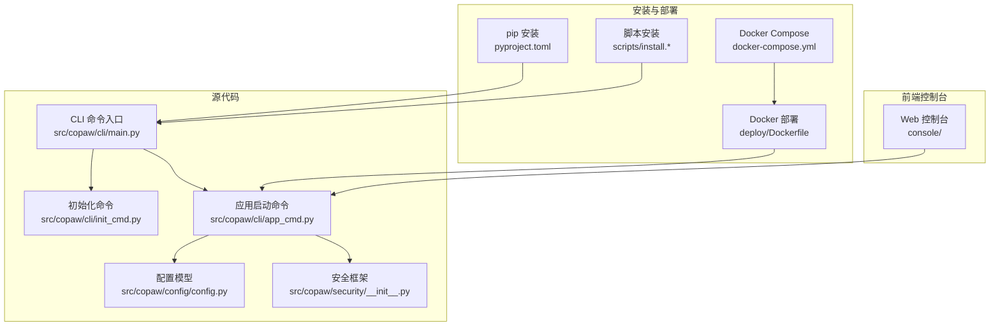
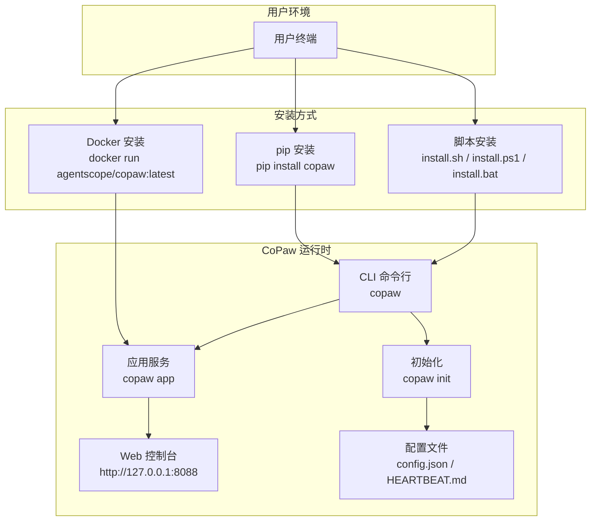
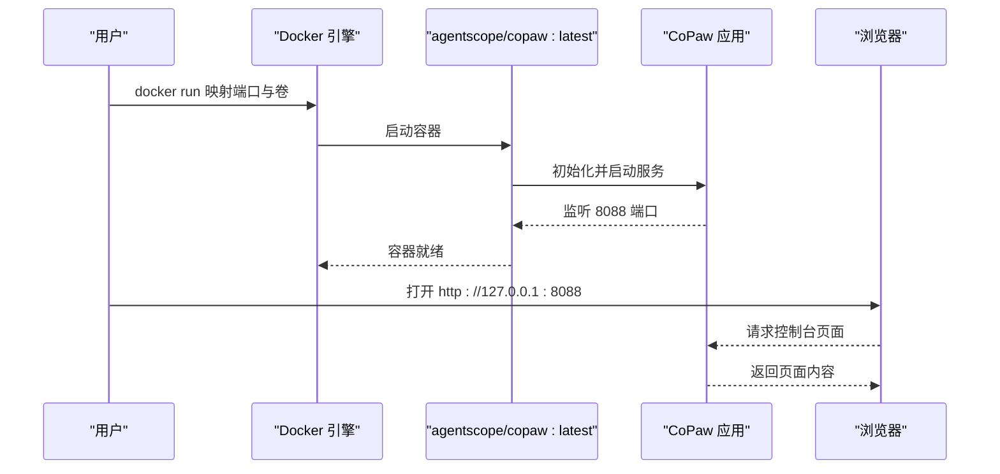
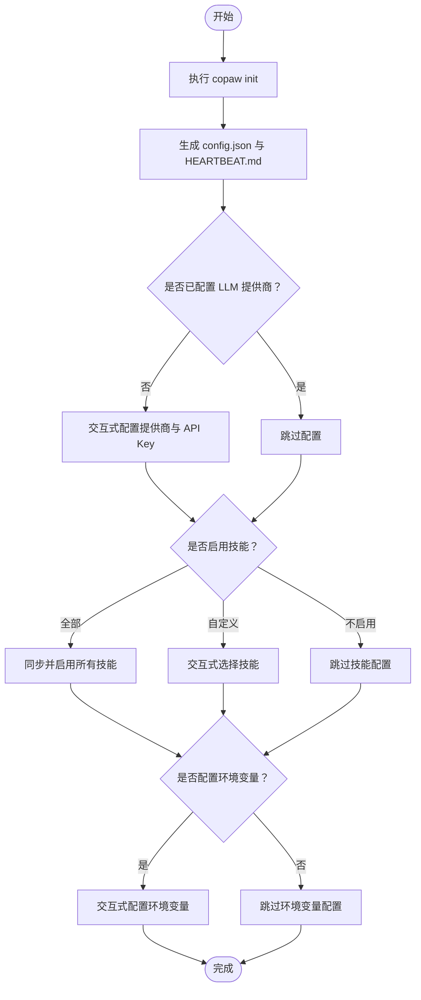
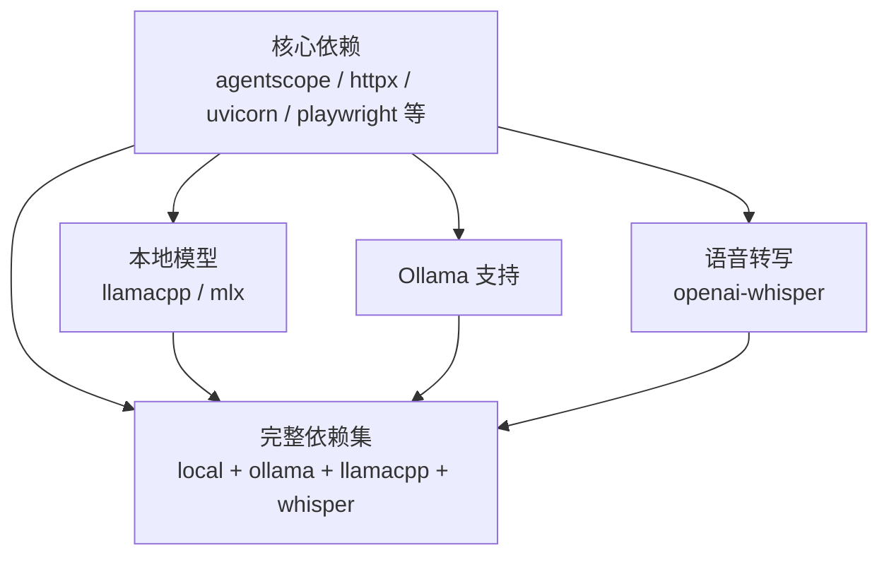

# 快速开始指南

<cite>
**本文档引用的文件**
- [README.md](file://README.md)
- [scripts/install.sh](file://scripts/install.sh)
- [scripts/install.bat](file://scripts/install.bat)
- [scripts/install.ps1](file://scripts/install.ps1)
- [deploy/Dockerfile](file://deploy/Dockerfile)
- [docker-compose.yml](file://docker-compose.yml)
- [deploy/entrypoint.sh](file://deploy/entrypoint.sh)
- [pyproject.toml](file://pyproject.toml)
- [setup.py](file://setup.py)
- [src/copaw/cli/main.py](file://src/copaw/cli/main.py)
- [src/copaw/cli/init_cmd.py](file://src/copaw/cli/init_cmd.py)
- [src/copaw/cli/app_cmd.py](file://src/copaw/cli/app_cmd.py)
- [src/copaw/config/config.py](file://src/copaw/config/config.py)
- [src/copaw/__main__.py](file://src/copaw/__main__.py)
- [src/copaw/security/__init__.py](file://src/copaw/security/__init__.py)
</cite>

## 目录
1. [简介](#简介)
2. [项目结构](#项目结构)
3. [核心组件](#核心组件)
4. [架构总览](#架构总览)
5. [详细组件分析](#详细组件分析)
6. [依赖关系分析](#依赖关系分析)
7. [性能考虑](#性能考虑)
8. [故障排除指南](#故障排除指南)
9. [结论](#结论)
10. [附录](#附录)

## 简介
CoPaw 是一款可在本地或云端运行的个人智能助手，支持多渠道聊天（如钉钉、飞书、QQ、Discord、iMessage 等），并具备可扩展的能力体系（Skills）。它提供三种安装方式：pip 安装（适合已有 Python 环境的用户）、脚本安装（自动处理 Python 环境，推荐新手）、Docker 安装（适合容器化部署）。首次启动后，您需要进行基础配置，包括初始化配置、API 密钥设置以及创建第一个代理。

## 项目结构
CoPaw 采用模块化设计，前端控制台位于 console 目录，后端服务通过 Python 包提供 CLI 和 Web 服务。部署相关文件位于 deploy 目录，安装脚本位于 scripts 目录，核心配置与安全机制在 src/copaw 中实现。

**图表来源**
- [src/copaw/cli/main.py:92-136](file://src/copaw/cli/main.py#L92-L136)
- [src/copaw/cli/init_cmd.py:119-142](file://src/copaw/cli/init_cmd.py#L119-L142)
- [src/copaw/cli/app_cmd.py:15-61](file://src/copaw/cli/app_cmd.py#L15-L61)
- [src/copaw/config/config.py:189-200](file://src/copaw/config/config.py#L189-L200)
- [src/copaw/security/__init__.py:1-17](file://src/copaw/security/__init__.py#L1-L17)
- [pyproject.toml:63-64](file://pyproject.toml#L63-L64)
- [scripts/install.sh:1-340](file://scripts/install.sh#L1-L340)
- [deploy/Dockerfile:1-103](file://deploy/Dockerfile#L1-L103)
- [docker-compose.yml:1-23](file://docker-compose.yml#L1-L23)

**章节来源**
- [README.md:99-180](file://README.md#L99-L180)
- [pyproject.toml:1-102](file://pyproject.toml#L1-L102)
- [scripts/install.sh:1-340](file://scripts/install.sh#L1-L340)
- [deploy/Dockerfile:1-103](file://deploy/Dockerfile#L1-L103)
- [docker-compose.yml:1-23](file://docker-compose.yml#L1-L23)

## 核心组件
- CLI 入口与命令分发：通过 Click 实现命令分组与延迟加载，支持 app、init、channels、models 等子命令。
- 初始化流程：交互式创建工作目录、配置文件、心跳检查清单，并可选择启用技能与环境变量。
- 应用启动：基于 Uvicorn 启动 FastAPI 服务，默认监听 127.0.0.1:8088。
- 配置系统：定义各渠道配置模型，支持多种第三方平台接入。
- 安全框架：工具调用防护与技能扫描，降低误用风险。

**章节来源**
- [src/copaw/cli/main.py:55-89](file://src/copaw/cli/main.py#L55-L89)
- [src/copaw/cli/init_cmd.py:119-492](file://src/copaw/cli/init_cmd.py#L119-L492)
- [src/copaw/cli/app_cmd.py:15-97](file://src/copaw/cli/app_cmd.py#L15-L97)
- [src/copaw/config/config.py:189-200](file://src/copaw/config/config.py#L189-L200)
- [src/copaw/security/__init__.py:1-17](file://src/copaw/security/__init__.py#L1-L17)

## 架构总览
CoPaw 的安装与运行架构如下：

**图表来源**
- [README.md:99-180](file://README.md#L99-L180)
- [scripts/install.sh:104-134](file://scripts/install.sh#L104-L134)
- [scripts/install.ps1:85-193](file://scripts/install.ps1#L85-L193)
- [scripts/install.bat:162-225](file://scripts/install.bat#L162-L225)
- [src/copaw/cli/main.py:146-162](file://src/copaw/cli/main.py#L146-L162)
- [src/copaw/cli/init_cmd.py:138-142](file://src/copaw/cli/init_cmd.py#L138-L142)
- [src/copaw/cli/app_cmd.py:54-61](file://src/copaw/cli/app_cmd.py#L54-L61)

## 详细组件分析

### 方式一：pip 安装（适合已有 Python 环境的用户）
- 适用场景：已在本地安装 Python 且希望手动管理依赖与环境。
- 前置条件：Python 3.10–3.13；网络可访问 PyPI。
- 步骤：
  1) 安装包：pip install copaw
  2) 初始化配置：copaw init --defaults 或交互式 copaw init
  3) 启动服务：copaw app
  4) 在浏览器打开 http://127.0.0.1:8088 访问控制台。
- 注意事项：
  - 如需本地模型支持，请安装额外可选依赖（见“本地模型”部分）。
  - 若网络受限，建议使用脚本安装或 Docker 安装。

**章节来源**
- [README.md:101-111](file://README.md#L101-L111)
- [pyproject.toml:63-64](file://pyproject.toml#L63-L64)

### 方式二：脚本安装（自动处理 Python 环境，推荐新手）
- 适用场景：无需手动准备 Python 环境，脚本自动完成安装与环境配置。
- 前置条件：网络可访问安装源；macOS/Linux 使用 curl；Windows 使用 PowerShell 或 CMD。
- 步骤（macOS/Linux）：
  1) 下载并执行安装脚本：curl -fsSL https://copaw.agentscope.io/install.sh | bash
  2) 可选：添加 --extras ollama 或 --extras llamacpp,mlx
  3) 重新打开终端后执行：copaw init --defaults；copaw app
- 步骤（Windows）：
  1) PowerShell：irm https://copaw.agentscope.io/install.ps1 | iex
  2) CMD：curl -fsSL https://copaw.agentscope.io/install.bat -o install.bat && install.bat
  3) 重新打开终端后执行：copaw init --defaults；copaw app
- 注意事项：
  - 脚本会自动检测并安装 uv（Python 包管理器），若网络受限可能无法下载，请参考脚本中的提示手动安装 uv。
  - Windows 企业版 LTSC 可能处于受限语言模式，导致环境变量无法自动更新，需按说明手动配置 PATH。

**章节来源**
- [README.md:115-180](file://README.md#L115-L180)
- [scripts/install.sh:104-134](file://scripts/install.sh#L104-L134)
- [scripts/install.ps1:85-193](file://scripts/install.ps1#L85-L193)
- [scripts/install.bat:162-225](file://scripts/install.bat#L162-L225)

### 方式三：Docker 安装（适合容器化部署）
- 适用场景：需要在容器中快速部署，或在受限环境中隔离运行。
- 前置条件：安装 Docker；确保主机端口 8088 未被占用。
- 步骤：
  1) 拉取镜像：docker pull agentscope/copaw:latest
  2) 运行容器：映射端口与数据卷，示例命令见下方“命令示例”
  3) 在浏览器打开 http://127.0.0.1:8088 访问控制台。
- 注意事项：
  - 数据持久化：使用两个命名卷分别保存配置与机密信息。
  - 本地模型：如需连接宿主机上的 Ollama 或其他服务，可使用 host.docker.internal 或 host 网络模式。
  - 中国用户可使用阿里云镜像仓库加速。

**图表来源**
- [README.md:273-314](file://README.md#L273-L314)
- [deploy/Dockerfile:89-95](file://deploy/Dockerfile#L89-L95)
- [docker-compose.yml:9-23](file://docker-compose.yml#L9-L23)

**章节来源**
- [README.md:273-314](file://README.md#L273-L314)
- [deploy/Dockerfile:1-103](file://deploy/Dockerfile#L1-L103)
- [docker-compose.yml:1-23](file://docker-compose.yml#L1-L23)
- [deploy/entrypoint.sh:1-10](file://deploy/entrypoint.sh#L1-L10)

### 首次启动后的基本配置
- 初始化配置：
  - 使用 copaw init --defaults 快速生成默认配置与心跳清单。
  - 交互式模式下可自定义心跳间隔、活跃时段、语言、音频模式等。
- API 密钥设置：
  - 控制台设置：在“设置 → 模型”中选择提供商并输入 API Key。
  - CLI 设置：copaw init 交互式引导配置。
  - 环境变量：在 shell 或工作目录 .env 文件中设置 DASHSCOPE_API_KEY 等。
- 第一个代理创建：
  - 初始化时会确保默认工作空间与内置 QA 代理存在。
  - 可在控制台“代理”页面创建与管理代理。

**图表来源**
- [src/copaw/cli/init_cmd.py:138-492](file://src/copaw/cli/init_cmd.py#L138-L492)

**章节来源**
- [src/copaw/cli/init_cmd.py:119-492](file://src/copaw/cli/init_cmd.py#L119-L492)
- [README.md:326-338](file://README.md#L326-L338)

### 安全注意事项
- 工具调用防护：对危险工具使用模式（如命令注入、数据外泄）进行参数扫描与拦截。
- 技能扫描：在安装/激活前对技能目录进行静态分析，识别潜在风险。
- 最佳实践：
  - 限制可触发渠道与用户范围，优先使用白名单。
  - 多用户共享实例时，使用独立配置与凭据，必要时分离 OS 用户或主机。
  - 将敏感信息置于代理工作目录之外，最小化工具权限。
  - 对处理不可信输入的代理使用更强大的模型。

**章节来源**
- [src/copaw/security/__init__.py:1-17](file://src/copaw/security/__init__.py#L1-L17)
- [src/copaw/cli/init_cmd.py:30-55](file://src/copaw/cli/init_cmd.py#L30-L55)

## 依赖关系分析
CoPaw 的依赖主要分为核心运行时依赖与可选功能依赖（如本地模型、Whisper 等）。可选依赖通过 extras 指定，便于按需安装。

**图表来源**
- [pyproject.toml:66-94](file://pyproject.toml#L66-L94)

**章节来源**
- [pyproject.toml:66-94](file://pyproject.toml#L66-L94)

## 性能考虑
- 启动优化：CLI 采用延迟加载子命令，减少启动时间。
- 日志与调试：支持 debug/trace 日志级别，便于定位问题。
- 容器运行：镜像预装 Chromium 并禁用沙箱以适配容器环境，同时提供 host 网络与 host.docker.internal 访问宿主机服务的方案。

**章节来源**
- [src/copaw/cli/main.py:55-89](file://src/copaw/cli/main.py#L55-L89)
- [src/copaw/cli/app_cmd.py:77-96](file://src/copaw/cli/app_cmd.py#L77-L96)
- [deploy/Dockerfile:71-78](file://deploy/Dockerfile#L71-L78)

## 故障排除指南
- pip 安装失败：
  - 检查 Python 版本是否在 3.10–3.13 之间。
  - 切换到国内镜像源或使用脚本安装。
- 脚本安装失败：
  - 确认网络可访问 astral.sh 或 GitHub Releases。
  - 手动安装 uv 并重试。
  - Windows LTSC 受限语言模式：按说明手动配置 PATH。
- Docker 启动异常：
  - 端口冲突：修改映射端口或停止占用进程。
  - 无法访问宿主机服务：使用 host.docker.internal 或 --network=host。
- API 密钥无效：
  - 在控制台“设置 → 模型”中确认提供商与密钥。
  - 或在 .env 文件中设置相应环境变量。

**章节来源**
- [README.md:149-173](file://README.md#L149-L173)
- [README.md:289-313](file://README.md#L289-L313)
- [README.md:326-338](file://README.md#L326-L338)

## 结论
通过三种安装方式，您可以根据自身环境与需求快速部署 CoPaw。首次启动后，按照初始化流程完成配置即可开始使用。建议在生产环境中遵循安全最佳实践，合理配置渠道与工具权限，并妥善保管 API 密钥与敏感信息。

## 附录

### 常用命令示例
- pip 安装与启动
  - pip install copaw
  - copaw init --defaults
  - copaw app
- 脚本安装（macOS/Linux）
  - curl -fsSL https://copaw.agentscope.io/install.sh | bash
  - 新终端：copaw init --defaults；copaw app
- 脚本安装（Windows）
  - PowerShell：irm https://copaw.agentscope.io/install.ps1 | iex
  - CMD：curl -fsSL https://copaw.agentscope.io/install.bat -o install.bat && install.bat
- Docker 安装
  - docker pull agentscope/copaw:latest
  - docker run -p 127.0.0.1:8088:8088 -v copaw-data:/app/working -v copaw-secrets:/app/working.secret agentscope/copaw:latest

**章节来源**
- [README.md:101-180](file://README.md#L101-L180)
- [README.md:273-314](file://README.md#L273-L314)