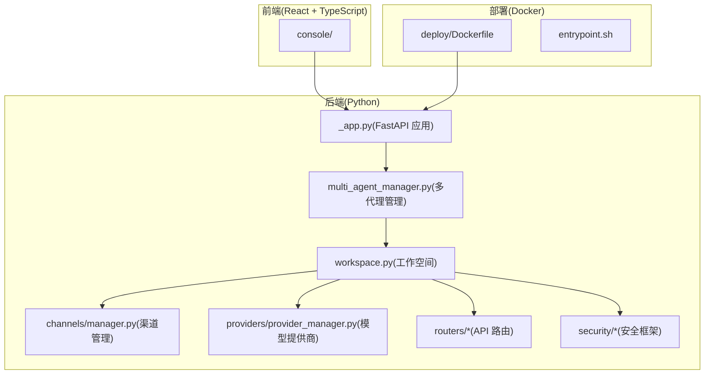
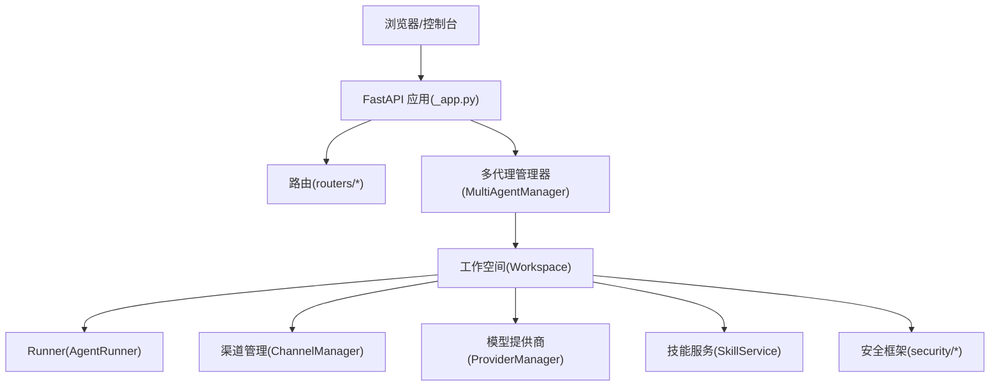
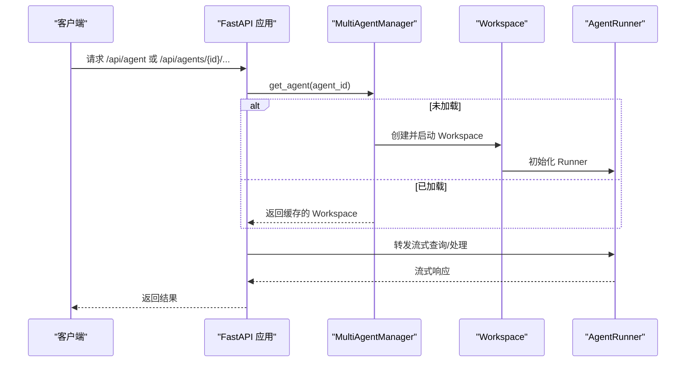
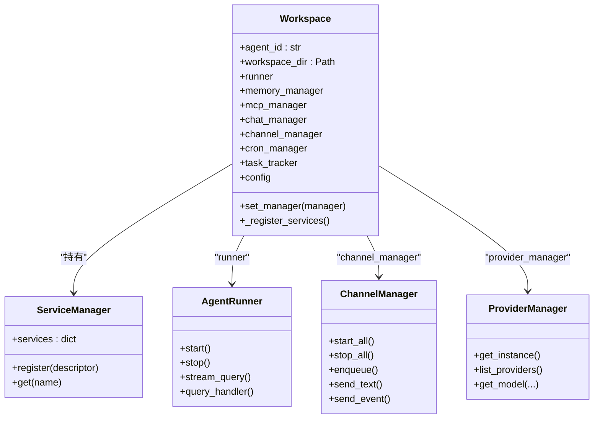
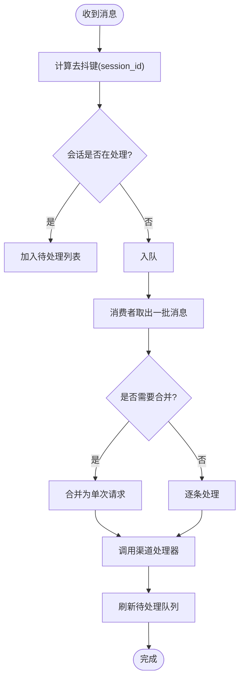
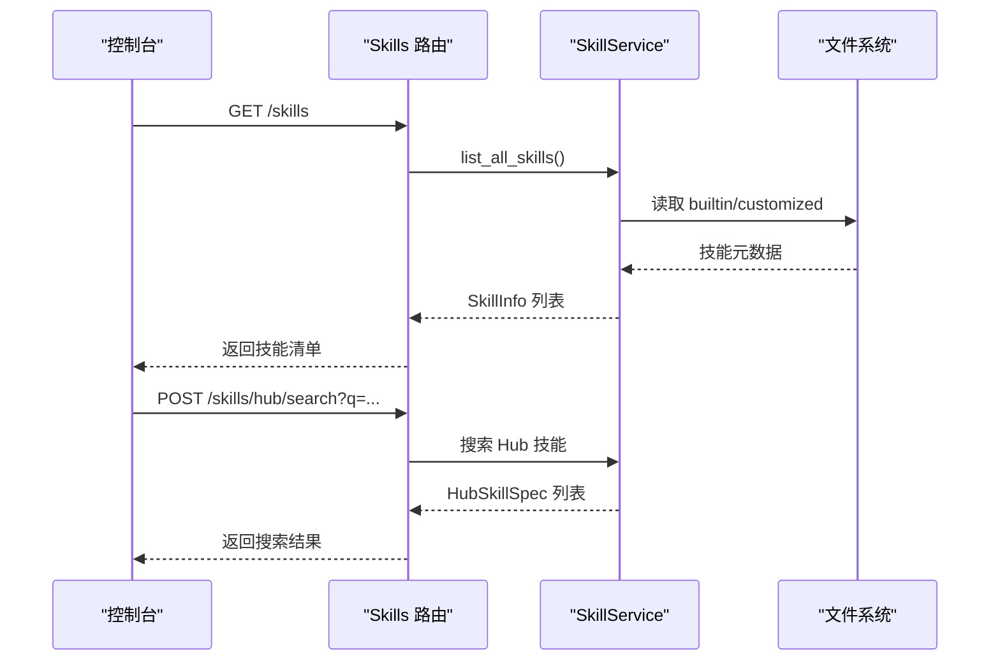
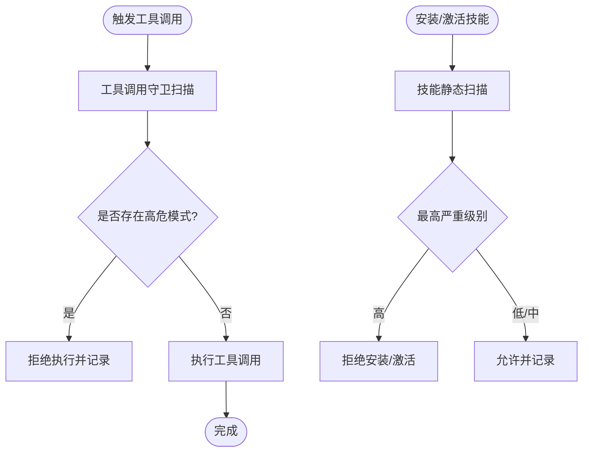
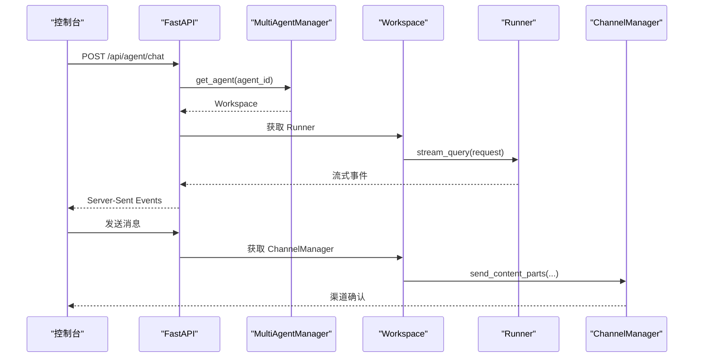
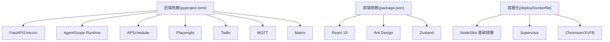

# 技术架构总览

<cite>
**本文档引用的文件**
- [README.md](file://README.md)
- [pyproject.toml](file://pyproject.toml)
- [console/package.json](file://console/package.json)
- [deploy/Dockerfile](file://deploy/Dockerfile)
- [src/copaw/__main__.py](file://src/copaw/__main__.py)
- [src/copaw/app/_app.py](file://src/copaw/app/_app.py)
- [src/copaw/app/multi_agent_manager.py](file://src/copaw/app/multi_agent_manager.py)
- [src/copaw/app/workspace/workspace.py](file://src/copaw/app/workspace/workspace.py)
- [src/copaw/app/channels/manager.py](file://src/copaw/app/channels/manager.py)
- [src/copaw/providers/provider_manager.py](file://src/copaw/providers/provider_manager.py)
- [src/copaw/app/routers/agent.py](file://src/copaw/app/routers/agent.py)
- [src/copaw/app/routers/skills.py](file://src/copaw/app/routers/skills.py)
- [src/copaw/security/__init__.py](file://src/copaw/security/__init__.py)
</cite>

## 目录
1. [引言](#引言)
2. [项目结构](#项目结构)
3. [核心组件](#核心组件)
4. [架构总览](#架构总览)
5. [详细组件分析](#详细组件分析)
6. [依赖关系分析](#依赖关系分析)
7. [性能考虑](#性能考虑)
8. [故障排除指南](#故障排除指南)
9. [结论](#结论)

## 引言
CoPaw 是一个可扩展的个人智能体工作站，支持多渠道通信（如钉钉、飞书、QQ、Discord、iMessage 等），具备技能中心、多代理管理、渠道适配器与安全防护等能力。其整体架构采用前后端分离设计：后端基于 Python + FastAPI 提供统一 API 与运行时；前端使用 React + TypeScript 构建控制台界面；通过 Docker 容器化实现跨平台部署。系统强调插件化扩展机制，允许用户在工作空间内动态启用/禁用技能，并通过 MCP（Model Context Protocol）客户端进行工具扩展。

## 项目结构
CoPaw 的代码库采用模块化组织方式，主要分为以下层次：
- 后端核心（Python）：位于 src/copaw 下，包含应用入口、路由、多代理管理、工作空间、渠道适配、模型提供商、技能管理、安全扫描等子系统。
- 前端控制台（React + TypeScript）：位于 console/ 目录，构建后产物打包到后端包中以提供静态资源。
- 部署与容器化：deploy/ 目录包含 Dockerfile、入口脚本与 Supervisor 配置模板，支持一键容器化部署。
- 文档与网站：website/ 目录提供文档站点与发布资源。

**图表来源**
- [src/copaw/app/_app.py:243-411](file://src/copaw/app/_app.py#L243-L411)
- [src/copaw/app/multi_agent_manager.py:17-451](file://src/copaw/app/multi_agent_manager.py#L17-L451)
- [src/copaw/app/workspace/workspace.py:39-200](file://src/copaw/app/workspace/workspace.py#L39-L200)
- [src/copaw/app/channels/manager.py:114-580](file://src/copaw/app/channels/manager.py#L114-L580)
- [src/copaw/providers/provider_manager.py:1-200](file://src/copaw/providers/provider_manager.py#L1-L200)
- [src/copaw/app/routers/agent.py:1-200](file://src/copaw/app/routers/agent.py#L1-L200)
- [src/copaw/app/routers/skills.py:1-200](file://src/copaw/app/routers/skills.py#L1-L200)
- [src/copaw/security/__init__.py:1-17](file://src/copaw/security/__init__.py#L1-L17)
- [deploy/Dockerfile:1-103](file://deploy/Dockerfile#L1-L103)

**章节来源**
- [README.md:1-500](file://README.md#L1-L500)
- [pyproject.toml:1-102](file://pyproject.toml#L1-L102)
- [console/package.json:1-60](file://console/package.json#L1-L60)
- [deploy/Dockerfile:1-103](file://deploy/Dockerfile#L1-L103)

## 核心组件
- 多代理管理系统：负责多个独立工作空间的懒加载、生命周期管理与零停机热重载。
- 工作空间：封装单个代理的完整运行时，包括 Runner、ChannelManager、MemoryManager、MCPClientManager、CronManager 等。
- 渠道适配器：统一接入多种即时通讯渠道，提供队列化消费、去抖合并与并发处理。
- 模型提供商管理：集中管理云厂商与本地模型，提供统一接口与能力探测。
- 技能中心：内置/自定义/激活三层技能树，支持同步、回溯与 Hub 安装。
- 安全防护：工具调用守卫与技能静态扫描，保障运行期安全。
- 控制台 API：提供文件读写、内存管理、技能配置、语音通道等接口。

**章节来源**
- [src/copaw/app/multi_agent_manager.py:17-451](file://src/copaw/app/multi_agent_manager.py#L17-L451)
- [src/copaw/app/workspace/workspace.py:39-200](file://src/copaw/app/workspace/workspace.py#L39-L200)
- [src/copaw/app/channels/manager.py:114-580](file://src/copaw/app/channels/manager.py#L114-L580)
- [src/copaw/providers/provider_manager.py:1-200](file://src/copaw/providers/provider_manager.py#L1-L200)
- [src/copaw/app/routers/skills.py:1-200](file://src/copaw/app/routers/skills.py#L1-L200)
- [src/copaw/security/__init__.py:1-17](file://src/copaw/security/__init__.py#L1-L17)

## 架构总览
CoPaw 采用“后端 API + 前端控制台 + 渠道适配 + 安全防护”的分层架构。后端以 FastAPI 作为入口，结合 AgentApp 运行时与多代理管理器，按需启动各工作空间。前端通过 REST/Server-Sent Events 与后端交互，实现聊天、技能配置、定时任务等操作。容器化部署通过 Dockerfile 将前端构建产物与后端打包，配合 Supervisor 管理进程。

**图表来源**
- [src/copaw/app/_app.py:142-248](file://src/copaw/app/_app.py#L142-L248)
- [src/copaw/app/multi_agent_manager.py:17-451](file://src/copaw/app/multi_agent_manager.py#L17-L451)
- [src/copaw/app/workspace/workspace.py:39-200](file://src/copaw/app/workspace/workspace.py#L39-L200)
- [src/copaw/providers/provider_manager.py:1-200](file://src/copaw/providers/provider_manager.py#L1-L200)
- [src/copaw/app/routers/agent.py:1-200](file://src/copaw/app/routers/agent.py#L1-L200)
- [src/copaw/app/routers/skills.py:1-200](file://src/copaw/app/routers/skills.py#L1-L200)
- [src/copaw/security/__init__.py:1-17](file://src/copaw/security/__init__.py#L1-L17)

## 详细组件分析

### 多代理管理系统
- 功能要点
  - 懒加载：仅在首次请求时创建并启动工作空间。
  - 生命周期管理：支持停止、重启、零停机热重载。
  - 并发安全：使用异步锁保证多实例并发访问一致性。
  - 零停机重载：新旧实例原子替换，后台清理旧实例。
- 关键流程
  - 获取代理：根据 agent_id 从配置加载引用并创建 Workspace。
  - 热重载：创建新实例 → 原子替换 → 优雅停止旧实例。
  - 停止：取消待完成任务并清理资源。

**图表来源**
- [src/copaw/app/_app.py:50-137](file://src/copaw/app/_app.py#L50-L137)
- [src/copaw/app/multi_agent_manager.py:34-82](file://src/copaw/app/multi_agent_manager.py#L34-L82)
- [src/copaw/app/workspace/workspace.py:134-200](file://src/copaw/app/workspace/workspace.py#L134-L200)

**章节来源**
- [src/copaw/app/multi_agent_manager.py:17-451](file://src/copaw/app/multi_agent_manager.py#L17-L451)

### 工作空间与运行时
- 组件职责
  - Runner：处理请求与流式输出。
  - ChannelManager：统一渠道接入与消息消费。
  - MemoryManager：对话记忆管理。
  - MCPClientManager：MCP 客户端生命周期管理。
  - CronManager：定时任务调度。
- 设计特点
  - 服务化注册：通过 ServiceDescriptor 声明式注册，支持并发初始化与复用。
  - 配置驱动：按 agent_id 加载独立配置，确保隔离性。

**图表来源**
- [src/copaw/app/workspace/workspace.py:39-200](file://src/copaw/app/workspace/workspace.py#L39-L200)
- [src/copaw/app/channels/manager.py:114-580](file://src/copaw/app/channels/manager.py#L114-L580)
- [src/copaw/providers/provider_manager.py:1-200](file://src/copaw/providers/provider_manager.py#L1-L200)

**章节来源**
- [src/copaw/app/workspace/workspace.py:39-200](file://src/copaw/app/workspace/workspace.py#L39-L200)

### 渠道适配器与消息处理
- 功能要点
  - 队列化与去抖：同一会话的消息合并，避免重复与乱序。
  - 并发消费者：每通道多工作线程并行处理不同会话。
  - 可插拔：通过注册表动态启用/禁用渠道。
- 关键流程
  - 入队：根据去抖键将消息放入对应通道队列。
  - 批量处理：同键消息合并后一次性处理。
  - 发送：将内容拆分为文本/图片等部件发送至目标渠道。

**图表来源**
- [src/copaw/app/channels/manager.py:42-112](file://src/copaw/app/channels/manager.py#L42-L112)
- [src/copaw/app/channels/manager.py:322-364](file://src/copaw/app/channels/manager.py#L322-L364)

**章节来源**
- [src/copaw/app/channels/manager.py:114-580](file://src/copaw/app/channels/manager.py#L114-L580)

### 技能中心与插件化扩展
- 数据结构
  - 内置技能：随代码分发，版本化管理。
  - 自定义技能：用户在工作空间内定制，优先覆盖内置。
  - 激活技能：当前生效的技能集合，用于运行时加载。
- 关键流程
  - 同步：将内置/自定义技能复制到激活目录，必要时强制覆盖。
  - 列表：读取 SKILL.md 元信息，构建 SkillInfo 列表。
  - Hub 安装：支持从 Hub 搜索、安装与启用技能，带安全扫描。

**图表来源**
- [src/copaw/app/routers/skills.py:122-200](file://src/copaw/app/routers/skills.py#L122-L200)
- [src/copaw/agents/skills_manager.py:654-800](file://src/copaw/agents/skills_manager.py#L654-L800)

**章节来源**
- [src/copaw/app/routers/skills.py:1-200](file://src/copaw/app/routers/skills.py#L1-L200)
- [src/copaw/agents/skills_manager.py:1-800](file://src/copaw/agents/skills_manager.py#L1-L800)

### 安全防护系统
- 工具调用守卫：在执行工具前对参数进行扫描，识别命令注入、数据外泄等高危模式。
- 技能静态扫描：安装/激活前对技能目录进行静态分析，输出严重级别与具体发现。
- 模块化设计：安全子系统按需加载，不影响主流程性能。

**图表来源**
- [src/copaw/security/__init__.py:1-17](file://src/copaw/security/__init__.py#L1-L17)
- [src/copaw/app/routers/skills.py:28-51](file://src/copaw/app/routers/skills.py#L28-L51)

**章节来源**
- [src/copaw/security/__init__.py:1-17](file://src/copaw/security/__init__.py#L1-L17)
- [src/copaw/app/routers/skills.py:28-51](file://src/copaw/app/routers/skills.py#L28-L51)

### 用户消息处理流程
- 控制台发起聊天请求，后端根据 X-Agent-Id 选择工作空间。
- Workspace 的 Runner 接收请求并生成流式响应。
- 渠道管理器根据消息类型拆分为内容部件并发送至目标渠道。
- 记忆管理器维护上下文，技能中心按需加载并执行。

**图表来源**
- [src/copaw/app/_app.py:96-126](file://src/copaw/app/_app.py#L96-L126)
- [src/copaw/app/workspace/workspace.py:79-114](file://src/copaw/app/workspace/workspace.py#L79-L114)
- [src/copaw/app/channels/manager.py:528-580](file://src/copaw/app/channels/manager.py#L528-L580)

**章节来源**
- [src/copaw/app/_app.py:50-137](file://src/copaw/app/_app.py#L50-L137)
- [src/copaw/app/channels/manager.py:528-580](file://src/copaw/app/channels/manager.py#L528-L580)

## 依赖关系分析
- 技术栈与依赖
  - 后端：FastAPI、Uvicorn、AgentScope Runtime、APScheduler、Playwright、Twilio、MQTT、Matrix 等。
  - 前端：React 18、Ant Design、Zustand、Day.js、i18n 等。
  - 容器化：NodeSlim 基础镜像、Supervisor、Chromium、XVFB 等。
- 包管理与可选特性
  - 可选依赖涵盖 llama.cpp、MLX、Ollama、Whisper 等，满足本地模型与语音场景需求。
  - 前端通过 Vite 构建，支持开发/生产环境切换。

**图表来源**
- [pyproject.toml:7-38](file://pyproject.toml#L7-L38)
- [console/package.json:18-40](file://console/package.json#L18-L40)
- [deploy/Dockerfile:29-78](file://deploy/Dockerfile#L29-L78)

**章节来源**
- [pyproject.toml:1-102](file://pyproject.toml#L1-L102)
- [console/package.json:1-60](file://console/package.json#L1-L60)
- [deploy/Dockerfile:1-103](file://deploy/Dockerfile#L1-L103)

## 性能考虑
- 多代理零停机重载：通过新旧实例原子替换与后台清理，最小化中断时间。
- 并发消费者：每通道多工作线程并行处理不同会话，提升吞吐。
- 懒加载与缓存：仅在首次请求时创建工作空间，减少内存占用。
- 静态资源内嵌：前端构建产物打包进后端包，降低部署复杂度。
- 容器优化：预装 Chromium、关闭沙箱标志、使用系统浏览器，兼顾可用性与性能。

## 故障排除指南
- 启动失败
  - 检查日志：后端启动阶段会记录迁移、初始化与 Telemetry 收集状态。
  - 端口冲突：默认端口 8088，可通过环境变量调整。
- 渠道异常
  - 查看 ChannelManager 的消费者任务状态与队列长度，确认去抖键与合并逻辑。
  - 检查渠道 SDK 配置与网络连通性。
- 技能安装失败
  - 若安全扫描返回高危告警，需修正技能内容或降低严重级别。
  - 确认 Zip 包未包含危险路径或符号链接。
- 本地模型问题
  - 确认已安装相应可选依赖（llama.cpp、MLX、Ollama）并正确配置模型服务地址。

**章节来源**
- [src/copaw/app/_app.py:149-241](file://src/copaw/app/_app.py#L149-L241)
- [src/copaw/app/channels/manager.py:365-426](file://src/copaw/app/channels/manager.py#L365-L426)
- [src/copaw/app/routers/skills.py:28-51](file://src/copaw/app/routers/skills.py#L28-L51)
- [deploy/Dockerfile:71-78](file://deploy/Dockerfile#L71-L78)

## 结论
CoPaw 通过“多代理 + 工作空间 + 渠道适配 + 安全防护”的架构设计，实现了可扩展、可插拔且易于部署的个人智能体平台。后端以 FastAPI 为核心，结合 AgentApp 运行时与多代理管理器，提供稳定的请求处理与生命周期管理；前端控制台提供丰富的配置与可视化能力；容器化部署简化了跨平台交付。该架构既满足当前功能需求，也为未来横向扩展（更多渠道/模型/技能）与纵向演进（多智能体协作、多模态交互）奠定了坚实基础。