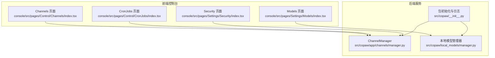
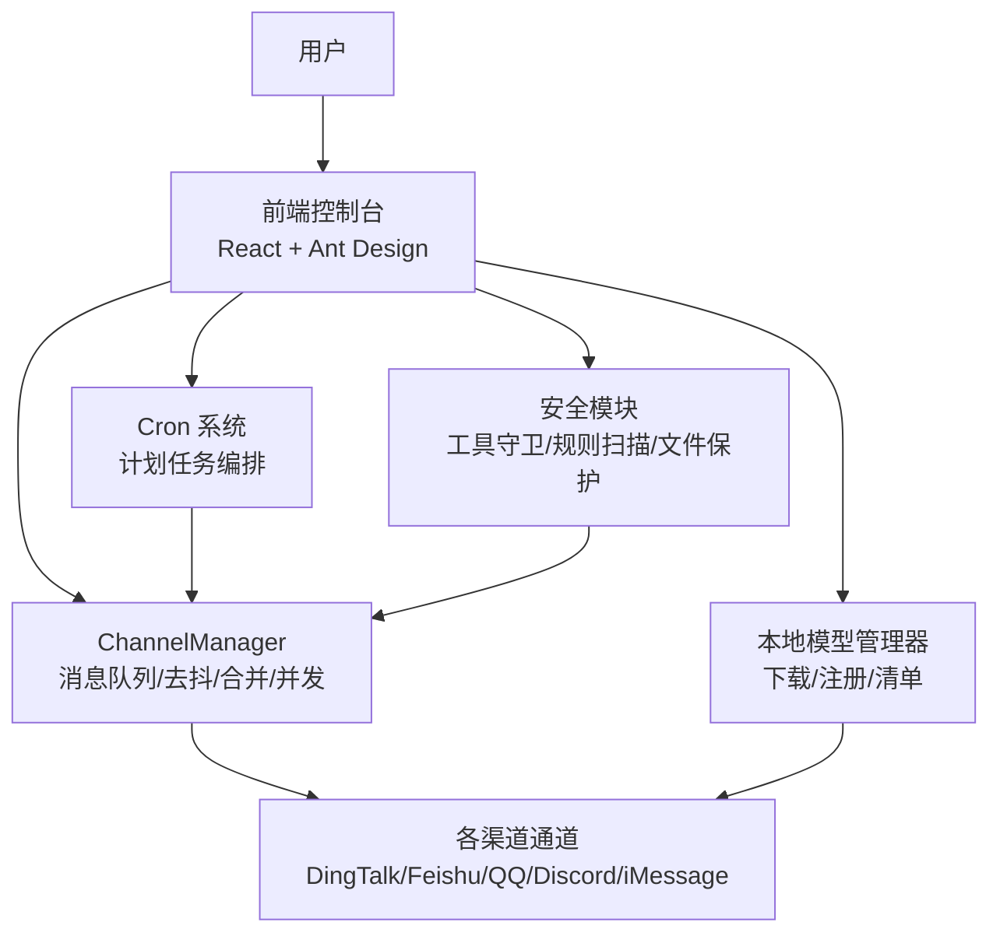
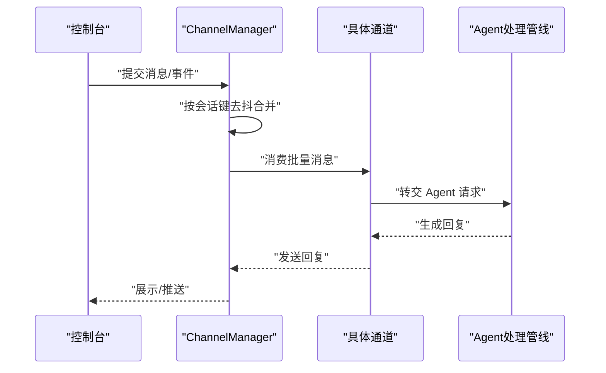
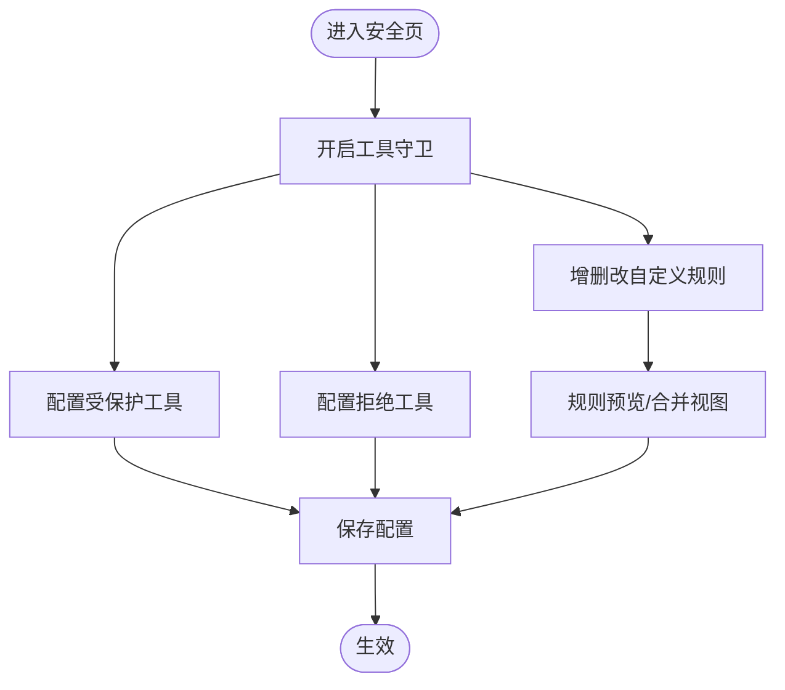
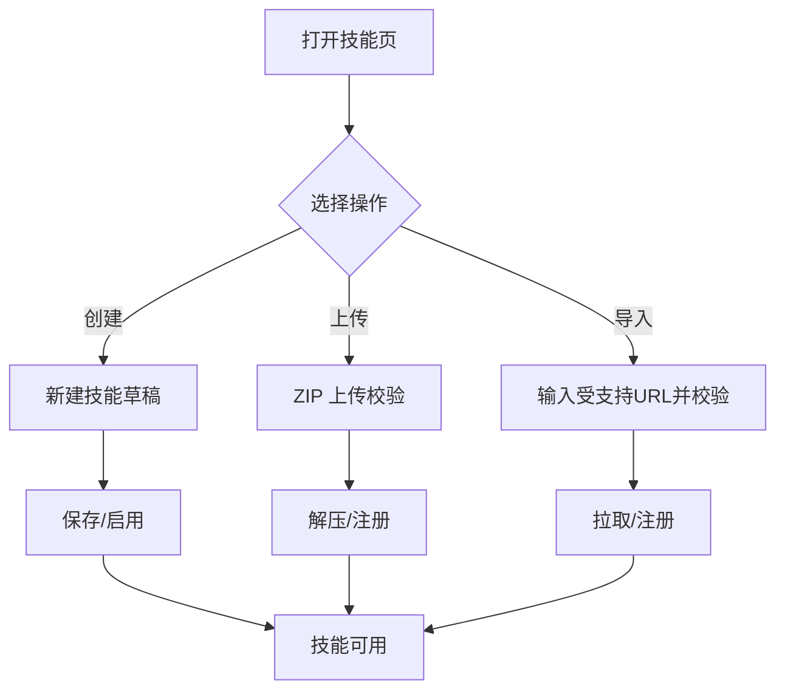
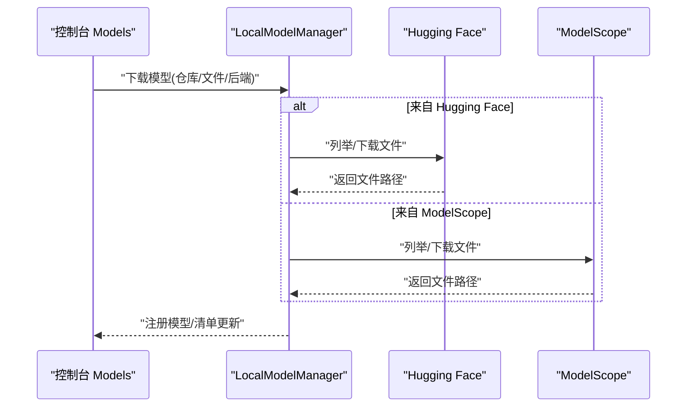
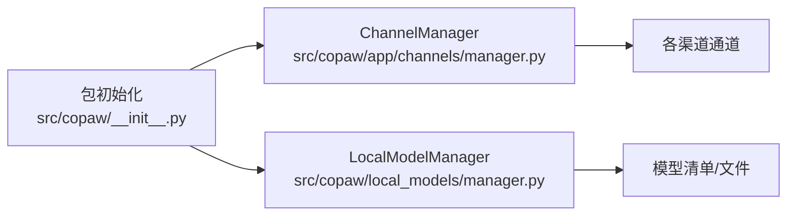

# 核心功能特性

<cite>
**本文引用的文件**
- [README.md](file://README.md)
- [src/copaw/__init__.py](file://src/copaw/__init__.py)
- [console/src/pages/Control/Channels/index.tsx](file://console/src/pages/Control/Channels/index.tsx)
- [console/src/pages/Settings/Models/index.tsx](file://console/src/pages/Settings/Models/index.tsx)
- [src/copaw/app/channels/manager.py](file://src/copaw/app/channels/manager.py)
- [src/copaw/agents/skills/cron/SKILL.md](file://src/copaw/agents/skills/cron/SKILL.md)
- [console/src/pages/Control/CronJobs/index.tsx](file://console/src/pages/Control/CronJobs/index.tsx)
- [src/copaw/local_models/manager.py](file://src/copaw/local_models/manager.py)
- [console/src/pages/Settings/Security/index.tsx](file://console/src/pages/Settings/Security/index.tsx)
</cite>

## 目录
1. [简介](#简介)
2. [项目结构](#项目结构)
3. [核心组件](#核心组件)
4. [架构总览](#架构总览)
5. [详细组件分析](#详细组件分析)
6. [依赖关系分析](#依赖关系分析)
7. [性能考量](#性能考量)
8. [故障排查指南](#故障排查指南)
9. [结论](#结论)
10. [附录](#附录)

## 简介
CoPaw 是一个“与你并肩”的个人智能体工作站，强调“易安装、可本地部署、可云端部署”，支持多渠道连接、完全可控（本地隐私与个性化）、技能系统（内置计划任务与自定义技能）、本地模型推理（llama.cpp、MLX、Ollama）、以及图形化的 Web 控制台。其目标是成为你数字生活的“温暖小爪”，在本地或云端为你提供稳定、可控、可扩展的能力。

## 项目结构
- 后端以 Python 实现，提供通道管理、技能调度、本地模型管理、安全策略等能力。
- 前端控制台基于 React + Ant Design，提供图形化配置与管理界面。
- 通过统一的 ChannelManager 负责多渠道接入与消息处理，通过 Cron 系统实现定时任务编排，通过本地模型管理器支持多种后端推理。

图表来源
- [console/src/pages/Control/Channels/index.tsx](file://console/src/pages/Control/Channels/index.tsx)
- [console/src/pages/Settings/Models/index.tsx](file://console/src/pages/Settings/Models/index.tsx)
- [console/src/pages/Control/CronJobs/index.tsx](file://console/src/pages/Control/CronJobs/index.tsx)
- [console/src/pages/Settings/Security/index.tsx](file://console/src/pages/Settings/Security/index.tsx)
- [src/copaw/app/channels/manager.py](file://src/copaw/app/channels/manager.py)
- [src/copaw/local_models/manager.py](file://src/copaw/local_models/manager.py)
- [src/copaw/__init__.py](file://src/copaw/__init__.py)

章节来源
- [README.md](file://README.md)
- [src/copaw/__init__.py](file://src/copaw/__init__.py)

## 核心组件
- 多渠道连接：通过 ChannelManager 统一接入与消费消息，支持 DingTalk、Feishu、QQ、Discord、iMessage 等，具备去抖合并、并发消费者、队列管理等机制。
- 完全可控：通过 Web 控制台实现“本地部署、隐私保护、个性化定制”。安全页提供工具守卫、规则扫描与文件访问保护。
- 技能系统：内置 cron 技能用于计划任务；支持自定义技能上传与从技能库导入；技能启用/禁用、编辑、删除均可在控制台完成。
- 本地模型推理：支持 llama.cpp、MLX、Ollama（通过 Provider 与本地模型管理器），可在控制台中下载、选择与管理本地模型。
- Web 控制台：提供 Channels、Models、CronJobs、Security 等页面，图形化配置与管理。

章节来源
- [console/src/pages/Control/Channels/index.tsx](file://console/src/pages/Control/Channels/index.tsx)
- [console/src/pages/Settings/Models/index.tsx](file://console/src/pages/Settings/Models/index.tsx)
- [src/copaw/app/channels/manager.py](file://src/copaw/app/channels/manager.py)
- [src/copaw/agents/skills/cron/SKILL.md](file://src/copaw/agents/skills/cron/SKILL.md)
- [console/src/pages/Control/CronJobs/index.tsx](file://console/src/pages/Control/CronJobs/index.tsx)
- [src/copaw/local_models/manager.py](file://src/copaw/local_models/manager.py)
- [console/src/pages/Settings/Security/index.tsx](file://console/src/pages/Settings/Security/index.tsx)

## 架构总览
CoPaw 的运行时由“前端控制台 + 后端服务”构成。后端通过 ChannelManager 统一管理各渠道的消息入队与消费；通过 Cron 系统实现定时任务；通过本地模型管理器与 Provider 管理器实现本地与云端模型的统一调用；通过安全模块保障工具调用与文件访问的安全。

图表来源
- [src/copaw/app/channels/manager.py](file://src/copaw/app/channels/manager.py)
- [src/copaw/local_models/manager.py](file://src/copaw/local_models/manager.py)
- [console/src/pages/Control/CronJobs/index.tsx](file://console/src/pages/Control/CronJobs/index.tsx)
- [console/src/pages/Settings/Security/index.tsx](file://console/src/pages/Settings/Security/index.tsx)

## 详细组件分析

### 多渠道连接（ChannelManager）
- 统一入口：从环境或配置创建可用通道实例，按启用状态与配置注入处理回调。
- 队列与去抖：为每个通道维护队列，按会话键去抖合并，避免重复与乱序。
- 并发消费：每通道多个消费者并行处理不同会话，提升吞吐。
- 动态替换：支持新旧通道替换，保证平滑切换。
- 发送接口：提供事件与纯文本发送接口，自动合并元数据（如机器人前缀、会话标识）。

图表来源
- [src/copaw/app/channels/manager.py](file://src/copaw/app/channels/manager.py)
- [console/src/pages/Control/Channels/index.tsx](file://console/src/pages/Control/Channels/index.tsx)

章节来源
- [src/copaw/app/channels/manager.py](file://src/copaw/app/channels/manager.py)
- [console/src/pages/Control/Channels/index.tsx](file://console/src/pages/Control/Channels/index.tsx)

### 完全可控（安全与隐私）
- 工具守卫：可启用/禁用受保护工具、设置拒绝工具列表、增删改自定义规则，支持规则预览与合并视图。
- 技能扫描：内置规则集，覆盖命令注入、数据外泄、硬编码密钥、混淆、提示注入、资源滥用、社交工程、供应链、越权工具使用等风险类别。
- 文件访问保护：限制敏感路径访问，降低误操作风险。
- 个性化定制：通过控制台调整工具守卫策略、扫描策略与文件保护策略，满足不同环境下的合规需求。

图表来源
- [console/src/pages/Settings/Security/index.tsx](file://console/src/pages/Settings/Security/index.tsx)

章节来源
- [console/src/pages/Settings/Security/index.tsx](file://console/src/pages/Settings/Security/index.tsx)

### 技能系统（内置 cron 与自定义技能）
- 内置 cron 技能：用于未来定时或周期性任务，需显式传入 agent-id，支持 list/get/state/pause/resume/delete/run 等命令。
- 自定义技能：支持 ZIP 上传、从技能库导入（含 GitHub、ModelScope 等），支持创建、编辑、启用/禁用、删除。
- 控制台管理：提供技能卡片、抽屉表单、导入弹窗、URL 校验与大小限制等。

图表来源
- [console/src/pages/Agent/Skills/index.tsx](file://console/src/pages/Agent/Skills/index.tsx)
- [src/copaw/agents/skills/cron/SKILL.md](file://src/copaw/agents/skills/cron/SKILL.md)

章节来源
- [console/src/pages/Agent/Skills/index.tsx](file://console/src/pages/Agent/Skills/index.tsx)
- [src/copaw/agents/skills/cron/SKILL.md](file://src/copaw/agents/skills/cron/SKILL.md)

### 本地模型推理（llama.cpp、MLX、Ollama）
- 支持后端：llama.cpp（跨平台）、MLX（Apple Silicon）、Ollama（需服务端）。
- 管理能力：下载（Hugging Face、ModelScope）、列出、获取、删除、清单注册与校验。
- 控制台集成：在 Models 页面中搜索、添加提供商（含本地嵌入式 Provider），并进行启用/禁用与模型选择。

图表来源
- [src/copaw/local_models/manager.py](file://src/copaw/local_models/manager.py)
- [console/src/pages/Settings/Models/index.tsx](file://console/src/pages/Settings/Models/index.tsx)

章节来源
- [src/copaw/local_models/manager.py](file://src/copaw/local_models/manager.py)
- [console/src/pages/Settings/Models/index.tsx](file://console/src/pages/Settings/Models/index.tsx)

### Web 控制台（图形化管理界面）
- Channels：查看/编辑各渠道配置，支持过滤内置/自定义、启用/禁用、去抖与思考内容过滤等。
- Models：搜索与管理云/本地 Provider，支持新增自定义 Provider。
- CronJobs：可视化创建/编辑/启用/禁用/立即执行/删除计划任务，支持 cron 表达式解析与序列化。
- Security：工具守卫、规则扫描、文件保护策略的图形化配置与管理。

章节来源
- [console/src/pages/Control/Channels/index.tsx](file://console/src/pages/Control/Channels/index.tsx)
- [console/src/pages/Settings/Models/index.tsx](file://console/src/pages/Settings/Models/index.tsx)
- [console/src/pages/Control/CronJobs/index.tsx](file://console/src/pages/Control/CronJobs/index.tsx)
- [console/src/pages/Settings/Security/index.tsx](file://console/src/pages/Settings/Security/index.tsx)

## 依赖关系分析
- 包初始化负责日志与环境变量加载，确保后续模块在正确上下文中启动。
- ChannelManager 依赖通道注册表与可用通道配置，动态构建通道实例并启动消费者循环。
- 本地模型管理器依赖清单文件与下载源，提供模型下载、注册与删除能力。
- 控制台页面通过 API 与后端交互，分别驱动 Channel、Model、Cron、Security 等子系统。

图表来源
- [src/copaw/__init__.py](file://src/copaw/__init__.py)
- [src/copaw/app/channels/manager.py](file://src/copaw/app/channels/manager.py)
- [src/copaw/local_models/manager.py](file://src/copaw/local_models/manager.py)

章节来源
- [src/copaw/__init__.py](file://src/copaw/__init__.py)
- [src/copaw/app/channels/manager.py](file://src/copaw/app/channels/manager.py)
- [src/copaw/local_models/manager.py](file://src/copaw/local_models/manager.py)

## 性能考量
- 消息去抖与合并：ChannelManager 对同会话消息进行去抖与合并，减少重复处理与网络抖动影响。
- 并发消费者：每通道多消费者并行处理不同会话，提高吞吐与响应速度。
- 队列容量与锁粒度：合理设置队列上限与会话级锁，避免阻塞与死锁。
- 本地模型缓存：模型清单与目录结构优化，减少重复下载与 IO 开销。
- 控制台渲染：分页与懒加载策略，降低大数据量下的页面卡顿。

## 故障排查指南
- 渠道无法接收/发送：检查 ChannelManager 启动状态、队列是否创建、消费者任务是否运行；确认通道配置的启用状态与过滤选项。
- 计划任务未触发：核对 cron 表达式、时区、任务状态（启用/禁用），必要时手动执行一次验证。
- 本地模型下载失败：确认下载源可用（HF/MS）、网络连通性、磁盘空间；检查清单完整性与模型目录权限。
- 安全策略导致工具不可用：检查工具守卫开关、受保护工具列表、自定义规则冲突；必要时临时关闭策略定位问题。

章节来源
- [src/copaw/app/channels/manager.py](file://src/copaw/app/channels/manager.py)
- [console/src/pages/Control/CronJobs/index.tsx](file://console/src/pages/Control/CronJobs/index.tsx)
- [src/copaw/local_models/manager.py](file://src/copaw/local_models/manager.py)
- [console/src/pages/Settings/Security/index.tsx](file://console/src/pages/Settings/Security/index.tsx)

## 结论
CoPaw 通过“多渠道连接 + 完全可控 + 技能系统 + 本地模型推理 + Web 控制台”的组合，为用户提供从“安装部署到日常使用”的全链路体验。其模块化设计与图形化界面降低了使用门槛，同时保留了高度的可控性与扩展性，适合个人与团队在本地或云端灵活部署与迭代。

## 附录

### 功能对比表（概念性说明）
- 多渠道连接：支持 DingTalk、Feishu、QQ、Discord、iMessage 等，具备去抖合并与并发消费。
- 完全可控：工具守卫、规则扫描、文件保护、个性化策略，满足隐私与合规需求。
- 技能系统：内置 cron 技能与自定义技能生态，支持上传与导入。
- 本地模型推理：支持 llama.cpp、MLX、Ollama，控制台内即可下载与管理。
- Web 控制台：Channels、Models、CronJobs、Security 页面，图形化配置与管理。

[本节为概念性说明，不直接分析具体文件，故无章节来源]