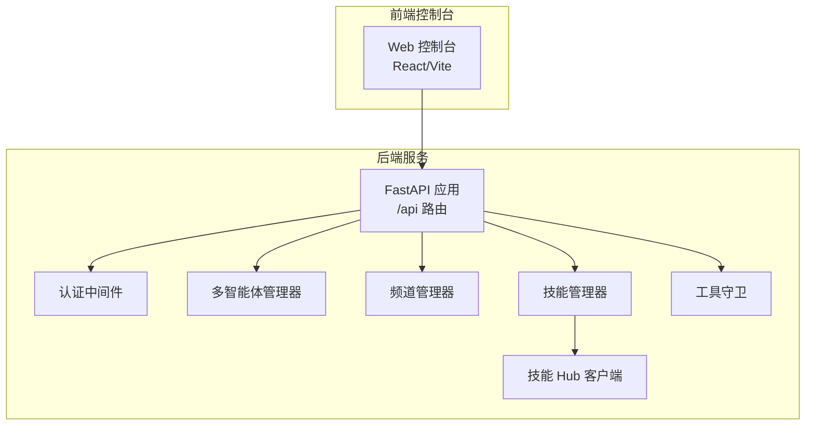
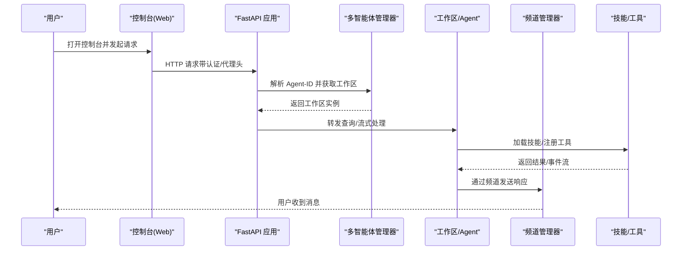
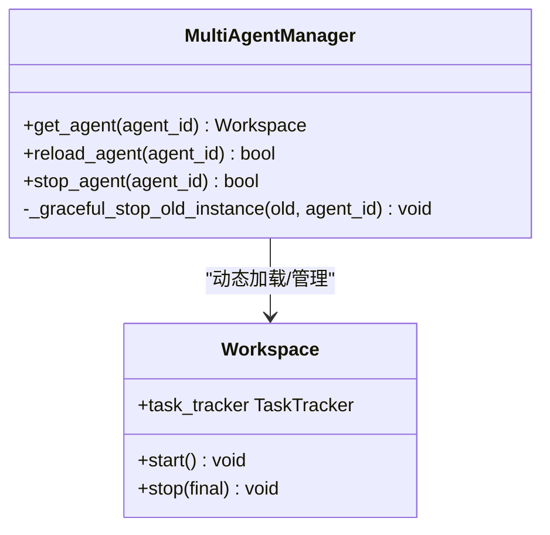
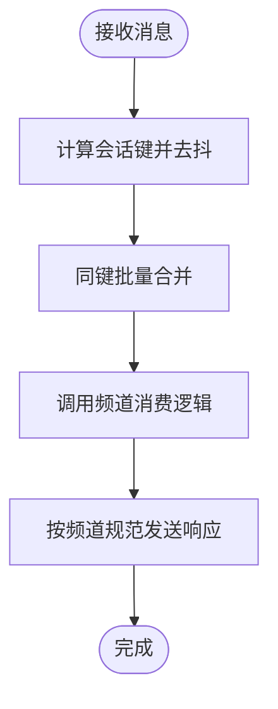
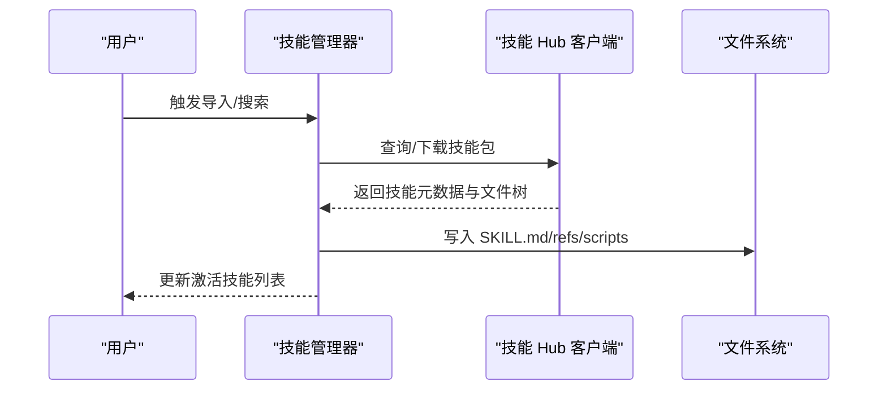
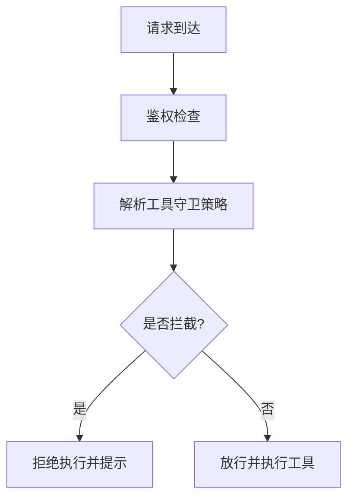
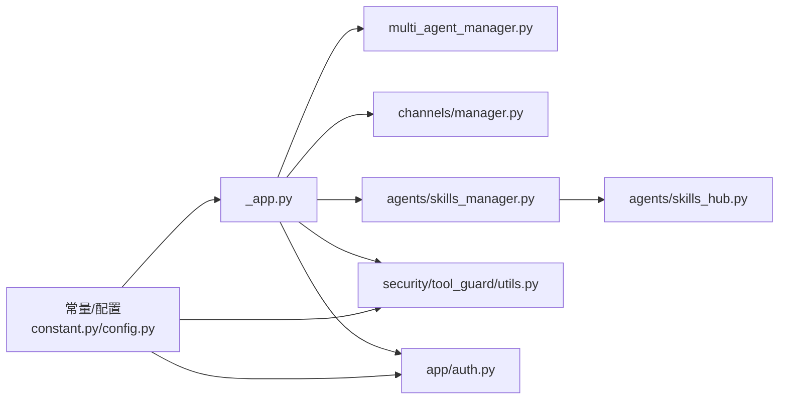

# 项目介绍与核心价值

<cite>
**本文引用的文件**
- [README.md](file://README.md)
- [README_zh.md](file://README_zh.md)
- [CONTRIBUTING.md](file://CONTRIBUTING.md)
- [src/copaw/__version__.py](file://src/copaw/__version__.py)
- [src/copaw/__init__.py](file://src/copaw/__init__.py)
- [src/copaw/constant.py](file://src/copaw/constant.py)
- [src/copaw/app/_app.py](file://src/copaw/app/_app.py)
- [src/copaw/app/channels/manager.py](file://src/copaw/app/channels/manager.py)
- [src/copaw/config/config.py](file://src/copaw/config/config.py)
- [src/copaw/app/multi_agent_manager.py](file://src/copaw/app/multi_agent_manager.py)
- [src/copaw/agents/react_agent.py](file://src/copaw/agents/react_agent.py)
- [src/copaw/agents/skills_manager.py](file://src/copaw/agents/skills_manager.py)
- [src/copaw/agents/skills_hub.py](file://src/copaw/agents/skills_hub.py)
- [SECURITY.md](file://SECURITY.md)
- [src/copaw/cli/init_cmd.py](file://src/copaw/cli/init_cmd.py)
- [src/copaw/app/auth.py](file://src/copaw/app/auth.py)
- [src/copaw/security/tool_guard/utils.py](file://src/copaw/security/tool_guard/utils.py)
- [website/public/docs/comparison.en.md](file://website/public/docs/comparison.en.md)
- [website/public/docs/comparison.zh.md](file://website/public/docs/comparison.zh.md)
</cite>

## 目录
1. [引言](#引言)
2. [项目结构](#项目结构)
3. [核心组件](#核心组件)
4. [架构总览](#架构总览)
5. [详细组件分析](#详细组件分析)
6. [依赖关系分析](#依赖关系分析)
7. [性能考量](#性能考量)
8. [故障排查指南](#故障排查指南)
9. [结论](#结论)
10. [附录](#附录)

## 引言
CoPaw 是一款“为你而生，与你共同成长”的个人AI助手。它强调“由你掌控”的隐私与安全、“零锁定”的技能扩展、“全域触达”的多渠道连接，以及“本地优先”的部署灵活性。CoPaw 的核心价值在于：
- 以“个人助理”的信任边界设计，提供可控、可审计、可迁移的能力。
- 通过统一的技能系统与频道管理，实现“一次配置、多端生效”的无缝体验。
- 以开源与社区驱动的方式，持续演进并降低技术门槛。

CoPaw 的愿景是成为你数字生活的“温暖小爪子”，既能在本地或云端稳定运行，也能在多聊天平台之间自由穿行，还能随着你的需求不断扩展与进化。

章节来源
- [README.md:25-51](file://README.md#L25-L51)
- [README_zh.md:25-51](file://README_zh.md#L25-L51)

## 项目结构
CoPaw 采用前后端分离与模块化组织的结构：
- 前端控制台（console）：基于 Vite + React 的 Web 界面，打包后嵌入 Python 包，提供聊天、配置与技能管理。
- 后端服务（src/copaw）：基于 FastAPI 的 Web 服务，负责路由、认证、多智能体工作区管理、频道接入、技能与工具管理、安全与遥测等。
- 配置与常量：集中于常量与配置模块，统一工作目录、日志级别、CORS、模型提供商超时等。
- 安全与合规：工具守卫、鉴权、安全基线与遥测策略。
- 生态与扩展：技能中心、MCP 客户端、多模型提供商、多频道适配。

图表来源
- [src/copaw/app/_app.py:243-411](file://src/copaw/app/_app.py#L243-L411)
- [src/copaw/app/channels/manager.py:114-580](file://src/copaw/app/channels/manager.py#L114-L580)
- [src/copaw/app/multi_agent_manager.py:17-200](file://src/copaw/app/multi_agent_manager.py#L17-L200)
- [src/copaw/agents/skills_manager.py:654-800](file://src/copaw/agents/skills_manager.py#L654-L800)
- [src/copaw/agents/skills_hub.py:1-1619](file://src/copaw/agents/skills_hub.py#L1-L1619)
- [src/copaw/security/tool_guard/utils.py:58-101](file://src/copaw/security/tool_guard/utils.py#L58-L101)

章节来源
- [src/copaw/app/_app.py:243-411](file://src/copaw/app/_app.py#L243-L411)
- [src/copaw/constant.py:72-210](file://src/copaw/constant.py#L72-L210)

## 核心组件
- 多智能体工作区管理：支持按 Agent ID 动态加载与生命周期管理，提供零停机热重载与任务跟踪。
- 频道管理：统一的频道消费循环与去抖合并，支持多通道并发处理与事件派发。
- 技能系统：内置技能与自定义技能的同步、激活与回退，支持从技能 Hub 导入与版本管理。
- 工具与安全：工具守卫与规则引擎，结合环境变量与配置，实现“最小授权”的工具调用。
- 配置与常量：集中化的环境变量解析、默认路径与行为参数，保障一致性与可移植性。
- 遥测与安全基线：匿名遥测收集策略与安全建议，贯穿初始化流程与文档。

章节来源
- [src/copaw/app/multi_agent_manager.py:17-200](file://src/copaw/app/multi_agent_manager.py#L17-L200)
- [src/copaw/app/channels/manager.py:114-580](file://src/copaw/app/channels/manager.py#L114-L580)
- [src/copaw/agents/skills_manager.py:654-800](file://src/copaw/agents/skills_manager.py#L654-L800)
- [src/copaw/agents/skills_hub.py:1-1619](file://src/copaw/agents/skills_hub.py#L1-L1619)
- [src/copaw/security/tool_guard/utils.py:58-101](file://src/copaw/security/tool_guard/utils.py#L58-L101)
- [src/copaw/constant.py:72-210](file://src/copaw/constant.py#L72-L210)

## 架构总览
CoPaw 的运行时由“Web 应用 + 多智能体工作区 + 频道与技能生态 + 安全与配置”构成。请求从控制台发起，经认证与中间件，进入多智能体路由，最终由对应 Agent 工作区处理，必要时调用技能与工具，再通过频道发送给用户。

图表来源
- [src/copaw/app/_app.py:49-146](file://src/copaw/app/_app.py#L49-L146)
- [src/copaw/app/multi_agent_manager.py:34-82](file://src/copaw/app/multi_agent_manager.py#L34-L82)
- [src/copaw/app/channels/manager.py:322-426](file://src/copaw/app/channels/manager.py#L322-L426)

章节来源
- [src/copaw/app/_app.py:49-146](file://src/copaw/app/_app.py#L49-L146)
- [src/copaw/app/multi_agent_manager.py:34-82](file://src/copaw/app/multi_agent_manager.py#L34-L82)

## 详细组件分析

### 多智能体工作区管理
- 动态工作区加载：按 Agent-ID 懒加载，避免启动时资源浪费。
- 零停机热重载：检测旧实例是否有活动任务，若有则延后清理，保证服务连续性。
- 任务跟踪：记录与等待活动任务，确保优雅停止。

图表来源
- [src/copaw/app/multi_agent_manager.py:17-200](file://src/copaw/app/multi_agent_manager.py#L17-L200)

章节来源
- [src/copaw/app/multi_agent_manager.py:17-200](file://src/copaw/app/multi_agent_manager.py#L17-L200)

### 频道管理与消息处理
- 统一消费循环：每通道多消费者并行处理，按会话键去抖合并，避免重复与乱序。
- 事件派发：支持文本与富媒体内容，按频道规范转换为内容部件并发送。
- 可插拔：支持内置与自定义频道，通过注册表与配置启用。

图表来源
- [src/copaw/app/channels/manager.py:42-112](file://src/copaw/app/channels/manager.py#L42-L112)
- [src/copaw/app/channels/manager.py:322-426](file://src/copaw/app/channels/manager.py#L322-L426)

章节来源
- [src/copaw/app/channels/manager.py:114-580](file://src/copaw/app/channels/manager.py#L114-L580)

### 技能系统与 Hub 集成
- 目录结构：内置技能、自定义技能与激活技能三套目录，自定义覆盖内置。
- 同步与回退：支持从激活目录回写到自定义目录，保持可编辑性。
- Hub 导入：支持从多个 Hub（clawhub、skills.sh、lobehub 等）导入技能，含重试、速率限制与校验。

图表来源
- [src/copaw/agents/skills_manager.py:654-800](file://src/copaw/agents/skills_manager.py#L654-L800)
- [src/copaw/agents/skills_hub.py:1-1619](file://src/copaw/agents/skills_hub.py#L1-L1619)

章节来源
- [src/copaw/agents/skills_manager.py:654-800](file://src/copaw/agents/skills_manager.py#L654-L800)
- [src/copaw/agents/skills_hub.py:1-1619](file://src/copaw/agents/skills_hub.py#L1-L1619)

### 工具与安全
- 工具守卫：根据环境变量、配置与默认高危集合，决定拦截范围；支持“全部放行/全部拦截/白名单”等策略。
- 鉴权：可启用独立鉴权文件与权限控制，配合中间件在请求链路中生效。
- 安全基线：初始化流程中的安全提示与建议，贯穿部署与日常运维。

图表来源
- [src/copaw/security/tool_guard/utils.py:58-101](file://src/copaw/security/tool_guard/utils.py#L58-L101)
- [src/copaw/app/auth.py:166-200](file://src/copaw/app/auth.py#L166-L200)
- [src/copaw/cli/init_cmd.py:42-70](file://src/copaw/cli/init_cmd.py#L42-L70)

章节来源
- [src/copaw/security/tool_guard/utils.py:58-101](file://src/copaw/security/tool_guard/utils.py#L58-L101)
- [src/copaw/app/auth.py:166-200](file://src/copaw/app/auth.py#L166-L200)
- [src/copaw/cli/init_cmd.py:42-70](file://src/copaw/cli/init_cmd.py#L42-L70)

### 配置与常量
- 工作目录与密钥目录：统一解析环境变量，支持默认值与跨平台路径。
- CORS 与文档开关：开发模式可开启 OpenAPI 文档，生产默认关闭。
- 模型提供商超时与重试：统一的 LLM 超时与退避策略，保障稳定性。

章节来源
- [src/copaw/constant.py:72-210](file://src/copaw/constant.py#L72-L210)
- [src/copaw/config/config.py:1-200](file://src/copaw/config/config.py#L1-L200)

## 依赖关系分析
- 运行时依赖：FastAPI、AgentScope/AgentScope-Runtime、ReActAgent、内存与工具生态。
- 配置与常量：集中于 constant.py，被应用、频道、技能、安全模块广泛引用。
- 安全与鉴权：auth 中间件与工具守卫相互配合，形成“最小授权”的执行边界。
- 生态扩展：技能 Hub 客户端与 MCP 客户端为第三方能力接入提供桥梁。

图表来源
- [src/copaw/constant.py:72-210](file://src/copaw/constant.py#L72-L210)
- [src/copaw/app/_app.py:243-411](file://src/copaw/app/_app.py#L243-L411)
- [src/copaw/app/channels/manager.py:114-580](file://src/copaw/app/channels/manager.py#L114-L580)
- [src/copaw/agents/skills_manager.py:654-800](file://src/copaw/agents/skills_manager.py#L654-L800)
- [src/copaw/agents/skills_hub.py:1-1619](file://src/copaw/agents/skills_hub.py#L1-L1619)
- [src/copaw/security/tool_guard/utils.py:58-101](file://src/copaw/security/tool_guard/utils.py#L58-L101)
- [src/copaw/app/auth.py:166-200](file://src/copaw/app/auth.py#L166-L200)

章节来源
- [src/copaw/constant.py:72-210](file://src/copaw/constant.py#L72-L210)
- [src/copaw/app/_app.py:243-411](file://src/copaw/app/_app.py#L243-L411)

## 性能考量
- 启动与日志：包初始化阶段设置日志级别，便于定位问题；生产环境建议调整日志级别。
- 多智能体：懒加载与零停机重载减少冷启动与停机时间。
- 频道处理：按会话键去抖与批量合并，降低重复处理与网络抖动影响。
- 技能与工具：通过“激活技能”目录与工具守卫，避免不必要的加载与执行。
- 模型与重试：统一的超时与退避策略，提升对外部模型服务的鲁棒性。

章节来源
- [src/copaw/__init__.py:11-33](file://src/copaw/__init__.py#L11-L33)
- [src/copaw/app/multi_agent_manager.py:83-179](file://src/copaw/app/multi_agent_manager.py#L83-L179)
- [src/copaw/app/channels/manager.py:42-112](file://src/copaw/app/channels/manager.py#L42-L112)
- [src/copaw/constant.py:132-199](file://src/copaw/constant.py#L132-L199)

## 故障排查指南
- 遥测与日志
  - 遥测：初始化时收集匿名使用数据，用于理解用户环境与改进产品；可按版本收集一次，不影响功能。
  - 日志：包初始化阶段输出调试信息，生产环境建议调整日志级别。
- 安全与鉴权
  - 鉴权：可启用独立鉴权文件与权限控制；首次用户可注册，后续由管理员维护。
  - 工具守卫：根据环境变量或配置决定拦截范围；默认高危工具受保护。
- 配置与路径
  - 工作目录与密钥目录：通过环境变量解析，注意跨平台路径差异。
  - CORS：开发模式可配置允许来源，生产默认关闭。
- 版本与升级
  - 版本：当前版本信息位于版本文件；升级时注意配置与工作目录的兼容性。

章节来源
- [src/copaw/__version__.py:1-3](file://src/copaw/__version__.py#L1-L3)
- [src/copaw/__init__.py:11-33](file://src/copaw/__init__.py#L11-L33)
- [src/copaw/app/auth.py:166-200](file://src/copaw/app/auth.py#L166-L200)
- [src/copaw/security/tool_guard/utils.py:58-101](file://src/copaw/security/tool_guard/utils.py#L58-L101)
- [src/copaw/constant.py:72-210](file://src/copaw/constant.py#L72-L210)

## 结论
CoPaw 以“个人助理”的信任边界为核心，围绕“可控、可扩展、可迁移”的理念构建：通过多智能体工作区实现按需加载与零停机；通过统一的技能与频道体系实现“一次配置、多端生效”；通过工具守卫与安全基线保障隐私与安全；通过开源与社区驱动推动持续演进。对于初学者而言，CoPaw 提供了从脚本安装到控制台配置的一站式体验，既能满足日常生产力需求，也为进阶用户提供了强大的扩展空间。

章节来源
- [README.md:25-51](file://README.md#L25-L51)
- [README_zh.md:25-51](file://README_zh.md#L25-L51)
- [SECURITY.md:53-118](file://SECURITY.md#L53-L118)

## 附录

### 与其他方案的对比
- 与同类方案相比，CoPaw 在安装方式、平台支持、本地模型集成、技能生态与频道接入方面具有差异化优势；同时在多智能体、自愈、云原生与多模态交互方面有明确的路线图与社区驱动的生态建设。

章节来源
- [website/public/docs/comparison.en.md:1-23](file://website/public/docs/comparison.en.md#L1-L23)
- [website/public/docs/comparison.zh.md:1-23](file://website/public/docs/comparison.zh.md#L1-L23)

### 开源与社区
- 开源协议：Apache 2.0，适合商业与个人使用。
- 贡献指南：欢迎新增频道、模型提供商、技能与 MCP，以及文档与平台兼容性改进。
- 社区渠道：Discord 与钉钉开发者群，GitHub Discussions 与 Issues。

章节来源
- [CONTRIBUTING.md:1-244](file://CONTRIBUTING.md#L1-L244)
- [README.md:458-470](file://README.md#L458-L470)
- [README_zh.md:459-470](file://README_zh.md#L459-L470)