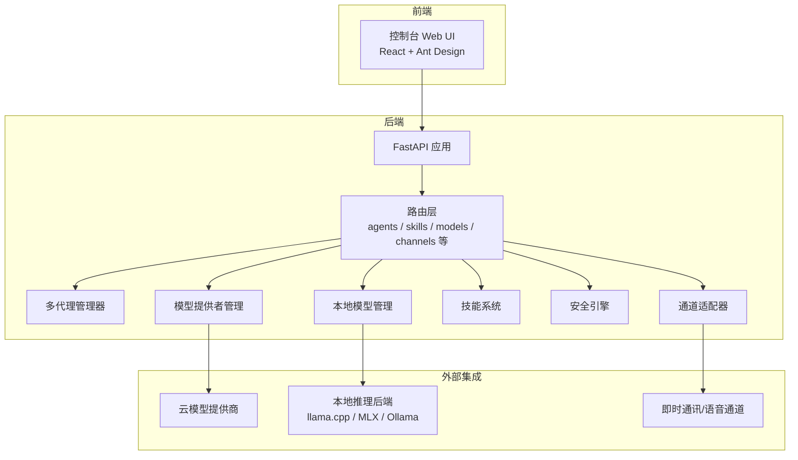
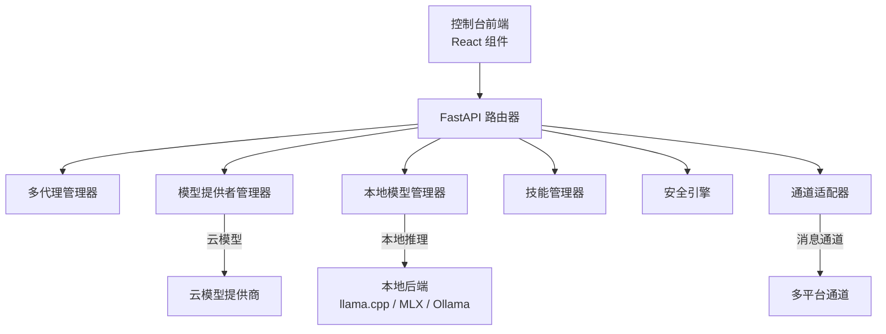
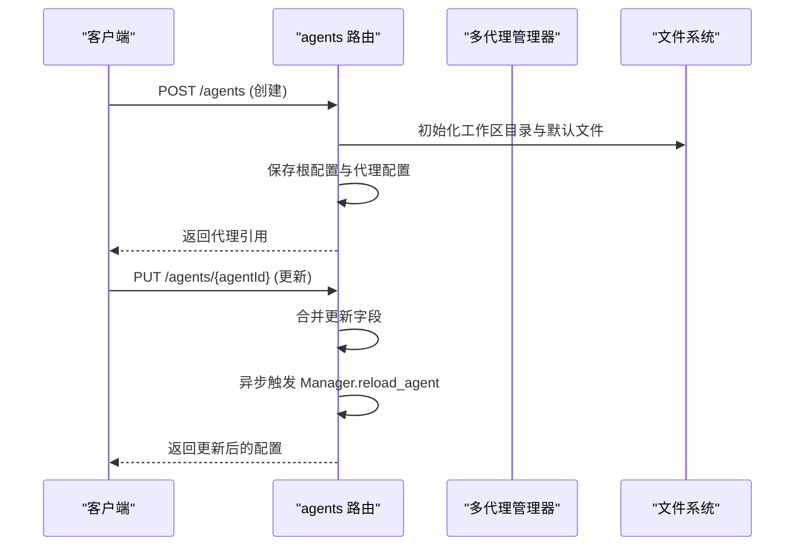
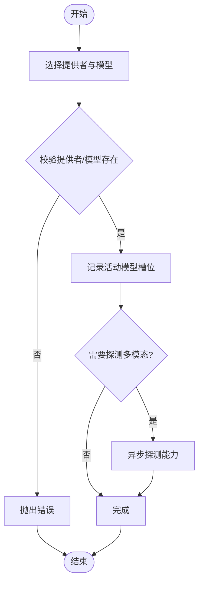
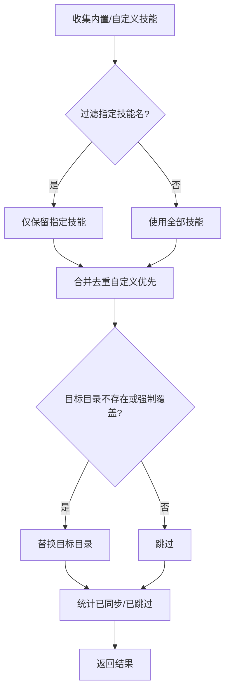
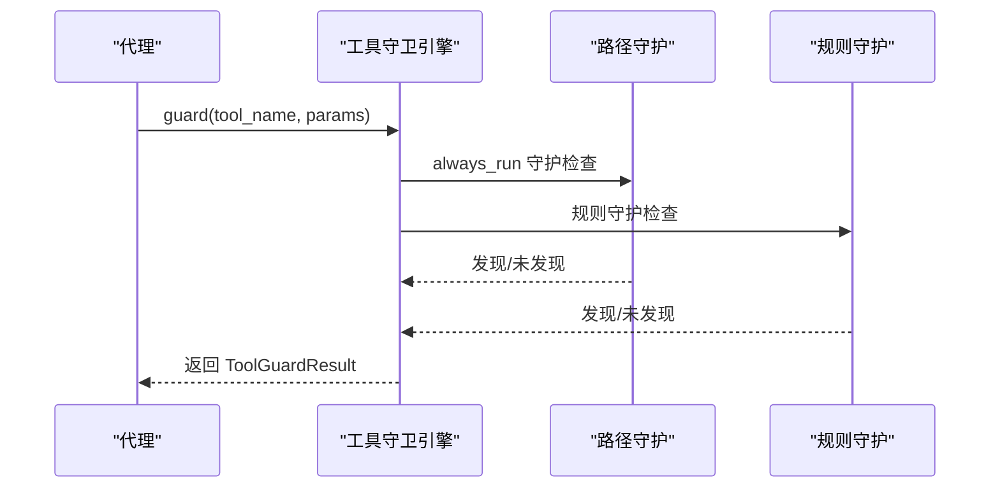
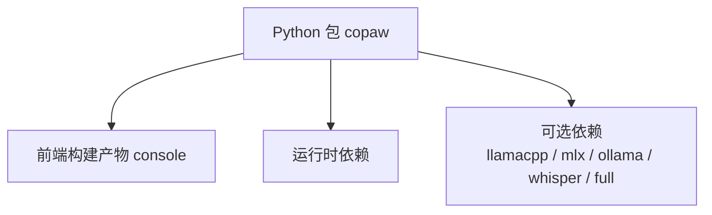

# 项目概述

<cite>
**本文档引用的文件**
- [README.md](file://README.md)
- [src/copaw/__init__.py](file://src/copaw/__init__.py)
- [src/copaw/__main__.py](file://src/copaw/__main__.py)
- [src/copaw/app/_app.py](file://src/copaw/app/_app.py)
- [src/copaw/cli/main.py](file://src/copaw/cli/main.py)
- [src/copaw/config/config.py](file://src/copaw/config/config.py)
- [src/copaw/constant.py](file://src/copaw/constant.py)
- [src/copaw/agents/react_agent.py](file://src/copaw/agents/react_agent.py)
- [src/copaw/providers/provider_manager.py](file://src/copaw/providers/provider_manager.py)
- [src/copaw/app/routers/agents.py](file://src/copaw/app/routers/agents.py)
- [src/copaw/agents/skills_manager.py](file://src/copaw/agents/skills_manager.py)
- [src/copaw/local_models/manager.py](file://src/copaw/local_models/manager.py)
- [src/copaw/security/tool_guard/engine.py](file://src/copaw/security/tool_guard/engine.py)
- [console/package.json](file://console/package.json)
- [pyproject.toml](file://pyproject.toml)
</cite>

## 目录
1. [引言](#引言)
2. [项目结构](#项目结构)
3. [核心组件](#核心组件)
4. [架构总览](#架构总览)
5. [详细组件分析](#详细组件分析)
6. [依赖关系分析](#依赖关系分析)
7. [性能考量](#性能考量)
8. [故障排查指南](#故障排查指南)
9. [结论](#结论)
10. [附录](#附录)

## 引言
CoPaw 是一个“个人AI助手”，可在本地或云端运行，支持多渠道连接（如钉钉、飞书、QQ、Discord、iMessage 等），并以“技能”为核心扩展能力。其设计理念是“随你而变、与你共长”，既可作为冷冰冰的工具，也能成为温暖可靠的“小爪子”伙伴。项目提供前后端分离的控制台界面、基于 FastAPI 的后端服务、多代理管理、插件化的技能系统、本地模型推理与安全防护等能力。

- 核心价值主张
  - 多渠道连接：统一接入多种即时通讯与语音通道，按需扩展。
  - 技能系统：内置与自定义技能，工作区自动加载，无厂商锁定。
  - 本地模型推理：llama.cpp、MLX、Ollama 等本地后端，隐私可控。
  - 安全与合规：工具调用守卫、技能扫描、审批流等安全机制。
  - 可观测与可运维：心跳检查、令牌用量统计、调试历史、UI 控制台。

- 主要特性
  - 控制台聊天与配置：Web 控制台，支持会话、频道、技能、模型、环境变量等管理。
  - 多代理与工作区：每个代理拥有独立工作区，支持独立的系统提示、技能与内存。
  - 本地模型下载与管理：支持从 Hugging Face 或 ModelScope 下载模型，自动注册到清单。
  - 语音通道：Twilio 集成，支持来电接听、状态回调与媒体处理。
  - 安全引擎：规则与路径级双重守卫，支持审批流程与超时控制。

- 使用场景举例
  - 社交：热点聚合、摘要生成、跨平台内容分发。
  - 生产力：日程提醒、邮件/日历联系人整理、定时报告。
  - 创作：夜间创作、草稿生成、跨格式文档处理。
  - 研究：科技新闻追踪、个人知识库构建。
  - 桌面：文件组织、文档阅读与摘要、聊天中请求文件。

**章节来源**
- [README.md:31-51](file://README.md#L31-L51)
- [README.md:99-180](file://README.md#L99-L180)
- [README.md:326-357](file://README.md#L326-L357)

## 项目结构
项目采用前后端分离与模块化架构：
- 后端（Python）：FastAPI 应用，提供 REST API、多代理管理、通道适配器、模型提供者管理、本地模型下载与路由、安全与审计。
- 前端（React）：控制台 Web UI，通过 Vite 构建，打包后嵌入 Python 包内提供静态资源。
- CLI：命令行入口，支持应用启动、初始化、技能管理、模型下载、桌面应用等。
- 配置与常量：集中于配置模型与环境变量加载，确保部署一致性。
- 插件化：技能系统、通道适配器、MCP 客户端均支持动态加载与扩展。

**图表来源**
- [src/copaw/app/_app.py:243-411](file://src/copaw/app/_app.py#L243-L411)
- [src/copaw/app/routers/agents.py:34-620](file://src/copaw/app/routers/agents.py#L34-L620)
- [src/copaw/providers/provider_manager.py:573-800](file://src/copaw/providers/provider_manager.py#L573-L800)
- [src/copaw/local_models/manager.py:94-413](file://src/copaw/local_models/manager.py#L94-L413)
- [src/copaw/agents/skills_manager.py:654-800](file://src/copaw/agents/skills_manager.py#L654-L800)
- [src/copaw/security/tool_guard/engine.py:53-238](file://src/copaw/security/tool_guard/engine.py#L53-L238)

**章节来源**
- [console/package.json:1-60](file://console/package.json#L1-L60)
- [pyproject.toml:1-101](file://pyproject.toml#L1-L101)
- [src/copaw/app/_app.py:243-411](file://src/copaw/app/_app.py#L243-L411)

## 核心组件
- 应用入口与生命周期
  - Python 包初始化负责日志与环境变量加载。
  - CLI 入口支持延迟加载子命令，提升启动速度。
  - FastAPI 应用在 lifespan 中完成多代理初始化、提供者管理器、安全审批等初始化，并在关闭时优雅停止。

- 多代理与工作区
  - 支持多个代理实例，每个代理有独立工作区（会话、记忆、技能、配置）。
  - 提供创建、更新、删除、热重载等管理接口。

- 模型提供者与本地模型
  - 内置多家云模型提供者，支持动态发现与能力探测。
  - 本地模型支持从 Hugging Face/ModelScope 下载，自动注册到清单，支持不同后端（llama.cpp、MLX、Ollama）。

- 技能系统
  - 内置技能目录与工作区技能目录，支持同步、去重、版本比较与回写。
  - 支持 ZIP 导入、树形文件结构、脚本与参考文件管理。

- 安全与合规
  - 工具调用守卫：规则与路径级双重检查，支持审批与超时。
  - 技能扫描：默认策略与签名规则，防止危险模式与供应链风险。

- 通道适配器
  - 支持多种即时通讯与语音通道，统一消息渲染与处理。
  - 语音通道集成 Twilio，支持来电、状态回调与媒体处理。

**章节来源**
- [src/copaw/__init__.py:1-33](file://src/copaw/__init__.py#L1-L33)
- [src/copaw/__main__.py:1-7](file://src/copaw/__main__.py#L1-L7)
- [src/copaw/cli/main.py:55-162](file://src/copaw/cli/main.py#L55-L162)
- [src/copaw/app/_app.py:149-241](file://src/copaw/app/_app.py#L149-L241)
- [src/copaw/app/routers/agents.py:124-354](file://src/copaw/app/routers/agents.py#L124-L354)
- [src/copaw/providers/provider_manager.py:573-800](file://src/copaw/providers/provider_manager.py#L573-L800)
- [src/copaw/local_models/manager.py:94-413](file://src/copaw/local_models/manager.py#L94-L413)
- [src/copaw/agents/skills_manager.py:654-800](file://src/copaw/agents/skills_manager.py#L654-L800)
- [src/copaw/security/tool_guard/engine.py:53-238](file://src/copaw/security/tool_guard/engine.py#L53-L238)

## 架构总览
CoPaw 采用“控制台前端 + FastAPI 后端 + 多代理工作区 + 插件化能力”的分层架构。后端通过路由器模块化暴露 API，多代理管理器按需路由到具体工作区执行；模型提供者与本地模型管理器负责推理后端选择与能力探测；安全引擎贯穿工具调用与技能加载过程；通道适配器屏蔽不同平台的消息差异。

**图表来源**
- [src/copaw/app/_app.py:243-411](file://src/copaw/app/_app.py#L243-L411)
- [src/copaw/app/routers/agents.py:34-620](file://src/copaw/app/routers/agents.py#L34-L620)
- [src/copaw/providers/provider_manager.py:573-800](file://src/copaw/providers/provider_manager.py#L573-L800)
- [src/copaw/local_models/manager.py:94-413](file://src/copaw/local_models/manager.py#L94-L413)
- [src/copaw/agents/skills_manager.py:654-800](file://src/copaw/agents/skills_manager.py#L654-L800)
- [src/copaw/security/tool_guard/engine.py:53-238](file://src/copaw/security/tool_guard/engine.py#L53-L238)

## 详细组件分析

### 多代理与工作区管理
- 设计要点
  - 每个代理拥有独立工作区，包含会话、记忆、活动技能、自定义技能、作业与聊天历史等。
  - 支持创建新代理、更新配置、删除代理（默认代理不可删）、列出与读取工作区文件。
  - 更新代理配置后触发后台热重载，避免中断服务。

- 关键流程
  - 创建代理：生成短 ID，初始化工作区目录与默认文件，保存根配置与代理配置。
  - 更新代理：合并更新字段，保存并异步触发重载。
  - 删除代理：停止实例、移除根配置、保留工作区目录以防误删。

**图表来源**
- [src/copaw/app/routers/agents.py:192-316](file://src/copaw/app/routers/agents.py#L192-L316)

**章节来源**
- [src/copaw/app/routers/agents.py:124-354](file://src/copaw/app/routers/agents.py#L124-L354)
- [src/copaw/app/routers/agents.py:508-620](file://src/copaw/app/routers/agents.py#L508-L620)

### 模型提供者与本地模型管理
- 设计要点
  - ProviderManager 管理内置与自定义提供者，支持列表、查询、激活、模型发现与能力探测。
  - 本地模型管理器支持从 Hugging Face/ModelScope 下载，自动选择文件（如 GGUF/Q4_K_M），注册到清单并计算大小。
  - 支持多后端（llama.cpp、MLX、Ollama），并进行 MLX 模型完整性校验。

- 关键流程
  - 激活模型：校验提供者与模型存在性，记录活动槽位，必要时异步探测多模态能力。
  - 下载模型：根据后端类型选择完整仓库或单文件下载，注册到清单并返回信息。

**图表来源**
- [src/copaw/providers/provider_manager.py:738-781](file://src/copaw/providers/provider_manager.py#L738-L781)
- [src/copaw/local_models/manager.py:94-413](file://src/copaw/local_models/manager.py#L94-L413)

**章节来源**
- [src/copaw/providers/provider_manager.py:573-800](file://src/copaw/providers/provider_manager.py#L573-L800)
- [src/copaw/local_models/manager.py:94-413](file://src/copaw/local_models/manager.py#L94-L413)

### 技能系统与插件化扩展
- 设计要点
  - 技能以目录形式存在，包含 SKILL.md（含 YAML Front Matter）、references 与 scripts 子目录。
  - 支持内置技能与自定义技能，自定义覆盖内置同名技能；支持从活动技能回写到自定义技能。
  - 支持 ZIP 导入、树形文件结构创建、名称解析与合法性校验。

- 关键流程
  - 同步技能：内置与自定义技能合并，按需强制覆盖；记录同步与跳过数量。
  - 列表技能：读取活动技能目录，解析 SKILL.md Front Matter，构建技能信息列表。

**图表来源**
- [src/copaw/agents/skills_manager.py:210-287](file://src/copaw/agents/skills_manager.py#L210-L287)
- [src/copaw/agents/skills_manager.py:676-724](file://src/copaw/agents/skills_manager.py#L676-L724)

**章节来源**
- [src/copaw/agents/skills_manager.py:654-800](file://src/copaw/agents/skills_manager.py#L654-L800)

### 安全与工具调用守卫
- 设计要点
  - 工具守卫引擎按守护集顺序执行，聚合结果并记录失败守护器。
  - 默认守护集包含路径级与规则级守护，支持启用开关、受保护工具集合与禁止工具集合。
  - 支持重新加载规则与刷新受保护/禁止集合。

- 关键流程
  - 守卫工具调用：若启用，则遍历守护器，收集违规发现，记录耗时与使用的守护器。

**图表来源**
- [src/copaw/security/tool_guard/engine.py:169-227](file://src/copaw/security/tool_guard/engine.py#L169-L227)

**章节来源**
- [src/copaw/security/tool_guard/engine.py:53-238](file://src/copaw/security/tool_guard/engine.py#L53-L238)

### 通道适配器与语音通道
- 设计要点
  - 通道适配器统一处理消息接收、渲染与发送，支持多种平台（钉钉、飞书、QQ、Discord、iMessage、Telegram、MQTT、Matrix、企业微信、小艺等）。
  - 语音通道集成 Twilio，支持来电、状态回调与媒体处理，配合 Cloudflare Tunnel 实现公网可达。

- 关键流程
  - 通道消息处理：解析消息、过滤策略、渲染输出、转发到代理处理。
  - 语音通道：建立会话、转写音频、调用代理、播放回复。

**章节来源**
- [src/copaw/app/_app.py:342-344](file://src/copaw/app/_app.py#L342-L344)

## 依赖关系分析
- 运行时依赖
  - 后端：FastAPI、Uvicorn、APScheduler、Playwright、Twilio、Matrix SDK、MQTT 客户端等。
  - 前端：Ant Design、React、Zustand、i18n、Markdown 渲染等。
  - 可选后端：llama-cpp-python、mlx-lm、ollama、openai-whisper 等。

- 包装与分发
  - Python 包通过 setuptools 打包，包含前端构建产物与内置资源。
  - 可选依赖通过 extras 字段区分本地模型、Whisper、完整功能等。

**图表来源**
- [pyproject.toml:65-94](file://pyproject.toml#L65-L94)
- [pyproject.toml:46-56](file://pyproject.toml#L46-L56)

**章节来源**
- [pyproject.toml:1-101](file://pyproject.toml#L1-L101)
- [console/package.json:18-40](file://console/package.json#L18-L40)

## 性能考量
- 启动与导入优化
  - CLI 使用延迟加载子命令，减少启动时的导入开销。
  - 包初始化阶段仅做最小化日志与环境变量加载，避免阻塞。

- 多代理与并发
  - 多代理管理器按需获取代理实例，避免全局锁争用。
  - 提供者管理器与本地模型管理器采用惰性初始化与缓存策略。

- I/O 与网络
  - 本地模型下载采用分片与完整性校验，避免不完整文件影响性能。
  - 通道适配器与浏览器自动化（Playwright）在容器环境下可通过环境变量指定可执行路径。

- 建议
  - 在生产环境中禁用 OpenAPI 文档路由，降低暴露面。
  - 合理设置内存压缩阈值与保留比例，平衡上下文长度与性能。

**章节来源**
- [src/copaw/cli/main.py:55-162](file://src/copaw/cli/main.py#L55-L162)
- [src/copaw/app/_app.py:149-241](file://src/copaw/app/_app.py#L149-L241)
- [src/copaw/local_models/manager.py:332-362](file://src/copaw/local_models/manager.py#L332-L362)
- [src/copaw/constant.py:143-146](file://src/copaw/constant.py#L143-L146)

## 故障排查指南
- 常见问题定位
  - 日志级别：通过环境变量设置日志级别，启动时即生效。
  - 包初始化异常：若持久化环境变量加载失败，会记录警告但不影响包导入。
  - CLI 启动慢：检查是否启用了调试日志与延迟加载子命令。

- 代理与工作区
  - 代理创建失败：确认工作区目录权限与磁盘空间。
  - 热重载失败：查看后台任务日志，确认代理实例状态。

- 模型与本地推理
  - 本地模型下载失败：检查网络与仓库可用性，确认后端类型与文件选择逻辑。
  - MLX 模型不完整：检查配置与权重文件是否存在。

- 安全与工具调用
  - 工具调用被拦截：检查工具守卫规则与路径白名单，必要时调整受保护工具集合。
  - 审批超时：调整审批超时时间，确保审批流程顺畅。

**章节来源**
- [src/copaw/__init__.py:11-33](file://src/copaw/__init__.py#L11-L33)
- [src/copaw/app/routers/agents.py:307-314](file://src/copaw/app/routers/agents.py#L307-L314)
- [src/copaw/local_models/manager.py:332-362](file://src/copaw/local_models/manager.py#L332-L362)
- [src/copaw/security/tool_guard/engine.py:209-227](file://src/copaw/security/tool_guard/engine.py#L209-L227)

## 结论
CoPaw 以“多渠道连接 + 技能系统 + 本地模型推理 + 安全合规”为核心，构建了可扩展、可观测、可运维的个人AI助手平台。通过前后端分离与模块化设计，项目在易用性与灵活性之间取得良好平衡，既适合初学者快速上手，也为高级用户提供了深入定制的空间。随着多代理协作、多模态交互、小大模型协同等能力逐步完善，CoPaw 将持续演进为更强大的个人智能工作站。

## 附录
- 快速开始
  - 本地安装：pip 安装后初始化并启动应用，打开控制台进行配置。
  - Docker 部署：拉取镜像并挂载数据卷，按需传递 API Key。
  - 桌面应用：免环境配置，双击即可运行。

- 版本与路线图
  - 当前版本与变更日志参见发布说明。
  - 路线图涵盖横向扩展、现有功能增强、多代理、多模态、小大模型协同、内存系统、沙箱与云原生集成等方向。

**章节来源**
- [README.md:99-180](file://README.md#L99-L180)
- [README.md:273-314](file://README.md#L273-L314)
- [README.md:389-413](file://README.md#L389-L413)